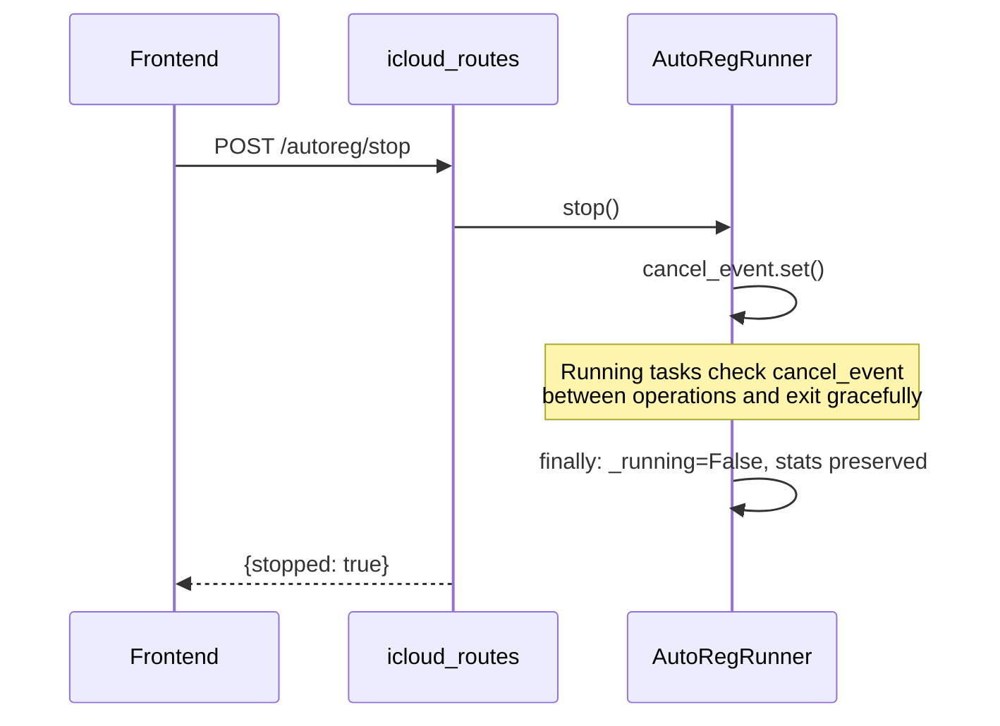

# Technical Design — auto-reg-gpt

## Overview

Module mở rộng tích hợp vào `web/icloud_routes.py` — tự động poll email iCloud (`status='created'`) và chạy ChatGPT signup flow với `mail_mode='worker'`. Output lưu vào bảng `chatgpt_accounts` mới (v9 migration) và stream realtime qua SSE.

### Mục tiêu

- Tự động hóa đăng ký ChatGPT từ email iCloud HME đã tạo
- UI sub-tab "Auto Reg" trong HME tab, layout 50/50 (email list + output stream)
- Toggle ON/OFF + SSE realtime output (`email|password|secret_2fa`)
- Concurrency 1–5 via `asyncio.Semaphore`
- Reuse toàn bộ signup infrastructure (`get_spec('worker')` → `run_signup()`)

### Constraints

- AutoRegRunner pattern mirrors HmeRunner (singleton, start/stop, LogBuffer SSE)
- Routes mount trong `build_icloud_router()` existing (prefix `/api/icloud/autoreg/`)
- DB migration v9 — single table `chatgpt_accounts`
- Worker config reuse env vars `HYBRID_WORKER_LOGS_URL`, `HYBRID_WORKER_API_KEY`
- Single-process only (module-level singleton state)

---

## Architecture

### Architecture Diagram

```mermaid
graph TB
    subgraph "Web UI — HME Tab"
        SUBTAB[Sub-tab: Auto Reg] --> JS[autoreg.js]
        JS -->|SSE| STREAM[/api/icloud/autoreg/stream]
        JS -->|POST| START[/api/icloud/autoreg/start]
        JS -->|POST| STOP[/api/icloud/autoreg/stop]
        JS -->|GET| STATUS[/api/icloud/autoreg/status]
    end

    subgraph "Backend (FastAPI — icloud_routes.py)"
        START --> ROUTES[autoreg endpoints in build_icloud_router]
        STOP --> ROUTES
        STATUS --> ROUTES
        STREAM --> ROUTES
        ROUTES --> RUNNER[AutoRegRunner singleton]
    end

    subgraph "AutoRegRunner"
        RUNNER -->|poll| DB_READ[icloud_emails WHERE status='created']
        RUNNER -->|semaphore| WORKERS[N concurrent signup tasks]
        WORKERS -->|get_spec worker| SIGNUP[run_signup]
        SIGNUP -->|OTP poll| WORKER_API[icloud-cf-mail Worker]
        WORKERS -->|on success| DB_WRITE[INSERT chatgpt_accounts + UPDATE icloud_emails]
        WORKERS -->|log events| LOGBUF[LogBuffer → SSE]
    end

    subgraph "Database (SQLite)"
        DB_READ --> SQLITE[(icloud_emails)]
        DB_WRITE --> SQLITE2[(chatgpt_accounts)]
    end
```

## Components and Interfaces

### Component Diagram

```
gpt_signup_hybrid/
├── web/
│   ├── icloud_routes.py         # MODIFIED: add autoreg endpoints + lazy singleton
│   └── static/
│       ├── index.html           # MODIFIED: add Auto Reg sub-tab in HME section
│       └── autoreg.js           # NEW: sub-tab JS (SSE, toggle, tables)
├── autoreg/                     # NEW MODULE
│   ├── __init__.py              # Public exports: AutoRegRunner
│   └── runner.py                # AutoRegRunner class
├── db/
│   ├── schema.py                # MODIFIED: MIGRATIONS[9], CURRENT_VERSION=9
│   └── repositories.py         # MODIFIED: add ChatGptAccountRepository
└── (existing — unchanged)
    ├── web/mail_modes.py        # get_spec('worker') — reused as-is
    ├── signup.py                # run_signup() — reused as-is
    └── icloud_hme/web/log_buffer.py  # LogBuffer — new instance for autoreg
```

### Data Flow

```
User clicks Toggle ON (concurrency=2, poll_interval=30, password="MyPass123")
  → POST /api/icloud/autoreg/start {concurrency:2, poll_interval:30, default_password:"MyPass123", logs_url:"...", api_key:"..."}
  → AutoRegRunner.start() — sets _running=True, spawns poll loop
  → Poll loop:
       1. Query icloud_emails WHERE status='created' LIMIT batch_size
       2. If empty → sleep poll_interval → goto 1
       3. For each email (bounded by Semaphore(concurrency)):
            a. get_spec('worker').parse_line(email)
            b. spec.build_request(parsed, worker_config={logs_url, api_key}, password=default_password)
            c. result = await run_signup(request, log=runner_log)
            d. If success:
               - BEGIN TRANSACTION
               - INSERT INTO chatgpt_accounts (email, password, secret_2fa)
               - UPDATE icloud_emails SET status='used_for_chatgpt' WHERE email=...
               - COMMIT
               - Push SSE event: {level:"success", email, password, secret_2fa}
            e. If fail:
               - Log error, push SSE event: {level:"error", email, error}
               - Continue to next email
       4. After batch processed → sleep poll_interval → goto 1
  → User clicks Toggle OFF
  → POST /api/icloud/autoreg/stop → sets cancel_event → loop exits gracefully
```

---

## Data Models

### Database Schema — `chatgpt_accounts` (v9 migration)

```sql
CREATE TABLE IF NOT EXISTS chatgpt_accounts (
    id INTEGER PRIMARY KEY AUTOINCREMENT,
    email TEXT NOT NULL UNIQUE,
    password TEXT NOT NULL,
    secret_2fa TEXT,
    created_at TEXT NOT NULL DEFAULT (strftime('%Y-%m-%dT%H:%M:%fZ','now'))
);

CREATE INDEX IF NOT EXISTS idx_chatgpt_accounts_email ON chatgpt_accounts(email);
```

### Migration Registration

```python
# db/schema.py
CURRENT_VERSION = 9

MIGRATIONS[9] = [
    "CREATE TABLE IF NOT EXISTS chatgpt_accounts (\n"
    "    id INTEGER PRIMARY KEY AUTOINCREMENT,\n"
    "    email TEXT NOT NULL UNIQUE,\n"
    "    password TEXT NOT NULL,\n"
    "    secret_2fa TEXT,\n"
    "    created_at TEXT NOT NULL DEFAULT (strftime('%Y-%m-%dT%H:%M:%fZ','now'))\n"
    ");",
    "CREATE INDEX IF NOT EXISTS idx_chatgpt_accounts_email ON chatgpt_accounts(email);",
]
```

### Pydantic Models (API)

```python
from pydantic import BaseModel, Field

class AutoRegStartRequest(BaseModel):
    """Body cho POST /api/icloud/autoreg/start."""
    concurrency: int = Field(default=1, ge=1, le=5)
    poll_interval: int = Field(default=30, ge=10, description="Seconds between poll cycles")
    default_password: str = Field(..., min_length=1)
    logs_url: str = Field(default="", description="Worker API URL (fallback to env HYBRID_WORKER_LOGS_URL)")
    api_key: str = Field(default="", description="Worker API key (fallback to env HYBRID_WORKER_API_KEY)")

class AutoRegStatusResponse(BaseModel):
    """Response cho GET /api/icloud/autoreg/status."""
    running: bool
    processed: int
    success: int
    errors: int
    current_cycle: int

class ChatGptAccountRow(BaseModel):
    """Một row trong chatgpt_accounts."""
    id: int
    email: str
    password: str
    secret_2fa: str | None
    created_at: str
```

---

## Sequence Diagrams

### AutoRegRunner Start → Poll → Signup → Persist

```mermaid
sequenceDiagram
    participant UI as Frontend
    participant API as icloud_routes
    participant R as AutoRegRunner
    participant DB as SQLite
    participant S as run_signup
    participant W as icloud-cf-mail Worker
    participant SSE as LogBuffer/SSE

    UI->>API: POST /autoreg/start {concurrency:2, poll_interval:30, password:"..."}
    API->>R: start(config)
    R->>R: _running = True, create Semaphore(2)

    loop Poll cycle
        R->>DB: SELECT email FROM icloud_emails WHERE status='created' LIMIT 10
        DB-->>R: [email1, email2, ...]
        
        par Concurrent signup (bounded by Semaphore)
            R->>S: run_signup(request_for_email1)
            S->>W: poll OTP for email1
            W-->>S: OTP code
            S-->>R: SignupResult(success=True, password, secret)
            R->>DB: BEGIN; INSERT chatgpt_accounts; UPDATE icloud_emails status; COMMIT
            R->>SSE: push("success", {email, password, secret_2fa})
        and
            R->>S: run_signup(request_for_email2)
            S-->>R: SignupResult(success=False, error="timeout")
            R->>SSE: push("error", {email, error})
        end

        R->>R: sleep(poll_interval) — interruptible
    end

    UI->>API: POST /autoreg/stop
    API->>R: stop() → cancel_event.set()
    R->>R: loop exits, _running = False
```

### Stop Flow



---

## API Endpoints

### Authentication

All `/api/icloud/autoreg/*` endpoints are gated through existing auth middleware (`require_token` in `web/server.py`). SSE endpoint accepts `?token=` query param (EventSource limitation).

### Endpoints Table

| Method | Path | Body / Params | Response |
|--------|------|---------------|----------|
| POST | `/api/icloud/autoreg/start` | `AutoRegStartRequest` JSON | `{ok: true}` or `{error: "already running"}` |
| POST | `/api/icloud/autoreg/stop` | — | `{stopped: true}` |
| GET | `/api/icloud/autoreg/status` | — | `AutoRegStatusResponse` |
| GET | `/api/icloud/autoreg/stream?token=...` | — | SSE stream |
| GET | `/api/icloud/autoreg/accounts?page=1&page_size=50` | — | `{items: [...], total: int}` |

### Router Integration

```python
# Inside build_icloud_router() in web/icloud_routes.py:

# ── AutoReg GPT endpoints ────────────────────────────────────────────
# Lazy singleton pattern (same as _runner for HmeRunner)
_autoreg_runner: "AutoRegRunner | None" = None
_autoreg_log_buffer: "LogBuffer | None" = None

def _init_autoreg() -> None:
    global _autoreg_runner, _autoreg_log_buffer
    if _autoreg_runner is not None:
        return
    from ..autoreg.runner import AutoRegRunner
    from ..icloud_hme.web.log_buffer import LogBuffer, make_web_log_callback

    _autoreg_log_buffer = LogBuffer()
    _autoreg_runner = AutoRegRunner(
        log_callback=make_web_log_callback(_autoreg_log_buffer),
    )

@router.post("/autoreg/start")
async def autoreg_start(body: AutoRegStartRequest) -> JSONResponse: ...

@router.post("/autoreg/stop")
async def autoreg_stop() -> JSONResponse: ...

@router.get("/autoreg/status")
async def autoreg_status() -> JSONResponse: ...

@router.get("/autoreg/stream")
async def autoreg_stream() -> StreamingResponse: ...

@router.get("/autoreg/accounts")
async def autoreg_accounts(page: int = 1, page_size: int = 50) -> JSONResponse: ...
```

---

## Component Design — `AutoRegRunner`

### Class Interface

```python
class AutoRegRunner:
    """Async runner tự động poll icloud_emails + signup ChatGPT.

    Pattern mirrors HmeRunner:
    - Module-level lazy singleton
    - start/stop lifecycle with cancel_event
    - LogCallback for SSE bridging
    - Stats tracking (monotonically non-decreasing)
    """

    def __init__(self, *, log_callback: LogCallback) -> None:
        self._log_cb = log_callback
        self._running: bool = False
        self._cancel_event: asyncio.Event | None = None
        self._semaphore: asyncio.Semaphore | None = None
        self._stats = AutoRegStats()
        self._current_cycle: int = 0
        self._config: AutoRegStartRequest | None = None

    # Read-only properties
    @property
    def is_running(self) -> bool: ...

    @property
    def stats(self) -> AutoRegStats: ...

    @property
    def current_cycle(self) -> int: ...

    # Lifecycle
    async def start(self, config: AutoRegStartRequest) -> None:
        """Start poll loop. Raises RuntimeError if already running."""
        ...

    def stop(self) -> None:
        """Signal graceful stop via cancel_event. Non-blocking."""
        ...

    # Internal
    async def _poll_loop(self) -> None:
        """Main loop: poll → process batch → sleep → repeat."""
        ...

    async def _process_email(self, email: str) -> None:
        """Single email signup: parse → build → run_signup → persist."""
        ...
```

### Stats Dataclass

```python
@dataclass
class AutoRegStats:
    """Cumulative stats, monotonically non-decreasing."""
    processed: int = 0
    success: int = 0
    errors: int = 0
```

### Concurrency Model

```python
# Inside start():
self._semaphore = asyncio.Semaphore(config.concurrency)

# Inside _poll_loop():
emails = query_created_emails(limit=config.concurrency * 2)
tasks = []
for email in emails:
    async def _bounded_process(e=email):
        async with self._semaphore:
            await self._process_email(e)
    tasks.append(asyncio.create_task(_bounded_process()))
await asyncio.gather(*tasks, return_exceptions=True)
```

### Interruptible Sleep

```python
async def _interruptible_sleep(self, seconds: float) -> bool:
    """Sleep interruptible by cancel_event. Returns True if interrupted."""
    try:
        await asyncio.wait_for(self._cancel_event.wait(), timeout=seconds)
        return True  # cancelled
    except asyncio.TimeoutError:
        return False  # slept full duration
```

---

## Database Repository — `ChatGptAccountRepository`

```python
class ChatGptAccountRepository:
    """CRUD for chatgpt_accounts table."""

    def __init__(self, engine: "SQLiteEngine") -> None:
        self.engine = engine

    def insert(self, email: str, password: str, secret_2fa: str | None) -> None:
        """INSERT OR IGNORE (idempotent for retry scenarios)."""
        with self.engine.transaction() as conn:
            conn.execute(
                "INSERT OR IGNORE INTO chatgpt_accounts (email, password, secret_2fa) VALUES (?, ?, ?)",
                (email, password, secret_2fa),
            )

    def mark_email_used(self, email: str) -> None:
        """UPDATE icloud_emails SET status='used_for_chatgpt' WHERE email=?."""
        with self.engine.transaction() as conn:
            conn.execute(
                "UPDATE icloud_emails SET status='used_for_chatgpt' WHERE email = ? AND status = 'created'",
                (email,),
            )

    def persist_success(self, email: str, password: str, secret_2fa: str | None) -> None:
        """Atomic: INSERT account + UPDATE email status in single transaction."""
        with self.engine.transaction() as conn:
            conn.execute(
                "INSERT OR IGNORE INTO chatgpt_accounts (email, password, secret_2fa) VALUES (?, ?, ?)",
                (email, password, secret_2fa),
            )
            conn.execute(
                "UPDATE icloud_emails SET status='used_for_chatgpt' WHERE email = ? AND status = 'created'",
                (email,),
            )

    def list_accounts(self, *, page: int = 1, page_size: int = 50) -> tuple[list[dict], int]:
        """Paginated list. Returns (rows, total_count)."""
        ...

    def get_created_emails(self, limit: int = 10) -> list[str]:
        """SELECT email FROM icloud_emails WHERE status='created' LIMIT ?."""
        ...
```

---

## SSE Streaming

### LogBuffer Integration

```python
# AutoRegRunner uses the same LogBuffer pattern as HmeRunner:
# - LogBuffer instance created at init
# - make_web_log_callback wraps buffer.push → LogCallback
# - SSE endpoint iterates buffer.subscribe()

# SSE event format:
# event: message
# data: {"ts":"...", "level":"success", "message":"email|pass|secret", "payload":{...}, "seq":1}
```

### SSE Endpoint Implementation

```python
@router.get("/autoreg/stream")
async def autoreg_stream() -> StreamingResponse:
    _init_autoreg()

    async def event_generator():
        async for event in _autoreg_log_buffer.subscribe():
            data = json.dumps(event.model_dump(), ensure_ascii=False)
            yield f"data: {data}\n\n"

    return StreamingResponse(
        event_generator(),
        media_type="text/event-stream",
        headers={
            "Cache-Control": "no-cache",
            "X-Accel-Buffering": "no",
            "Connection": "keep-alive",
        },
    )
```

---

## Frontend — Auto Reg Sub-Tab

### Layout Structure

```html
<!-- Inside #tab-icloud (HME tab) — new sub-tab "Auto Reg" -->
<section class="card hme-panel hme-panel-autoreg" id="hme-page-autoreg">
  <header class="card-head">
    <h2>Auto Reg GPT</h2>
    <div class="card-head-actions">
      <button id="autoreg-toggle" class="btn btn-primary btn-small">START</button>
      <span id="autoreg-status-badge" class="badge badge-muted">IDLE</span>
    </div>
  </header>

  <!-- Config row -->
  <div class="autoreg-config">
    <label class="input-group config-field-short">
      <span class="input-label">Password</span>
      <input type="text" id="autoreg-password" placeholder="default password" />
    </label>
    <label class="input-group config-field-short">
      <span class="input-label">Concurrency</span>
      <input type="number" id="autoreg-concurrency" value="1" min="1" max="5" />
    </label>
    <label class="input-group config-field-short">
      <span class="input-label">Poll interval (s)</span>
      <input type="number" id="autoreg-poll-interval" value="30" min="10" />
    </label>
  </div>

  <!-- 50/50 split -->
  <div class="autoreg-split">
    <!-- Left: email list -->
    <div class="autoreg-panel-left">
      <h3>Available Emails</h3>
      <table class="hme-table">
        <thead><tr><th>email</th><th>status</th><th>created_at</th></tr></thead>
        <tbody id="autoreg-emails-tbody"></tbody>
      </table>
    </div>
    <!-- Right: output stream -->
    <div class="autoreg-panel-right">
      <h3>Output</h3>
      <pre id="autoreg-output-pane" class="log-pane"></pre>
    </div>
  </div>

  <!-- Stats -->
  <div class="autoreg-stats muted">
    Cycle <span id="autoreg-stats-cycle">#0</span>
    | Processed: <span id="autoreg-stats-processed">0</span>
    | Success: <span id="autoreg-stats-success">0</span>
    | Errors: <span id="autoreg-stats-errors">0</span>
  </div>
</section>
```

### JavaScript Behavior (`autoreg.js`)

```javascript
// Toggle button: POST /api/icloud/autoreg/start or /stop
// SSE: EventSource(/api/icloud/autoreg/stream?token=...)
// Poll status: GET /api/icloud/autoreg/status every 3s when running
// Left panel: GET icloud_emails with status filter on load + refresh
// Right panel: append SSE events as lines (email|password|secret_2fa)
```

---

## Error Handling

| Error | Classification | Behavior |
|-------|---------------|----------|
| Signup raises exception | Transient | Log error, skip email, continue next |
| Worker unreachable (OTP poll) | Transient | Retry 3× exponential backoff, then mark failed |
| DB transaction fail (persist_success) | Transient | Log error, continue next email |
| No emails with status='created' | Expected | Sleep poll_interval, retry |
| Runner already running + start called | User error | Return HTTP 409 Conflict |
| Invalid concurrency (0 or >5) | Validation | Return HTTP 422 |
| cancel_event set during sleep | Expected | Exit loop gracefully |
| cancel_event set during signup | Expected | Current signup completes, no new pickup |

### Exponential Backoff for Worker Retry

```python
# Inside run_signup (existing behavior via WorkerMailProvider):
# retry_count = 3, delays = [5s, 10s, 20s]
# Already implemented in mail_providers/worker.py — no new code needed.
# AutoRegRunner just catches the final exception after all retries exhausted.
```

---

## Worker Configuration

```python
# Environment variables (reuse existing):
#   HYBRID_WORKER_LOGS_URL — default Worker API URL
#   HYBRID_WORKER_API_KEY  — default Worker API key
#
# Priority: UI input > env var > hardcoded default
# Resolved at start() time, passed to every signup request via worker_config dict.

def _resolve_worker_config(config: AutoRegStartRequest) -> dict[str, str]:
    """Resolve logs_url + api_key from UI input or env fallback."""
    return {
        "logs_url": config.logs_url or os.environ.get("HYBRID_WORKER_LOGS_URL", "https://icloud-cf-mail.n5pskgzs9g.workers.dev/logs"),
        "api_key": config.api_key or os.environ.get("HYBRID_WORKER_API_KEY", ""),
    }
```

---

## Correctness Properties

*A property is a characteristic or behavior that should hold true across all valid executions of a system — essentially, a formal statement about what the system should do. Properties serve as the bridge between human-readable specifications and machine-verifiable correctness guarantees.*

### Property 1: Single-instance guard

*For any* state where `AutoRegRunner.is_running == True`, calling `start()` SHALL raise `RuntimeError` without modifying any internal state (stats, cycle count, cancel_event).

**Validates: Requirements 1.5**

### Property 2: Concurrency bound invariant

*For any* concurrency value N (1 ≤ N ≤ 5) and any number of queued emails, the number of simultaneously executing signup tasks SHALL never exceed N.

**Validates: Requirements 2.2**

### Property 3: Poll filter correctness

*For any* set of `icloud_emails` rows with mixed statuses, the poll query SHALL return only rows where `status = 'created'` — no row with status `used_for_chatgpt`, `deactivated`, `revoked`, `deleted`, or `disabled` shall appear.

**Validates: Requirements 1.2, 7.3**

### Property 4: Password propagation

*For any* non-empty `default_password` string provided in the start config, every `SignupRequest` built by the runner SHALL contain that exact password value.

**Validates: Requirements 3.3**

### Property 5: Atomic persistence on success

*For any* successful signup result (email, password, secret_2fa), after `persist_success()` completes, BOTH the `chatgpt_accounts` table SHALL contain a row with that email AND the corresponding `icloud_emails` row SHALL have `status = 'used_for_chatgpt'`. If either operation fails, neither change SHALL be committed.

**Validates: Requirements 4.1, 4.2, 4.3**

### Property 6: Stats monotonicity

*For any* sequence of signup attempts (success or failure), the cumulative counters `processed`, `success`, and `errors` SHALL be monotonically non-decreasing, and `processed == success + errors` SHALL hold at all times.

**Validates: Requirements 10.4**

### Property 7: Resilience — single failure does not stop batch

*For any* batch of N emails being processed, if email K (where K < N) raises an exception during signup, the runner SHALL continue to process emails K+1 through N without terminating the poll loop.

**Validates: Requirements 10.1**

### Property 8: SSE event completeness on success

*For any* successful registration result, the SSE event pushed to subscribers SHALL contain all three fields: `email`, `password`, and `secret_2fa` (secret_2fa may be null if 2FA was not enabled).

**Validates: Requirements 8.2, 7.4**

### Property 9: Status response completeness

*For any* runner state (running or idle), the GET `/api/icloud/autoreg/status` response SHALL contain all required fields: `running` (bool), `processed` (int), `success` (int), `errors` (int), `current_cycle` (int).

**Validates: Requirements 9.3**

### Property 10: Auth gate enforcement

*For any* request to any `/api/icloud/autoreg/*` endpoint without a valid authentication token, the system SHALL return HTTP 401 Unauthorized.

**Validates: Requirements 9.6**


---

## Testing Strategy

### Property-Based Tests (Hypothesis)

| Property | Test Approach | Generator Strategy |
|----------|--------------|-------------------|
| P1: Single-instance guard | Generate random start configs, verify RuntimeError on double-start | `st.builds(AutoRegStartRequest)` |
| P2: Concurrency bound | Inject N mock emails, verify max concurrent via counter | `st.integers(1, 5)` for concurrency |
| P3: Poll filter | Insert emails with random statuses, verify only 'created' returned | `st.sampled_from(all_statuses)` |
| P4: Password propagation | Generate random passwords, verify SignupRequest.password matches | `st.text(min_size=1, max_size=50)` |
| P5: Atomic persistence | Mock DB with random failure injection, verify all-or-nothing | `st.booleans()` for fail toggle |
| P6: Stats monotonicity | Generate random success/fail sequences, verify counters | `st.lists(st.booleans())` |
| P7: Resilience | Generate N emails with random fail positions, verify continuation | `st.lists(st.booleans(), min_size=2)` |
| P8: SSE event completeness | Generate random SignupResult, verify SSE event fields | `st.builds(SignupResult)` |

### Unit Tests (Example-Based)

- Lifecycle: start → verify running → stop → verify idle
- Default concurrency = 1 when not specified
- Worker config resolution: UI > env > default
- Migration v9 creates table with correct schema
- Auth gate returns 401 without token

### Integration Tests

- Full signup flow with mocked Worker (HTTP mock)
- SSE stream delivers events to connected client
- Pagination on /accounts endpoint
