## Overview

Feature `icloud-hme-pool` mở rộng module `icloud_hme/` thành HME Pool đầy đủ vòng đời, dựa trên 12 component (MVP) + 4 component sau MVP (HME_Manager, JobManager, Web_UI/Web_API integration, AddProfileService) được phân lớp rạch ròi:

- **Tầng CLI/API** (Phase MVP và sau MVP): `CLI` (Click/Typer) và `Web_API` (FastAPI). Tầng này chỉ parse input, gọi service, format output. Không chạm DB hay browser trực tiếp.
- **Tầng Service / Domain logic**: `Pool_Manager` (R2, R5, R7), `HME_Generator` (R3, R8), `Profile_Checker` (R4), `HME_Manager` (R9, sau MVP), `Recorder` (R1), `Bootstrap_Flow` (R12). Tất cả đều orchestration thuần, ép buộc invariant nghiệp vụ, không biết chi tiết Camoufox / httpx / SQL.
- **Tầng Infrastructure**: `Session_Bundle Extractor` (R12.3-R12.5), `HmeClient` (R11), `Pool_Repository` + `Audit_Log Repository` (R6). Tầng này adapter hoá các nguồn ngoài (Camoufox, Apple HTTP API, SQLite) để service layer chỉ phụ thuộc interface, không phụ thuộc implementation.

Quyết định kiến trúc lớn nhất: **open-profile-each-run, no cross-run cookie cache** (R12.6, R12.13). Mỗi process run phải tự mở Camoufox 1 lần đầu batch trên mỗi profile, extract Session_Bundle từ `profile_dir`, đóng Camoufox ngay, rồi gọi HME API qua `httpx` thuần với Session_Bundle in-memory. Lý do:

1. Cookie iCloud có TTL ngắn và rotate; cache cross-run dễ stale → 421/440 giữa batch.
2. Camoufox giữ profile_dir là source of truth (cookies + IndexedDB + localStorage). Mọi run mới đọc lại từ đó là an toàn nhất.
3. Tách rạch ròi: chỉ 1 entry point chạm UI Apple ID là `Bootstrap_Flow` headed (R12.1); mọi flow tự động (generate / check / revoke) headless ngắn để extract bundle, không tương tác UI.

Quyết định lớn thứ hai: **2-step generate→reserve race-aware** (R3.13-R3.15). Apple thiết kế `generate` không tốn slot, chỉ `reserve` mới chốt. Tool retry candidate mới khi gặp race "already taken" mà KHÔNG đếm là `create_fail` và KHÔNG mark profile `limited`.

Quyết định lớn thứ ba: **Audit-first transactional** (R6.3, R2.5, R3.5, R8.3). Mỗi mutation state (đếm hme_count, transition status, INSERT email, INSERT/UPDATE row) đi cùng 1 audit event trong CÙNG transaction SQLite. Tool fail-fast bằng cách rollback cả hai khi DB fail — không có kịch bản state đổi mà audit thiếu.

Quyết định lớn thứ tư: **HME_Manager là full lifecycle layer** (R9 mở rộng). Không chỉ revoke (deactivate), HME_Manager handle 4 action Apple-side (`deactivate / reactivate / delete / updateMetaData`) + 1 sync action (`list_sync`) với 5 nhánh diff. Lý do tách HME_Manager khỏi HME_Generator: tách rạch ròi tạo (write-create) vs quản lý (write-update + sync) để dễ test riêng và scaling Web UI; HME_Generator chỉ có `generate / reconcile`, HME_Manager owning toàn bộ post-create lifecycle.

Quyết định lớn thứ năm: **JobManager là async orchestration layer cho Web UI** (R13). Mọi action long-running từ Web (`generate`, `deactivate_bulk`, `list_sync`...) đều wrap thành Job có lifecycle (`queued → running → completed/failed/cancelled`), log JSONL append-only, SSE stream realtime. Pattern này tái dùng `JobRepository` đã có ở `db/repositories.py` cho hotmail flow, mở rộng thêm bảng `icloud_jobs` riêng để query nhanh + filter theo `kind`/`status`/`apple_id_filter`/`label_filter`.

Quyết định lớn thứ sáu: **Infinite_Generate_Mode + auto-wait pool exhausted** (R3.20-R3.26, R13.15-R13.17). Job `kind='generate'` có flag `params_json.infinite=true` chạy vô hạn — không có `count` cố định, vòng lặp pick → tạo email → switch profile, chỉ dừng khi user gọi `stop` (single hoặc stop-all) hoặc fatal error. Khi pool exhausted (mọi profile `limited`/`quota_full`), job KHÔNG fail mà giữ `status='running'`, compute `wake_at = min(limited_until, quota_retry_until)`, sleep capped bởi `ICLOUD_INFINITE_WAIT_MAX_SEC` (default 24h) chia chunks 1 giây để check cancellation/pause kịp thời, rồi loop pick lại. Profile chạm `HME_QUOTA_LIMIT` (default 700) được mark state mới `quota_full` (khác `limited` ở nguyên nhân + TTL — 15 phút thay vì 24h), tự transition về `active` sau `quota_retry_until` + re-check `hme_count` để đảm bảo slot đã free thật. Trách nhiệm check `hme_count` chuyển từ Pool_Manager sang HME_Generator (R3.22) để Pool_Manager chỉ filter theo status enum, giảm coupling — pattern tương tự Generator owning domain logic, Pool owning pure state machine.

## Architecture

### Component diagram

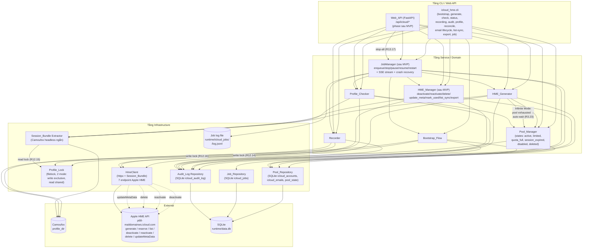

### Sequence — Generate batch flow (R3, R8, R12)

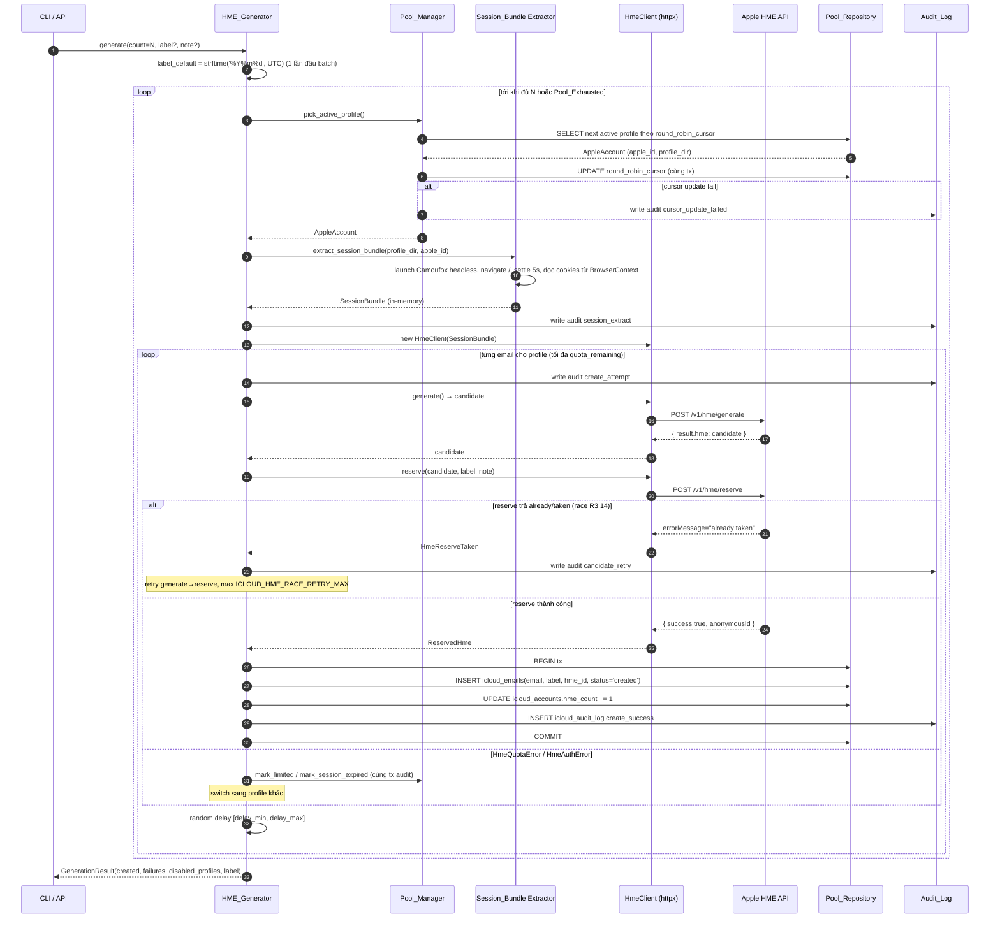

### Sequence — Profile_Checker flow (R4, R12)

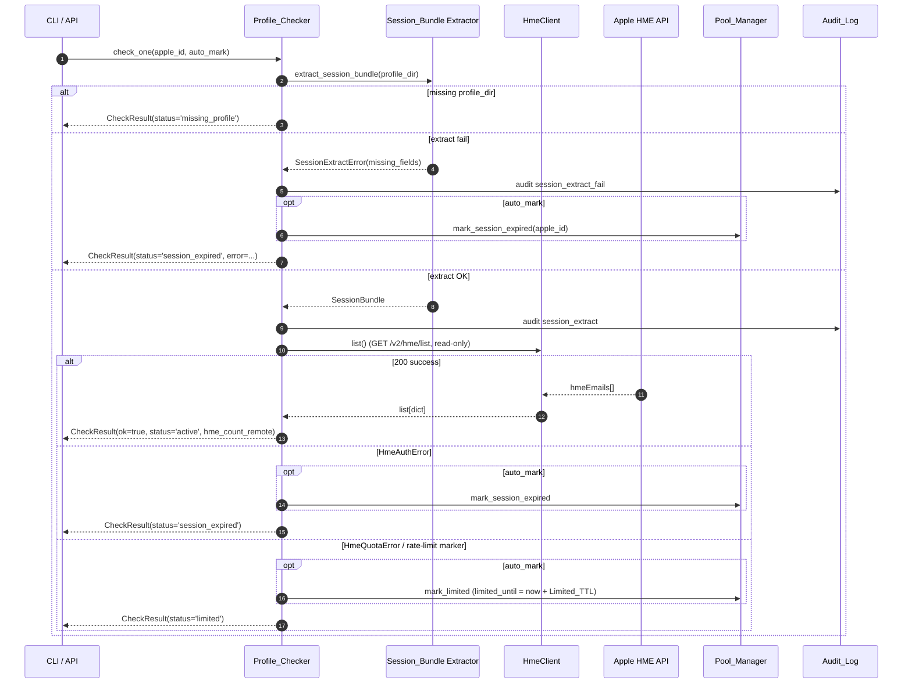

### Sequence — Email lifecycle action (deactivate / reactivate / delete / update-meta) (R9.1, R9.13, R9.14, R9.16)

Bao trùm 4 single-action lifecycle (đơn lẻ). Bulk variant lặp lại flow này theo group apple_id, reuse cùng SessionBundle in-memory + delay [1.0, 3.0]s giữa cặp request kế tiếp (R9.7).

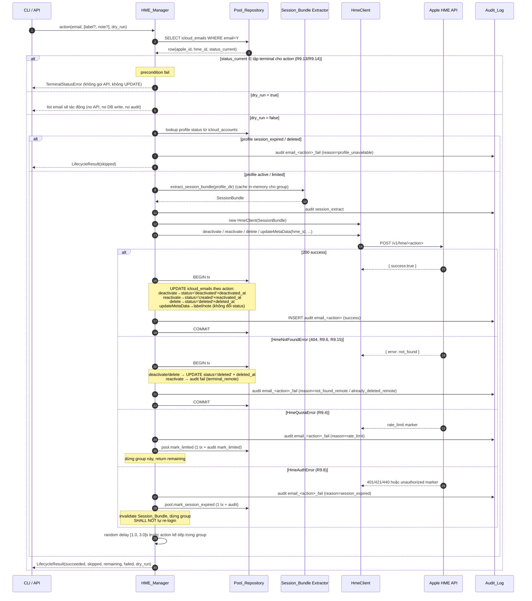

### Sequence — list_sync diff flow (R9.12)

`list_sync` là sync action read-driven (refactor B — DB source-of-truth): pull toàn bộ HME của 1 Apple_ID từ `/v2/hme/list`, so sánh với DB-side rồi áp 3 nhánh UPDATE diff trong 1 transaction. Email Apple-side mà DB không có → bỏ qua, KHÔNG insert. Match key là `hme_id` (= `anonymousId` Apple-side).

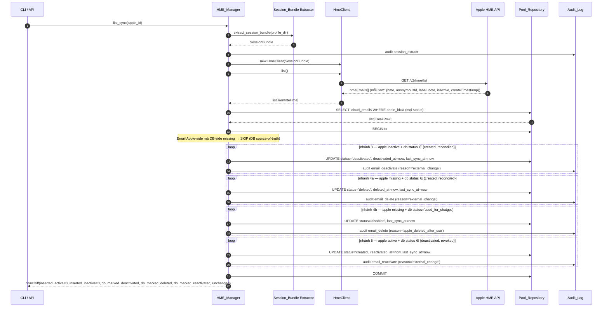

### Sequence — Job lifecycle (R13)

Job là async wrapper cho mọi long-running action. Web_API trả về `{job_id}` ngay khi enqueue, không block. SSE stream log realtime cho UI.

```mermaid
sequenceDiagram
    autonumber
    participant U as Web_API / CLI
    participant J as JobManager
    participant R as JobRepository
    participant W as Worker (asyncio task)
    participant H as Handler<br/>(Generator/HmeMgr/Checker/Bootstrap/Recorder)
    participant F as Job log file<br/>(log.jsonl)
    participant L as Audit_Log

    U->>J: enqueue(kind, params, apple_id_filter?, label_filter?)
    J->>R: INSERT icloud_jobs(status='queued', params_json, ...)
    R-->>J: job_id
    J-->>U: {job_id}

    Note over W: poll loop mỗi 2s, semaphore=ICLOUD_JOB_MAX_PARALLEL
    W->>R: SELECT WHERE status='queued' ORDER BY created_at LIMIT 1
    R-->>W: job_id
    W->>R: UPDATE status='running', started_at=now
    W->>L: audit job_started
    W->>F: append {ts, level=info, message='job started'}

    loop mỗi unit work
        opt user gọi action stop
            U->>J: stop(job_id)
            J->>J: cancellation_event.set()
        end
        opt user gọi action pause
            U->>J: pause(job_id)
            J->>J: pause_event.set()
        end
        W->>W: check pause_event
        alt pause_event đã set
            W->>R: UPDATE status='paused'
            W->>L: audit job_paused
            W->>F: append {level=info, message='job paused'}
            W->>W: await resume_event
            U->>J: resume(job_id)
            J->>J: resume_event.set()
            W->>R: UPDATE status='running'
            W->>L: audit job_resumed
        end
        W->>W: check cancellation_event
        alt cancellation_event đã set
            W->>R: UPDATE status='cancelled', ended_at=now, result_json=partial
            W->>L: audit job_cancelled
            W->>F: append {level=info, message='job cancelled'}
            W-->>J: done
        end
        W->>H: process_unit(unit_input)
        H->>F: append {level=debug|info, message, payload}
        H-->>W: unit_result
        W->>R: BEGIN tx; UPDATE progress_done +=1, updated_at=now;<br/>(cùng tx với DB change của unit do handler thực hiện); COMMIT
    end

    alt mọi unit hoàn tất
        W->>R: UPDATE status='completed', ended_at=now, result_json=final
        W->>L: audit job_completed
        W->>F: append {level=info, message='job completed'}
    else handler raise exception không recover
        W->>R: UPDATE status='failed', ended_at=now, result_json={error}
        W->>L: audit job_failed
        W->>F: append {level=error, message=str(exc)}
    end

    Note over J: SSE stream: client GET /jobs/<id>/log/stream → tail log.jsonl
    Note over J: Crash recovery: trên startup,<br/>SELECT WHERE status='running' AND updated_at < now-300s<br/>→ mark failed (reason='process_crashed') + audit job_failed
```

### Sequence — Infinite_Generate_Mode flow (R3.20-R3.26)

Mode kích hoạt khi `params_json.infinite=true` hoặc `count ∈ {None, 0, -1, 'infinite'}`. Vòng lặp pick → tạo email → switch profile chạy không giới hạn `count`, chỉ break khi user `stop` (single hoặc stop-all qua R13.17), `pause` (R13.7), hoặc fatal error không recover (R3.25).

```mermaid
sequenceDiagram
    autonumber
    participant U as Web_API / CLI
    participant J as JobManager
    participant G as HME_Generator
    participant P as Pool_Manager
    participant S as Session_Bundle Extractor
    participant C as HmeClient
    participant D as Pool_Repository
    participant L as Audit_Log

    U->>J: enqueue(kind='generate', params={infinite:true, label?, note?, count:null})
    J->>G: handle(job_id, params, cancellation_event, pause_event, resume_event)
    G->>G: effective_infinite = params.infinite OR params.count in (None,0,-1,'infinite')
    G->>G: label_default = strftime('%Y%m%d', UTC) (1 lần đầu batch)

    loop infinite — chỉ break vì cancel/pause/fatal
        G->>G: check cancellation_event
        alt cancellation_event set
            G-->>J: return GenerationResult partial (count=created, label)
            Note over J: JobManager mark status='cancelled' + audit job_cancelled
        end
        G->>G: check pause_event
        alt pause_event set
            G->>L: audit job_paused
            G->>G: await resume_event
            G->>L: audit job_resumed
        end

        G->>P: pick_active_profile()
        alt IcloudPoolError (Pool_Exhausted)
            Note over G: → Pool_Exhausted_Wait (sequence riêng)
        else profile OK
            P-->>G: AppleAccount(apple_id, profile_dir, hme_count)
            G->>G: post-pick check hme_count >= HME_QUOTA_LIMIT (R3.22)
            alt hme_count >= HME_QUOTA_LIMIT
                G->>P: pool.mark_quota_full(apple_id, reason=f'hme_count={hme_count}')
                P->>D: BEGIN tx; UPDATE status='quota_full', quota_retry_until=now+Quota_Retry_TTL
                P->>L: audit mark_quota_full {apple_id, hme_count, quota_retry_until}
                P->>D: COMMIT
                G->>L: audit email_skip_quota_full {apple_id, hme_count}
                Note over G: NO delay, pick profile kế tiếp NGAY
            else hme_count < HME_QUOTA_LIMIT
                G->>S: extract_session_bundle(profile_dir)
                S-->>G: SessionBundle
                G->>L: audit session_extract
                G->>C: new HmeClient(bundle)

                loop từng email tuần tự (R3.16)
                    G->>G: check cancellation_event / pause_event (R3.21)
                    alt cancellation/pause
                        Note over G: break inner loop, return partial / await resume
                    end
                    G->>C: generate() → candidate
                    G->>C: reserve(candidate, label, note)
                    alt reserve thành công
                        C-->>G: ReservedHme
                        G->>D: BEGIN tx
                        G->>D: INSERT icloud_emails + UPDATE hme_count + INSERT audit create_success
                        G->>D: COMMIT
                        G->>G: random delay [delay_min, delay_max]
                    else HmeReserveTaken
                        Note over G: candidate retry max race_retry_max (R3.14)
                    else HmeQuotaError
                        G->>P: pool.mark_limited
                        Note over G: break inner loop, switch profile
                    else HmeAuthError
                        G->>P: pool.mark_session_expired
                        G->>G: invalidate cached SessionBundle
                        Note over G: break inner loop, switch profile
                    end
                end
                G->>G: check cancellation_event / pause_event (R3.21) sau switch profile
            end
        end
    end

    Note over G: Fatal error (ngoài HmeClientError / SessionExtractError / IcloudPoolError):<br/>re-raise → JobManager mark 'failed' (R3.25) + audit job_failed
```

### Sequence — Pool_Exhausted_Wait flow (R3.23, R3.24)

Branch riêng kích hoạt từ Infinite_Generate_Mode khi `pool.pick_active_profile()` raise `IcloudPoolError`. Mục tiêu: KHÔNG fail job mà sleep tới điểm profile có thể tự recover, vẫn cancellable trong tối đa 1 giây.

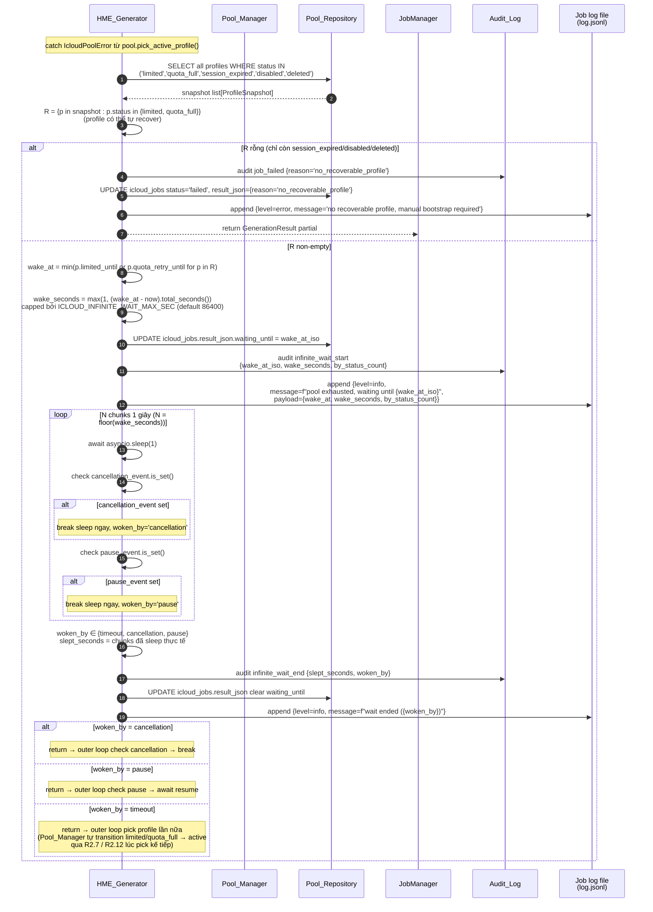

Note quan trọng: HME_Generator KHÔNG dùng `await asyncio.sleep(wake_seconds)` 1 phát vì không cancellable nếu user `stop` ở giữa. Pattern chia chunks 1 giây + check event trong loop đảm bảo response time ≤ 1 giây dù sleep tổng dài tới 24 giờ.

### State diagram — Job_Status (R13.2)

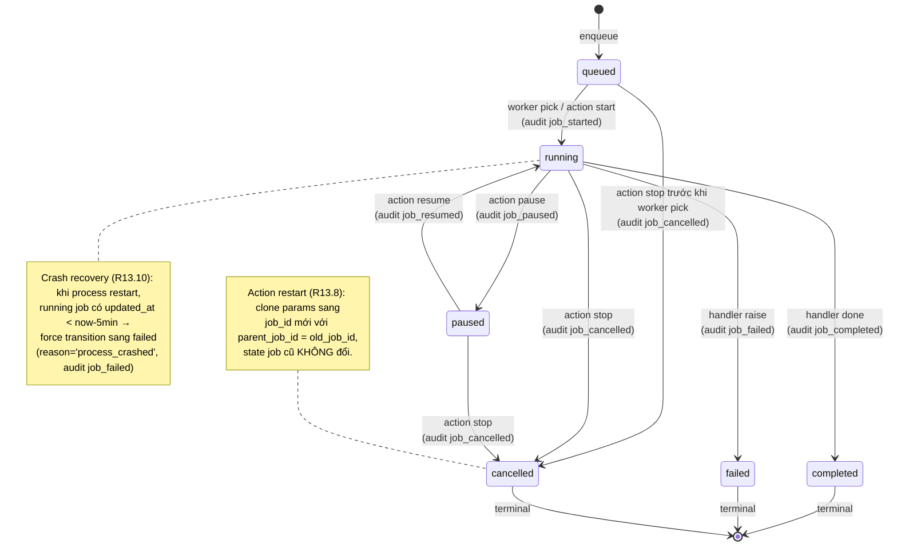

### State diagram — Profile_Status (R2)

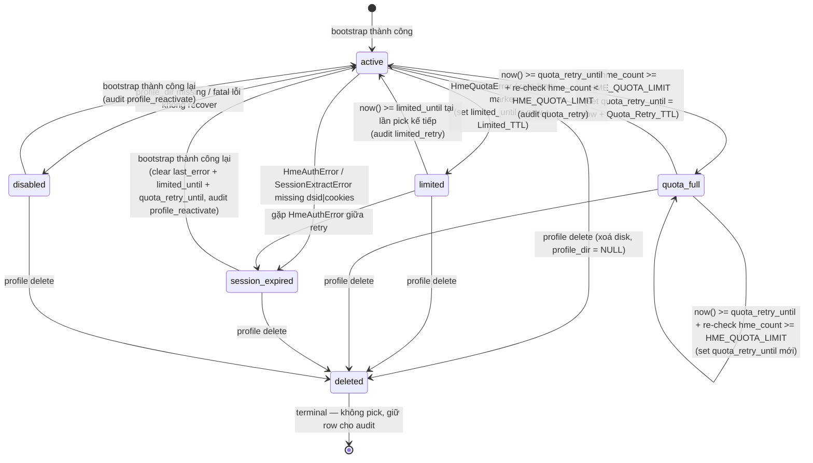

## Components and Interfaces

### Sequence — Add_Profile_Flow (R14)

Server-side flow cho web `+ Thêm profile`. UI dialog → API → Camoufox HEADED → user thao tác manual → save / cancel / timeout. KHÔNG dùng JobManager.

```mermaid
sequenceDiagram
    autonumber
    participant U as Web_UI Dialog
    participant W as Web_API
    participant S as AddProfileService
    participant Cf as Camoufox HEADED
    participant D as IcloudPoolRepository
    participant L as Audit_Log

    U->>W: POST /api/icloud/profiles/add/start
    alt đã có session active
        W-->>U: 409 {error: 'add_profile_in_progress', active_session_id}
    else session free
        W->>S: start()
        S->>S: tạo session_id (uuid4) + profile_dir = .adding/<session_id>/
        S->>Cf: launch headed → navigate icloud.com
        S->>L: audit profile_add_start {session_id, profile_dir, started_at}
        S->>S: spawn watchdog task (asyncio.sleep timeout_sec)
        S-->>W: AddProfileSession {state='recording'}
        W-->>U: 200 {session_id, started_at, profile_dir}

        Note over U,Cf: User login Apple ID + 2FA tay trong Camoufox<br/>UI poll GET /status mỗi 2s

        loop polling status
            U->>W: GET /api/icloud/profiles/add/<session_id>/status
            W->>S: status(session_id)
            S-->>W: AddProfileSession state hiện tại
            W-->>U: 200 {session_id, state, started_at, duration_seconds, ...}
        end

        alt user click `Lưu`
            U->>W: POST /api/icloud/profiles/add/<session_id>/save
            W->>S: save(session_id)
            S->>S: state recording → saving
            S->>Cf: read cookies + multi-strategy extract apple_id (cookie/setup_api/DOM)
            alt apple_id không extract được
                S->>Cf: close
                S->>S: cleanup .adding/<session_id>/
                S->>L: audit profile_add_fail {session_id, reason='apple_id_not_extractable'}
                S-->>W: AddProfileError(reason='apple_id_not_extractable')
                W-->>U: 400 {error, message, session_id}
            else cookies bắt buộc thiếu (PCS-Mail / WEBAUTH-USER)
                S->>Cf: close
                S->>S: cleanup
                S->>L: audit profile_add_fail {session_id, reason='cookies_not_ready'}
                S-->>W: AddProfileError(reason='cookies_not_ready')
                W-->>U: 400 {error: 'cookies_not_ready', message, session_id}
            else apple_id đã có row active|limited|quota_full|session_expired
                S->>Cf: close
                S->>S: cleanup
                S->>L: audit profile_add_fail {session_id, reason='apple_id_already_exists', apple_id}
                S-->>W: AddProfileError(reason='apple_id_already_exists')
                W-->>U: 409 {error: 'apple_id_already_exists', apple_id, session_id, message}
            else extract OK + apple_id mới (hoặc row deleted = re-add)
                S->>Cf: close (flush state vào profile_dir tạm)
                S->>S: rename .adding/<session_id>/ → icloud_profiles/<apple_id>/
                alt rename bị file-lock conflict (Bootstrap/Recorder khác)
                    S->>S: retry tối đa 5s
                    alt vẫn fail
                        S->>S: state saving → failed
                        S->>L: audit profile_add_fail {session_id, reason='move_failed', error}
                        S-->>W: AddProfileError(reason='move_failed')
                        W-->>U: 500 {error: 'move_failed', message, session_id}
                    end
                else rename thành công
                    S->>D: BEGIN tx; upsert(apple_id, profile_dir_final); update_status(active, clear_*); COMMIT
                    S->>L: audit profile_add_success {session_id, apple_id, profile_dir_final, duration_seconds}
                    S->>S: state saving → done; cancel watchdog
                    S-->>W: AddProfileSession {state='done', apple_id}
                    W-->>U: 200 {session_id, apple_id, status='active'}
                    U->>U: refresh GET /api/icloud/profiles → toast success
                end
            end
        else user click `Huỷ`
            U->>W: POST /api/icloud/profiles/add/<session_id>/cancel
            W->>S: cancel(session_id)
            S->>S: state recording|saving → cancelling
            S->>Cf: terminate (force, không đợi flush)
            S->>S: cleanup .adding/<session_id>/
            S->>L: audit profile_add_cancel {session_id, duration_seconds, reason='user_cancel'}
            S->>S: state cancelling → cancelled; cancel watchdog
            S-->>W: AddProfileSession {state='cancelled'}
            W-->>U: 200 {session_id, status='cancelled'}
        else watchdog timeout (R14.8) — user đóng tab không bấm gì
            S->>S: asyncio.sleep(timeout_sec) hoàn tất
            S->>Cf: terminate
            S->>S: cleanup
            S->>L: audit profile_add_timeout {session_id, expired_after_sec}
            S->>S: state recording|saving → cancelled
        end
    end

    Note over S: Process restart → in-memory state mất.<br/>cleanup_orphan_on_startup() xoá .adding/<*>/<br/>+ audit profile_add_fail reason='process_crashed' (R14.12)
```

### State diagram — Add_Profile_Session (R14)

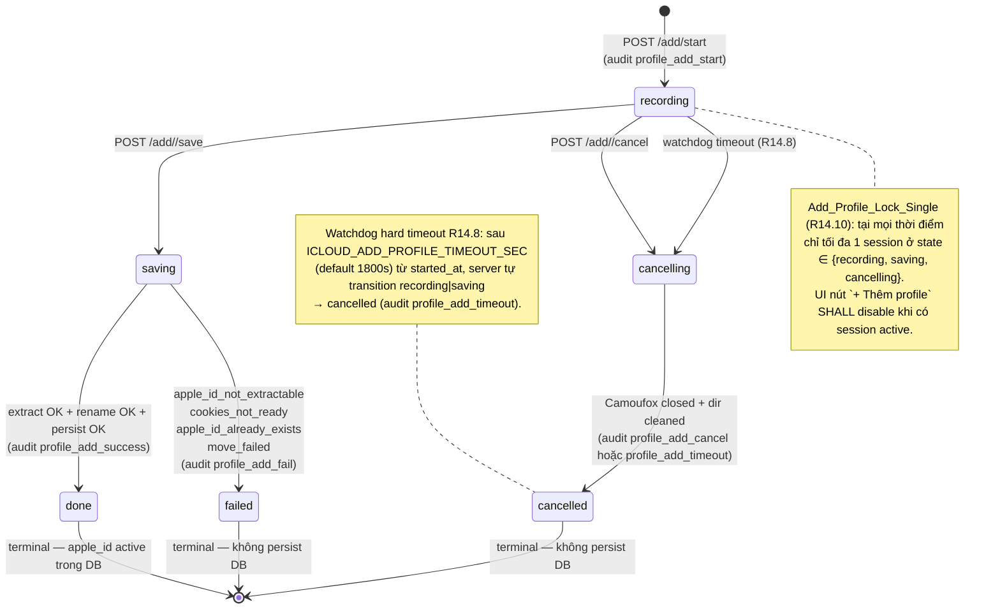

## Components and Interfaces

Mỗi component dưới đây là 1 module/class trong tầng đã mô tả ở Architecture. Pseudo-code chỉ thể hiện signature + contract; chưa phải implementation.

### 1. Bootstrap_Flow (`icloud_hme/bootstrap.py` — extend) (R12.1, R12.2, R12.10)

Vai trò duy nhất: chạm UI Apple ID. Là cách duy nhất đưa profile từ `session_expired` / `disabled` về `active`.

```python
@dataclass
class BootstrapResult:
    apple_id: str
    profile_dir: Path
    status: str          # 'active'
    matched_cookies: list[str]
    bootstrapped_at: datetime  # UTC

class BootstrapError(IcloudError): ...

async def bootstrap(
    apple_id: str,
    *,
    runtime_dir: Path,
    pool_repo: "IcloudPoolRepository",
    audit_repo: "AuditLogRepository",
    proxy: str | None = None,
    log: Logger,
) -> BootstrapResult:
    """Mở Camoufox HEADED với profile_dir cố định, đợi user login + 2FA tay,
    verify cookie X-APPLE-WEBAUTH-USER xuất hiện, đóng browser, upsert DB.

    Phải:
      - Headed (R12.1, R12.11): KHÔNG headless cho flow này.
      - Acquire `profile_lock.write_lock(timeout=30)` TRƯỚC KHI launch Camoufox (R12.14).
        Timeout → raise BootstrapError(reason='profile_locked_by_another_process')
        + audit `profile_bootstrap_fail`.
      - Apply retry pattern (R12.17): tối đa 2 lần retry với pause 5 giây nếu cookie
        verify fail. Audit `profile_bootstrap_fail` với `attempt` count cho mỗi attempt
        fail; raise BootstrapError(reason='cookie_verify_failed_after_retry') sau attempt
        thứ 3.
      - Verify ÍT NHẤT 1 cookie marker login (X-APPLE-WEBAUTH-USER /
        X-APPLE-WEBAUTH-TOKEN / X-APPLE-WEBAUTH-PCS-Mail) trước khi đóng (R12.2).
      - Cùng tx: upsert icloud_accounts + reset status='active' +
        clear last_error + clear limited_until + ghi audit profile_bootstrap
        (hoặc profile_reactivate nếu profile từng disabled/session_expired).

    Raise BootstrapError nếu user huỷ hoặc cookie chưa đủ sau retry.
    """
```

Khác với bản hiện có ở `bootstrap.py`:

- Audit event `profile_bootstrap` / `profile_reactivate` được ghi trong cùng tx upsert (R6.3).
- Khi profile đang `session_expired` → set lại `Profile_Status = active` + clear `limited_until`, không chỉ `disabled` đơn thuần.

### 2. Session_Bundle Extractor (`icloud_hme/session.py` — extend) (R12.3, R12.4, R12.5)

Adapter giữa Camoufox và HmeClient: bóc cookies thành object thuần để `HmeClient` không cần biết Camoufox. Refactor B (May 2026) đơn giản hoá đáng kể: bỏ extract `window.webAuth` (Apple đã gỡ), bỏ extract `dsid` / `clientId` / `scnt` / `X-Apple-ID-Session-Id` / `maildomainws_host` / `user_agent` (Apple HME API không enforce khi cookies hợp lệ — verified `test/check_hme_minimal_call.py`).

```python
@dataclass(frozen=True)
class SessionBundle:
    apple_id: str
    cookies: dict[str, str]            # X-APPLE-WEBAUTH-* và bạn bè
    extracted_at: datetime             # UTC

class SessionExtractError(IcloudError):
    def __init__(self, apple_id: str, missing_fields: list[str]): ...

async def extract_session_bundle(
    *,
    profile_dir: Path,
    apple_id: str,
    audit_repo: AuditLogRepository,
    proxy: str | None = None,
    log: Logger,
    settle_seconds: float = 5.0,
) -> SessionBundle:
    """Acquire ``Profile_Lock`` mode ``read`` (timeout 60s) TRƯỚC KHI launch
    Camoufox (R12.15). Timeout → raise SessionExtractError(reason='profile_locked_by_bootstrap')
    + audit session_extract_fail. Caller (HME_Generator/Profile_Checker/HME_Manager)
    SHALL switch sang profile khác qua Pool_Manager (KHÔNG retry trong cùng vòng pick).

    Launch Camoufox headless với profile_dir, navigate
    https://www.icloud.com/, sleep ``settle_seconds`` để Apple webapp gọi
    /setup/ws/1/validate flush cookies session post-validate, đọc cookies
    qua BrowserContext.cookies('https://www.icloud.com/'). Đóng Camoufox
    NGAY sau extract (R12.11).

    Validate (R12.5): cookies non-empty + có ÍT NHẤT 1 cookie thuộc tập
    marker login {X-APPLE-WEBAUTH-USER, X-APPLE-WEBAUTH-TOKEN,
    X-APPLE-WEBAUTH-PCS-Mail}. Thiếu → raise SessionExtractError(missing_fields=['cookies']).
    """
```

Lưu ý:

- Function tự log cookie key names + count, không log raw cookie value (R12.6, R12.7).
- Caller (HME_Generator / Profile_Checker / HME_Manager) chịu trách nhiệm cache `SessionBundle` in-memory cho cùng profile trong 1 batch (R12.8).

### 3. HmeClient (`icloud_hme/client.py` — refactor) (R11)

Refactor từ implementation hiện có (gọi qua `page.evaluate`) sang `httpx.AsyncClient` thuần, nhận `SessionBundle` (không nhận Page).

```python
@dataclass
class GeneratedCandidate:
    candidate: str       # email chưa reserve
    raw: dict

@dataclass
class ReservedHme:
    email: str
    hme_id: str          # anonymousId (hoặc hmeId nếu Apple trả)
    label: str | None
    note: str | None
    raw: dict

@dataclass
class RemoteHme:
    email: str
    hme_id: str
    label: str | None
    note: str | None
    is_active: bool
    create_timestamp: int

class HmeClient:
    def __init__(
        self,
        bundle: SessionBundle,
        *,
        timeout_sec: int | None = None,    # ICLOUD_HME_HTTP_TIMEOUT_SEC, default 30 (R11.7)
        log: Logger,
    ) -> None: ...

    async def generate(self) -> GeneratedCandidate:
        """POST {host}/v1/hme/generate?{params}, body {"langCode":"en-us"}.
        Return candidate; KHÔNG gọi reserve (R3.13)."""

    async def reserve(self, candidate: str, label: str, note: str | None) -> ReservedHme:
        """POST {host}/v1/hme/reserve. Apple require non-empty label."""

    async def list(self) -> list[RemoteHme]:
        """GET {host}/v2/hme/list. Read-only — Profile_Checker dùng làm probe."""

    async def deactivate(self, hme_id: str) -> None:
        """POST {host}/v1/hme/deactivate?... (sau MVP, R9)."""

    async def aclose(self) -> None: ...
```

Contract (R11):

- 4 query param bắt buộc trên mọi request: `clientBuildNumber`, `clientMasteringNumber`, `clientId`, `dsid`. Lấy từ `SessionBundle`.
- Headers cố định khi init `httpx.AsyncClient`: `Origin: https://www.icloud.com`, `Referer: https://www.icloud.com/`, `Content-Type: text/plain` (đặc thù iCloud API), `User-Agent` từ bundle, `scnt` từ bundle, `X-Apple-ID-Session-Id` từ bundle.
- Cookies set vào `client.cookies` cookiejar (KHÔNG paste vào header `Cookie:` thủ công, R11.8).
- KHÔNG dùng `requests` hoặc `aiohttp` (R11.8).

### 4. Pool_Manager (R2, R5, R7)

Class mới `IcloudPoolManager` đặt trong `icloud_hme/pool.py`. Wrap `IcloudPoolRepository` + áp luật pick / transition state. Mọi mutation trạng thái đều ghi audit trong cùng tx (R2.5, R6.3).

```python
@dataclass
class ProfileSnapshot:
    apple_id: str
    status: str                         # active|limited|quota_full|session_expired|disabled|deleted
    hme_count: int
    quota_remaining: int
    last_used_at: datetime | None
    limited_until: datetime | None
    quota_retry_until: datetime | None  # MỚI — non-null khi status=quota_full
    last_error: str | None

@dataclass
class PoolStatusReport:
    by_status: dict[str, int]           # active=N, limited=M, quota_full=K, ...
    profiles: list[ProfileSnapshot]
    emails_by_status: dict[str, int]    # created/used/revoked/disabled/reconciled
    quota_soft_cap_per_account: int
    total_quota_remaining: int
    low_capacity: bool                  # True khi total_quota_remaining < threshold
    quota_full_count: int               # MỚI (R7.5) — count profile đang ở status='quota_full'
    quota_full_profiles: list[dict]     # MỚI (R7.5) — [{apple_id, hme_count, quota_retry_until}]

@dataclass
class ProfileDeleteResult:
    apple_id: str
    deleted: bool
    profile_dir_removed: bool
    hme_count_at_delete: int
    reason: str | None                  # apple_id_not_found | already_deleted | None

class IcloudPoolError(IcloudError): ...

class IcloudPoolManager:
    def __init__(
        self,
        pool_repo: "IcloudPoolRepository",
        audit_repo: "AuditLogRepository",
        *,
        limited_ttl_hours: int = 24,           # ICLOUD_LIMITED_TTL_HOURS
        quota_retry_minutes: int = 15,         # MỚI — ICLOUD_QUOTA_RETRY_MINUTES (R2.13)
        hme_quota_limit: int = 700,            # MỚI — ICLOUD_HME_QUOTA_LIMIT (R2.14)
        low_capacity_threshold: int = 50,
    ) -> None: ...

    def pick_active_profile(self) -> AppleAccount:
        """Round-robin pick (R2.2 + R2.15 — atomic).

        CRITICAL: Wrap toàn bộ logic SELECT next + UPDATE round_robin_cursor trong
        1 SQLite transaction mode `BEGIN IMMEDIATE` (R2.15) để write-lock connection
        ngay từ đầu — đảm bảo 2 process song song serialize qua write-lock.

        SELECT profile có status='active' (tự transition limited→active khi
        now>=limited_until + audit limited_retry per R2.7; tự transition
        quota_full→active khi now>=quota_retry_until + re-check hme_count
        < HME_QUOTA_LIMIT per R2.12) ORDER BY (apple_id > round_robin_cursor) DESC,
        apple_id ASC, LIMIT 1.
        Pool_Manager SHALL NOT check hme_count ở bước pick — trách nhiệm này
        chuyển sang HME_Generator (R3.22) để giảm coupling: Pool chỉ filter
        theo status enum, Generator owning domain logic post-pick.
        Update round_robin_cursor trong cùng tx (R2.3, atomic via BEGIN IMMEDIATE).

        IF SQLite trả 'database is locked' (timeout 5s default), THEN
          - audit pool_pick_locked với payload {wait_ms, parallelism}
          - raise IcloudPoolError(message='pool_pick_locked')

        Pool_Exhausted → IcloudPoolError(by_status={...}) với set status đầy đủ
        bao gồm quota_full."""

    def mark_limited(self, apple_id: str, *, reason: str) -> None:
        """1 tx: status='limited', limited_until=now+Limited_TTL, last_error=reason,
        audit mark_limited (R2.5)."""

    def mark_session_expired(self, apple_id: str, *, reason: str) -> None:
        """1 tx: status='session_expired', last_error=reason, audit mark_session_expired."""

    def mark_disabled(self, apple_id: str, *, reason: str) -> None: ...

    def mark_quota_full(self, apple_id: str, *, reason: str) -> None:
        """MỚI (R2.10).
        1 tx: status='quota_full', quota_retry_until=now+Quota_Retry_TTL,
        last_error=reason (vd 'hme_count=700'), audit mark_quota_full
        với payload {apple_id, hme_count, quota_retry_until}."""

    def reactivate(self, apple_id: str) -> None:
        """Sau bootstrap thành công: status='active', clear last_error +
        limited_until + quota_retry_until (MỚI), audit profile_reactivate
        (R4.7, R12.10)."""

    def delete_profile(self, apple_id: str) -> ProfileDeleteResult:
        """Xoá profile_dir trên disk + set status='deleted' + profile_dir=NULL,
        preserve icloud_emails. Audit profile_delete hoặc profile_delete_fail
        cho mọi lỗi (apple_id_not_found, already_deleted, disk error) (R5)."""

    def status_report(self) -> PoolStatusReport: ...
```

Pattern mượn từ `outlook_pool.py`:

- `_TERMINAL_ERRORS` tương đương → ở đây không cần substring filter, vì status enum đã rạch ròi (`session_expired`, `disabled`, `quota_full`).
- `mark_success` (outlook_pool) ↔ tăng `hme_count` + audit `create_success`.
- `mark_failure` (outlook_pool) ↔ `mark_limited` / `mark_session_expired` / `mark_disabled` / `mark_quota_full` tuỳ exception class hoặc precondition (vd `mark_quota_full` không phải exception — là precondition phát hiện ở Generator post-pick check).
- `status_summary` (outlook_pool) ↔ `status_report()`. Cấu trúc giàu hơn: count theo status enum 6 trạng thái, capacity per profile, low_capacity flag (R7.4), quota_full_count + quota_full_profiles (R7.5).

### 5. HME_Generator (`icloud_hme/generator.py` — refactor) (R3, R8)

```python
@dataclass
class FailureRecord:
    apple_id: str
    error_class: str
    error: str

@dataclass
class GenerationResult:
    requested: int
    created: int
    emails: list[str]
    failures: list[FailureRecord]
    disabled_profiles: list[str]
    label: str                          # label thực dùng (Label_Default hoặc override)

class HmeGenerator:
    def __init__(
        self,
        pool: IcloudPoolManager,
        pool_repo: "IcloudPoolRepository",
        audit_repo: "AuditLogRepository",
        *,
        race_retry_max: int = 3,        # ICLOUD_HME_HME_RACE_RETRY_MAX
        delay_range: tuple[float, float] = (2.0, 5.0),   # R3.11
        profile_parallelism: int = 1,   # ICLOUD_HME_PROFILE_PARALLELISM (R3.17)
        infinite_wait_max_sec: int = 86400,  # MỚI — ICLOUD_INFINITE_WAIT_MAX_SEC (R3.23)
        log: Logger,
    ) -> None: ...

    async def generate(
        self,
        *,
        count: int | None = None,           # MỚI: None / 0 / -1 → infinite mode (R3.20)
        infinite: bool = False,             # MỚI: explicit flag (R13.15)
        label: str | None = None,           # None → Label_Default (R3.18)
        note: str | None = None,
        proxy: str | None = None,
        cancellation_event: asyncio.Event | None = None,    # MỚI (R3.21)
        pause_event: asyncio.Event | None = None,           # MỚI (R3.21)
        resume_event: asyncio.Event | None = None,          # MỚI (R3.21)
        on_progress: Callable | None = None,                # MỚI: callback update result_json.waiting_until
    ) -> GenerationResult:
        """Flow extension cho infinite mode:
          1. Resolve effective_infinite = infinite OR count in (None, 0, -1, 'infinite').
          2. Tính label hiệu lực (R3.18, R3.19) — không đổi: nếu label None →
             strftime('%Y%m%d', UTC) 1 lần đầu batch; user truyền non-empty → giữ nguyên.
          3. Loop:
             a. Pre-pick check (chỉ áp dụng khi effective_infinite=True):
                - cancellation_event set → break, return partial GenerationResult.
                - pause_event set → await resume_event, audit job_paused/job_resumed.
             b. pool.pick_active_profile() — KHÔNG check hme_count ở Pool_Manager (R2.2).
                - IcloudPoolError raise → handle Pool_Exhausted_Wait (R3.23, branch riêng dưới).
             c. Post-pick check hme_count (R3.22):
                - hme_count >= HME_QUOTA_LIMIT → pool.mark_quota_full(reason=f'hme_count={hme_count}'),
                  audit email_skip_quota_full {apple_id, hme_count}, continue (NO delay).
             d. extract Session_Bundle → loop tạo email tuần tự (R3.16):
                - Mỗi reserve thành công → 1 tx: INSERT email + UPDATE hme_count
                  + INSERT audit create_success (R3.5, R6.3, R8.1).
                - Mỗi reserve thành công → check cancellation_event / pause_event (R3.21).
                - reserve trả already/taken → audit candidate_retry, retry max race_retry_max
                  (R3.14, R3.15) — KHÔNG đếm fail.
                - HmeQuotaError → pool.mark_limited, đóng client, switch profile (R3.7).
                - HmeAuthError → invalidate bundle, pool.mark_session_expired,
                  switch profile (R3.8, R12.9).
                - Bounded mode: dừng khi created == count.
                - Infinite mode: vòng lặp KHÔNG break vì count.
             e. Switch profile → check cancellation_event / pause_event (R3.21).
          4. Pool_Exhausted_Wait branch (R3.23):
             - Compute wake_at = min(p.limited_until or p.quota_retry_until)
               for p in pool if p.status in {limited, quota_full}.
             - Set rỗng (chỉ còn session_expired/disabled/deleted) → transition job
               'failed' với result_json.reason='no_recoverable_profile', audit job_failed,
               return.
             - Set non-empty: wake_seconds = max(1, (wake_at - now).total_seconds())
               capped bởi infinite_wait_max_sec.
             - Update result_json.waiting_until = wake_at_iso, audit infinite_wait_start
               {wake_at_iso, wake_seconds, by_status_count}.
             - Sleep chunks 1 giây (N = floor(wake_seconds)). MỖI chunk check
               cancellation_event.is_set() và pause_event.is_set() — set thì break ngay.
             - Sau wake: audit infinite_wait_end {slept_seconds, woken_by ∈
               {timeout, cancellation, pause}}, clear result_json.waiting_until,
               loop pick lại từ đầu (Pool_Manager tự transition limited/quota_full
               → active qua R2.7 / R2.12).
          5. Fatal error (ngoài HmeClientError / SessionExtractError / IcloudPoolError):
             - Re-raise → JobManager catch → mark 'failed' (R3.25) + audit job_failed.
          6. SIGINT/SIGTERM → hoàn tất tx email đang reserve (nếu Apple đã trả 200),
             không bắt đầu email mới, return partial (R3.12).

        Return GenerationResult với count=created. Infinite mode: count = số email đã
        tạo tới khi cancelled. Bounded mode: count = N (đủ) hoặc partial."""

    async def reconcile(self, *, apple_id: str) -> ReconcileResult:
        """Gọi client.list(), so sánh icloud_emails theo hme_id:
          - Apple-side có, DB-side thiếu → INSERT status='reconciled' + audit
            reconcile_add (1 tx, R8.3).
          - DB-side có (status='created'), Apple-side thiếu → UPDATE status='disabled'
            + audit reconcile_disable (1 tx, R8.4).
        Map hme_id ưu tiên `hmeId`, fallback `anonymousId` (R8.6)."""
```

Pattern mượn từ `outlook_pool.py`: terminal error classification. Generator ánh xạ exception class sang hành động pool:

- `HmeQuotaError` → `pool.mark_limited`.
- `HmeAuthError` → `pool.mark_session_expired`.
- `HmeTransientError` → retry trong cùng profile (KHÔNG thay đổi pool state).
- `SessionExtractError` → `pool.mark_session_expired` nếu thiếu dsid/cookies, ngược lại `mark_disabled`.
- `hme_count >= HME_QUOTA_LIMIT` (precondition, không phải exception) → `pool.mark_quota_full` (R3.22).

Pattern bổ sung cho cancellable sleep dài: HME_Generator dùng vòng lặp `while remaining_seconds > 0: await asyncio.sleep(1); if cancellation_event.is_set(): break` (chia chunks 1 giây) thay vì 1 phát `await asyncio.sleep(wake_seconds)`. Lý do: `asyncio.sleep` dài không cancellable bằng `Event.set()` — chỉ cancellable nếu task bị `task.cancel()`. Pattern chunks 1s đảm bảo response action user trong tối đa 1 giây dù sleep tổng dài đến 24h.

Lý do tách rạch ròi (khác `outlook_pool` filter substring): với iCloud, classification đã do `HmeClient` xử lý qua status code + errorMessage marker (R11.6); generator chỉ cần `except` đúng class.

### 6. Profile_Checker (`icloud_hme/checker.py` — refactor) (R4)

```python
@dataclass
class CheckResult:
    apple_id: str
    ok: bool
    status: str                         # active|limited|session_expired|missing_profile|error
    hme_count_remote: int | None
    hme_count_local: int
    error: str | None
    error_class: str | None

class ProfileChecker:
    def __init__(
        self,
        pool: IcloudPoolManager,
        pool_repo: "IcloudPoolRepository",
        audit_repo: "AuditLogRepository",
        *,
        log: Logger,
    ) -> None: ...

    async def check_one(self, apple_id: str, *, auto_mark: bool = False) -> CheckResult:
        """1. Đọc profile_dir từ pool_repo.
        2. profile_dir không tồn tại → CheckResult(status='missing_profile').
        3. extract_session_bundle → SessionExtractError → audit session_extract_fail,
           auto_mark → mark_session_expired (R4.4 mở rộng cho cookies/dsid missing).
        4. HmeClient(bundle).list() (read-only, R4.8).
        5. Map exception:
             - HmeAuthError → status='session_expired', auto_mark → mark_session_expired
             - HmeQuotaError / rate-limit marker → status='limited', auto_mark → mark_limited
             - 200 OK → status='active', hme_count_remote = len(items)
        6. KHÔNG gọi generate / reserve (R4.8). KHÔNG headed (R4.9)."""

    async def check_all(self, *, auto_mark: bool = False) -> list[CheckResult]:
        """Tuần tự, chỉ profile status ∈ {active, limited} (R4.2)."""
```

### 7. HME_Manager (sau MVP, R9 mở rộng — full lifecycle)

HME_Manager owning toàn bộ post-create lifecycle: 4 action Apple-side (`deactivate / reactivate / delete / updateMetaData`) + 1 sync action (`list_sync`) + 1 DB-only action (`mark_used`) + 1 export action. Mọi biến thể đều có flow tương đương: load row → check terminal status → group-by-apple_id → reuse SessionBundle in-memory → delay [1.0, 3.0]s giữa cặp request kế tiếp trong cùng group (R9.7).

```python
@dataclass
class LifecycleResult:
    """Kết quả cho mọi lifecycle action (single + bulk).

    Single action (deactivate/reactivate/delete/update_meta/mark_used) trả
    requested=1, succeeded ∈ {0,1}, ngược lại bị bắt ở skipped/failed.
    Bulk dùng đầy đủ các trường: succeeded < requested khi có skipped/failed/remaining.
    """
    requested: int
    succeeded: int
    skipped: list[dict]                 # {email, reason}
    remaining: list[str]                # khi dừng giữa group (limited/auth)
    failed: list[dict]                  # {email, reason, error}
    dry_run: bool

@dataclass
class SyncDiff:
    """Kết quả 1 lần list_sync — counter cho 5 nhánh diff (R9.12)."""
    apple_id: str
    inserted_active: int                # apple-side active, db-missing
    inserted_inactive: int              # apple-side inactive, db-missing
    db_marked_deactivated: int          # apple-side inactive, db-side created/reconciled
    db_marked_deleted: int              # apple-side missing, db-side created/reconciled
    db_marked_reactivated: int          # apple-side active, db-side deactivated/revoked
    unchanged: int

@dataclass
class ExportResult:
    count: int
    format: str                         # 'csv' | 'json'
    output_path: Path | None            # None = stdout
    audit_logged: bool

class TerminalStatusError(IcloudError):
    """Action gọi trên email có status terminal (deleted) hoặc precondition fail."""
    def __init__(self, email: str, current_status: str, action: str): ...

class HmeManager:
    """Full lifecycle layer cho HME email post-create.

    Tách rạch ròi với HME_Generator: Generator owning create/reconcile,
    Manager owning mọi update + sync + DB-only mutation. Cả hai chia chung
    pool/repo/audit dependency.
    """

    def __init__(
        self,
        pool: IcloudPoolManager,
        pool_repo: "IcloudPoolRepository",
        audit_repo: "AuditLogRepository",
        *,
        delay_range: tuple[float, float] = (1.0, 3.0),   # R9.7
        log: Logger,
    ) -> None: ...

    # ----- Single email actions (R9.1, R9.13, R9.14, R9.16, R9.19) -----
    async def deactivate(self, email: str, *, dry_run: bool = False) -> LifecycleResult: ...
    async def reactivate(self, email: str, *, dry_run: bool = False) -> LifecycleResult:
        """Precondition: status ∈ {deactivated, revoked}; status ∈ {deleted, disabled}
        → raise TerminalStatusError, không gọi API (R9.13)."""
    async def delete(self, email: str, *, dry_run: bool = False) -> LifecycleResult:
        """Precondition: status ∉ {deleted}; status='deleted' → raise TerminalStatusError.
        404/already-deleted-remote → vẫn UPDATE status='deleted' + audit (R9.15)."""
    async def update_meta(
        self, email: str, *, label: str | None, note: str | None, dry_run: bool = False,
    ) -> LifecycleResult:
        """Update label/note qua /v1/hme/updateMetaData. Không đổi status (R9.16)."""
    async def mark_used(self, email: str, *, used_for: str) -> LifecycleResult:
        """DB-only: status='used_for_chatgpt' + used_for_email=email.
        SHALL NOT gọi API Apple. Audit email_mark_used (R9.19)."""

    # ----- Bulk actions (R9.2, R9.17): group-by-apple_id + reuse SessionBundle + delay -----
    async def deactivate_bulk(self, emails: list[str], *, dry_run: bool = False) -> LifecycleResult: ...
    async def reactivate_bulk(self, emails: list[str], *, dry_run: bool = False) -> LifecycleResult: ...
    async def delete_bulk(self, emails: list[str], *, dry_run: bool = False) -> LifecycleResult: ...
    async def update_meta_bulk(
        self, items: list[dict], *, dry_run: bool = False,
    ) -> LifecycleResult:
        """items = [{email, label?, note?}]"""

    # ----- By-label / by-date filters (R9.9, R9.10, R9.17) -----
    async def deactivate_by_label(self, label: str, *, dry_run: bool = False) -> LifecycleResult: ...
    async def reactivate_by_label(self, label: str, *, dry_run: bool = False) -> LifecycleResult: ...
    async def delete_by_label(self, label: str, *, dry_run: bool = False) -> LifecycleResult: ...
    async def deactivate_by_date(self, yyyymmdd: str, *, dry_run: bool = False) -> LifecycleResult:
        """Convert thành deactivate_by_label(yyyymmdd) (R9.10)."""
    async def delete_by_date(self, yyyymmdd: str, *, dry_run: bool = False) -> LifecycleResult: ...

    # ----- Sync action (R9.12) -----
    async def list_sync(self, apple_id: str) -> SyncDiff:
        """Pull /v2/hme/list, diff với DB-side, áp 5 nhánh trong 1 tx:
          - apple active + db missing → INSERT status='reconciled' + audit reconcile_add.
          - apple inactive + db missing → INSERT status='deactivated' + audit reconcile_add
            (payload.inactive_at_sync=true).
          - apple inactive + db status ∈ {created, reconciled} → UPDATE status='deactivated'
            + deactivated_at + audit email_deactivate (reason='external_change').
          - apple missing + db status ∈ {created, reconciled} → UPDATE status='deleted'
            + deleted_at + audit email_delete (reason='external_change').
          - apple active + db status ∈ {deactivated, revoked} → UPDATE status='created'
            + reactivated_at + audit email_reactivate (reason='external_change').
        Match key: hme_id (= anonymousId Apple-side, fallback hmeId).
        Mọi UPDATE đều set last_sync_at=now."""

    # ----- Export (R9.20) -----
    async def export(
        self, *, format: str, filter: dict, output: Path | None,
    ) -> ExportResult:
        """format ∈ {csv, json}; filter ∈ {status, apple_id, label, date_range}.
        Schema: email, apple_id, label, note, hme_id, status, used_for_email,
        created_at, deactivated_at, reactivated_at, deleted_at, last_sync_at.
        Audit email_export {count, format, filter}."""
```

**Bulk semantics (R9.2, R9.7, R9.17, R9.18)** — bảng map action → endpoint Apple → status mới → audit event:

| Action | Endpoint | Status sau (success) | Audit event | Reason payload |
|---|---|---|---|---|
| `deactivate` | POST /v1/hme/deactivate | `deactivated` | `email_deactivate` | (mặc định, không có) |
| `reactivate` | POST /v1/hme/reactivate | `created` | `email_reactivate` | (mặc định, không có) |
| `delete` | POST /v1/hme/delete | `deleted` | `email_delete` | (mặc định, không có) |
| `update_meta` | POST /v1/hme/updateMetaData | (không đổi status) | `email_update_meta` | payload chứa `{label_old, label_new, note_old, note_new}` |
| `mark_used` | (không, DB-only) | `used_for_chatgpt` | `email_mark_used` | payload `{used_for}` |
| `list_sync` (5 nhánh) | GET /v2/hme/list | (theo nhánh) | `reconcile_add` / `email_deactivate` / `email_delete` / `email_reactivate` | `external_change` cho UPDATE; `inactive_at_sync=true` cho INSERT inactive |
| `export` | (không) | (không đổi) | `email_export` | payload `{count, format, filter}` |

Bulk variant (`*_bulk`, `*_by_label`, `*_by_date`) đều áp dụng:

- Group emails theo `apple_id` chủ.
- Mỗi group reuse 1 `SessionBundle` extracted in-memory (R9.2).
- Delay random `[delay_min, delay_max]`s giữa MỖI cặp request kế tiếp trong group (R9.7).
- Skip cả group khi profile chủ ở `session_expired` / `deleted` (R9.3) — audit `email_<action>_fail(reason=profile_unavailable)` cho từng email trong group.
- Dừng group khi `HmeQuotaError` (R9.4) hoặc `HmeAuthError` (R9.8); email còn lại trong group đi vào `remaining`.
- `dry_run=True` → chỉ trả list email sẽ tác động, KHÔNG gọi API, KHÔNG UPDATE DB, KHÔNG ghi audit lifecycle (R9.18). Audit `session_extract` cũng không ghi vì không launch Camoufox.

### 8. Recorder (`icloud_hme/recorder.py` — mới) (R1)

```python
@dataclass
class RecordingSession:
    session_id: str                     # uuid4
    apple_id: str
    scenario: str                       # user-set: "create" | "revoke" | ...
    recording_dir: Path                 # runtime/icloud_recordings/<session_id>/
    started_at: datetime
    ended_at: datetime | None
    exit_reason: str | None             # normal|crashed|interrupted

_REDACT_FIELDS = ("password", "code", "otp", "secret")

class Recorder:
    def __init__(
        self,
        runtime_dir: Path,
        audit_repo: "AuditLogRepository",
        *,
        retention_days: int | None = None,   # ICLOUD_RECORDING_RETENTION_DAYS
        log: Logger,
    ) -> None: ...

    async def start_session(self, apple_id: str, *, scenario: str) -> RecordingSession:
        """Cleanup session cũ hơn retention (R1.8).
        Acquire `profile_lock.write_lock(timeout=30)` TRƯỚC KHI launch Camoufox headed
        (R12.16). Timeout → raise RecorderError(reason='recorder_profile_locked')
        và exit ngay (no Camoufox launched).
        Launch Camoufox HEADED với profile_dir, navigate icloud.com.
        Bật:
          - context.tracing.start(screenshots=True, snapshots=True, sources=True)
          - context.new_page() với recordHar(path=<dir>/network.har, mode='full')
          - page.on('framenavigated' | 'load' | ...) → ghi actions.jsonl
          - page.expose_function('__record_input__', input_handler) +
            inject script attach 'input', 'click', 'keydown' listeners.
          - input_handler redact value khi field name ∈ _REDACT_FIELDS (R1.4).
        Audit recording_start với {session_id, apple_id} (R1.9)."""

    async def stop_session(
        self,
        session_id: str,
        *,
        exit_reason: str = "normal",
    ) -> RecordingSession:
        """Stop tracing → flush HAR → ghi metadata.json {session_id, apple_id,
        scenario, started_at, ended_at, exit_reason}. Audit recording_stop.
        Crash / interrupt → vẫn flush log đến thời điểm đó (R1.6)."""
```

### 9. Pool_Repository (`db/repositories.py` — extend) (R2.5, R3.5, R5.6, R6.3, R8.3)

Thêm class `IcloudPoolRepository` (kế thừa pattern hiện có `ComboRepository`, `JobRepository`):

```python
@dataclass
class AppleAccount:
    apple_id: str
    profile_dir: Path | None
    status: str                         # active|limited|session_expired|disabled|deleted
    hme_count: int
    limited_until: datetime | None
    last_used_at: datetime | None
    last_error: str | None

class IcloudPoolRepository:
    def __init__(self, engine: "DatabaseEngine") -> None: ...

    # icloud_accounts
    def get(self, apple_id: str) -> AppleAccount | None: ...
    def list_all(self) -> list[AppleAccount]: ...
    def upsert(self, apple_id: str, profile_dir: Path) -> None: ...
    def update_status(
        self,
        apple_id: str,
        *,
        status: str,
        limited_until: datetime | None = None,
        last_error: str | None = None,
        clear_error: bool = False,
        clear_limited_until: bool = False,
    ) -> None:
        """Single UPDATE — caller wrap trong tx + audit."""
    def increment_hme_count_and_set_last_used(
        self,
        apple_id: str,
        *,
        when: datetime,
    ) -> int: ...

    # icloud_emails
    def insert_email(
        self,
        *,
        email: str,
        apple_id: str,
        label: str,
        note: str | None,
        hme_id: str | None,
        status: str,                    # 'created' | 'reconciled'
    ) -> int: ...
    def update_email_status(
        self,
        email: str,
        *,
        status: str,                    # 'revoked' | 'disabled' | 'used'
        revoked_at: datetime | None = None,
    ) -> None: ...
    def list_emails(
        self,
        *,
        status: str | None = None,
        apple_id: str | None = None,
        label: str | None = None,
        limit: int | None = None,
    ) -> list[dict]: ...
    def list_emails_by_label(
        self,
        label: str,
        *,
        statuses: tuple[str, ...] = ("created", "reconciled"),
    ) -> list[dict]: ...
    def get_email(self, email: str) -> dict | None: ...

    # pool_state
    def read_round_robin_cursor(self) -> str | None: ...
    def write_round_robin_cursor(self, apple_id: str) -> None: ...
```

Mọi mutation method dùng `engine.transaction()` để wrap; caller (Pool_Manager / Generator / HME_Manager) gọi nested `engine.transaction()` để gộp INSERT email + UPDATE account + INSERT audit thành 1 outer-tx (DatabaseEngine reentrant theo `db/engine.py:get_connection`).

### 10. Audit_Log Repository (R6)

```python
@dataclass
class AuditEvent:
    id: int | None                      # PK autoincrement
    timestamp_iso: str                  # ISO 8601 UTC
    event_type: str
    apple_id: str | None
    payload: dict                       # → JSON
    error: str | None

class AuditLogRepository:
    def __init__(self, engine: "DatabaseEngine") -> None: ...

    def write(
        self,
        *,
        event_type: str,
        apple_id: str | None,
        payload: dict,
        error: str | None = None,
    ) -> int:
        """INSERT vào icloud_audit_log. Caller PHẢI gọi từ trong outer tx
        khi event đi cùng mutation state (R6.3); cho event độc lập như
        recording_start, gọi không cần outer tx."""

    def list(
        self,
        *,
        apple_id: str | None = None,
        event_type: str | None = None,
        since: datetime | None = None,
        limit: int = 100,
    ) -> list[AuditEvent]:
        """ORDER BY timestamp_iso DESC (R6.4)."""

    def cleanup_older_than(self, days: int) -> int:
        """Xoá row có timestamp_iso < now - days (R6.5)."""
```

### 11. CLI (`icloud_hme/cli.py` — extend)

Click/Typer commands. Phần `email <action>` gồm 4 lifecycle action chính (`deactivate / reactivate / delete / update-meta`) + 1 sync (`list-sync`) + 1 DB-only (`mark-used`) + 1 export. Mỗi action đều có biến thể single + bulk + by-label + by-date + `--dry-run`.

| Command | Mục đích | R |
|---|---|---|
| `bootstrap --apple-id` | Headed login flow | R12.2 |
| `generate -n N [--label] [--note] [--delay-min] [--delay-max] [--proxy]` | Bounded mode: tạo N email rồi exit | R3, R8 |
| `generate --infinite [--label] [--note] [--delay-min] [--delay-max] [--proxy]` | **MVP Blocking mode** (R3.20 case 1): tạo email vô hạn, dừng bằng Ctrl+C (SIGINT). HME_Generator install signal handler try/finally. KHÔNG enqueue qua JobManager (JobManager là phase sau MVP). | R3.20, R3.27 |
| `check [--apple-id X | --all] [--auto-mark]` | Probe session | R4 |
| `status` | Pool status report | R7 |
| `recording start --apple-id --scenario S` | Mở recorder | R1.1, R1.2 |
| `recording stop --session-id` | Dừng recorder | R1.5 |
| `audit list [--apple-id] [--event-type] [--since] [--limit]` | Xem audit | R6.4 |
| `audit cleanup [--days]` | Xoá audit cũ | R6.5 |
| `profile delete --apple-id` | Xoá profile | R5 |
| `reconcile --apple-id` | Đồng bộ Apple-side ↔ DB (MVP) | R8.3, R8.4 |
| `email deactivate EMAIL [--dry-run]` | Tắt 1 email | R9.1 |
| `email deactivate --bulk EMAILS [--dry-run]` | Tắt nhiều | R9.2, R9.17 |
| `email deactivate --by-label LABEL [--dry-run]` | Tắt theo label | R9.9 |
| `email deactivate --by-date YYYYMMDD [--dry-run]` | Tắt theo ngày | R9.10 |
| `email reactivate EMAIL [--dry-run]` | Bật lại 1 email | R9.13 |
| `email reactivate --bulk EMAILS [--dry-run]` | Bật lại nhiều | R9.17 |
| `email reactivate --by-label LABEL [--dry-run]` | Bật lại theo label | R9.17 |
| `email delete EMAIL [--dry-run]` | Xoá hẳn 1 email | R9.14 |
| `email delete --bulk EMAILS [--dry-run]` | Xoá hẳn nhiều | R9.17 |
| `email delete --by-label LABEL [--dry-run]` | Xoá hẳn theo label | R9.17 |
| `email delete --by-date YYYYMMDD [--dry-run]` | Xoá hẳn theo ngày | R9.17 |
| `email update-meta EMAIL --label L --note N [--dry-run]` | Đổi label/note 1 email | R9.16 |
| `email update-meta --bulk ITEMS [--dry-run]` | Đổi label/note nhiều | R9.17 |
| `email mark-used EMAIL --used-for chatgpt` | Đánh dấu DB-only | R9.19 |
| `email list-sync --apple-id X` | Đồng bộ DB ↔ Apple (5 nhánh) | R9.12 |
| `email export --format csv|json [--filter ...] [--output PATH]` | Xuất file | R9.20 |
| `job stop-all [--kind generate]` | Stop tất cả job (filter theo kind, default kind=None stop mọi job) | R13.17 |
| `job list [--kind] [--status] [--apple-id] [--label] [--since] [--limit]` | Liệt kê job | R10.17 |
| `job show JOB_ID` | Chi tiết 1 job | R10.17 |
| `job stop JOB_ID` | Dừng job | R13.6 |
| `job pause JOB_ID` | Tạm dừng | R13.7 |
| `job resume JOB_ID` | Tiếp tục | R13.7 |
| `job restart JOB_ID` | Clone job mới (parent_job_id = old) | R13.8 |
| `job log JOB_ID [--follow]` | Xem log job (tail file JSONL) | R13.5 |
| `job cleanup [--days N]` | Xoá log + row job cũ | R13.12 |

Note về `generate --infinite` ở phase MVP vs phase sau MVP:

- **MVP (Blocking mode)**: User chạy `icloud_hme generate --infinite` → CLI gọi trực tiếp `HmeGenerator.generate(infinite=True, cancellation_event=None, pause_event=None, resume_event=None)` → install signal handler cho SIGINT/SIGTERM → loop vô hạn. User Ctrl+C → graceful exit (commit DB của email đang reserve, return partial).
- **Phase sau MVP (Event-controlled mode)**: User dùng Web UI `+ New Generate Job → Mode Infinite` → POST /api/icloud/emails/generate `{infinite:true, count:null}` → JobManager.enqueue → handler call `HmeGenerator.generate(infinite=True, cancellation_event=evt1, pause_event=evt2, resume_event=evt3)`. User stop từ UI → JobManager set cancellation → handler exit gracefully.
- Cùng method `HmeGenerator.generate()` 1 implementation, 2 mode tuỳ caller (R3.27 enforces all-None hoặc all-non-None).

### 12. Web_API (sau MVP, R10)

FastAPI router `icloud_hme/web/router.py`. Mọi endpoint long-running (generate, deactivate_bulk, list_sync, bootstrap, check_all, update_meta_bulk) đều enqueue qua `JobManager` và trả `{job_id}` ngay.

| Method | Path | Handler | R |
|---|---|---|---|
| GET | `/api/icloud/pool/status` | `IcloudPoolManager.status_report()` | R10.1 |
| GET | `/api/icloud/profiles?status=` | list profile filter | R10.2 |
| POST | `/api/icloud/profiles/{apple_id}/check` | `ProfileChecker.check_one` | R10.3 |
| POST | `/api/icloud/profiles/{apple_id}/bootstrap` | enqueue Job kind=`bootstrap` (legacy, vẫn giữ) | R10.13 |
| POST | `/api/icloud/profiles/add/start` | `AddProfileService.start()` — launch Camoufox headed | R14.2 |
| POST | `/api/icloud/profiles/add/{session_id}/save` | `AddProfileService.save()` — verify cookies + persist DB | R14.3 |
| POST | `/api/icloud/profiles/add/{session_id}/cancel` | `AddProfileService.cancel()` — kill browser + xoá profile_dir tạm | R14.4 |
| GET | `/api/icloud/profiles/add/{session_id}/status` | `AddProfileService.status()` — UI poll progress | R14.9 |
| DELETE | `/api/icloud/profiles/{apple_id}` | `IcloudPoolManager.delete_profile` | R10.4 |
| GET | `/api/icloud/emails?status=&apple_id=&label=&date_range=&limit=` | list email | R10.5, R10.15 |
| POST | `/api/icloud/emails/generate` body `{count, label?, note?}` | enqueue Job kind=`generate` | R10.6 |
| POST | `/api/icloud/emails/{email}/deactivate?dry_run=` | `HmeManager.deactivate` | R10.16 |
| POST | `/api/icloud/emails/{email}/reactivate?dry_run=` | `HmeManager.reactivate` | R10.16 |
| POST | `/api/icloud/emails/{email}/delete?dry_run=` | `HmeManager.delete` (POST thay DELETE để có body cho dry_run) | R10.16 |
| PATCH | `/api/icloud/emails/{email}` body `{label?, note?, used_for_email?}` | `HmeManager.update_meta` (label/note) hoặc `mark_used` (used_for_email) | R10.16 |
| POST | `/api/icloud/emails/list-sync` body `{apple_id}` | enqueue Job kind=`list_sync`, return `{job_id}` | R10.16 |
| POST | `/api/icloud/emails/export` body `{format, filter}` | `HmeManager.export` (return file download) | R10.16 |
| DELETE | `/api/icloud/emails` body `{emails: [...]}?dry_run=` | enqueue Job kind=`deactivate_bulk` | R10.7 |
| DELETE | `/api/icloud/emails/by-label/{label}?dry_run=` | enqueue Job kind=`deactivate_bulk` + filter label | R10.11 |
| POST | `/api/icloud/recording/start` body `{apple_id, scenario}` | `Recorder.start_session` | R10.8 |
| POST | `/api/icloud/recording/{session_id}/stop` | `Recorder.stop_session` | R10.8 |
| GET | `/api/icloud/audit?apple_id=&event_type=&since=&limit=` | `AuditLogRepository.list` | R10.9 |
| GET | `/api/icloud/jobs?kind=&status=&apple_id=&label=&since=&limit=` | `JobManager.list` | R10.17 |
| GET | `/api/icloud/jobs/{job_id}` | `JobManager.get` | R10.17 |
| POST | `/api/icloud/jobs/{job_id}/stop` | `JobManager.stop` | R10.17, R13.6 |
| POST | `/api/icloud/jobs/{job_id}/pause` | `JobManager.pause` | R10.17, R13.7 |
| POST | `/api/icloud/jobs/{job_id}/resume` | `JobManager.resume` | R10.17, R13.7 |
| POST | `/api/icloud/jobs/{job_id}/restart` | `JobManager.restart` → `{new_job_id}` | R10.17, R13.8 |
| POST | `/api/icloud/jobs/stop-all?kind=generate` | `JobManager.stop_all(kind='generate')` → `{stopped_count}` | R13.17, R10.19 |
| POST | `/api/icloud/jobs/stop-all` (no query) | `JobManager.stop_all(kind=None)` stop mọi job → `{stopped_count}` | R13.17, R10.19 |
| GET | `/api/icloud/jobs/{job_id}/log/stream` | SSE `JobManager.stream_log` | R10.17, R13.5 |

Auth dependency: middleware chung `web/auth.py:require_token` áp dụng cho toàn bộ `/api/*` (đã có sẵn trước feature này). Token chấp nhận qua header `X-API-Token: <token>`, query `?token=<token>`, hoặc cookie `gsh_token=<token>`. Token nguồn từ env `GPT_SIGNUP_WEB_TOKEN` (nếu set) hoặc auto-sinh random per-process khi server start. Sai/thiếu → 401 (R10.10, R10.18). KHÔNG dùng `Authorization: Bearer` — scheme khác với spec text gốc, đã align theo middleware thật của tool (single auth scheme cho toàn `/api/*`, không tách riêng cho icloud).

**Body schema cho `POST /api/icloud/emails/generate`** (R13.15, R13.16):

```python
class GenerateRequest(BaseModel):
    count: int | None = None       # > 0 cho bounded mode, null cho infinite mode
    infinite: bool = False         # MỚI — flag bật Infinite_Generate_Mode (R13.15)
    label: str | None = None
    note: str | None = None

    @model_validator(mode='after')
    def validate_count_or_infinite(self):
        # R13.16: reject HTTP 400 nếu có cả count > 0 lẫn infinite=true
        if self.count is not None and self.count > 0 and self.infinite:
            raise ValueError('count_and_infinite_mutually_exclusive')
        # Bounded mode require count > 0
        if not self.infinite and (self.count is None or self.count <= 0):
            raise ValueError('count_required_when_not_infinite')
        return self
```

Validator chạy ở Pydantic layer trước khi `JobManager.enqueue`, đảm bảo `params_json` lưu xuống DB luôn ở 1 trong 2 dạng hợp lệ: `{count: N, infinite: false, ...}` hoặc `{count: null, infinite: true, ...}`.

### 13. JobManager (`icloud_hme/jobs/manager.py` — mới) (R13)

Async orchestration layer cho mọi long-running action từ Web UI / CLI. Mỗi job có state machine 6 trạng thái + log JSONL append-only + SSE stream. Pattern adopt từ `db/repositories.py:JobRepository` đã có cho hotmail flow (bảng `jobs` + `job_logs`):

- INSERT/UPDATE row + log file pattern.
- Mở rộng: thêm `parent_job_id`, `apple_id_filter`, `label_filter`, `progress_done/total`, support pause/resume bằng `asyncio.Event`.
- Đặt vào `db/repositories.py` 1 class mới `IcloudJobRepository` (kế thừa pattern `IcloudPoolRepository` mục §9) để JobManager DI nhận. Không trộn với `JobRepository` cũ vì schema khác (icloud_jobs vs jobs) và lifecycle khác (6 state vs 5 state hotmail).

```python
@dataclass
class JobRecord:
    job_id: str                         # uuid4
    kind: str                           # generate|deactivate_bulk|reactivate_bulk|
                                        # delete_bulk|list_sync|bootstrap|check_all|
                                        # update_meta_bulk|export
    status: str                         # queued|running|paused|completed|failed|cancelled
    progress_done: int
    progress_total: int
    params: dict                        # serialized JSON (params_json column)
    result: dict | None                 # serialized JSON (result_json column)
    started_at: datetime | None
    ended_at: datetime | None
    updated_at: datetime
    parent_job_id: str | None           # FK self khi restart (R13.8)
    apple_id_filter: str | None
    label_filter: str | None

@dataclass
class JobLogEntry:
    timestamp_iso: str
    level: str                          # debug|info|warn|error
    message: str
    payload: dict

class JobError(IcloudError): ...
class JobNotFoundError(JobError): ...
class JobInvalidTransitionError(JobError):
    def __init__(self, job_id: str, current: str, action: str): ...
class JobCrashedError(JobError): ...

class JobManager:
    """Async orchestration layer cho mọi long-running action từ Web UI / CLI."""

    def __init__(
        self,
        job_repo: "IcloudJobRepository",
        audit_repo: "AuditLogRepository",
        *,
        runtime_dir: Path,                  # runtime/icloud_jobs/
        max_parallel: int = 1,              # ICLOUD_JOB_MAX_PARALLEL (R13.9)
        crash_threshold_sec: int = 300,     # 5 min (R13.10)
        log_retention_days: int = 30,       # ICLOUD_JOB_LOG_RETENTION_DAYS (R13.12)
        log: Logger,
    ) -> None: ...

    # ----- Lifecycle (R13.4, R13.6, R13.7, R13.8) -----
    async def enqueue(
        self,
        *,
        kind: str,
        params: dict,
        apple_id_filter: str | None = None,
        label_filter: str | None = None,
    ) -> str:
        """1 tx: INSERT row status='queued', return job_id. Worker pool tự pick."""

    async def stop(self, job_id: str) -> JobRecord:
        """Set cancellation_event; handler check sau mỗi unit work.
        Hợp lệ từ status ∈ {running, paused}; ngược lại raise JobInvalidTransitionError."""

    async def stop_all(
        self,
        *,
        kind: str | None = None,
    ) -> int:
        """MỚI (R13.17). Set cancellation cho TẤT CẢ job có status ∈ {running, paused}.
        Filter `kind` nếu set (vd kind='generate' chỉ stop infinite generate jobs,
        không stop list_sync / check_all / bootstrap / *_bulk). kind=None → stop mọi job
        bất kể kind.

        Atomicity: SELECT job_ids khớp filter → set cancellation_event cho từng job
        (cancellation_event là asyncio.Event in-memory, set không cần tx). Audit
        job_cancelled được ghi cho từng job ASYNC sau khi handler thực sự transition
        sang 'cancelled' (theo R13.6) — KHÔNG phải lúc set event.

        Return stopped_count = số job được set cancellation. Job ở terminal state
        (queued / completed / failed / cancelled) SHALL NOT bị tác động."""

    async def pause(self, job_id: str) -> JobRecord:
        """Set pause_event; handler chuyển paused trước unit kế tiếp.
        Hợp lệ từ status=running; ngược lại raise JobInvalidTransitionError."""

    async def resume(self, job_id: str) -> JobRecord:
        """Set resume_event; handler chuyển running.
        Hợp lệ từ status=paused; ngược lại raise JobInvalidTransitionError."""

    async def restart(self, job_id: str) -> str:
        """Clone params sang job mới với parent_job_id = job_id.
        Job cũ KHÔNG đổi state. Job mới luôn ở 'queued'.
        Job cũ phải tồn tại; nếu không raise JobNotFoundError."""

    # ----- Query -----
    def get(self, job_id: str) -> JobRecord | None: ...
    def list(
        self,
        *,
        kind: str | None = None,
        status: str | None = None,
        apple_id_filter: str | None = None,
        label_filter: str | None = None,
        since: datetime | None = None,
        limit: int = 50,
    ) -> list[JobRecord]: ...

    # ----- Logging (R13.5) -----
    def append_log(self, job_id: str, level: str, message: str, payload: dict | None = None) -> None:
        """Append vào runtime/icloud_jobs/<job_id>/log.jsonl.
        File mode='a', flush ngay sau write để SSE đọc được realtime."""
    async def stream_log(self, job_id: str) -> AsyncIterator[dict]:
        """SSE-friendly: tail file log.jsonl realtime (poll inotify hoặc seek)."""

    # ----- Crash recovery (R13.10) -----
    def detect_crashed_jobs(self) -> list[str]:
        """Trên startup, scan jobs status='running' AND updated_at < now-crash_threshold_sec.
        Mark status='failed' với result_json={'reason':'process_crashed'} + audit job_failed.
        SHALL NOT auto-resume — user phải gọi restart thủ công."""

    # ----- Cleanup (R13.12) -----
    def cleanup_older_than(self, days: int) -> int:
        """Xoá row jobs có ended_at < now - days AND status ∈ {completed, failed, cancelled}.
        Đồng thời xoá thư mục runtime/icloud_jobs/<job_id>/."""
```

**Worker pool pattern**: dùng `asyncio.Semaphore(max_parallel)` để giới hạn concurrency số job `running` đồng thời. Một loop poll `icloud_jobs` mỗi 2s (`SELECT WHERE status='queued' ORDER BY created_at LIMIT 1`) để pick khi có slot trống. Với `max_parallel=1` (default theo R13.9), pool tránh trigger rate-limit Apple đa profile cùng lúc.

**Handler dispatch**: mỗi `kind` có handler async riêng đặt trong `icloud_hme/jobs/<kind>.py` (R13.3). Handler signature:

```python
async def handle(
    *,
    job_id: str,
    params: dict,
    job_mgr: JobManager,
    cancellation_event: asyncio.Event,
    pause_event: asyncio.Event,
    resume_event: asyncio.Event,
) -> dict:
    """Trả result dict, được serialize vào icloud_jobs.result_json.
    Sau mỗi unit work: gọi job_mgr.append_log + UPDATE progress trong cùng tx
    với DB change của unit (R13.13)."""
```

Mapping `kind → handler`:

| kind | Handler delegate |
|---|---|
| `generate` | `HmeGenerator.generate` (bounded: count units, mỗi unit = 1 email; infinite: chạy vô hạn theo R3.20-R3.26) |
| `deactivate_bulk` | `HmeManager.deactivate_bulk` |
| `reactivate_bulk` | `HmeManager.reactivate_bulk` |
| `delete_bulk` | `HmeManager.delete_bulk` |
| `list_sync` | `HmeManager.list_sync` (1 unit duy nhất, progress_total=1) |
| `bootstrap` | `Bootstrap_Flow.bootstrap` (1 unit, headed, không pause được) |
| `check_all` | `ProfileChecker.check_all` (mỗi unit = 1 profile) |
| `update_meta_bulk` | `HmeManager.update_meta_bulk` |
| `export` | `HmeManager.export` (1 unit, progress_total=1) |

**Sub-dispatch cho `kind='generate'`** dựa trên `params_json.infinite` (R13.15, R13.16):

| kind | params.infinite | params.count | Behavior |
|---|---|---|---|
| `generate` | not set / false | int > 0 | Bounded mode: `HmeGenerator.generate(count=N, infinite=False)`, progress_total=N, dừng khi đủ N hoặc Pool_Exhausted (R3.9) |
| `generate` | true | null / không truyền | Infinite mode: `HmeGenerator.generate(count=None, infinite=True)`, progress_total=0 (vô hạn), dùng cancellation_event/pause_event/resume_event để control, Pool_Exhausted → Pool_Exhausted_Wait (R3.23) thay vì fail |
| `generate` | true | int > 0 | INVALID — `GenerateRequest.validate_count_or_infinite` reject HTTP 400 trước khi enqueue (R13.16) |
| `generate` | false / not set | null / 0 / -1 | INVALID — phải có count > 0 cho bounded mode (R13.16) |

### 14. Web_UI — tab HME (3 sub-page) (R10.12-R10.18, R13)

Frontend stack: cùng stack đang có (xem `web/` hiện tại). Tab HME được thêm vào navigation chính của web app.

**Current integrated layout/style note (`web/static/*`):** HME đang chạy như một main tab trong trang web hiện có, không phải route riêng. Layout giữ dạng dashboard đồng thời: `Profiles` và `Jobs` ở hàng trên, `Emails` full-width ở hàng dưới. UI HME SHALL dùng chung primitives của app hiện tại (`.card`, `.card-head`, `.card-head-actions`, `.btn`, `.btn-small`, `.badge`, control height/color token trong `style.css`). Header toolbar SHALL dùng `.card-head-actions`; `.card-actions` chỉ dành cho footer/action bar trong card. Button trong header dùng text label nhất quán như `Refresh`, `Pool Status`, `Add Profile`, không dùng emoji-only action. `EmailBulkActionToolbar` SHALL ẩn cho tới khi có row được chọn; không dùng CSS `display: ... !important` làm override state runtime.

**Conceptual routing** (implementation hiện tại nằm trong single-page tab `#tab-hme`, không mount route riêng):

```
/hme/profiles
/hme/jobs
/hme/jobs/:job_id          (drawer log mở overlay trên page Jobs)
/hme/emails                (default subroute của tab)
```

**Page Profiles** (`/hme/profiles`) — components:

- `ProfileTable`: cột `apple_id`, `status` (Badge component, color theo status), `hme_count`, `quota_remaining`, `last_used_at`, `limited_until`, `last_error`.
- `ProfileTableActions` per row: `Open` (mở Camoufox headed manual qua `Bootstrap_Flow`), `Bootstrap` (re-bootstrap khi `session_expired`), `Check` (run `ProfileChecker.check_one --auto-mark`), `Delete` (`Pool_Manager.delete_profile`).
- Toolbar: `Add Profile` (R14) mở `AddProfileDialog` — nút bấm đầu tiên POST `/api/icloud/profiles/add/start` → backend launch Camoufox headed → dialog UI hiển thị 2 nút `Lưu` (POST `/profiles/add/{session_id}/save`) / `Huỷ` (POST `/profiles/add/{session_id}/cancel`). UI poll `GET /profiles/add/{session_id}/status` mỗi 2 giây cho đến khi state ∈ {done, cancelled, failed}. Dialog disable `Add Profile` button trong toolbar khi đã có session active (server response 409 → UI báo "đang có session khác", không mở dialog). KHÔNG dùng job stream/SSE — flow ngắn (≤30 phút TTL), polling status đủ dùng (R14 design rationale).

**Page Jobs** (`/hme/jobs`) — components:

- `JobTable`: cột `job_id` (truncate, copy button), `kind` (Badge), `status` (Badge color theo state), `progress` (`X/Y` + progress bar nhỏ), `started_at`, `ended_at`, `apple_id_filter`, `label_filter`.
- Filter bar: `kind` multi-select, `status` multi-select, `apple_id` select, `label` text, `since` date picker.
- `JobTableActions` per row: `Start` (cho job ở `queued`), `Stop`, `Pause`, `Resume`, `Restart`, `View Log`.
- `JobLogDrawer` (side drawer): SSE connect tới `GET /api/icloud/jobs/{job_id}/log/stream`, render virtualized list (chỉ render rows visible vì log dài).

**Page Emails** (`/hme/emails`) — **full-width responsive** (chiếm 100% width content area, R10.15):

- `EmailFilterBar` sticky top: `status` multi-select, `apple_id` select dropdown, `label` text input + regex toggle, `date_range` 2 date pickers (from / to).
- `EmailTable` (full-width):
  - Cột 1: checkbox multi-select.
  - Cột data: `email`, `apple_id`, `label`, `status` (Badge), `created_at`, `deactivated_at`, `reactivated_at`, `deleted_at`, `used_for_email`, `hme_id` (truncate), `note`, `last_sync_at`.
  - Cột cuối: row actions menu (3-dot).
- `EmailBulkActionToolbar` (xuất hiện khi có row được check): `Deactivate selected`, `Reactivate selected`, `Delete selected`, `Mark used for ChatGPT`, `Export selected` (dropdown chọn CSV / JSON).
- `EmailRowActionMenu`: `Deactivate`, `Reactivate`, `Delete`, `Update label/note` (mở Dialog inline), `View detail` (mở `EmailDetailDrawer`).
- `EmailDetailDrawer` (side drawer): full info email + audit log của email (query `GET /api/icloud/audit?...&filter_email=...` hoặc dedicated endpoint).

**Auth**: header `X-API-Token: <token>` cho mọi request `/api/icloud/*` (R10.18). Token đọc qua `window.GptUi.getAuthToken()` (xem `web/static/app.js`), nguồn: meta tag injected server-side khi loopback bind, URL param `?token=`, hoặc localStorage. KHÔNG hardcode trong frontend code (theo project-rules).

**Realtime**: SSE pattern reuse cho `JobLogDrawer`, không cần WebSocket.

### 15. Profile_Lock (`icloud_hme/profile_lock.py` — mới) (R12.14, R12.15, R12.16)

Wrapper class quanh thư viện `filelock` (FileLock from `pip install filelock`) để hiện thực 2 mode lock per Apple_ID. KHÔNG dùng `fcntl.flock` trực tiếp vì `filelock` đã handle cross-platform (macOS / Linux / Windows).

```python
from filelock import FileLock, Timeout
from contextlib import contextmanager
from pathlib import Path

class ProfileLockError(IcloudError):
    """Raise khi acquire fail."""
    def __init__(self, apple_id: str, mode: str, reason: str): ...

class ProfileLock:
    """Per-apple_id lock, 2 mode: write (exclusive) và read (shared).

    Implement: write mode dùng FileLock chính `<lock_dir>/icloud-<apple_id>.write.lock`.
    Read mode dùng counter file `<lock_dir>/icloud-<apple_id>.read.count` + 1 sentinel
    FileLock `<lock_dir>/icloud-<apple_id>.read.sentinel` để increment/decrement counter
    atomic. Write SHALL block khi counter > 0; read SHALL block khi write lock đang giữ.

    Pattern reference: stdlib `threading.RLock` / Python `multiprocessing.RWLock`.
    Production: dùng `filelock` library + counter file pattern (open-source examples available).
    """

    def __init__(self, lock_dir: Path, apple_id: str): ...

    @contextmanager
    def write_lock(self, *, timeout: float = 30.0):
        """Exclusive lock cho Bootstrap_Flow (R12.14) và Recorder (R12.16).

        Block tới khi không còn read lock + write lock nào khác giữ.
        Timeout → raise ProfileLockError(mode='write', reason='locked_by_another_process').
        """

    @contextmanager
    def read_lock(self, *, timeout: float = 60.0):
        """Shared lock cho extract_session_bundle (R12.15).

        Multiple process có thể giữ đồng thời. Block khi write lock đang giữ.
        Timeout → raise ProfileLockError(mode='read', reason='profile_locked_by_bootstrap').
        """
```

Caller usage:

- `Bootstrap_Flow`: `with profile_lock.write_lock(timeout=30): launch_camoufox_headed(...)`.
- `Recorder.start_session`: `with profile_lock.write_lock(timeout=30): launch_camoufox_headed(...)`.
- `extract_session_bundle`: `with profile_lock.read_lock(timeout=60): launch_camoufox_headless(...)`.

Note: `filelock` library sẽ thêm vào `pyproject.toml` ở task setup. Lock files đặt trong `runtime/icloud_profiles/<apple_id>/.lock/` (subdir để gom các lock file của 1 profile vào 1 chỗ).

### 16. AddProfileService (`icloud_hme/add_profile.py` — mới) (R14)

Component server-side cho Web flow `+ Thêm profile`. Khác Bootstrap_Flow ở 3 điểm:

- **Không yêu cầu apple_id input** lúc start — extract sau khi user login xong.
- **Profile_dir tạm cô lập** trong `runtime/icloud_profiles/.adding/<session_id>/`, KHÔNG đụng `runtime/icloud_profiles/<apple_id>/` cho đến lúc save thành công → rename atomic.
- **Lifecycle in-memory** không persist DB (không có bảng add_profile_sessions) — process restart = mất hết = treat như cancel + cleanup orphan dir lúc startup.

Component này không tích hợp với JobManager vì lifecycle ngắn (≤30 phút), single-instance per process, không cần log realtime SSE — UI dialog chỉ poll status mỗi 2s.

```python
import asyncio
import shutil
import uuid
from contextlib import asynccontextmanager
from dataclasses import dataclass, field
from datetime import datetime, timezone
from enum import Enum
from pathlib import Path
from typing import Any

from .exceptions import IcloudError


class AddProfileState(str, Enum):
    RECORDING = "recording"
    SAVING = "saving"
    CANCELLING = "cancelling"
    DONE = "done"
    CANCELLED = "cancelled"
    FAILED = "failed"


@dataclass
class AddProfileSession:
    session_id: str
    state: AddProfileState
    profile_dir_temp: Path                    # runtime/icloud_profiles/.adding/<session_id>/
    started_at: datetime
    ended_at: datetime | None = None
    apple_id: str | None = None               # extract khi save thành công
    profile_dir_final: Path | None = None     # rename target lúc save
    error: str | None = None
    error_reason: str | None = None           # apple_id_not_extractable | cookies_not_ready | ...
    _camoufox_handle: Any = None              # in-memory only, không serialize
    _watchdog_task: asyncio.Task | None = None


class AddProfileError(IcloudError):
    """Error chung cho Add_Profile_Flow."""

    def __init__(self, reason: str, message: str, *, session_id: str | None = None):
        self.reason = reason
        self.session_id = session_id
        super().__init__(message)


class AddProfileService:
    """Server-side state machine cho `+ Thêm profile` flow.

    Single-instance per process — invariant Add_Profile_Lock_Single (R14.10).

    Lifecycle: idle → recording → saving|cancelling → done|cancelled|failed.

    Watchdog task tự transition `recording → cancelling` sau hard timeout
    (R14.8, default 1800s).
    """

    def __init__(
        self,
        runtime_dir: Path,
        pool_repo: "IcloudPoolRepository",
        audit_repo: "AuditLogRepository",
        *,
        timeout_sec: int = 1800,
        log: Any = None,
    ):
        self._runtime_dir = runtime_dir
        self._pool_repo = pool_repo
        self._audit_repo = audit_repo
        self._timeout_sec = timeout_sec
        self._log = log
        self._lock = asyncio.Lock()
        self._active: AddProfileSession | None = None

    @property
    def adding_dir(self) -> Path:
        """Top-level dir chứa mọi session profile_dir tạm."""
        return self._runtime_dir / "icloud_profiles" / ".adding"

    # =====================================================================
    # Public API (gọi từ web/icloud_routes.py)
    # =====================================================================

    async def start(self) -> AddProfileSession:
        """Start session mới. Raise AddProfileError(reason='add_profile_in_progress')
        nếu đã có session active (R14.10).
        """
        async with self._lock:
            if self._active and self._active.state in {
                AddProfileState.RECORDING,
                AddProfileState.SAVING,
                AddProfileState.CANCELLING,
            }:
                raise AddProfileError(
                    reason="add_profile_in_progress",
                    message="Có session Add_Profile khác đang chạy",
                    session_id=self._active.session_id,
                )
            session_id = uuid.uuid4().hex
            profile_dir = self.adding_dir / session_id
            profile_dir.mkdir(parents=True, exist_ok=True)
            session = AddProfileSession(
                session_id=session_id,
                state=AddProfileState.RECORDING,
                profile_dir_temp=profile_dir,
                started_at=datetime.now(timezone.utc),
            )
            self._active = session
        # launch Camoufox HEADED (ngoài lock vì chậm)
        await self._launch_camoufox(session)
        # ghi audit + start watchdog
        self._audit_repo.write(
            event_type="profile_add_start",
            apple_id=None,
            payload={
                "session_id": session.session_id,
                "profile_dir": str(profile_dir),
                "started_at": session.started_at.isoformat() + "Z",
            },
        )
        session._watchdog_task = asyncio.create_task(self._watchdog(session))
        return session

    async def save(self, session_id: str) -> AddProfileSession:
        """Extract apple_id từ cookies, đóng Camoufox, rename profile_dir, persist
        DB. Raise AddProfileError với reason ∈ {apple_id_not_extractable,
        cookies_not_ready, apple_id_already_exists, move_failed, session_not_found}
        (R14.3-R14.6, R14.11).
        """
        async with self._lock:
            session = self._require_active(session_id)
            if session.state is not AddProfileState.RECORDING:
                raise AddProfileError(
                    reason="invalid_state",
                    message=f"Session ở state {session.state}, không thể save",
                    session_id=session_id,
                )
            session.state = AddProfileState.SAVING
        try:
            apple_id = await self._extract_apple_id(session)
            await self._verify_required_cookies(session)
            await self._close_camoufox(session)
            await self._move_profile_dir(session, apple_id)
            self._persist_account(session, apple_id)
        except AddProfileError as exc:
            await self._fail(session, reason=exc.reason, error=str(exc))
            raise
        except Exception as exc:
            await self._fail(session, reason="unexpected", error=repr(exc))
            raise AddProfileError("unexpected", repr(exc), session_id=session_id) from exc
        # success
        session.state = AddProfileState.DONE
        session.ended_at = datetime.now(timezone.utc)
        duration = (session.ended_at - session.started_at).total_seconds()
        self._audit_repo.write(
            event_type="profile_add_success",
            apple_id=apple_id,
            payload={
                "session_id": session.session_id,
                "apple_id": apple_id,
                "profile_dir_final": str(session.profile_dir_final),
                "duration_seconds": duration,
            },
        )
        if session._watchdog_task and not session._watchdog_task.done():
            session._watchdog_task.cancel()
        async with self._lock:
            self._active = None
        return session

    async def cancel(self, session_id: str) -> AddProfileSession:
        """Đóng Camoufox NGAY, xoá profile_dir tạm, audit profile_add_cancel
        (R14.7).
        """
        async with self._lock:
            session = self._require_active(session_id)
            if session.state in {
                AddProfileState.DONE,
                AddProfileState.CANCELLED,
                AddProfileState.FAILED,
            }:
                return session  # idempotent
            session.state = AddProfileState.CANCELLING
        await self._close_camoufox(session, force=True)
        self._cleanup_temp_dir(session)
        session.state = AddProfileState.CANCELLED
        session.ended_at = datetime.now(timezone.utc)
        duration = (session.ended_at - session.started_at).total_seconds()
        self._audit_repo.write(
            event_type="profile_add_cancel",
            apple_id=None,
            payload={
                "session_id": session.session_id,
                "duration_seconds": duration,
                "reason": "user_cancel",
            },
        )
        if session._watchdog_task and not session._watchdog_task.done():
            session._watchdog_task.cancel()
        async with self._lock:
            self._active = None
        return session

    def status(self, session_id: str) -> AddProfileSession:
        """Trả session state hiện tại — non-blocking (R14.9)."""
        if not self._active or self._active.session_id != session_id:
            raise AddProfileError(
                reason="session_not_found",
                message=f"Session {session_id} không tồn tại hoặc đã kết thúc",
                session_id=session_id,
            )
        return self._active

    def cleanup_orphan_on_startup(self) -> int:
        """Quét adding/ dir, xoá thư mục còn sót từ process trước, audit
        profile_add_fail reason='process_crashed' (R14.12). Return số dir xoá.
        """
        if not self.adding_dir.exists():
            return 0
        count = 0
        for child in self.adding_dir.iterdir():
            if not child.is_dir():
                continue
            self._audit_repo.write(
                event_type="profile_add_fail",
                apple_id=None,
                payload={"session_id": child.name, "reason": "process_crashed"},
            )
            shutil.rmtree(child, ignore_errors=True)
            count += 1
        return count

    # =====================================================================
    # Internal helpers (KHÔNG export public)
    # =====================================================================

    async def _launch_camoufox(self, session: AddProfileSession) -> None:
        """Launch Camoufox HEADED → navigate icloud.com → giữ handle."""
        # implementation gọi launch_camoufox tương tự bootstrap.py headed mode
        ...

    async def _extract_apple_id(self, session: AddProfileSession) -> str:
        """Multi-strategy extract apple_id từ Camoufox session đã login.

        Apple webapp KHÔNG luôn expose ``window.webAuth.dsInfo.appleId`` —
        phụ thuộc account type, region, app đang mở, và thời điểm webapp
        init. Tool thử 8 strategy (0-7), lấy match đầu tiên — chi tiết
        xem docstring trong code (icloud_hme/add_profile.py).

        Raise AddProfileError(reason='apple_id_not_extractable') nếu cả 8
        đều fail.
        """
        ...

    async def _verify_required_cookies(self, session: AddProfileSession) -> None:
        """Verify X-APPLE-WEBAUTH-PCS-Mail + X-APPLE-WEBAUTH-USER có. Raise
        AddProfileError(reason='cookies_not_ready') nếu thiếu.
        """
        ...

    async def _close_camoufox(self, session: AddProfileSession, *, force: bool = False) -> None:
        """Đóng Camoufox. force=True → terminate process ngay (cancel path)."""
        ...

    async def _move_profile_dir(self, session: AddProfileSession, apple_id: str) -> None:
        """Rename profile_dir_temp → runtime/icloud_profiles/<apple_id>/.

        Check existing apple_id row trong DB:
            - row tồn tại với status ∈ {active, limited, quota_full, session_expired}
              → AddProfileError(reason='apple_id_already_exists')
            - row tồn tại với status='deleted' → coi như re-add hợp lệ
            - row không tồn tại → rename mới

        IF target dir đang bị file-locked (Bootstrap/Recorder khác đang chạy),
        retry tối đa 5s + raise AddProfileError(reason='move_failed') nếu vẫn fail
        (R14.11).
        """
        ...

    def _persist_account(self, session: AddProfileSession, apple_id: str) -> None:
        """Upsert row icloud_accounts với apple_id + profile_dir_final + status='active'.

        Reset hme_count + clear last_error/limited_until/quota_retry_until nếu là
        re-add row deleted.
        """
        with self._pool_repo.engine.transaction():
            self._pool_repo.upsert(apple_id, str(session.profile_dir_final))
            self._pool_repo.update_status(
                apple_id,
                status="active",
                clear_error=True,
                clear_limited_until=True,
                clear_quota_retry_until=True,
            )

    def _cleanup_temp_dir(self, session: AddProfileSession) -> None:
        """Xoá profile_dir_temp recursive. Best-effort, không raise."""
        shutil.rmtree(session.profile_dir_temp, ignore_errors=True)

    async def _fail(self, session: AddProfileSession, *, reason: str, error: str | None) -> None:
        """Transition saving|recording → failed, đóng Camoufox, cleanup, audit."""
        await self._close_camoufox(session, force=True)
        self._cleanup_temp_dir(session)
        session.state = AddProfileState.FAILED
        session.ended_at = datetime.now(timezone.utc)
        session.error_reason = reason
        session.error = error
        self._audit_repo.write(
            event_type="profile_add_fail",
            apple_id=None,
            payload={"session_id": session.session_id, "reason": reason, "error": error},
        )
        if session._watchdog_task and not session._watchdog_task.done():
            session._watchdog_task.cancel()
        async with self._lock:
            self._active = None

    async def _watchdog(self, session: AddProfileSession) -> None:
        """Hard timeout — sau timeout_sec từ started_at, transition tự động
        sang cancelling (R14.8).
        """
        try:
            await asyncio.sleep(self._timeout_sec)
        except asyncio.CancelledError:
            return
        # vẫn đang ở recording/saving — force timeout cancel
        if session.state in {AddProfileState.RECORDING, AddProfileState.SAVING}:
            await self._close_camoufox(session, force=True)
            self._cleanup_temp_dir(session)
            session.state = AddProfileState.CANCELLED
            session.ended_at = datetime.now(timezone.utc)
            self._audit_repo.write(
                event_type="profile_add_timeout",
                apple_id=None,
                payload={
                    "session_id": session.session_id,
                    "expired_after_sec": self._timeout_sec,
                },
            )
            async with self._lock:
                self._active = None

    def _require_active(self, session_id: str) -> AddProfileSession:
        if not self._active or self._active.session_id != session_id:
            raise AddProfileError(
                reason="session_not_found",
                message=f"Session {session_id} không active",
                session_id=session_id,
            )
        return self._active
```

**Web router endpoint mapping** (`web/icloud_routes.py` — extend, R14.1-R14.10, R14.13):

```python
from icloud_hme.add_profile import AddProfileService, AddProfileError, AddProfileState

_add_profile_svc: AddProfileService | None = None  # lazy singleton, scoped theo process

def get_add_profile_service() -> AddProfileService:
    """Lazy init + cleanup_orphan_on_startup() lần đầu."""

@router.post("/profiles/add/start")
async def add_profile_start() -> JSONResponse:
    svc = get_add_profile_service()
    try:
        session = await svc.start()
    except AddProfileError as exc:
        if exc.reason == "add_profile_in_progress":
            return JSONResponse({"error": exc.reason, "active_session_id": exc.session_id,
                                 "message": str(exc)}, status_code=409)
        raise
    return JSONResponse({
        "session_id": session.session_id,
        "started_at": session.started_at.isoformat() + "Z",
        "profile_dir": str(session.profile_dir_temp),
    })

@router.post("/profiles/add/{session_id}/save")
async def add_profile_save(session_id: str) -> JSONResponse:
    svc = get_add_profile_service()
    try:
        session = await svc.save(session_id)
    except AddProfileError as exc:
        status_code = {
            "apple_id_not_extractable": 400,
            "cookies_not_ready": 400,
            "apple_id_already_exists": 409,
            "move_failed": 500,
            "session_not_found": 404,
            "invalid_state": 409,
        }.get(exc.reason, 500)
        return JSONResponse({"error": exc.reason, "message": str(exc),
                             "session_id": session_id}, status_code=status_code)
    return JSONResponse({
        "session_id": session.session_id,
        "apple_id": session.apple_id,
        "status": "active",
    })

@router.post("/profiles/add/{session_id}/cancel")
async def add_profile_cancel(session_id: str) -> JSONResponse:
    svc = get_add_profile_service()
    try:
        session = await svc.cancel(session_id)
    except AddProfileError as exc:
        return JSONResponse({"error": exc.reason, "message": str(exc)},
                            status_code=404 if exc.reason == "session_not_found" else 500)
    return JSONResponse({"session_id": session.session_id, "status": session.state.value})

@router.get("/profiles/add/{session_id}/status")
async def add_profile_status(session_id: str) -> JSONResponse:
    svc = get_add_profile_service()
    try:
        session = svc.status(session_id)
    except AddProfileError as exc:
        return JSONResponse({"error": exc.reason, "message": str(exc)}, status_code=404)
    duration = ((session.ended_at or datetime.now(timezone.utc)) - session.started_at).total_seconds()
    return JSONResponse({
        "session_id": session.session_id,
        "state": session.state.value,
        "started_at": session.started_at.isoformat() + "Z",
        "ended_at": session.ended_at.isoformat() + "Z" if session.ended_at else None,
        "apple_id": session.apple_id,
        "error": session.error,
        "error_reason": session.error_reason,
        "duration_seconds": duration,
    })
```

Auth middleware đã có (chung cho toàn `/api/*` qua `web/auth.py:require_token`) — apply cùng pattern `X-API-Token: <token>` (R14.13). KHÔNG cần wire dependency thêm cho router add_profile.

## Data Models

### Schema DB v6 (incremental migration từ v5)

Schema v5 hiện có: `icloud_accounts`, `icloud_emails` (theo `db/schema.py`). Schema v6 mở rộng theo cách tương thích với pattern `MIGRATIONS` đang dùng. Thay đổi v6 (so với v5 cũ + so với phiên bản design trước):

- `icloud_accounts`: thêm `status` enum, `limited_until` (đã có ở v5 design trước).
- `icloud_emails`: thêm `deactivated_at`, `reactivated_at`, `deleted_at`, `last_sync_at`. Bỏ `revoked_at` cũ — copy `revoked_at` → `deactivated_at` cho row hiện có rồi drop column cũ qua rebuild table. CHECK enum mở rộng đầy đủ Email_Status_Enum (`created, reconciled, deactivated, revoked, deleted, disabled, used_for_chatgpt`); `revoked` giữ làm alias backward-compat.
- `icloud_audit_log`: KHÔNG có CHECK trên `event_type` (set quá lớn, dễ kẹt khi thêm event mới); set value được giữ trong code + Glossary.
- `icloud_jobs` mới: bảng riêng cho HME job lifecycle (R13).
- `pool_state` mới: persistent cursor cho round-robin.

```python
# db/schema.py — extend
CURRENT_VERSION = 6

DDL_ICLOUD_AUDIT_LOG = """\
CREATE TABLE IF NOT EXISTS icloud_audit_log (
    id INTEGER PRIMARY KEY AUTOINCREMENT,
    timestamp_iso TEXT NOT NULL DEFAULT (strftime('%Y-%m-%dT%H:%M:%fZ','now')),
    event_type TEXT NOT NULL,
    apple_id TEXT,
    payload_json TEXT NOT NULL DEFAULT '{}',
    error TEXT
);
"""

DDL_ICLOUD_AUDIT_LOG_INDEXES = """\
CREATE INDEX IF NOT EXISTS idx_icloud_audit_log_apple_id_ts
    ON icloud_audit_log(apple_id, timestamp_iso DESC);
CREATE INDEX IF NOT EXISTS idx_icloud_audit_log_event_type_ts
    ON icloud_audit_log(event_type, timestamp_iso DESC);
"""

DDL_POOL_STATE = """\
CREATE TABLE IF NOT EXISTS pool_state (
    key   TEXT PRIMARY KEY,
    value TEXT NOT NULL
);
"""

DDL_ICLOUD_JOBS = """\
CREATE TABLE IF NOT EXISTS icloud_jobs (
    job_id TEXT PRIMARY KEY,
    kind TEXT NOT NULL CHECK(kind IN (
        'generate','deactivate_bulk','reactivate_bulk','delete_bulk',
        'list_sync','bootstrap','check_all','update_meta_bulk','export'
    )),
    status TEXT NOT NULL DEFAULT 'queued' CHECK(status IN (
        'queued','running','paused','completed','failed','cancelled'
    )),
    progress_done INTEGER NOT NULL DEFAULT 0,
    progress_total INTEGER NOT NULL DEFAULT 0,
    params_json TEXT NOT NULL DEFAULT '{}',
    result_json TEXT,
    apple_id_filter TEXT,
    label_filter TEXT,
    parent_job_id TEXT,
    started_at TEXT,
    ended_at TEXT,
    updated_at TEXT NOT NULL DEFAULT (strftime('%Y-%m-%dT%H:%M:%fZ', 'now')),  -- Timestamp_Format (P30)
    created_at TEXT NOT NULL DEFAULT (strftime('%Y-%m-%dT%H:%M:%fZ', 'now'))   -- Timestamp_Format (P30)
);
"""

DDL_ICLOUD_JOBS_INDEXES = """\
CREATE INDEX IF NOT EXISTS idx_icloud_jobs_status_updated
    ON icloud_jobs(status, updated_at DESC);
CREATE INDEX IF NOT EXISTS idx_icloud_jobs_kind_status
    ON icloud_jobs(kind, status, updated_at DESC);
CREATE INDEX IF NOT EXISTS idx_icloud_jobs_apple_id
    ON icloud_jobs(apple_id_filter, updated_at DESC);
CREATE INDEX IF NOT EXISTS idx_icloud_jobs_label
    ON icloud_jobs(label_filter, updated_at DESC);
"""

# v6 incremental: ALTER existing tables + rebuild icloud_emails
MIGRATIONS[6] = [
    # icloud_accounts: thêm status enum + limited_until + quota_retry_until
    "ALTER TABLE icloud_accounts ADD COLUMN status TEXT NOT NULL DEFAULT 'active';",
    "ALTER TABLE icloud_accounts ADD COLUMN limited_until TEXT;",
    "ALTER TABLE icloud_accounts ADD COLUMN quota_retry_until TEXT;",
    # Migrate dữ liệu cũ: row có disabled=1 → status='disabled'
    "UPDATE icloud_accounts SET status='disabled' WHERE disabled=1 AND status='active';",

    # icloud_emails: rebuild để mở rộng CHECK enum + thêm 4 cột timestamp lifecycle.
    # SQLite không hỗ trợ ALTER CHECK; phải rebuild bảng tương tự v3 pattern.
    # `revoked_at` cũ (nếu có ở schema trước) được copy sang `deactivated_at`.
    "CREATE TABLE icloud_emails_new (\n"
    "    id INTEGER PRIMARY KEY AUTOINCREMENT,\n"
    "    email TEXT NOT NULL UNIQUE,\n"
    "    apple_id TEXT NOT NULL REFERENCES icloud_accounts(apple_id),\n"
    "    label TEXT,\n"
    "    note TEXT,\n"
    "    hme_id TEXT,\n"
    "    status TEXT NOT NULL DEFAULT 'created'\n"
    "        CHECK(status IN ('created','reconciled','deactivated','revoked',\n"
    "                          'deleted','disabled','used_for_chatgpt')),\n"
    "    used_for_email TEXT,\n"
    "    created_at TEXT NOT NULL DEFAULT (strftime('%Y-%m-%dT%H:%M:%fZ', 'now')),\n"  # Timestamp_Format (P30)
    "    used_at TEXT,\n"
    "    deactivated_at TEXT,\n"
    "    reactivated_at TEXT,\n"
    "    deleted_at TEXT,\n"
    "    last_sync_at TEXT\n"
    ");",
    # Copy data: nếu schema cũ có cột `revoked_at` (v5 design trước),\n"
    # giá trị đó được copy vào `deactivated_at` cho row hiện có.\n"
    "INSERT INTO icloud_emails_new (id,email,apple_id,label,note,hme_id,status,"
    "used_for_email,created_at,used_at,deactivated_at) "
    "SELECT id,email,apple_id,label,note,hme_id,status,used_for_email,created_at,used_at,"
    "(SELECT revoked_at FROM icloud_emails WHERE icloud_emails.id = icloud_emails_old.id) "
    "FROM icloud_emails AS icloud_emails_old;",
    "DROP TABLE icloud_emails;",
    "ALTER TABLE icloud_emails_new RENAME TO icloud_emails;",
    "CREATE INDEX IF NOT EXISTS idx_icloud_emails_status ON icloud_emails(status);",
    "CREATE INDEX IF NOT EXISTS idx_icloud_emails_apple_id ON icloud_emails(apple_id);",
    "CREATE INDEX IF NOT EXISTS idx_icloud_emails_label ON icloud_emails(label);",
    "CREATE INDEX IF NOT EXISTS idx_icloud_emails_last_sync_at ON icloud_emails(last_sync_at);",

    # New tables — CREATE IF NOT EXISTS, idempotent.
    DDL_ICLOUD_AUDIT_LOG,
    DDL_ICLOUD_AUDIT_LOG_INDEXES,
    DDL_POOL_STATE,
    DDL_ICLOUD_JOBS,
    DDL_ICLOUD_JOBS_INDEXES,
]
```

Migration plan đặt trong `db/schema.py` (tận dụng `MIGRATIONS` dict + `_migrate()` của `DatabaseEngine`). Không cần file `db/migrations/v6_icloud_pool.py` riêng — `db/schema.py` đã là single source theo convention hiện có. CHECK enum trên `icloud_audit_log.event_type` cố tình KHÔNG được set (set giá trị quá lớn — gồm `email_deactivate*`, `email_reactivate*`, `email_delete*`, `email_update_meta*`, `email_mark_used`, `email_export`, `job_*`, `reconcile_*`, ... — set check ở schema sẽ block thêm event mới); enum được giữ trong code (Glossary + Audit_Log Repository) như single source.

### Bảng & cột chi tiết

`icloud_accounts` (v6):

| Cột | Type | Note |
|---|---|---|
| apple_id | TEXT PK | email Apple ID đã bootstrap |
| profile_dir | TEXT | NULL khi `status='deleted'` |
| hme_count | INTEGER NOT NULL DEFAULT 0 | counter local, soft cap = `HME_QUOTA_LIMIT` |
| disabled | INTEGER NOT NULL DEFAULT 0 | giữ cho backward compat; bị thay bằng `status` |
| **status** (mới) | TEXT NOT NULL DEFAULT 'active' | enum: active, limited, session_expired, disabled, deleted |
| **limited_until** (mới) | TEXT | ISO UTC, NULL khi không ở limited |
| last_error | TEXT | đã có v5 |
| last_used_at | TEXT | đã có v5 |
| created_at | TEXT NOT NULL DEFAULT strftime('%Y-%m-%dT%H:%M:%fZ','now') | ISO 8601 UTC với millisecond + suffix Z (theo Timestamp_Format, P30); đã có v5 nay chuẩn hoá DEFAULT |

`icloud_emails` (v6):

| Cột | Type | Note |
|---|---|---|
| id | INTEGER PK AUTOINC | đã có |
| email | TEXT NOT NULL UNIQUE | đã có |
| apple_id | TEXT NOT NULL FK → icloud_accounts | đã có |
| label | TEXT | dùng cho `email <action> --by-label` (Label_Default = `YYYYMMDD`) |
| note | TEXT | đã có |
| hme_id | TEXT | `anonymousId` Apple, dùng cho deactivate / reactivate / delete / updateMetaData |
| status | TEXT NOT NULL CHECK | Email_Status_Enum: `created, reconciled, deactivated, revoked, deleted, disabled, used_for_chatgpt` (R7.3, R9). `revoked` là alias backward-compat của `deactivated`, deprecated cho row mới |
| used_for_email | TEXT | giữ cho ChatGPT signup integration |
| created_at | TEXT NOT NULL DEFAULT strftime('%Y-%m-%dT%H:%M:%fZ','now') | ISO 8601 UTC với millisecond + suffix Z (theo Timestamp_Format, P30) |
| used_at | TEXT | |
| **deactivated_at** (mới v6) | TEXT | ISO UTC khi `deactivate` thành công (thay `revoked_at` cũ) |
| **reactivated_at** (mới v6) | TEXT | ISO UTC khi `reactivate` thành công |
| **deleted_at** (mới v6) | TEXT | ISO UTC khi `delete` thành công Apple-side |
| **last_sync_at** (mới v6) | TEXT | ISO UTC lần `list_sync` gần nhất chạm row này |

`icloud_audit_log` (mới, v6):

| Cột | Type | Note |
|---|---|---|
| id | INTEGER PK AUTOINC | |
| timestamp_iso | TEXT NOT NULL DEFAULT strftime UTC | |
| event_type | TEXT NOT NULL | enum mở rộng theo R6.2 — KHÔNG có CHECK schema |
| apple_id | TEXT NULLABLE | |
| payload_json | TEXT NOT NULL DEFAULT '{}' | JSON-serialized |
| error | TEXT NULLABLE | |
| index | (apple_id, timestamp_iso DESC) | filter R10.9 / R6.4 |
| index | (event_type, timestamp_iso DESC) | filter audit list |

Tập `event_type` đầy đủ (R6.2): `create_attempt`, `create_success`, `create_fail`, `candidate_retry`, `mark_limited`, `limited_retry`, `mark_session_expired`, `mark_disabled`, `profile_bootstrap`, `profile_reactivate`, `profile_delete`, `profile_delete_fail`, `email_deactivate`, `email_deactivate_fail`, `email_reactivate`, `email_reactivate_fail`, `email_delete`, `email_delete_fail`, `email_update_meta`, `email_update_meta_fail`, `email_mark_used`, `email_export`, `recording_start`, `recording_stop`, `session_extract`, `session_extract_fail`, `cursor_update_failed`, `reconcile_add`, `reconcile_disable`, `job_started`, `job_paused`, `job_resumed`, `job_completed`, `job_failed`, `job_cancelled`. `email_revoke` / `email_revoke_fail` được giữ làm alias backward-compat cho row audit cũ và SHALL NOT được ghi mới.

`pool_state` (mới, v6):

| Cột | Type | Note |
|---|---|---|
| key | TEXT PK | giá trị đầu tiên: `'round_robin_cursor'` |
| value | TEXT NOT NULL | apple_id được pick gần nhất |

`icloud_jobs` (mới, v6):

| Cột | Type | Note |
|---|---|---|
| job_id | TEXT PK | uuid4 |
| kind | TEXT NOT NULL CHECK | `generate, deactivate_bulk, reactivate_bulk, delete_bulk, list_sync, bootstrap, check_all, update_meta_bulk, export` (R13.3) |
| status | TEXT NOT NULL CHECK | `queued, running, paused, completed, failed, cancelled` (R13.2) |
| progress_done | INTEGER NOT NULL DEFAULT 0 | monotonic non-decreasing trong cùng 1 job (R13.13) |
| progress_total | INTEGER NOT NULL DEFAULT 0 | tổng unit work |
| params_json | TEXT NOT NULL DEFAULT '{}' | JSON-serialized params (count, label, emails, ...) |
| result_json | TEXT NULLABLE | JSON-serialized result (set khi terminal) |
| apple_id_filter | TEXT NULLABLE | filter index cho R10.17 |
| label_filter | TEXT NULLABLE | filter index cho R10.17 |
| parent_job_id | TEXT NULLABLE | trỏ đến job gốc khi tạo qua action restart (R13.8) |
| started_at | TEXT NULLABLE | ISO UTC, NULL khi chưa start |
| ended_at | TEXT NULLABLE | ISO UTC, NULL khi chưa terminal |
| updated_at | TEXT NOT NULL DEFAULT strftime('%Y-%m-%dT%H:%M:%fZ','now') | ISO 8601 UTC với millisecond + suffix Z (theo Timestamp_Format, P30); bắt buộc cập nhật mỗi unit work cho crash recovery (R13.10, R13.13) |
| created_at | TEXT NOT NULL DEFAULT strftime('%Y-%m-%dT%H:%M:%fZ','now') | ISO 8601 UTC với millisecond + suffix Z (theo Timestamp_Format, P30); enqueue time |
| index | (status, updated_at DESC) | crash recovery scan + queue poll |
| index | (kind, status, updated_at DESC) | filter R10.17 |
| index | (apple_id_filter, updated_at DESC) | filter R10.17 |
| index | (label_filter, updated_at DESC) | filter R10.17 |

Log file mỗi job: `runtime/icloud_jobs/<job_id>/log.jsonl` (R13.5). Schema mỗi line: `{timestamp_iso, level, message, payload}` với `level ∈ {debug, info, warn, error}`. File mode append-only trong khi job ở `status='running'` (xem Property 22). Cleanup do `JobManager.cleanup_older_than(days)` (R13.12).

### Dataclasses Python (in-memory)

Tất cả đặt trong `icloud_hme/models.py` (file mới, không trùng `gpt_signup_hybrid/models.py` ở root). Section dưới mở rộng dataclass cho lifecycle + sync + export + job (R9, R13):

```python
from dataclasses import dataclass, field
from datetime import datetime
from pathlib import Path

@dataclass(frozen=True)
class SessionBundle:
    """Refactor B (May 2026) — cookies-only.

    Apple HME REST API auth qua cookie ``X-APPLE-WEBAUTH-*`` duy nhất; các
    field cũ (``dsid``, ``client_id``, ``scnt``, ``x_apple_id_session_id``,
    ``maildomainws_host``, ``user_agent``) đã bị bỏ vì:
      - ``window.webAuth`` không còn được Apple webapp expose → extract qua
        ``page.evaluate`` luôn fail.
      - ``dsid`` / ``client_id`` không bắt buộc trong query param Apple HME.
      - ``scnt`` / ``X-Apple-ID-Session-Id`` headers không cần khi cookies
        đầy đủ.
      - ``maildomainws_host`` cố định ``p68-maildomainws.icloud.com`` cho
        mọi account.
    """
    apple_id: str
    cookies: dict[str, str]
    extracted_at: datetime              # UTC

@dataclass
class LifecycleResult:
    requested: int
    succeeded: int
    skipped: list[dict] = field(default_factory=list)
    remaining: list[str] = field(default_factory=list)
    failed: list[dict] = field(default_factory=list)
    dry_run: bool = False

@dataclass
class SyncDiff:
    apple_id: str
    inserted_active: int = 0
    inserted_inactive: int = 0
    db_marked_deactivated: int = 0
    db_marked_deleted: int = 0
    db_marked_reactivated: int = 0
    unchanged: int = 0

@dataclass
class ExportResult:
    count: int
    format: str                         # 'csv' | 'json'
    output_path: Path | None
    audit_logged: bool

@dataclass
class JobRecord:
    job_id: str
    kind: str
    status: str
    progress_done: int
    progress_total: int
    params: dict
    result: dict | None
    started_at: datetime | None
    ended_at: datetime | None
    updated_at: datetime
    parent_job_id: str | None
    apple_id_filter: str | None
    label_filter: str | None

@dataclass
class JobLogEntry:
    timestamp_iso: str
    level: str                          # debug|info|warn|error
    message: str
    payload: dict

@dataclass(frozen=True)
class AppleAccount:
    apple_id: str
    profile_dir: Path | None
    status: str                         # active|limited|quota_full|session_expired|disabled|deleted
    hme_count: int
    limited_until: datetime | None
    quota_retry_until: datetime | None  # MỚI — non-null khi status='quota_full' (R2.10-R2.12)
    last_used_at: datetime | None
    last_error: str | None

@dataclass
class FailureRecord:
    apple_id: str
    error_class: str
    error: str

@dataclass
class GenerationResult:
    requested: int
    created: int
    emails: list[str] = field(default_factory=list)
    failures: list[FailureRecord] = field(default_factory=list)
    disabled_profiles: list[str] = field(default_factory=list)
    label: str = ""

@dataclass
class CheckResult:
    apple_id: str
    ok: bool
    status: str
    hme_count_remote: int | None
    hme_count_local: int
    error: str | None
    error_class: str | None

@dataclass
class ProfileSnapshot:
    apple_id: str
    status: str
    hme_count: int
    quota_remaining: int
    last_used_at: datetime | None
    limited_until: datetime | None
    quota_retry_until: datetime | None  # MỚI — non-null khi status='quota_full' (R7.2)
    last_error: str | None

@dataclass
class PoolStatusReport:
    by_status: dict[str, int]
    profiles: list[ProfileSnapshot]
    emails_by_status: dict[str, int]
    quota_soft_cap_per_account: int
    total_quota_remaining: int
    low_capacity: bool
    quota_full_count: int               # MỚI (R7.5)
    quota_full_profiles: list[dict]     # MỚI (R7.5) — [{apple_id, hme_count, quota_retry_until}]

@dataclass
class ProfileDeleteResult:
    apple_id: str
    deleted: bool
    profile_dir_removed: bool
    hme_count_at_delete: int
    reason: str | None

# ── Add_Profile_Flow (R14) ───────────────────────────────────────────────

from enum import Enum

class AddProfileState(str, Enum):
    RECORDING = "recording"
    SAVING = "saving"
    CANCELLING = "cancelling"
    DONE = "done"
    CANCELLED = "cancelled"
    FAILED = "failed"

@dataclass
class AddProfileSession:
    session_id: str                       # uuid4 hex
    state: AddProfileState
    profile_dir_temp: Path                # runtime/icloud_profiles/.adding/<session_id>/
    started_at: datetime                  # UTC
    ended_at: datetime | None = None      # set khi terminal
    apple_id: str | None = None           # extract khi save thành công
    profile_dir_final: Path | None = None # rename target lúc save
    error: str | None = None
    error_reason: str | None = None       # apple_id_not_extractable | cookies_not_ready | apple_id_already_exists | move_failed | process_crashed
    # internal field — không serialize qua API
    # _camoufox_handle: Any = None
    # _watchdog_task: asyncio.Task | None = None
```

## Correctness Properties

*Một property là tính chất / hành vi phải đúng với mọi execution hợp lệ của hệ thống — là phát biểu chính thức về việc hệ thống "phải làm gì". Properties đóng vai trò cầu nối giữa requirement đọc-bằng-người và đảm bảo correctness kiểm chứng-bằng-máy.*

Đối với feature này, PBT phù hợp với phần lớn business logic (Pool, Generator orchestration, HmeClient classification, audit atomicity, Label_Default, reconcile, dry-run, lifecycle transition, list_sync diff, Job state machine, Job log append-only). PBT KHÔNG phù hợp với phần Recorder UI (R1), bootstrap headed (R12.2 manual), Web UI rendering (R10.12-R10.15) — phần này dùng integration / snapshot / Playwright test riêng (xem Testing Strategy).

Đã tiến hành Prework + Property Reflection để loại trùng (chi tiết trong context prework). Kết quả 23 property đã gộp (P1-P17 cho MVP + R8/R12; P18-P23 cho R9 mở rộng + R13):

### Property 1: Pool pick eligibility — Pool chỉ filter status, Generator post-pick check hme_count

*For any* tập profile `P = {p1, p2, ..., pN}` với `pi.status ∈ {active, limited, quota_full, session_expired, disabled, deleted}` và `pi.limited_until ∈ Optional[datetime]` và `pi.quota_retry_until ∈ Optional[datetime]`, gọi `pool.pick_active_profile()` trả về `p` thoả: (`p.status = 'active'`) OR (`p.status = 'limited' AND now() >= p.limited_until`) OR (`p.status = 'quota_full' AND now() >= p.quota_retry_until AND p.hme_count < HME_QUOTA_LIMIT` — re-check tại transition theo R2.12); nếu không có profile nào thoả thì raise `IcloudPoolError` với count đầy đủ theo từng status. Pool_Manager SHALL NOT filter theo `hme_count` ở pick (R2.2 mới); Generator post-pick check + `mark_quota_full` (R3.22).

**Validates: Requirements 2.2, 2.4, 2.6, 2.7, 2.11, 2.12**

### Property 2: Round-robin coverage trong 1 chu kỳ

*For any* tập N profile cùng `status='active'` và `hme_count < HME_QUOTA_LIMIT`, gọi `pool.pick_active_profile()` N lần liên tiếp luôn trả về N profile khác nhau (= permutation của N apple_id); lần pick thứ N+1 quay lại profile được pick lần đầu (cursor đã advance qua hết).

**Validates: Requirements 2.2, 2.3**

### Property 3: Atomic state-change + audit event

*For any* mutation method M trên pool/generator/manager (cụ thể: `mark_limited`, `mark_session_expired`, `mark_disabled`, `reactivate`, `delete_profile`, generator persist email, reconcile diff), với mọi failure injection point F trong DB transaction, hậu trạng thái phải thoả: `count(state_changes_persisted) == count(audit_events_persisted)` — hoặc cả hai đều committed (M thành công), hoặc cả hai đều rolled back (M raise lỗi). Không tồn tại trạng thái mà state đã đổi nhưng audit thiếu, hoặc audit đã ghi nhưng state chưa đổi.

**Validates: Requirements 2.5, 3.5, 5.6, 6.3, 8.3**

### Property 4: HmeClient error classification từ response

*For any* tuple `(http_status: int, body: dict|str, error_message: str)` từ HME API, hàm `classify_response(status, body)` trả về class chính xác theo decision table (R11.6): `429` → `HmeQuotaError`; `{401,421,440}` → `HmeAuthError`; status 200 + `success=false` + errorMessage chứa marker case-insensitive `{rate limit, too many, limit reached, quota}` → `HmeQuotaError`; errorMessage chứa marker `{unauthorized, not authenticated, session expired}` → `HmeAuthError`; `error` là số nguyên (timeout/network) → `HmeTransientError`; 200 + success=true → không raise.

**Validates: Requirements 3.7, 3.8, 11.6**

### Property 5: Candidate-taken retry không tính fail

*For any* `race_count ∈ [0, race_retry_max + K]` (K > 0), khi `client.reserve` trả response chứa marker `{already, taken, unavailable, duplicate}` cho `race_count` lần đầu rồi success: số audit event `candidate_retry` được ghi = `min(race_count, race_retry_max)`; nếu `race_count <= race_retry_max` thì cuối cùng có đúng 1 audit `create_success` và 0 audit `create_fail`; nếu `race_count > race_retry_max` thì 0 audit `create_success` và 1 audit `create_fail` với reason `race_retry_exhausted`. Pool không bị mark_limited cho race trong cả 2 trường hợp.

**Validates: Requirements 3.13, 3.14, 3.15**

### Property 6: Label_Default formatting và batch consistency

*For any* datetime `t` UTC, `format_label_default(t) = strftime("%Y%m%d", t)` là chuỗi đúng 8 ký tự số và parse lại bằng `datetime.strptime(s, "%Y%m%d")` không raise. Đồng thời, *for any* batch `generate(count=N, label=L)`: nếu `L` là `None` hoặc empty thì mọi email trong batch dùng cùng `Label_Default = strftime("%Y%m%d", UTC)` tính 1 lần đầu batch (không recompute); nếu `L` non-empty thì mọi email trong batch dùng `icloud_emails.label = L` (không override bằng Label_Default).

**Validates: Requirements 3.18, 3.19**

### Property 7: Profile_Checker status mapping từ probe outcome

*For any* tuple `(profile_dir_exists: bool, api_outcome ∈ {200_ok, hme_auth_error, hme_quota_error, hme_transient_error, session_extract_error})`, `checker.check_one(apple_id)` trả `CheckResult` có `status` đúng theo bảng: `(False, _) → 'missing_profile'`; `(_, session_extract_error) → 'session_expired'`; `(_, hme_auth_error) → 'session_expired'`; `(_, hme_quota_error) → 'limited'`; `(_, 200_ok) → 'active'`; `(_, hme_transient_error) → 'error'`. Khi `auto_mark=True`, các transition tương ứng cũng được persist qua `pool.mark_*`.

**Validates: Requirements 4.1, 4.3, 4.4, 4.5, 4.6**

### Property 8: Profile delete bảo toàn email rows

*For any* profile X có N row trong `icloud_emails` trước khi delete (mọi `status` ∈ enum), sau `pool.delete_profile(X)`: `count(SELECT * FROM icloud_emails WHERE apple_id=X) == N`, mọi field trên từng row không đổi, đồng thời `icloud_accounts(X).status='deleted'` và `icloud_accounts(X).profile_dir IS NULL`. Sau đó `pool.pick_active_profile()` không bao giờ trả X.

**Validates: Requirements 5.1, 5.2, 5.3, 5.7**

### Property 9: Audit list ordering

*For any* tập audit event đã insert với `timestamp_iso` ngẫu nhiên, kết quả `audit_repo.list(...)` luôn ordered DESC theo `timestamp_iso`: với mọi `i`, `result[i].timestamp_iso >= result[i+1].timestamp_iso`. Khi áp filter `apple_id` / `event_type` / `since`, kết quả là subset đúng và vẫn giữ ordering DESC.

**Validates: Requirements 6.4**

### Property 10: Audit retention cleanup

*For any* tập audit event với `timestamp_iso` ngẫu nhiên và mọi `days >= 0`, sau `audit_repo.cleanup_older_than(days)`: số row còn lại = `count(events where timestamp_iso >= now - days)`. Số row đã xoá = N_total - count_remaining. Không event nào có `timestamp_iso >= now - days` bị xoá.

**Validates: Requirements 6.5**

### Property 11: Pool status conservation, low_capacity flag, quota_full inventory

*For any* tập profile đã insert (mọi sequence mutation pick/mark/delete), `report = pool.status_report()` thoả:

- `sum(report.by_status.values()) == count(SELECT * FROM icloud_accounts)`.
- `report.total_quota_remaining = sum(max(0, HME_QUOTA_LIMIT - p.hme_count) for p in profiles if p.status in {'active','limited','quota_full'})`. Profile `quota_full` được include với `quota_remaining=0` (vì `hme_count >= HME_QUOTA_LIMIT`) — phản ánh đúng capacity tức thời của pool: profile `quota_full` chiếm slot trong pool nhưng KHÔNG đóng góp capacity. Profile `session_expired` / `disabled` / `deleted` SHALL NOT include vì không thuộc working set.
- `report.low_capacity == (report.total_quota_remaining < threshold)`.
- `report.quota_full_count == |{p in profiles : p.status='quota_full'}|`.
- `report.quota_full_profiles == [{apple_id: p.apple_id, hme_count: p.hme_count, quota_retry_until: p.quota_retry_until} for p in profiles if p.status='quota_full']`.

**Validates: Requirements 7.1, 7.2, 7.3, 7.4, 7.5**

### Property 12: Reconcile diff symmetric

*For any* `(apple_side: set[hme_id], db_side: dict[hme_id, status])` với `db_side` chứa subset trạng thái `{created, reconciled, used, revoked, disabled}`, sau khi gọi `generator.reconcile(apple_id)`: `{e.hme_id for e in db_side if e.status in {'created','reconciled','used','revoked'}} == apple_side ∪ {e.hme_id for e in db_side if e.status='disabled' before}`. Đồng thời mỗi email mới có audit `reconcile_add`; mỗi email DB-side `created` mà Apple-side thiếu có audit `reconcile_disable` + `status='disabled'`. Map `hme_id` ưu tiên `hmeId`, fallback `anonymousId` (R8.6).

**Validates: Requirements 8.2, 8.3, 8.4, 8.6**

### Property 13: Bulk lifecycle delay invariant

*For any* group bulk lifecycle action gồm M >= 2 email trên cùng profile, với `action ∈ {deactivate, reactivate, delete, update_meta}`, mỗi cặp request kế tiếp `(rᵢ, rᵢ₊₁)` trong cùng group thoả: `rᵢ₊₁.start_time - rᵢ.end_time ∈ [delay_min, delay_max]` với mặc định `[1.0, 3.0]`. Property này áp dụng cho mọi biến thể bulk: `*_bulk(emails)`, `*_by_label(label)`, `*_by_date(yyyymmdd)`.

**Validates: Requirements 9.7**

### Property 14: Dry-run no-side-effect

*For any* tập email và mọi biến thể lifecycle action (`one`, `bulk`, `by_label`, `by_date`) với `action ∈ {deactivate, reactivate, delete, update_meta}`, gọi với `dry_run=True`: `mock_client.<action>` không bao giờ được call; không có row `icloud_emails` nào bị UPDATE (status, deactivated_at, reactivated_at, deleted_at, label, note giữ nguyên); không có audit event `email_<action>` hay `email_<action>_fail` nào được insert; result trả list email "sẽ bị tác động" với đúng schema `{email, apple_id, hme_id, label, created_at}`.

**Validates: Requirements 9.18**

### Property 15: HmeClient request format

*For any* `SessionBundle` hợp lệ (cookies dict non-empty + ≥1 marker login), mọi method `generate / reserve / list / deactivate` của `HmeClient` gửi HTTP request thoả: URL host hardcode `p68-maildomainws.icloud.com` (refactor B); URL có đủ 4 query param `{clientBuildNumber, clientMasteringNumber, clientId, dsid}` với `clientBuildNumber` + `clientMasteringNumber` hardcode value, `clientId` + `dsid` empty string; request headers cố định `{Origin: 'https://www.icloud.com', Referer: 'https://www.icloud.com/', Content-Type: 'text/plain', Accept: '*/*', User-Agent: <FIXED_USER_AGENT Chrome 141>}`; KHÔNG có header `scnt` hay `X-Apple-ID-Session-Id`; cookies set qua `client.cookies` cookiejar với domain `.icloud.com` (không serialize thủ công vào `Cookie:` header).

**Validates: Requirements 11.1, 11.2, 11.5, 11.8**

### Property 16: Session_Bundle validation

*For any* cookies dict input, `_validate_and_build_bundle(...)` (gọi từ `extract_session_bundle`) phải:

- Nếu cookies empty hoặc KHÔNG có ÍT NHẤT 1 cookie thuộc tập marker login `{X-APPLE-WEBAUTH-USER, X-APPLE-WEBAUTH-TOKEN, X-APPLE-WEBAUTH-PCS-Mail}` → raise `SessionExtractError` với `missing_fields == ['cookies']`, ghi audit `session_extract_fail` payload `{missing_fields: ['cookies'], reason, available_cookie_names}`.
- Nếu cookies có ≥1 marker login → trả `SessionBundle(apple_id, cookies copy, extracted_at)` immutable, ghi audit `session_extract` payload `{has_user_cookie, has_token_cookie, has_pcs_mail_cookie, cookie_count, extracted_at}` (KHÔNG raw cookie value).

**Validates: Requirements 12.4, 12.5, 12.7**

### Property 17: Session_Bundle batch cache reuse

*For any* sequence pick profile `[p1, p2, p3, ...]` của HME_Generator/HME_Manager trong cùng process run, số lần `extract_session_bundle` được gọi = `1 + count(switches)` với `switches = count(i: pᵢ != pᵢ₋₁) + count(invalidations)`. Cùng profile liên tiếp (không switch, không HmeAuthError) luôn reuse bundle in-memory; gặp `HmeAuthError` → invalidate ngay → lần pick kế tiếp (kể cả cùng profile) phải re-extract. Bundle không được serialize ra disk hay được đọc từ disk ở bất kỳ flow nào ngoài `bootstrap`.

**Validates: Requirements 12.8, 12.9, 12.13, 12.6**

### Property 18: Email lifecycle status transition validity

*For any* tuple `(action, current_status)` với `action ∈ {deactivate, reactivate, delete}` và `current_status ∈ Email_Status_Enum` (`{created, reconciled, deactivated, revoked, deleted, disabled, used_for_chatgpt}`), gọi `HmeManager.<action>(email)` chỉ thành công khi `current_status` thuộc preconditions hợp lệ:

- `deactivate`: yêu cầu `status ∈ {created, reconciled}`
- `reactivate`: yêu cầu `status ∈ {deactivated, revoked}`
- `delete`: yêu cầu `status ∉ {deleted}` (cho phép từ mọi state khác chuyển sang `deleted`)

Khi precondition fail, `HmeManager` raise `TerminalStatusError` và SHALL NOT gọi API Apple (mock client never called) và SHALL NOT UPDATE DB. Action `update_meta` SHALL NOT đổi `status` cho mọi `current_status` thoả precondition `status ∉ {deleted}`.

**Validates: Requirements 9.13, 9.14, 9.16**

### Property 19: list_sync diff symmetric với 3 nhánh UPDATE (refactor B)

*For any* tuple `(apple_side: dict[anonymous_id, isActive: bool], db_side: dict[hme_id, EmailRow])`, sau `HmeManager.list_sync(apple_id)` áp dụng đúng số count cho từng nhánh (DB source-of-truth — KHÔNG insert apple-side missing):

- `inserted_active = 0` (luôn — refactor B drop nhánh 1)
- `inserted_inactive = 0` (luôn — refactor B drop nhánh 2)
- `db_marked_deactivated = |{e in db_side : status in {created,reconciled} AND apple_side[e.hme_id].isActive=false}|`
- `db_marked_deleted = |{e in db_side : status in {created,reconciled} AND e.hme_id not in apple_side}| + |{e in db_side : status='used_for_chatgpt' AND e.hme_id not in apple_side}|` (gộp 4a + 4b)
- `db_marked_reactivated = |{e in db_side : status in {deactivated,revoked} AND apple_side[e.hme_id].isActive=true}|`
- Email Apple-side mà `e.hme_id not in db_side` → bỏ qua, KHÔNG count.

Đồng thời `db_marked_deactivated + db_marked_deleted + db_marked_reactivated + unchanged == |db_side|` (mọi DB row được phân loại đúng 1 nhánh). Match key: `hme_id` (= `anonymousId`).

**Validates: Requirements 9.12**

### Property 20: Job state transition

*For any* sequence action `[start, stop, pause, resume, restart]` áp dụng lên 1 job, `JobManager` chỉ accept transition hợp lệ:

- `queued → running` (qua action `start`); reject từ mọi state khác → `JobInvalidTransitionError`
- `running → paused` (qua action `pause`); reject từ mọi state khác
- `paused → running` (qua action `resume`); reject từ mọi state khác
- `running|paused → cancelled` (qua action `stop`)
- `running → completed|failed` (handler tự transition, không qua action user)
- Action `restart` luôn tạo job mới với state `queued` và `parent_job_id = old_job_id`; KHÔNG transition job cũ; chấp nhận từ mọi state của job cũ

Mọi transition thành công ghi audit event tương ứng (`job_started`, `job_paused`, `job_resumed`, `job_completed`, `job_failed`, `job_cancelled`) với payload `{job_id, kind, progress_done, progress_total, duration_seconds}`.

**Validates: Requirements 13.2, 13.6, 13.7, 13.8, 13.14**

### Property 21: Job progress monotonic + crash recovery

*For any* unit work mà handler hoàn tất, `progress_done` SHALL chỉ tăng dần (monotonic non-decreasing) trong cùng 1 job. SHALL không bao giờ giảm hoặc reset (trừ khi `restart` tạo job mới — job mới có `progress_done=0`, job cũ KHÔNG đổi). `updated_at` SHALL được cập nhật trong cùng DB transaction với `progress_done` increment + DB change của unit (R13.13). Hệ quả: với mọi job ở `status='running'`, nếu `now - updated_at > crash_threshold_sec` (default 300s) thì job đã crash; `JobManager.detect_crashed_jobs()` SHALL identify chính xác job stuck đó và mark `status='failed'` với `result_json.reason='process_crashed'` + audit `job_failed`. Nếu job còn alive (mỗi unit cập nhật `updated_at`), crash recovery SHALL NOT mis-mark.

**Validates: Requirements 13.10, 13.13**

### Property 22: Job log JSONL append-only

*For any* sequence log entry `[e1, e2, ..., eN]` được handler ghi vào `runtime/icloud_jobs/<job_id>/log.jsonl` trong khi job ở `status='running'`, file SHALL chỉ append, KHÔNG bao giờ rewrite hay truncate. Sau khi đọc file lại, parse từng line ra JSON, kết quả phải khớp 1-1 với sequence ghi vào (cùng order, cùng content). SSE stream `JobManager.stream_log(job_id)` gửi entries theo cùng order với file (không re-order, không drop). Mỗi entry hợp lệ schema `{timestamp_iso, level ∈ {debug, info, warn, error}, message, payload}`.

**Validates: Requirements 13.5**

### Property 23: list_sync external_change audit reason

*For any* nhánh trong `list_sync` đổi DB status (`db_marked_deactivated`, `db_marked_deleted`, `db_marked_reactivated`), audit event tương ứng (`email_deactivate` / `email_delete` / `email_reactivate`) SHALL có `payload_json` chứa flag `reason='external_change'`. Cho nhánh `inserted_inactive` (apple-side `isActive=false` + db-missing), audit `reconcile_add` SHALL có flag `inactive_at_sync=true`. Cho nhánh `inserted_active` (apple-side `isActive=true` + db-missing), audit `reconcile_add` không cần flag đặc biệt. Property này phân biệt sync-driven changes vs user-driven changes — cho phép truy vết nguồn gốc thay đổi qua audit log filter.

**Validates: Requirements 9.12**

### Property 24: quota_full state transition

*For any* sequence `(hme_count_initial, mark_calls, time_advance)` với `mark_calls` là list `mark_quota_full / quota_retry` timing và `time_advance` là delta time mock:

- Sau `mark_quota_full(apple_id, reason)`, profile có `status='quota_full'`, `quota_retry_until = now + Quota_Retry_TTL`, audit `mark_quota_full` ghi với payload `{apple_id, hme_count, quota_retry_until}` trong cùng 1 DB transaction (R2.10, P3 atomicity).
- WHILE `now() < quota_retry_until`: `pool.pick_active_profile()` không bao giờ trả profile này (R2.11).
- WHEN `now() >= quota_retry_until`: lần pick kế tiếp re-check `hme_count`:
  - IF `hme_count < HME_QUOTA_LIMIT` → transition `active`, audit `quota_retry`, profile được pick (R2.12).
  - IF `hme_count >= HME_QUOTA_LIMIT` → set lại `quota_full` với `quota_retry_until` mới (R2.12), profile vẫn không pick được lượt này.

**Validates: Requirements 2.10, 2.11, 2.12**

### Property 25: Pool exhausted wake_at compute correctness

*For any* tập profile `P` có status mix `{active, limited, quota_full, session_expired, disabled, deleted}` với `limited_until` và `quota_retry_until` random non-null cho profile `limited` và `quota_full`:

- Đặt `R = {p in P : p.status in {limited, quota_full}}` — tập profile có thể tự recover.
- IF `R` non-empty, THEN `wake_at = min(p.limited_until if p.status='limited' else p.quota_retry_until for p in R)`.
- IF `R` rỗng (chỉ còn `session_expired` / `disabled` / `deleted` / `active=0`), THEN HME_Generator transition job sang `failed` với `result_json.reason='no_recoverable_profile'`, audit `job_failed`.
- IF `R` non-empty: `wake_seconds = max(1, (wake_at - now).total_seconds())` và capped bởi `infinite_wait_max_sec` (default 86400 từ env `ICLOUD_INFINITE_WAIT_MAX_SEC`).
- Audit event `infinite_wait_start` được ghi với payload đúng `{wake_at_iso, wake_seconds, by_status_count}`; sau khi sleep xong audit `infinite_wait_end` ghi với payload đúng `{slept_seconds, woken_by ∈ {timeout, cancellation, pause}}`.

**Validates: Requirements 3.23**

### Property 26: Pool_Exhausted_Wait cancellable trong tối đa 1 giây

*For any* `wake_seconds ∈ [1, infinite_wait_max_sec]` và mọi `cancel_at ∈ [0, wake_seconds]` (giây sau khi sleep bắt đầu):

- Sleep được implement bằng vòng lặp `while remaining > 0: await asyncio.sleep(1); check events; remaining -= 1` thay vì 1 phát `await asyncio.sleep(wake_seconds)`.
- IF `cancellation_event.set()` được gọi tại `cancel_at`, THEN HME_Generator break sleep trong tối đa **1 giây** sau `cancel_at` (do chunk size 1s). Audit `infinite_wait_end` ghi với `slept_seconds ≈ cancel_at`, `woken_by='cancellation'`. Job transition sang `cancelled`.
- IF `pause_event.set()` được gọi tại `cancel_at`, THEN HME_Generator break sleep trong tối đa **1 giây** sau `cancel_at`. Audit `infinite_wait_end` ghi với `woken_by='pause'`. Outer loop tiếp tục với `await pause_event.wait()` cho đến khi `resume_event.set()`.
- IF cả 2 event đều không set cho đến khi sleep kết thúc tự nhiên, THEN audit `infinite_wait_end` ghi với `woken_by='timeout'`, `slept_seconds ≈ wake_seconds`, outer loop loop pick profile lần nữa.

**Validates: Requirements 3.23, 3.24**

### Property 27: stop-all filter by kind

*For any* tập job với `kind` mix `{generate, list_sync, bootstrap, check_all, deactivate_bulk, ...}` và `status` mix `{queued, running, paused, completed, failed, cancelled}`:

- `JobManager.stop_all(kind=None)` SHALL set `cancellation_event` cho mọi job có `status ∈ {running, paused}` bất kể kind. Job có `status ∈ {queued, completed, failed, cancelled}` SHALL NOT bị tác động.
- `JobManager.stop_all(kind='generate')` SHALL set `cancellation_event` chỉ cho job có `kind='generate'` AND `status ∈ {running, paused}`. Job kind khác (vd `list_sync`, `bootstrap`) đang chạy SHALL NOT bị stop.
- `stopped_count` trả về = số job được set cancellation. Endpoint trả ngay (non-blocking — transition thực tế qua audit `job_cancelled` cho từng job theo R13.6).
- Property này đảm bảo button `Stop All Generate Jobs` (R10.19) chỉ ảnh hưởng infinite generate workers, không cắt mất `list_sync` / `check_all` / `bootstrap` đang chạy.

**Validates: Requirements 13.17**

### Property 28: Cursor atomic pick concurrent safety

*For any* tập N profile cùng `status='active'` và mọi sequence M ≥ 2 process song song gọi `pool.pick_active_profile()` (mô phỏng qua N thread/asyncio task song song):

- Mỗi process trong M nhận được EXACTLY 1 profile khác nhau cho đến khi N profile đầu được pick (không có 2 process pick cùng 1 profile).
- Lần pick thứ N+1 từ process bất kỳ → quay lại profile được pick lần đầu (cursor đã advance qua hết).
- Pool_Manager SHALL implement bằng SQLite `BEGIN IMMEDIATE` để write-lock connection ngay từ đầu transaction — đảm bảo serialize giữa các process song song. Process bị block khi process khác đang giữ write-lock SHALL chờ tối đa 5s SQLite default; vượt timeout raise `IcloudPoolError(message='pool_pick_locked')` (R2.15) + audit `pool_pick_locked` payload `{wait_ms, parallelism}`.

**Validates: Requirements 2.15**

### Property 29: Profile_Lock concurrent safety

*For any* tập M ≥ 2 process song song với cùng `apple_id`:

- **Write lock exclusive (R12.14, R12.16)**: 2 process gọi `Bootstrap_Flow.bootstrap(apple_id)` HOẶC `Recorder.start_session(apple_id)` cùng lúc → đúng 1 process acquire được lock; process còn lại chờ tối đa 30s → fail với `BootstrapError(reason='profile_locked_by_another_process')` HOẶC `RecorderError(reason='recorder_profile_locked')` (no Camoufox launched).
- **Read lock shared (R12.15)**: M process gọi `extract_session_bundle(apple_id)` cùng lúc → ALL M process acquire được read lock đồng thời (không serialize giữa nhau). M process song song với `extract_session_bundle` cùng apple_id phải hoàn tất trong cùng latency với 1 process đơn lẻ (× số lần Camoufox launch parallel).
- **Write blocks read (R12.15)**: Process A đang giữ write lock (Bootstrap đang chạy headed) → process B gọi `extract_session_bundle(apple_id)` SHALL chờ tối đa 60s; nếu A vẫn chạy thì B raise `SessionExtractError(reason='profile_locked_by_bootstrap')`. Caller (Generator/Checker/Manager) SHALL switch sang profile khác qua Pool_Manager (KHÔNG retry trong cùng vòng pick).
- **Read blocks write**: Process A đang giữ read lock (extract đang chạy) → process B gọi `bootstrap(apple_id)` SHALL chờ tối đa 30s; nếu vẫn block thì B raise `BootstrapError(reason='profile_locked_by_another_process')`.

**Validates: Requirements 12.14, 12.15, 12.16**

### Property 30: Timestamp format consistency (Timestamp_Format glossary term)

*For any* row được INSERT/UPDATE vào bất kỳ bảng nào trong schema v6 với cột timestamp ISO (`icloud_audit_log.timestamp_iso`, `icloud_accounts.{last_used_at, limited_until, quota_retry_until}`, `icloud_emails.{created_at, used_at, deactivated_at, reactivated_at, deleted_at, last_sync_at}`, `icloud_jobs.{started_at, ended_at, updated_at, created_at}`):

- Giá trị non-null SHALL khớp regex chuẩn ISO 8601 UTC với suffix `Z`: `^\d{4}-\d{2}-\d{2}T\d{2}:\d{2}:\d{2}(\.\d{1,6})?Z$`.
- Parse lại bằng `datetime.fromisoformat()` (Python 3.12+) hoặc `datetime.strptime("%Y-%m-%dT%H:%M:%S.%fZ")` SHALL không raise.
- SQLite `strftime('%Y-%m-%dT%H:%M:%fZ', 'now')` được dùng làm DEFAULT cho mọi cột thay cho `datetime('now')` — đảm bảo nhất quán giữa runtime application code và SQL DEFAULT.
- Mọi field datetime trong dataclass response API tương ứng SHALL serialize ra cùng format Z-suffix khi qua JSON.

**Validates: Requirements 6.1, 7.2, 13.1**

### Property 31: Add_Profile_Flow state machine + cleanup invariants

*For any* sequence các action `start / save / cancel / timeout` trên Add_Profile_Service:

- **State machine completeness (R14)**: từ mọi state non-terminal `{recording, saving, cancelling}`, tồn tại đường transition đến đúng 1 state terminal `{done, cancelled, failed}`. Không có state nào kẹt non-terminal vĩnh viễn (watchdog đảm bảo timeout cancel sau hard cap).
- **Single-instance invariant (R14.10)**: tại mọi thời điểm, `count(session ở state ∈ {recording, saving, cancelling}) ≤ 1`. `start()` thứ 2 SHALL raise `AddProfileError(reason='add_profile_in_progress')`.
- **Cleanup invariants**:
  - `cancelled` state: `profile_dir_temp` đã bị xoá khỏi disk; KHÔNG có row mới trong `icloud_accounts` cho session_id này.
  - `failed` state: `profile_dir_temp` đã bị xoá; KHÔNG có row mới trong `icloud_accounts`. Trường hợp đặc biệt `apple_id_already_exists`: row hiện tại (apple_id existing) SHALL NOT bị thay đổi (không ghi đè profile_dir, không reset hme_count).
  - `done` state: `profile_dir_temp` đã được rename → `runtime/icloud_profiles/<apple_id>/`; row `icloud_accounts.apple_id = X` tồn tại với `status='active'`, `profile_dir` trỏ đến path mới, `hme_count = 0`, `last_error / limited_until / quota_retry_until` đã clear.
- **Audit completeness**: mọi terminal transition đều có audit event tương ứng `{done → profile_add_success, cancelled → profile_add_cancel hoặc profile_add_timeout, failed → profile_add_fail}`. Mỗi event có `session_id` trong payload — cho phép trace 1 session từ start đến terminal qua `audit list --filter session_id=...`.
- **Crash recovery (R14.12)**: process restart làm mất in-memory state. `cleanup_orphan_on_startup()` quét `runtime/icloud_profiles/.adding/` xoá mọi subdir còn sót, audit `profile_add_fail reason='process_crashed'` cho từng dir. Sau cleanup, `start()` mới SHALL chạy bình thường.
- **No JobManager dependency**: Add_Profile_Flow SHALL NOT enqueue qua `JobManager` — lifecycle ngắn (≤30 phút), in-memory single-instance, không cần SSE log realtime. Property này validate rằng `icloud_jobs` table KHÔNG được INSERT cho action add profile.

**Validates: Requirements 14.1, 14.10, 14.12**

## Error Handling

### Exception hierarchy

```
IcloudError                       # base
├── IcloudPoolError               # Pool_Exhausted, không có active profile, message='pool_pick_locked' khi SQLite lock timeout (R2.15)
├── BootstrapError                # bootstrap fail (login fail, 2FA fail, timeout, user huỷ); reason='profile_locked_by_another_process' (R12.14), reason='cookie_verify_failed_after_retry' (R12.17)
├── SessionExtractError           # missing dsid / cookies / maildomainws_host; reason='profile_locked_by_bootstrap' khi read-lock timeout (R12.15)
├── RecorderError                 # MỚI — Recorder.start_session lock timeout với reason='recorder_profile_locked' (R12.16)
├── TerminalStatusError           # action gọi trên email có status terminal (deleted) hoặc precondition fail (R9.13, R9.14)
├── JobError                      # base cho mọi lỗi job (R13)
│   ├── JobInvalidTransitionError # vd resume khi job đang running, restart job không tồn tại với state không hợp lệ
│   ├── JobNotFoundError          # job_id không tồn tại trong icloud_jobs
│   └── JobCrashedError           # job phát hiện crashed qua detect_crashed_jobs (R13.10)
└── HmeClientError                # base cho mọi lỗi HmeClient
    ├── HmeQuotaError             # rate limit / quota
    ├── HmeAuthError              # session expired / cookie invalid
    ├── HmeReserveTaken           # candidate đã bị taken (race) — KHÔNG phải fail thực
    ├── HmeNotFoundError          # 404 từ Apple cho deactivate/reactivate/delete/updateMetaData (R9.6, R9.15)
    └── HmeTransientError         # timeout / network / 5xx — caller có thể retry

AddProfileError(IcloudError)      # MỚI — Add_Profile_Flow lỗi (R14)
                                  # reason ∈ {add_profile_in_progress (R14.10),
                                  #           apple_id_not_extractable (R14.4),
                                  #           cookies_not_ready (R14.5),
                                  #           apple_id_already_exists (R14.6),
                                  #           move_failed (R14.11),
                                  #           session_not_found,
                                  #           invalid_state,
                                  #           process_crashed (R14.12)}
```

`HmeReserveTaken` được tách riêng khỏi `HmeClientError` để generator phân biệt rõ "race vô hại" (R3.14) vs lỗi cần switch profile. `HmeNotFoundError` được tách để HME_Manager xử lý "đã bị xoá ngoài tool" thành nhánh chuyển status='deleted' thay vì coi là lỗi auth/quota. `TerminalStatusError` không phải lỗi runtime API — là lỗi precondition phát hiện trước khi gọi API. `JobError` là branch riêng cho job lifecycle (Web/CLI), không trộn với HmeClient. `RecorderError` đặt ngang hàng `BootstrapError`/`SessionExtractError` — đều là root-level exception cho Profile_Lock fail khi launch Camoufox (write mode cho Bootstrap/Recorder, read mode cho extract); không nhét vào `BootstrapError` hierarchy vì Recorder không phải subset của Bootstrap.

### Bảng error mapping

| Trigger | Class | Pool/Email action | Caller action |
|---|---|---|---|
| HTTP 429 | `HmeQuotaError` | `pool.mark_limited(reason='http_429', limited_until=now+TTL)` | switch profile |
| HTTP 401 / 421 / 440 | `HmeAuthError` | `pool.mark_session_expired(reason='http_<status>')` | switch profile, invalidate bundle |
| 200 + `success=false` + errorMessage marker `rate limit` / `too many` / `limit reached` / `quota` (case-insensitive) | `HmeQuotaError` | `pool.mark_limited` | switch profile |
| 200 + `success=false` + errorMessage marker `unauthorized` / `not authenticated` / `session expired` (case-insensitive) | `HmeAuthError` | `pool.mark_session_expired` | switch profile, invalidate bundle |
| reserve trả errorMessage marker `already` / `taken` / `unavailable` / `duplicate` (case-insensitive) | `HmeReserveTaken` | (không) | retry generate→reserve, max `race_retry_max` lần, audit `candidate_retry` |
| HTTP 404 trên `deactivate` / `reactivate` / `delete` / `updateMetaData` | `HmeNotFoundError` | (không trực tiếp) | tuỳ action: `deactivate`/`delete` → UPDATE `icloud_emails.status='deleted'` + `deleted_at=now()` + audit `email_<action>_fail(reason='not_found_remote')` (R9.6) hoặc `email_delete(reason='already_deleted_remote')` (R9.15); `reactivate` → audit `email_reactivate_fail(reason='not_found_remote')`, không UPDATE; `update_meta` → audit `email_update_meta_fail(reason='not_found_remote')` |
| Action `deactivate` / `reactivate` trên email có `status ∈ {deleted, disabled}` | `TerminalStatusError` | (không) | reject với error `terminal_status`, KHÔNG gọi API, KHÔNG UPDATE DB; CLI exit non-zero, API trả 409 Conflict |
| Action `delete` trên email có `status='deleted'` | `TerminalStatusError` | (không) | reject với error `terminal_status` |
| Action `reactivate` trên email có `status ∉ {deactivated, revoked}` | `TerminalStatusError` | (không) | reject với error `terminal_status` |
| Action `deactivate` trên email có `status ∉ {created, reconciled}` | `TerminalStatusError` | (không) | reject với error `terminal_status` |
| timeout / network error / HTTP 5xx | `HmeTransientError` | (không) | retry trong cùng profile (HmeClient nội bộ retry với backoff, max 3 lần); hết retry → bubble lên generator → đếm `create_fail`, không mark pool |
| `extract_session_bundle` thiếu `dsid` hoặc `cookies` | `SessionExtractError` | `pool.mark_session_expired(reason='missing_dsid_or_cookies')` | switch profile, audit `session_extract_fail` |
| `extract_session_bundle` thiếu `maildomainws_host` | `SessionExtractError` | `pool.mark_disabled(reason='missing_maildomainws_host')` | switch profile (host lệch là dấu hiệu profile bất thường) |
| `pool.pick_active_profile()` không có profile | `IcloudPoolError` | (none) | Bounded mode: generator dừng, return `GenerationResult` partial. Infinite mode: trigger Pool_Exhausted_Wait theo R3.23 (xem 3 row dưới). |
| Post-pick check `hme_count >= HME_QUOTA_LIMIT` ở Generator (R3.22) | (precondition, không exception) | `pool.mark_quota_full(reason=f'hme_count={hme_count}')` (R2.10) | Audit `email_skip_quota_full {apple_id, hme_count}`, switch profile NGAY (KHÔNG apply random delay R3.11) |
| Pool_Exhausted trong Infinite mode + tập `{limited, quota_full}` non-empty | `IcloudPoolError` (caught) | (none) | Audit `infinite_wait_start`, sleep capped chunks 1s + check events, audit `infinite_wait_end`, loop pick lại (R3.23) |
| Pool_Exhausted trong Infinite mode + tập `{limited, quota_full}` empty | `IcloudPoolError` (caught) | (none) | Transition job `failed` với `result_json.reason='no_recoverable_profile'`, audit `job_failed`. User phải `bootstrap` thủ công recover profile (R3.23) |
| `delete_profile(X)` mà X không tồn tại | `ValueError` | (none) | audit `profile_delete_fail(reason='apple_id_not_found')` |
| `delete_profile(X)` mà X đã `status='deleted'` | `ValueError` | (none) | audit `profile_delete_fail(reason='already_deleted')` |
| Filesystem error khi xoá `profile_dir` | `OSError` | row vẫn set `status='deleted'`, `profile_dir=NULL` | audit `profile_delete_fail(reason='disk_error: ...')` |
| User huỷ bootstrap (gõ `q`) | `BootstrapError` | (none) | exit non-zero |
| Bootstrap timeout (chờ Enter quá lâu) | `BootstrapError` | (none) | exit non-zero |
| `JobManager.stop` / `pause` / `resume` gọi từ state không hợp lệ | `JobInvalidTransitionError` | (none) | API trả 409 Conflict; CLI exit non-zero |
| `JobManager.restart` / `get` / `stop` cho job_id không tồn tại | `JobNotFoundError` | (none) | API trả 404; CLI exit non-zero |
| Process restart phát hiện job stuck > 5min (R13.10) | (set status='failed') | (none) | UPDATE `status='failed'` + `result_json={'reason':'process_crashed'}` + audit `job_failed`; SHALL NOT raise exception ra caller |
| `pool.pick_active_profile()` SQLite write-lock timeout (R2.15) | `IcloudPoolError(message='pool_pick_locked')` | (none) | Caller (Generator) retry sau 1-3s random hoặc fail-fast tuỳ context. Audit `pool_pick_locked {wait_ms, parallelism}` |
| `Bootstrap_Flow.bootstrap` profile lock timeout (R12.14) | `BootstrapError(reason='profile_locked_by_another_process')` | (none) | Exit non-zero + audit `profile_bootstrap_fail`. User chờ process khác xong rồi retry. |
| `extract_session_bundle` profile lock timeout (R12.15) | `SessionExtractError(reason='profile_locked_by_bootstrap')` | (none — caller xử lý) | Caller switch profile (KHÔNG retry trong cùng vòng pick). Audit `session_extract_fail {reason='profile_locked_by_bootstrap'}` |
| `Recorder.start_session` profile lock timeout (R12.16) | `RecorderError(reason='recorder_profile_locked')` | (none) | Exit non-zero |
| Bootstrap cookie verify fail sau 3 attempts (R12.17) | `BootstrapError(reason='cookie_verify_failed_after_retry')` | (none) | Exit non-zero + audit `profile_bootstrap_fail {attempt:3}` |
| `Web_API` request đến `/api/*` thiếu/sai token (R10.10) | `HTTPException(status_code=401)` | (none) | Trả 401 với body `{"detail": "missing or invalid auth token"}` + header `WWW-Authenticate: Token`. UI xử lý 401 chung (redirect login dialog hoặc hiện banner). |
| `Audit_Log.write` event_type không thuộc WRITABLE_EVENT_TYPES (R6.6) | `ValueError(f"event_type X not writable")` | (none) | Caller fix code (sai event_type), exit non-zero |
| `Audit_Log.list` filter event_type không thuộc READABLE_EVENT_TYPES (R6.6) | `ValueError(f"event_type X unknown")` | (none) | Caller fix filter, return 400 nếu qua API |
| `AddProfileService.start()` đã có session active (R14.10) | `AddProfileError(reason='add_profile_in_progress')` | (none) | Web_API trả 409 với `active_session_id`. UI disable nút `+ Thêm profile`, hiển thị link tới dialog đang mở |
| `AddProfileService.save()` không extract được apple_id (R14.4) | `AddProfileError(reason='apple_id_not_extractable')` | (none) | Đóng Camoufox, xoá profile_dir tạm, audit `profile_add_fail`. Web_API trả 400. UI hiện toast lỗi + đóng dialog |
| `AddProfileService.save()` cookies bắt buộc thiếu (R14.5) | `AddProfileError(reason='cookies_not_ready')` | (none) | Đóng Camoufox, xoá profile_dir tạm, audit `profile_add_fail`. Web_API trả 400 với message hướng dẫn user login + 2FA xong rồi bấm Lưu lại |
| `AddProfileService.save()` apple_id đã có row active/limited/quota_full/session_expired (R14.6) | `AddProfileError(reason='apple_id_already_exists')` | KHÔNG ghi đè row cũ | Đóng Camoufox, xoá profile_dir tạm, audit `profile_add_fail`. Web_API trả 409 với `apple_id` trong body, message gợi ý dùng action Bootstrap |
| `AddProfileService.save()` rename profile_dir tạm conflict file-lock (R14.11) | `AddProfileError(reason='move_failed')` | (none) | Retry tối đa 5s, vẫn fail → audit `profile_add_fail`, Web_API trả 500 |
| Watchdog hard timeout `ICLOUD_ADD_PROFILE_TIMEOUT_SEC` (R14.8) | (no exception, server-side state transition) | (none) | Server tự đóng Camoufox + xoá profile_dir tạm + audit `profile_add_timeout` + transition state → cancelled |
| Process restart phát hiện `runtime/icloud_profiles/.adding/<*>/` orphan (R14.12) | (no exception, cleanup_orphan_on_startup) | (none) | Xoá orphan dir, audit `profile_add_fail reason='process_crashed'`. SHALL NOT auto-resume — user phải bấm `+ Thêm profile` lại |
| `AddProfileService.save() / cancel() / status()` với session_id không tồn tại | `AddProfileError(reason='session_not_found')` | (none) | Web_API trả 404. UI thường gặp khi user mở dialog từ tab cũ sau khi server restart |
| `AddProfileService.save()` từ state ≠ `recording` | `AddProfileError(reason='invalid_state')` | (none) | Web_API trả 409. Race khi user double-click Lưu — idempotent xử lý ở UI side |

### Retry policy

| Layer | Khi nào retry | Bao nhiêu lần | Backoff |
|---|---|---|---|
| HmeClient nội bộ | `HmeTransientError` (timeout/network/5xx) | tối đa 3 | exponential: 1s, 2s, 4s + jitter |
| HME_Generator candidate-taken | `HmeReserveTaken` | `ICLOUD_HME_RACE_RETRY_MAX` (default 3) | random [0.3, 0.8]s giữa attempts |
| HME_Generator profile switch | bất kỳ `HmeQuotaError` / `HmeAuthError` / `SessionExtractError` | switch sang profile khác, mỗi profile thử tối đa 1 lần / batch | random [delay_min, delay_max] khi switch |
| HME_Manager (lifecycle action: deactivate / reactivate / delete / update_meta / list_sync) | KHÔNG retry tự động khi gặp lỗi state-changing | 0 | (caller chạy lại `email <action> --bulk emails=<remaining>` thủ công) |
| Profile_Checker | KHÔNG retry | 0 | — |

### Logging policy (R12.6)

- KHÔNG log raw cookie value, raw scnt, raw `X-Apple-ID-Session-Id`, raw `dsid`. Chỉ log key names + length: `cookies={X-APPLE-WEBAUTH-USER:len=128, scnt:len=64}`.
- KHÔNG log raw HTTP request/response body chứa cookie. Body log redact qua hàm `_redact_session_fields(body)` — replace value của field thuộc `{cookies, scnt, x_apple_id_session_id, sessionToken}` bằng `<redacted>`.
- Audit `payload_json` cũng tuân thủ policy: chỉ ghi bool flag (`has_dsid`, `has_pcs_mail_cookie`) + length, không ghi giá trị.
- Recorder redact value của field `{password, code, otp, secret}` trong `actions.jsonl` (R1.4). HAR file (network capture) là raw; cảnh báo trong `metadata.json` ghi rõ rằng HAR có thể chứa cookies → user phải bảo mật thư mục `runtime/icloud_recordings/`.

### Failure semantics — partial result

`GenerationResult` luôn trả về kể cả khi batch không hoàn thành đủ N email (R3.9). Convention:

- `created < requested` + `disabled_profiles` non-empty → một số profile bị mark trong batch.
- `created < requested` + `failures` non-empty → có lỗi đã ghi audit `create_fail`.
- `created == 0` + `disabled_profiles == []` + `failures == []` → Pool_Exhausted ngay từ đầu (raise `IcloudPoolError`, generator catch và return result rỗng).

CLI exit code mapping: `created == 0` → exit 1; `0 < created < requested` → exit 0 (partial OK); `created == requested` → exit 0.

## Testing Strategy

Project rule: mọi file test/debug nằm trong `test/`, đặt tên theo convention `test/check_*.py` (smoke), `test/test_*.py` (unit/PBT), `test/integration_*.py` (manual integration), không có watch mode.

Library / tool:

- **PBT**: [Hypothesis](https://hypothesis.readthedocs.io) (`hypothesis>=6.0`). Min 100 iterations per `@given` (deadline=None cho async).
- **Async**: `pytest-asyncio` cho test async; `pytest-trio` không cần — toàn bộ async stack đã chuẩn asyncio.
- **Mock**: `unittest.mock` (sync) + `pytest-mock` cho fixture; `httpx` có `MockTransport` built-in cho fake HTTP server.
- **Camoufox**: KHÔNG mock được — integration test với 1 Apple_ID test thật (manual, không CI auto).
- **DB**: dùng `sqlite3` in-memory (`:memory:`) qua `DatabaseEngine` để tránh chạm `runtime/data.db` thật.

### Test tag format

Mỗi property test phải có comment đầu file/function theo format chuẩn:

```python
# Feature: icloud-hme-pool, Property 1: Pool pick eligibility — round-robin chỉ chọn profile thoả filter
```

### Unit + PBT tests (đặt trong `test/`)

| File | Property cover | Strategy |
|---|---|---|
| `test/test_hme_client_classification.py` | P4, P15 | `@given(http_status=st.sampled_from([200,401,421,429,440,500,503]), error_message=st.text())`. Build response qua `httpx.MockTransport`, gọi `HmeClient.generate/reserve/list`, assert exception class hoặc captured request format. |
| `test/test_pool_pick_round_robin.py` | P1, P2, P11 | `@given(profiles=st.lists(profile_strategy(), min_size=1, max_size=20))` với `profile_strategy()` build `(apple_id, status, hme_count, limited_until)` random. Setup pool, gọi `pick_active_profile` N lần, assert eligibility filter + round-robin coverage + by_status conservation. |
| `test/test_pool_atomicity.py` | P3 | `@given(failure_point=st.integers(0, 5), method=st.sampled_from([...]))`. Mock `engine.transaction()` để raise tại `failure_point`. Assert post-rollback: count(state) == count(audit) cho mọi method mutation. |
| `test/test_label_default.py` | P6 | `@given(t=st.datetimes(timezones=just(timezone.utc)), override=st.one_of(none(), text()))`. Assert format 8-char digit, parseable, batch consistency. |
| `test/test_session_bundle_validation.py` | P16 | `@given(missing=st.subsets(st.sampled_from(['dsid','cookies','maildomainws_host'])))`. Build fake page object trả thiếu field tương ứng, assert `SessionExtractError.missing_fields == missing`. |
| `test/test_session_bundle_cache.py` | P17 | `@given(switch_sequence=st.lists(st.sampled_from(['p1','p2','p3']), min_size=1, max_size=20), invalidate_at=st.lists(st.integers(0, 19), max_size=5))`. Mock `extract_session_bundle`, đếm call, assert `call_count == 1 + len(switches) + len(invalidations)`. |
| `test/test_candidate_retry.py` | P5 | `@given(race_count=st.integers(0, 10), race_retry_max=st.integers(1, 5))`. Mock `HmeClient.reserve` raise `HmeReserveTaken` cho `race_count` lần đầu rồi success. Assert audit `candidate_retry` count + `create_success`/`create_fail` count theo decision table. |
| `test/test_checker_status_mapping.py` | P7 | `@given(profile_dir_exists=booleans(), api_outcome=st.sampled_from([...]))`. Mock filesystem + `HmeClient.list`. Assert `CheckResult.status` đúng theo bảng. |
| `test/test_profile_delete_preserves_emails.py` | P8 | `@given(emails=st.lists(email_row_strategy(), min_size=0, max_size=50))`. Setup profile X với N email random, gọi `delete_profile(X)`, assert email rows nguyên vẹn + `pool.pick_active_profile()` không trả X. |
| `test/test_audit_repository.py` | P9, P10 | `@given(events=st.lists(audit_event_strategy(), min_size=0, max_size=100), days=st.integers(0, 365))`. Insert events, assert list ordering DESC + cleanup_older_than đúng count. |
| `test/test_pool_status_report.py` | P11 | `@given(profiles=st.lists(profile_strategy(), min_size=0, max_size=30), threshold=st.integers(0, 1000))`. Assert conservation + low_capacity flag. |
| `test/test_reconcile_diff.py` | P12 | `@given(apple_side=st.sets(text(), max_size=20), db_side=st.dictionaries(text(), st.sampled_from(['created','reconciled','deactivated','revoked','deleted','disabled','used_for_chatgpt']), max_size=20))`. Mock `client.list`, assert post-reconcile diff symmetric. |
| `test/test_lifecycle_delay.py` | P13 | `@given(action=st.sampled_from(['deactivate','reactivate','delete','update_meta']), bulk_size=st.integers(2, 10), delay_min=st.floats(0.5, 1.5), delay_max=st.floats(2.0, 5.0))`. Mock `time.monotonic`, gọi `<action>_bulk`, assert mọi delay ∈ `[delay_min, delay_max]`. |
| `test/test_lifecycle_dry_run.py` | P14 | `@given(emails=st.lists(text(), min_size=0, max_size=20), action=st.sampled_from(['deactivate','reactivate','delete','update_meta']))`. Mock client + repo + audit. Gọi với `dry_run=True`. Assert KHÔNG có call nào tới mock cho mọi action. |
| `test/test_hme_client_request_format.py` | P15 | `@given(bundle=session_bundle_strategy())`. Capture request qua `httpx.MockTransport`, assert query params + headers + cookiejar. |
| `test/test_email_lifecycle_transitions.py` | P18 | `@given(action=st.sampled_from(['deactivate','reactivate','delete','update_meta']), current_status=st.sampled_from(['created','reconciled','deactivated','revoked','deleted','disabled','used_for_chatgpt']))`. Mock client + repo. Assert: precondition fail → `TerminalStatusError` raise + mock client never called + DB không đổi; precondition pass → status đổi đúng + audit ghi đúng. |
| `test/test_list_sync_diff.py` | P19 | `@given(apple_side=st.dictionaries(text(min_size=1, max_size=20), st.booleans(), max_size=20), db_side=st.dictionaries(text(min_size=1, max_size=20), email_row_strategy(), max_size=20))`. Mock `client.list`, run `list_sync`, assert 5 count khớp công thức diff + sum + unchanged = `|apple ∪ db|`. |
| `test/test_list_sync_audit_reason.py` | P23 | `@given(scenarios=st.lists(scenario_strategy(), min_size=1, max_size=10))` với mỗi scenario tạo 1 trong 5 nhánh. Run `list_sync`. Assert audit của 3 nhánh UPDATE có `reason='external_change'`; nhánh INSERT inactive có `inactive_at_sync=true`. |
| `test/test_job_state_transition.py` | P20 | `@given(actions=st.lists(st.sampled_from(['start','stop','pause','resume','restart']), min_size=1, max_size=15))`. Setup job, apply actions tuần tự, assert mỗi transition hợp lệ thành công + transition không hợp lệ → `JobInvalidTransitionError`. Đếm audit event tương ứng. |
| `test/test_job_progress_monotonic.py` | P21 | `@given(units=st.integers(0, 50), unit_outcomes=st.lists(st.booleans(), max_size=50))`. Mock handler simulate completion + crash. Assert `progress_done` strictly non-decreasing trong cùng job; `updated_at` cập nhật cùng tx; crash recovery đúng (job với `now-updated_at>300s` → mark failed). |
| `test/test_job_log_append_only.py` | P22 | `@given(entries=st.lists(log_entry_strategy(), min_size=0, max_size=100))`. Append vào file `runtime/icloud_jobs/<job_id>/log.jsonl`, đọc lại bằng `Path.read_text` + parse từng line, assert order + content match exactly với input. Stream qua `stream_log` cũng emit cùng order. |
| `test/test_quota_full_transition.py` | P24 | `@given(hme_count=st.integers(0, HME_QUOTA_LIMIT*2), time_advance=st.integers(0, 3600), reactivate=st.booleans())`. Setup pool, mark_quota_full, advance time mock, assert pick eligibility + transition correctness (active khi count<cap, set lại quota_full khi count vẫn >=cap). |
| `test/test_infinite_wait_compute.py` | P25 | `@given(profiles=st.lists(profile_strategy_with_status_mix(), min_size=0, max_size=20))`. Mock pool exhausted, assert wake_at compute đúng từ subset {limited, quota_full}, transition to failed reason='no_recoverable_profile' khi rỗng, audit `infinite_wait_start` payload đúng. |
| `test/test_infinite_wait_cancellable.py` | P26 | `@given(wake_seconds=st.integers(2, 60), cancel_at=st.integers(0, 60), event_type=st.sampled_from(['cancellation', 'pause']))`. Mock asyncio.sleep, set event giữa chunks, assert break trong tối đa 1s, audit `infinite_wait_end` woken_by chính xác. |
| `test/test_job_stop_all_filter.py` | P27 | `@given(jobs=st.lists(job_strategy_with_kind_status_mix(), min_size=0, max_size=20), filter_kind=st.one_of(st.none(), st.sampled_from(['generate', 'list_sync', 'bootstrap'])))`. Setup jobs, gọi stop_all(kind=filter_kind), assert chỉ job khớp kind + status ∈ {running, paused} bị set cancellation; stopped_count = số job thoả. |
| `test/test_cursor_atomic_pick.py` | P28 | `@given(num_profiles=st.integers(2,10), num_workers=st.integers(2,5))`. Spawn N asyncio task song song gọi `pool.pick_active_profile()`. Dùng counter `Counter[apple_id]` để verify mọi task pick distinct trong N pick đầu. Test thêm SQLite lock timeout: spawn N+5 worker với pool 2 profile → assert (N) succeed + 5 raise `pool_pick_locked`. |
| `test/test_profile_lock_concurrent.py` | P29 | `@given(scenarios=st.sampled_from([('write_write','write_blocks_write'),('read_read','reads_concurrent'),('write_then_read','write_blocks_read'),('read_then_write','read_blocks_write')]))`. Spawn 2 asyncio task với scenario tương ứng. Mock filelock backend để test deterministic. Assert behavior khớp Property 29. |
| `test/test_timestamp_format.py` | P30 | `@given(operations=st.lists(st.sampled_from(['insert_audit','insert_email','update_account','update_job']), min_size=1, max_size=20))`. Apply random INSERT/UPDATE → SELECT lại → assert mọi cột timestamp khớp regex `^\d{4}-\d{2}-\d{2}T\d{2}:\d{2}:\d{2}(\.\d{1,6})?Z$` + parse được bằng `datetime.fromisoformat()`. |

### Example unit tests (không PBT, vẫn quan trọng)

| File | Cover | Lý do EXAMPLE |
|---|---|---|
| `test/test_web_api_auth.py` | R10.10 | 2 example: token đúng → 200; token sai/thiếu → 401. Behavior nhị phân, không cần generate input. |
| `test/test_session_bundle_no_persist.py` | R12.6 | Mock `Path.write_text`/`write_bytes`, gọi `extract_session_bundle`, assert mock không bao giờ được call với cookie value trong args. Pure example về file I/O — PBT không add value. |
| `test/test_cli_commands.py` | R10 path coverage | CliRunner gọi từng command, assert exit code + JSON shape. Smoke per-command. |

### Integration tests (manual, không chạy CI auto)

| File | Cover | Mô tả |
|---|---|---|
| `test/integration_bootstrap_smoke.py` | R12.1, R12.2 | Manual với 1 Apple_ID test: chạy `bootstrap`, login + 2FA tay, verify `profile_dir` tồn tại + cookie `X-APPLE-WEBAUTH-USER` có trong context. Đầu file ghi rõ "MANUAL — không chạy CI". |
| `test/integration_generate_e2e.py` | R3, R6, R8 | Manual: tạo 3 email với 1 Apple_ID đã bootstrap. Assert: 3 row trong `icloud_emails(status='created')`, `hme_count` tăng đúng 3, có 3 audit `create_success`. |
| `test/integration_check_smoke.py` | R4, R12.3 | Manual: `check --apple-id X --auto-mark`, expect status='active' khi profile fresh. |
| `test/integration_recording_manual.py` | R1 | Manual: `recording start`, click vài chỗ trên iCloud, `recording stop`. Assert thư mục `runtime/icloud_recordings/<sid>/` chứa `network.har`, `actions.jsonl`, `metadata.json` với `exit_reason='normal'`. Verify `actions.jsonl` không chứa raw password value cho field `password`. |
| `test/integration_revoke_e2e.py` | R9 (legacy) | Manual: tạo 3 email, `email revoke --bulk` 3 email, assert API Apple trả 200 cho cả 3, DB status='revoked', audit có 3 event `email_revoke`. Lưu ý: convention mới SHALL dùng `email deactivate`; test này giữ làm regression cho alias backward-compat. |
| `test/integration_lifecycle_e2e.py` | R9.1, R9.13, R9.14, R9.16 | Manual: tạo 2 email, `email deactivate` 1 email, `email reactivate` cùng email đó, `email update-meta` đổi label/note, `email delete` cả 2 email. Assert: DB status sau từng bước đúng (`deactivated → created → deleted`), 4 audit event `email_deactivate / email_reactivate / email_update_meta / email_delete`. |
| `test/integration_list_sync_external_change.py` | R9.12 | Manual: tạo 1 email qua tool, vào icloud.com bấm deactivate tay, chạy `email list-sync --apple-id X`, assert DB row chuyển status='deactivated' + audit `email_deactivate(reason='external_change')` ghi đúng. |
| `test/integration_job_lifecycle_smoke.py` | R13 | Manual: enqueue job kind=`generate` count=2, sau 1 unit gọi `job stop`. Assert: progress_done=1, status='cancelled', audit `job_cancelled`. Sau đó gọi `job restart` → job mới chạy đủ 2 unit → status='completed', `parent_job_id` của job mới = job cũ. |
| `test/integration_infinite_mode_smoke.py` | R3.20–R3.26, R13.15–R13.17 | Manual với 2 Apple_ID đã bootstrap. Enqueue infinite job (`POST /api/icloud/emails/generate {infinite: true}`), đợi tạo 5 email, gọi `job stop`. Assert: status='cancelled', progress_done=5, audit có `job_started` + 5 `create_success` + `job_cancelled`. Test thêm: 1 profile chỉ còn 5 slot quota → tạo 5 email → mark_quota_full → switch sang profile 2 → tạo tiếp đến khi user stop. Test thứ 3: cả 2 profile rate-limit cùng lúc → audit `infinite_wait_start` → wait đến `min(limited_until)` → audit `infinite_wait_end woken_by=timeout` → loop pick lại. |
| `test/integration_stop_all_smoke.py` | R13.17, R10.19 | Manual: enqueue 2 job `generate` infinite + 1 job `list_sync`, tất cả `running`. Gọi `POST /api/icloud/jobs/stop-all?kind=generate`. Assert: stopped_count=2, 2 generate jobs transition `cancelled` trong vòng 1s, list_sync job vẫn `running`. Sau đó gọi `stop-all` (no filter) → list_sync cũng `cancelled`. |

### Smoke / config tests

| File | Cover | Mô tả |
|---|---|---|
| `test/syntax_check.py` | toàn module | Parse AST mọi file `.py` mới trong `icloud_hme/` + thay đổi trong `db/`. Catch import circular và syntax lỗi sớm. |
| `test/check_schema_v6_migration.py` | Schema v6 | Tạo SQLite v5 (insert mock data với `revoked_at` cũ), gọi `DatabaseEngine` mới (auto-migrate v6), assert: bảng mới `icloud_jobs` + `icloud_audit_log` + `pool_state` tồn tại; cột mới `deactivated_at` / `reactivated_at` / `deleted_at` / `last_sync_at` trên `icloud_emails` có giá trị default; `revoked_at` cũ được copy sang `deactivated_at`; CHECK enum status mới chấp nhận đủ 7 giá trị `Email_Status_Enum`; dữ liệu cũ trên `icloud_accounts` được migrate (`disabled=1` → `status='disabled'`); 4 index trên `icloud_jobs` được tạo. |
| `test/check_camoufox_signup.py` (đã có) | template | Reuse làm baseline cho `integration_recording_manual.py`. |

### Property test configuration

```python
from hypothesis import given, settings, HealthCheck, strategies as st

# Async test với deadline=None để tránh false-positive khi mock chậm
HYPOTHESIS_SETTINGS = settings(
    max_examples=200,                      # min 100 theo project rule, dùng 200 cho buffer
    deadline=None,
    suppress_health_check=[HealthCheck.too_slow],
)

# Custom strategy ví dụ
@st.composite
def profile_strategy(draw):
    return AppleAccount(
        apple_id=draw(st.from_regex(r"^[a-z]{3,10}@icloud\.com$")),
        profile_dir=Path(f"/tmp/profiles/{draw(st.text(min_size=1, max_size=20))}"),
        status=draw(st.sampled_from(['active','limited','session_expired','disabled','deleted'])),
        hme_count=draw(st.integers(0, HME_QUOTA_LIMIT + 50)),
        limited_until=draw(st.one_of(st.none(), st.datetimes(timezones=just(timezone.utc)))),
        last_used_at=draw(st.one_of(st.none(), st.datetimes(timezones=just(timezone.utc)))),
        last_error=draw(st.one_of(st.none(), st.text())),
    )
```

### Coverage requirement

Toàn bộ method public của `IcloudPoolManager`, `HmeGenerator`, `HmeClient`, `ProfileChecker`, `IcloudPoolRepository`, `AuditLogRepository` phải có ít nhất 1 property test hoặc 1 example test cover happy path + 1 cover error path.

### Failure injection pattern (cho P3 atomicity)

```python
class FailingEngine:
    """Wrap DatabaseEngine, raise tại failure_point để test rollback."""
    def __init__(self, real: DatabaseEngine, failure_point: int): ...
    @contextmanager
    def transaction(self):
        with self._real.transaction() as conn:
            self._tx_conn = _CountingConnection(conn, self._failure_point)
            yield self._tx_conn

class _CountingConnection:
    def __init__(self, real, fail_at: int): ...
    def execute(self, sql, params=()):
        self._count += 1
        if self._count == self._fail_at:
            raise RuntimeError(f"Injected failure at op #{self._fail_at}")
        return self._real.execute(sql, params)
```

Pattern này áp dụng cho mọi mutation method, đảm bảo invariant atomicity được verify ở mọi điểm rollback có thể xảy ra.

---

## Open_Profile_Flow — design (R15)

### Sequence — Open_Profile_Flow (R15)

Server-side flow cho web button `Open` trên row mỗi profile. Cũng có CLI command tương đương `profile open`. Khác `Add_Profile_Flow` (R14): mở profile EXISTING bằng `profile_dir` thật, hai nhánh `Save` (verify cookies + reactivate) hoặc `Close` (đóng browser, không sửa DB).

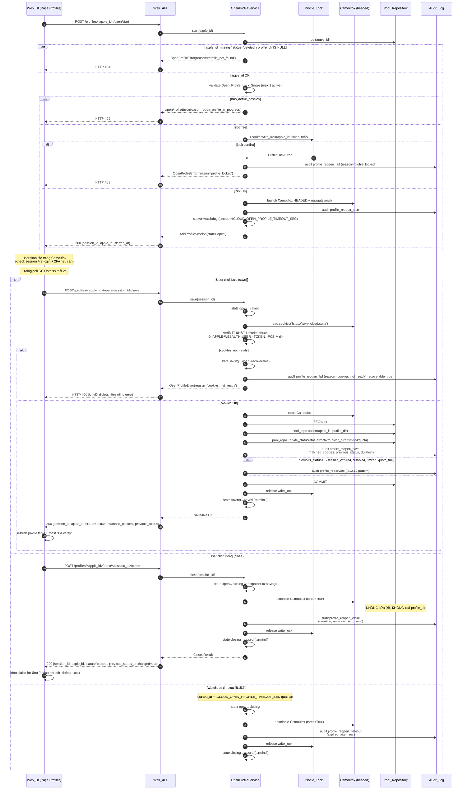

### State diagram — Open_Profile_Session (R15)

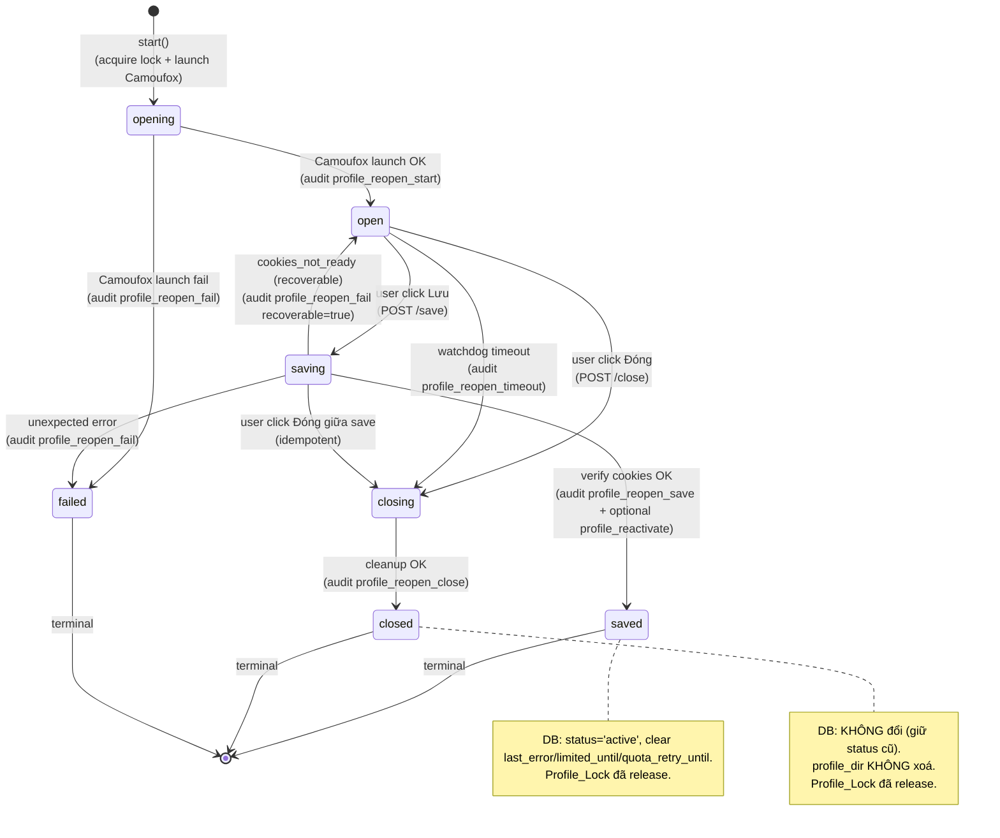

### 17. OpenProfileService (`icloud_hme/open_profile.py` — mới) (R15)

Service layer cho Open_Profile_Flow web extension. Pattern bám sát `AddProfileService` (§16) với 4 thay đổi quan trọng:

| Aspect | AddProfileService (R14) | OpenProfileService (R15) |
|--------|-------------------------|--------------------------|
| Mục đích | Thêm profile MỚI | Mở profile EXISTING |
| Profile_dir | Tạm `runtime/icloud_profiles/.adding/<session_id>/`, rename khi save | THẬT `runtime/icloud_profiles/<apple_id>/`, KHÔNG move |
| apple_id | Extract sau khi user login (auto + hint) | Đã biết trước (input từ row UI) |
| Profile_Lock | KHÔNG acquire (isolated dir) | Acquire `write_lock` mode (R12.14 pattern) |
| Save behavior | Insert/upsert + status='active' + audit `profile_add_success` | Upsert + reset status='active' + audit `profile_reopen_save` (+ `profile_reactivate` nếu cũ session_expired/disabled/limited/quota_full) |
| Cancel behavior | Đóng browser + xoá profile_dir tạm | Đóng browser, KHÔNG đụng DB / profile_dir |
| State enum | `recording, saving, cancelling, done, cancelled, failed` | `opening, open, saving, closing, saved, closed, failed` |

```python
# icloud_hme/open_profile.py (skeleton)

class OpenProfileState(str, Enum):
    OPENING = "opening"     # acquire lock + launch Camoufox
    OPEN = "open"           # Camoufox đã mở, chờ user thao tác
    SAVING = "saving"       # User bấm Lưu, đang verify cookies
    CLOSING = "closing"     # User bấm Đóng / watchdog timeout, đang cleanup
    SAVED = "saved"         # Terminal — DB đã update
    CLOSED = "closed"       # Terminal — đã đóng browser, DB không đổi
    FAILED = "failed"       # Terminal — lock conflict / unexpected


@dataclass
class OpenProfileSession:
    session_id: str
    apple_id: str
    state: OpenProfileState
    profile_dir: Path                  # THẬT, không tạm
    started_at: datetime
    ended_at: datetime | None = None
    matched_cookies: list[str] = field(default_factory=list)
    previous_status: str | None = None  # status DB lúc start, để audit decision
    error: str | None = None
    error_reason: str | None = None
    # Internal
    _camoufox_ctx_mgr: Any | None = field(default=None, repr=False)
    _camoufox_ctx: Any | None = field(default=None, repr=False)
    _watchdog_task: asyncio.Task | None = field(default=None, repr=False)
    _profile_lock_ctx: Any | None = field(default=None, repr=False)


class OpenProfileService:
    """State machine + Camoufox lifecycle cho Open_Profile_Flow.

    Single-instance per process (R15.4). Web router lazy init.
    """

    LOGIN_COOKIE_MARKERS = (
        "X-APPLE-WEBAUTH-USER",
        "X-APPLE-WEBAUTH-TOKEN",
        "X-APPLE-WEBAUTH-PCS-Mail",
    )
    REACTIVATE_STATUSES = frozenset({
        "session_expired", "disabled", "limited", "quota_full",
    })
    LOCK_TIMEOUT_SEC = 5.0

    def __init__(
        self,
        runtime_dir: Path,
        pool_repo: IcloudPoolRepository,
        audit_repo: AuditLogRepository,
        *,
        timeout_sec: int = 1800,
        log: Callable[[str], None] | None = None,
    ): ...

    async def start(self, apple_id: str) -> OpenProfileSession: ...
    async def save(self, session_id: str) -> OpenProfileSession: ...
    async def close(self, session_id: str) -> OpenProfileSession: ...
    def status(self, session_id: str) -> OpenProfileSession: ...

    def has_active_session(self) -> bool: ...

    # Internal
    async def _launch_camoufox(self, session): ...
    async def _close_camoufox(self, session, *, force): ...
    async def _verify_cookies(self, session) -> list[str]: ...
    def _persist_save(self, session, matched: list[str]): ...
    async def _watchdog(self, session): ...
    async def _release_lock(self, session): ...
```

#### Web_API endpoints (extend §12 Web_API table)

| Method | Path | Service call | Purpose |
|--------|------|---------------|---------|
| POST | `/api/icloud/profiles/{apple_id}/open/start` | `OpenProfileService.start(apple_id)` | Acquire lock + launch Camoufox HEADED — R15.1 |
| POST | `/api/icloud/profiles/{apple_id}/open/{session_id}/save` | `OpenProfileService.save(session_id)` | Verify cookies + upsert + reactivate — R15.6 |
| POST | `/api/icloud/profiles/{apple_id}/open/{session_id}/close` | `OpenProfileService.close(session_id)` | Đóng browser, không sửa DB — R15.8 |
| GET | `/api/icloud/profiles/{apple_id}/open/{session_id}/status` | `OpenProfileService.status(session_id)` | UI poll progress — R15.10 |

Auth: cùng pattern `web/auth.py:require_token` middleware với header `X-API-Token` (R15.13, align với R10.10a).

#### CLI command (R15.17)

```
python -m gpt_signup_hybrid.icloud_hme profile open --apple-id <X>
```

Blocking flow (giống Bootstrap_Flow CLI):

1. Validate apple_id tồn tại trong DB (qua `IcloudPoolRepository.get`).
2. Acquire `Profile_Lock` mode `write` (timeout 5s) — fail → exit code 1 với message `profile_locked`.
3. Launch Camoufox HEADED + navigate `https://www.icloud.com/mail/`.
4. Print hướng dẫn + `input("Enter để Save (verify cookies), 'q'+Enter để Close: ")`.
5. Enter → verify cookies + reactivate (cùng logic Web_API save). 'q' → đóng browser, KHÔNG sửa DB.
6. Release lock + exit.

#### Error mapping (extend Failure semantics)

| Tình huống | Exception | Side-effect | Web_API mapping |
|-----------|-----------|-------------|-----------------|
| `apple_id` missing / deleted (R15.2) | `OpenProfileError(reason='profile_not_found')` | (none) | HTTP 404 |
| `Profile_Lock` conflict (R15.3) | `OpenProfileError(reason='profile_locked')` | audit `profile_reopen_fail` | HTTP 409 với `apple_id` |
| Has active Open_Profile_Session khác (R15.4) | `OpenProfileError(reason='open_profile_in_progress')` | (none) | HTTP 409 với `active_session_id, active_apple_id` |
| `save()` cookies marker thiếu (R15.7) | `OpenProfileError(reason='cookies_not_ready')` | state revert saving→open, audit recoverable=true | HTTP 400, dialog giữ mở để retry |
| Watchdog timeout (R15.9) | (none — service tự transition) | đóng browser, release lock, audit `profile_reopen_timeout` | (poll status sẽ thấy state='closed') |
| `status()` session_id không tồn tại (R15.10) | `OpenProfileError(reason='session_not_found')` | (none) | HTTP 404 |
| `save()/close()` từ state ≠ hợp lệ | `OpenProfileError(reason='invalid_state')` | (none) | HTTP 409 |

#### Audit event types mới (extend R6.2)

`AuditLogRepository.WRITABLE_EVENT_TYPES` SHALL extend với 5 event:

- `profile_reopen_start` — acquire lock + launch Camoufox OK.
- `profile_reopen_save` — user Save thành công (cookies verify pass + DB updated).
- `profile_reopen_close` — user Close thường (không đổi DB).
- `profile_reopen_timeout` — watchdog auto-close.
- `profile_reopen_fail` — lock conflict / cookies_not_ready (recoverable) / unexpected.

Payload schema chuẩn: `{session_id, apple_id, ...}`. Trừ trường hợp CLI mode (R15.17, R15.18) — payload chỉ có `apple_id` (không session_id).

### Property 32 (mới): Open_Profile_Flow state machine + lock invariants

`# Feature: icloud-hme-pool, Property 32: Open_Profile_Flow state machine + Profile_Lock invariants`

Invariants (PBT phải verify):

1. **Single active session**: `count(state ∈ {opening, open, saving, closing}) ≤ 1` tại mọi thời điểm trong cùng process.
2. **Lock held xuyên suốt non-terminal**: từ lúc `state=opening` (sau acquire) tới lúc terminal (`saved/closed/failed`), `Profile_Lock` write mode SHALL được hold; release đúng 1 lần ở mỗi transition tới terminal.
3. **Save = idempotent reactivate**: nếu `previous_status='active'` thì sau save vẫn `status='active'`, audit chỉ có `profile_reopen_save` (không double `profile_reactivate`). Nếu `previous_status ∈ REACTIVATE_STATUSES` thì sau save `status='active'` + audit có cả `profile_reopen_save` lẫn `profile_reactivate`.
4. **Close không touch DB**: trước `close()` SELECT row → sau `close()` SELECT lại → mọi field (status, hme_count, last_error, limited_until, quota_retry_until, profile_dir) KHÔNG đổi.
5. **Cookies verify atomic**: Save success path → `len(matched_cookies) ≥ 1` AND mọi marker đều thuộc `LOGIN_COOKIE_MARKERS`. Save fail path (`cookies_not_ready`) → `len(matched_cookies) = 0` AND state đã revert về `open`.
