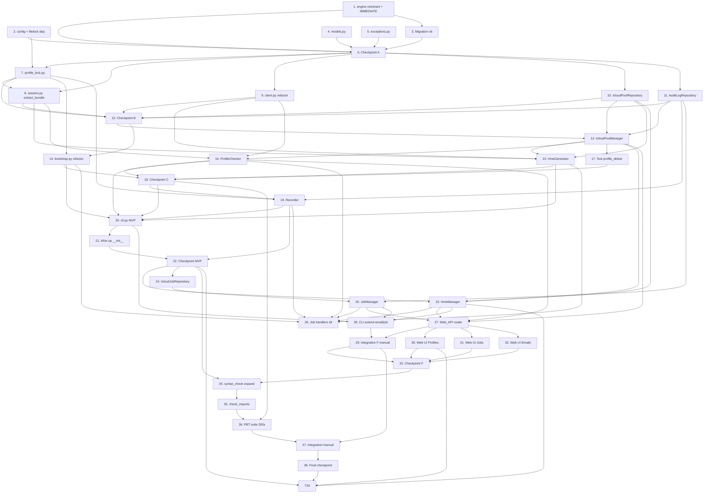

# Implementation Plan: icloud-hme-pool

## Refactor B (May 2026) — Session_Bundle cookies-only

**Trigger:** Apple đã gỡ `window.webAuth` global khỏi iCloud webapp; mọi
`page.evaluate('window.webAuth')` trả `undefined` → flow extract cũ (R12.4 phiên
bản đầu) luôn fail với `session_extract_fail: missing=['maildomainws_host']`.

**Verification:** `test/check_session_extract_diagnose.py` (đã xóa sau khi
chứng minh) + `test/check_hme_minimal_call.py` (giữ làm smoke). HME REST API
chỉ cần cookies `X-APPLE-WEBAUTH-*` để auth; `dsid` / `clientId` query param
empty + host hardcode `p68-maildomainws.icloud.com` vẫn 200 + `success=true`.

**Thay đổi quan trọng:**
- `SessionBundle` chỉ còn `apple_id` + `cookies` + `extracted_at`.
- `extract_session_bundle` navigate `https://www.icloud.com/settings/`, settle 5s, đọc
  cookies từ BrowserContext (không page.evaluate webAuth).
- `HmeClient` hardcode host `p68`, UA Chrome 141, `clientId=""`, `dsid=""`.
  Path: `/v1/hme/generate` + `/v1/hme/reserve` (không còn `generateAddress`/`reserveHme`).
- Bỏ `_extract_dsid_from_cookie`, `_MAILDOMAINWS_HOST_RE`, `_WEB_AUTH_JS`,
  `LegacyHmeClient`. Test P15/P16 viết lại theo semantic mới.
- **DB source-of-truth** cho list_sync: `HmeManager.list_sync` chỉ áp 3 nhánh
  UPDATE cho email DB-side đã có; KHÔNG INSERT email Apple-side missing.
  `HmeGenerator.reconcile()` no-op (giữ signature làm stub backward-compat).
  Tool chỉ quản email do tool tạo qua `generate`; email user tạo tay ngoài
  tool không được import.

Section đánh dấu "(refactor B — cookies-only, May 2026)" trong các task dưới
là phần đã được rewrite.

## Overview

Plan triển khai feature `icloud-hme-pool` (Python 3.12+, Camoufox + Playwright async, httpx async, sqlite3, Click/Typer CLI, FastAPI cho phase sau MVP, Hypothesis cho PBT, pytest-asyncio).

- **Phase MVP** (R1, R2, R3, R4, R5, R6, R7, R8, R11, R12): task 1–22. Phải hoàn tất hết trước khi sang phase sau MVP.
- **Phase sau MVP** (R9, R10, R13): task 23–33. Có thể delay / skip theo ưu tiên user; mỗi sub-feature gắn mức độ phụ thuộc rõ ràng vào task MVP đã hoàn tất.
- **Verification** (G — task 34, 35, 36, 37, 38): chạy tổng PBT suite + integration tests manual. KHÔNG chạy auto trong CI vì cần Apple_ID test thật + Camoufox headed/headless.
- **Phần H — Add_Profile_Flow web extension** (task 39-48, R14): bổ sung sau khi phase sau MVP + verification đã ổn định. Phụ thuộc task 22 (MVP), task 30 (Page Profiles UI hiện hữu), task 27 (Web_API + auth pattern). Cho phép user thêm profile qua dialog web với Camoufox headed (server-side) thay vì command line `bootstrap`.

Tổng số top-level task: 48 (2 prep + 1 Profile_Lock infra + 35 task gốc + 10 task Add_Profile_Flow); tổng subtask: ~150. Mỗi top-level task ≤ 4 giờ; mỗi subtask ≤ 1 giờ. Sub-task có postfix `*` là test, có thể skip để rút ngắn MVP nhưng nên giữ lại trong nhánh release.

Lưu ý chung:

- File test mới đặt trong `test/`, đặt tên `test/check_*.py` (smoke), `test/test_*.py` (unit/PBT), `test/integration_*.py` (manual).
- KHÔNG dùng inline `python3 -c "..."` để verify (theo project-rules); mọi check qua file `test/<file>.py` thật.
- KHÔNG chạy test ở watch mode; chỉ chạy `python3 test/<file>.py` 1 lần.
- Property test tag dòng đầu file: `# Feature: icloud-hme-pool, Property N: <title>`.
- Hypothesis dùng tối thiểu 100 example mỗi `@given` (deadline=None cho async).
- Integration tests manual không chạy CI auto — đầu file ghi rõ `# MANUAL — không chạy CI`.

## Tasks

### Phần A — Setup + Migration (foundation MVP)

- [x] 1. **Verify + extend `db/engine.py:DatabaseEngine.transaction()` reentrant**
  - Kiểm tra implementation hiện tại của `db/engine.py` — `engine.transaction()` cần support reentrant (nested context managers cùng connection thread-local) bằng SAVEPOINT pattern. Nếu chưa support → extend.
  - Method mới: `engine.transaction(immediate=False)` — flag `immediate=True` dùng `BEGIN IMMEDIATE` thay `BEGIN DEFERRED` cho `pool.pick_active_profile()` (R2.15). Default vẫn DEFERRED để giữ backward compat.
  - Verify: nested `with engine.transaction()` outer + `with engine.transaction()` inner phải gộp 1 commit, rollback inner = rollback outer.
  - File ảnh hưởng: `db/engine.py` (modify).
  - _Requirements: R2.5, R2.15, R3.5, R5.6, R6.3, R8.3_

  - [x] 1.1. Tìm/đọc `DatabaseEngine.transaction()` hiện tại trong `db/engine.py`
    - Đọc file, document state hiện tại: support reentrant chưa? Method signature, save point pattern.
    - Note vào task 1.2 về thay đổi cần thiết.
    - _Requirements: R6.3_

  - [x] 1.2. Thêm support `BEGIN IMMEDIATE` mode + reentrant SAVEPOINT
    - Method `transaction(immediate=False)` accept flag mới. `immediate=True` → emit `BEGIN IMMEDIATE TRANSACTION` (write-lock SQLite ngay từ đầu, R2.15).
    - Thread-local connection counter để detect nested call → emit `SAVEPOINT sp_<n>` thay vì `BEGIN`.
    - Outer commit → real `COMMIT`. Inner commit (savepoint) → `RELEASE SAVEPOINT`. Rollback inner → `ROLLBACK TO SAVEPOINT` không huỷ outer.
    - _Requirements: R2.15, R6.3_

    > **Implementation note (task 1.2 — đã apply, deviation từ spec text):**
    >
    > - **Default `immediate=True`** trên `transaction()` (cả sync + async) để giữ backward compat thật. Spec text "default DEFERRED" KHÔNG khớp code base hiện đã hardcode `BEGIN IMMEDIATE` — đổi sang DEFERRED là silent breaking change cho mọi caller cũ. Caller opt-in DEFERRED qua `transaction(immediate=False)` / `transaction_async(immediate=False)`.
    > - **KHÔNG dùng SAVEPOINT.** Counter-based reentrancy (`_tx_lock` RLock + `_tx_depth`) đã đáp ứng R2.15 + R6.3 — outer commit = real `COMMIT`, rollback inner re-raise → outer `ROLLBACK` toàn bộ. SAVEPOINT chỉ cần khi spec yêu cầu "rollback inner KEEP outer" (partial rollback) — R2.15 không yêu cầu. Để dành refactor sau nếu phát sinh.
    > - **API surface đồng bộ:** thêm `transaction_async(immediate=True)` cho async path. `get_connection()` / `get_connection_async()` giữ nguyên signature (hardcode IMMEDIATE) làm low-level alias backward compat. Logic chung tách qua `_scoped_transaction` + `_scoped_transaction_async`.
    > - Nested call truyền `immediate` (bất kỳ giá trị) bị ignore — outer scope quyết định BEGIN mode duy nhất 1 lần.

    > **Note từ task 1.1 — Khảo sát state hiện tại của `db/engine.py:DatabaseEngine.transaction()`:**
    >
    > - **Reentrant: ĐÃ có nhưng KHÔNG dùng SAVEPOINT.** Implementation hiện dùng `threading.RLock` (`_tx_lock`) + counter `_tx_depth` ở `get_connection()`. Outer scope (`is_outer = _tx_depth == 0`) emit `BEGIN IMMEDIATE` / `COMMIT` / `ROLLBACK`; nested call chỉ yield cùng `self._conn`, không emit SQL. Inner exception bubble lên outer → outer ROLLBACK toàn bộ.
    > - Behavior "gộp 1 commit, rollback inner = rollback outer" — đã đáp ứng bởi counter-based pattern. SAVEPOINT chỉ cần nếu spec yêu cầu "rollback inner KEEP outer" (counter-based không support). R2.15 không yêu cầu điều này → **đề xuất giữ counter-based, không refactor sang SAVEPOINT** trừ khi user xác nhận cần "partial rollback".
    > - **BEGIN mode: hardcode `BEGIN IMMEDIATE`** (`db/engine.py` line ~191). Chưa có flag `immediate`. Cần thêm parameter ở cả `transaction()` và `get_connection()` (sync) lẫn `get_connection_async()` (async — hiện cũng hardcode `BEGIN IMMEDIATE`).
    > - **Connection model:** SINGLE shared `self._conn` với `check_same_thread=False`, KHÔNG phải thread-local. RLock + counter serialize giữa thread. Mô tả parent task 1 ("thread-local connection") không khớp thực tế repo — vẫn an toàn, nhưng task 1.2 nên giữ single-connection model, không refactor sang thread-local.
    > - **⚠️ CẢNH BÁO default value:** parent task ghi `transaction(immediate=False)` (default DEFERRED). Mọi caller hiện tại (`db/migrate.py`, `db/repositories.py`, internal `_migrate()`, future repos) đang ngầm dựa vào IMMEDIATE (write-lock sớm tránh `database is locked` ở COMMIT). Nếu đổi default sang `False` → BREAKING CHANGE. **Đề xuất 2 phương án:**
    >   - **(A) An toàn nhất:** Giữ default `immediate=True`, chỉ caller nào opt-out mới truyền `immediate=False`. Trái với mô tả parent nhưng giữ behavior cũ.
    >   - **(B) Theo parent:** Default `immediate=False`, audit + truyền `immediate=True` ở mọi call site đang cần write-lock sớm (`_migrate()` outer tx, mọi repo write method). Tốn công audit nhưng đúng spec.
    >   - **→ Hỏi user trước khi implement task 1.2.**
    > - **Semantics khi nested truyền `immediate=True` ở inner scope:** outer đã BEGIN rồi → flag bị ignore là tự nhiên (BEGIN không chạy lại). Đề xuất: silently ignore khi `is_outer == False` (không raise, không warn). R2.15 không đề cập.
    > - **API surface phải đồng bộ:** Implement xong cần update cả `transaction()`, `get_connection()`, `get_connection_async()` để cùng accept `immediate` flag, tránh async caller thiếu API.

  - [x] 1.3.* Smoke test `test/check_engine_reentrant.py`
    - In-memory SQLite. Test 3 scenario:
      - Single transaction: insert rows, commit, verify persist.
      - Nested transaction (outer + inner success): insert outer, insert inner, commit cả 2, verify cả 2 persist.
      - Nested rollback inner only: insert outer, insert inner, rollback inner (raise giữa inner), commit outer, verify chỉ outer persist.
      - `BEGIN IMMEDIATE` mode: 2 connection thread, thread1 enter `transaction(immediate=True)` không commit, thread2 gọi `transaction(immediate=True)` → block tới timeout (5s default) → raise `database is locked`.
    - _Requirements: R2.15, R6.3_

- [x] 2. **Extend `config.py:Settings` với env mới + add `filelock` dependency**
  - Đọc `config.py` hiện tại để xem structure `Settings`. Thêm 12 env mới:
    - `ICLOUD_LIMITED_TTL_HOURS` (default 24, R2.9)
    - `ICLOUD_QUOTA_RETRY_MINUTES` (default 15, R2.13)
    - `ICLOUD_HME_QUOTA_LIMIT` (default 700, R2.14)
    - `ICLOUD_HME_PROFILE_PARALLELISM` (default 1, R3.17)
    - `ICLOUD_HME_HTTP_TIMEOUT_SEC` (default 30, R11.7)
    - `ICLOUD_HME_RACE_RETRY_MAX` (default 3, R3.14)
    - `ICLOUD_INFINITE_WAIT_MAX_SEC` (default 86400, R3.23)
    - `ICLOUD_RECORDING_RETENTION_DAYS` (default None, R1.8)
    - `ICLOUD_AUDIT_RETENTION_DAYS` (default None, R6.5)
    - `ICLOUD_JOB_MAX_PARALLEL` (default 1, R13.9)
    - `ICLOUD_JOB_LOG_RETENTION_DAYS` (default 30, R13.12)
    - `ICLOUD_API_AUTH_TOKEN` (no default — DEPRECATED, **đã thay bằng** middleware `web/auth.py:require_token` chung cho `/api/*` với env `GPT_SIGNUP_WEB_TOKEN` + scheme `X-API-Token`. Spec gốc viết Bearer auth nhưng implementation align với tool middleware có sẵn — chi tiết R10.10 phiên bản hiện tại.)
  - Thêm `filelock>=3.13` vào `pyproject.toml` dependency cho `Profile_Lock` component (R12.14, R12.15, R12.16, design §15).
  - File ảnh hưởng: `config.py` (modify), `pyproject.toml` (modify).
  - _Requirements: R1.8, R2.9, R2.13, R2.14, R3.14, R3.17, R3.23, R6.5, R10.10a, R11.7, R12.14, R12.15, R12.16, R13.9, R13.12_

  - [x] 2.1. Đọc `config.py` hiện tại + map env mới vào `Settings`
    - Document trạng thái hiện tại của `Settings` class. Thêm field cho 12 env mới với type hint + default + env name.
    - _Requirements: R6.1_

  - [x] 2.2. Thêm `filelock` vào `pyproject.toml` + lock file
    - `pip install filelock>=3.13` hoặc đặt vào `pyproject.toml` `[project.dependencies]`.
    - Verify import `from filelock import FileLock, Timeout`.
    - _Requirements: R12.14, R12.15, R12.16_

  - [x] 2.3.* Smoke test `test/check_config_env.py`
    - Set os.environ với mock value cho từng env, init `Settings`, assert giá trị đúng.
    - Test default khi env không set.
    - Test `ICLOUD_API_AUTH_TOKEN` unset behavior — `Settings()` không raise (chỉ Web_API startup raise theo R10.10a).
    - _Requirements: R6.1, R10.10a_

- [x] 3. Migration schema v6 trong `db/schema.py`
  - Bump `CURRENT_VERSION` từ 5 lên 6, thêm `MIGRATIONS[6]` theo design §Data Models.
  - `icloud_accounts`: `ALTER TABLE ADD COLUMN status TEXT NOT NULL DEFAULT 'active'`, `limited_until TEXT`, `quota_retry_until TEXT`; backfill `UPDATE ... SET status='disabled' WHERE disabled=1 AND status='active'`.
  - `icloud_emails`: rebuild bảng (SQLite không hỗ trợ ALTER CHECK) với CHECK enum mới `(created, reconciled, deactivated, revoked, deleted, disabled, used_for_chatgpt)`, copy `revoked_at` cũ sang `deactivated_at`, thêm `reactivated_at`, `deleted_at`, `last_sync_at`; tạo index `idx_icloud_emails_label`, `idx_icloud_emails_last_sync_at`.
  - Tạo bảng mới `icloud_audit_log` (PK autoincrement + 2 index `(apple_id, ts DESC)`, `(event_type, ts DESC)`), `pool_state` (key/value PK), `icloud_jobs` (PK uuid + 4 index theo design).
  - Mọi cột timestamp ISO SHALL dùng `strftime('%Y-%m-%dT%H:%M:%fZ', 'now')` thay cho `datetime('now')` để khớp `Timestamp_Format` (Property 30).
  - _Requirements: R6.1, R6.2, R7.3, R8.1, R9.1, R12.10, R13.1_

  - [x] 3.1. DDL constants + `MIGRATIONS[6]` list trong `db/schema.py`
    - Thêm các DDL string `DDL_ICLOUD_AUDIT_LOG`, `DDL_ICLOUD_AUDIT_LOG_INDEXES`, `DDL_POOL_STATE`, `DDL_ICLOUD_JOBS`, `DDL_ICLOUD_JOBS_INDEXES`.
    - Append vào `ALL_DDL` cho fresh DB; append `MIGRATIONS[6]` cho existing DB.
    - _Requirements: R6.1, R7.3, R13.1_

  - [x] 3.2. Rebuild `icloud_emails` qua pattern `<table>_new` (giống v3)
    - Sequence: CREATE `icloud_emails_new` → INSERT SELECT (copy `revoked_at`→`deactivated_at`) → DROP cũ → RENAME → recreate index.
    - Ghi rõ comment SQLite không support ALTER CHECK → phải rebuild.
    - _Requirements: R8.1, R9.1_

  - [x] 3.3.* Smoke test migration `test/check_schema_v6_migration.py`
    - Tạo DB tạm v5 (apply DDL v5 + migration đến v5), chạy `_migrate()` đến v6, assert: `_schema_version` có row `version=6`; `PRAGMA table_info(icloud_accounts)` có `status, limited_until, quota_retry_until`; `PRAGMA table_info(icloud_emails)` có 4 timestamp mới + CHECK enum đúng; bảng `icloud_audit_log`, `pool_state`, `icloud_jobs` tồn tại với index.
    - Chạy: `python3 test/check_schema_v6_migration.py`
    - _Requirements: R6.1, R7.3, R8.1, R9.1, R13.1_

  - [x] 3.4.* PBT test `test/test_timestamp_format.py` (Property 30)
    - `# Feature: icloud-hme-pool, Property 30: Timestamp format consistency`.
    - `@given(operations=st.lists(st.sampled_from(['insert_audit','insert_email','update_account','update_job']), min_size=1, max_size=20))`. Apply random INSERT/UPDATE → SELECT lại → assert mọi cột timestamp khớp regex `^\d{4}-\d{2}-\d{2}T\d{2}:\d{2}:\d{2}(\.\d{1,6})?Z$` + parse được bằng `datetime.fromisoformat()`.
    - Test thêm: `datetime('now')` (cũ) ra format `2024-01-01 12:34:56` KHÔNG khớp regex; verify migration v6 đã đổi sang `strftime('%Y-%m-%dT%H:%M:%fZ')` (Property 30 rule).
    - _Properties: P30_

- [x] 4. Tạo `icloud_hme/models.py` chứa 14 dataclass
  - File mới `icloud_hme/models.py` (không trùng `gpt_signup_hybrid/models.py` ở root) chứa toàn bộ dataclass dùng cho service layer in-memory.
  - Class: `SessionBundle (frozen)`, `AppleAccount (frozen)`, `GenerationResult`, `CheckResult`, `ProfileSnapshot`, `PoolStatusReport`, `ProfileDeleteResult`, `FailureRecord`, `LifecycleResult`, `SyncDiff`, `ExportResult`, `JobRecord`, `JobLogEntry`, `ReservedHme/GeneratedCandidate/RemoteHme` (3 dataclass cho HmeClient response).
  - Mỗi field theo đúng type ở design §Data Models.
  - _Requirements: R3.1, R4.1, R5.1, R7.1, R9.1, R12.4, R13.1_

  - [x] 4.1.* Smoke test `test/check_models_dataclass.py`
    - Import từng class trong `icloud_hme.models`, gọi constructor với placeholder value, assert dataclass field đúng (dùng `dataclasses.fields()`).
    - _Requirements: R3.1, R12.4, R13.1_

- [x] 5. Tạo `icloud_hme/exceptions.py` chứa exception hierarchy
  - File mới `icloud_hme/exceptions.py` chứa hierarchy: `IcloudError` (base) → `IcloudPoolError`, `BootstrapError`, `SessionExtractError`, `TerminalStatusError`, `JobError` (→ `JobInvalidTransitionError`, `JobNotFoundError`, `JobCrashedError`), `HmeClientError` (→ `HmeQuotaError`, `HmeAuthError`, `HmeReserveTaken`, `HmeNotFoundError`, `HmeTransientError`), `ProfileLockError`.
  - `SessionExtractError.__init__(apple_id, missing_fields: list[str])`. `JobInvalidTransitionError.__init__(job_id, current, action)`. `TerminalStatusError.__init__(email, current_status, action)`. `ProfileLockError.__init__(apple_id, mode, reason)` (R12.14, R12.15, R12.16).
  - Không re-export ngoài `icloud_hme.exceptions` để tránh circular import; `icloud_hme/__init__.py` chỉ re-export tên public.
  - _Requirements: R3.7, R3.8, R5.4, R9.13, R11.6, R12.5, R12.14, R12.15, R12.16, R13.6_

  - [x] 5.1.* Smoke test `test/check_exceptions_hierarchy.py`
    - Assert `issubclass(HmeQuotaError, HmeClientError)`, `issubclass(JobInvalidTransitionError, JobError)`, `issubclass(ProfileLockError, IcloudError)`, etc. cho mọi quan hệ.
    - _Requirements: R3.7, R9.13, R11.6, R13.6_

- [x] 6. Checkpoint A — đảm bảo migration + dataclass + exception build sạch
  - Chạy `python3 test/syntax_check.py` (mở rộng cover thêm `icloud_hme/models.py`, `icloud_hme/exceptions.py`).
  - Chạy `python3 test/check_engine_reentrant.py` + `python3 test/check_config_env.py` + `python3 test/check_schema_v6_migration.py` + `python3 test/test_timestamp_format.py` + `python3 test/check_models_dataclass.py` + `python3 test/check_exceptions_hierarchy.py`.
  - Nếu có lỗi → dừng, hỏi user trước khi tiếp tục.
  - _Requirements: R2.15, R6.1, R12.4_


### Phần B — Infrastructure layer (R6, R11, R12)

- [x] 7. **Tạo `icloud_hme/profile_lock.py:ProfileLock`** (design §15)
  - File mới `icloud_hme/profile_lock.py`. Class `ProfileLock(lock_dir: Path, apple_id: str)` wrap thư viện `filelock`.
  - 2 context manager: `write_lock(timeout=30)` cho Bootstrap + Recorder (exclusive); `read_lock(timeout=60)` cho extract_session_bundle (shared).
  - Implement: write mode dùng FileLock chính `<lock_dir>/icloud-<apple_id>.write.lock`. Read mode dùng counter file + 1 sentinel FileLock để increment/decrement counter atomic.
  - Exception `ProfileLockError(apple_id, mode, reason)` raise khi acquire fail (mode='write' hoặc 'read').
  - Lock files đặt trong `runtime/icloud_profiles/<apple_id>/.lock/` subdir.
  - _Requirements: R12.14, R12.15, R12.16_

  - [x] 7.1. Implement `write_lock` + `read_lock` context managers
    - Code skeleton + test deterministic: 2 thread/asyncio task gọi context manager.
    - _Requirements: R12.14, R12.15, R12.16_

  - [x] 7.2.* PBT test `test/test_profile_lock_concurrent.py` (Property 29)
    - `# Feature: icloud-hme-pool, Property 29: Profile_Lock concurrent safety`.
    - 4 scenario: write+write block, read+read concurrent, write blocks read, read blocks write. Spawn 2 asyncio task với scenario tương ứng. Mock filelock backend nếu cần để test deterministic. Assert behavior khớp Property 29.
    - _Properties: P29_

- [x] 8. Refactor `icloud_hme/session.py` — `extract_session_bundle` (refactor B — cookies-only, May 2026)
  - Giữ nguyên helper `_safe_apple_id`, `profile_dir_for`, `ensure_profile_dir`, `launch_camoufox` hiện có (sau khi hoàn tất task 3, không phá compatibility).
  - Function async `extract_session_bundle(*, profile_dir, apple_id, audit_repo, proxy=None, log, settle_seconds=5.0) -> SessionBundle`.
  - Acquire `profile_lock.read_lock(timeout=60)` qua `Profile_Lock` (design §15) TRƯỚC KHI launch Camoufox headless. Timeout → raise `SessionExtractError(reason='profile_locked_by_bootstrap')` + audit `session_extract_fail`. Caller (Generator/Checker/Manager) SHALL switch sang profile khác qua Pool_Manager (R12.15).
  - Flow: launch Camoufox HEADLESS → navigate `https://www.icloud.com/` (root, để Apple webapp gọi `/setup/ws/1/validate` flush cookies) → sleep `settle_seconds` (default 5s) → đọc cookies qua `BrowserContext.cookies('https://www.icloud.com/')` → đóng browser ngay (R12.11). KHÔNG dùng `page.evaluate(window.webAuth)` — Apple đã gỡ object này khỏi webapp.
  - Validate: `cookies` non-empty + có ÍT NHẤT 1 cookie thuộc tập marker login `{X-APPLE-WEBAUTH-USER, X-APPLE-WEBAUTH-TOKEN, X-APPLE-WEBAUTH-PCS-Mail}` → thiếu → raise `SessionExtractError(missing_fields=['cookies'])` + audit `session_extract_fail` payload `{missing_fields: ['cookies'], reason, available_cookie_names}`.
  - Success → audit `session_extract` payload `{has_user_cookie, has_token_cookie, has_pcs_mail_cookie, cookie_count, extracted_at}`, KHÔNG log raw cookie value.
  - _Requirements: R12.3, R12.4, R12.5, R12.6, R12.7, R12.11, R12.15_

  - [x] 8.1. ~~Hàm helper `_extract_dsid_from_cookie(cookies)`~~ — **REMOVED in refactor B**. Apple HME API không cần `dsid` trong query param khi cookies hợp lệ; tool truyền `dsid=""` cho mọi request.

  - [x] 8.2.* PBT test `test/test_session_bundle_validation.py` (Property 16 — refactor B)
    - `# Feature: icloud-hme-pool, Property 16: Session_Bundle validation`.
    - Property A: cookies có ≥1 marker login → trả `SessionBundle(apple_id, cookies copy, extracted_at)` + audit `session_extract` payload meta-only (không chứa raw cookie value). Property B: cookies empty hoặc không có marker → raise `SessionExtractError(missing_fields=['cookies'])` + audit `session_extract_fail`.
    - Chạy: `python3 test/test_session_bundle_validation.py`
    - _Properties: P16_

  - [x] 8.3.* Example test `test/test_session_bundle_no_persist.py`
    - Mock `Path.write_text`, `Path.write_bytes`, `open(..., 'w')` → gọi `extract_session_bundle` → assert mock không bao giờ được call với cookie value trong args.
    - Audit_Log payload chứa metadata flag không có raw cookie value (R12.7 schema: `has_user_cookie / has_token_cookie / has_pcs_mail_cookie / cookie_count / extracted_at`).
    - _Requirements: R12.6, R12.7_

- [x] 9. Refactor `icloud_hme/client.py:HmeClient` sang httpx async + `SessionBundle` (refactor B — cookies-only, May 2026)
  - Class mới `HmeClient(bundle: SessionBundle, *, timeout_sec=30, log)` dùng `httpx.AsyncClient` (KHÔNG dùng Page/Camoufox). Giữ lại exception `HmeApiError`/`HmeAuthError`/`HmeQuotaError` cũ — di chuyển sang `icloud_hme.exceptions` (task 5) làm subclass `HmeClientError`.
  - Host hardcode module-level `BASE_URL = "https://p68-maildomainws.icloud.com"` cho mọi profile (refactor B — Apple HME API chỉ phục vụ trên 1 host duy nhất).
  - 4 query param trên mọi request: `clientBuildNumber, clientMasteringNumber, clientId, dsid`. `clientBuildNumber` + `clientMasteringNumber` hardcode value từ webapp Apple hiện hành (vd `2536Project32` / `2536B20`). `clientId` + `dsid` cố định empty string — Apple HME API không enforce auth qua 2 param này.
  - Header cố định: `Origin: https://www.icloud.com`, `Referer: https://www.icloud.com/`, `Content-Type: text/plain`, `Accept: */*`, `User-Agent: <FIXED_USER_AGENT Chrome 141 placeholder>`. KHÔNG gửi header `scnt` hay `X-Apple-ID-Session-Id` — auth duy nhất qua cookies.
  - Cookies set qua `client.cookies` cookiejar với domain `.icloud.com` (httpx tự build header `Cookie:`, KHÔNG serialize thủ công).
  - Path: `/v1/hme/generate`, `/v1/hme/reserve`, `/v2/hme/list`, `/v1/hme/deactivate`, `/v1/hme/reactivate`, `/v1/hme/delete`, `/v1/hme/updateMetaData`. Methods: `generate() -> GeneratedCandidate`, `reserve(candidate, label, note) -> ReservedHme`, `list() -> list[RemoteHme]`, `deactivate(hme_id)`, `reactivate(hme_id)`, `delete(hme_id)`, `update_meta(hme_id, label, note)`, `aclose()`.
  - Internal helper `classify_response(status, body) -> exception_or_None` per decision table R11.6. Internal retry transient (timeout / 5xx) max 3 lần với exponential backoff `1, 2, 4s + jitter`.
  - _Requirements: R3.13, R11.1, R11.2, R11.3, R11.4, R11.5, R11.6, R11.7, R11.8, R12.12_

  - [x] 9.1. Hàm `classify_response(status, body, error_message)` theo decision table (R11.6)
    - 429 → `HmeQuotaError`; {401,421,440} → `HmeAuthError`; 200+success=false+marker `rate limit/too many/limit reached/quota` (case-insensitive) → `HmeQuotaError`; marker `unauthorized/not authenticated/session expired` → `HmeAuthError`; 200+success=true → return None; reserve markers `already/taken/unavailable/duplicate` → `HmeReserveTaken`; timeout/network → `HmeTransientError`.
    - 404 trên deactivate/reactivate/delete/update_meta → `HmeNotFoundError`.
    - _Requirements: R3.7, R3.8, R3.14, R9.6, R9.15, R11.6_

  - [x] 9.2.* PBT test `test/test_hme_client_classification.py` (Property 4)
    - `# Feature: icloud-hme-pool, Property 4: HmeClient error classification từ response`.
    - `@given(http_status=st.sampled_from([200,401,421,429,440,500,503]), body=st.dictionaries(...), error_message=st.text())` build response qua `httpx.MockTransport` → gọi `classify_response` → assert exception class đúng theo decision table.
    - Chạy: `python3 test/test_hme_client_classification.py`
    - _Properties: P4_

  - [x] 9.3.* PBT test `test/test_hme_client_request_format.py` (Property 15 — refactor B)
    - `# Feature: icloud-hme-pool, Property 15: HmeClient request format`.
    - `@given(bundle=session_bundle_strategy())` (cookies-only strategy: ≥1 marker login) capture request qua `httpx.MockTransport` → gọi `generate/reserve/list/deactivate` → assert: URL host = `p68-maildomainws.icloud.com` hardcode; URL có 4 query param với `clientId`/`dsid` empty; headers có Origin/Referer/Content-Type/Accept/User-Agent (FIXED_USER_AGENT) và KHÔNG có scnt/X-Apple-ID-Session-Id; cookies set qua `client.cookies` cookiejar.
    - Chạy: `python3 test/test_hme_client_request_format.py`
    - _Properties: P15_

- [x] 10. Tạo `db/repositories.py:IcloudPoolRepository`
  - Class mới đặt trong `db/repositories.py` (cùng file với `ComboRepository`, `JobRepository`). Tránh đổi tên hay phá class hiện có.
  - Methods (group `icloud_accounts`): `get(apple_id) -> AppleAccount | None`, `list_all() -> list[AppleAccount]`, `upsert(apple_id, profile_dir)`, `update_status(apple_id, *, status, limited_until=None, quota_retry_until=None, last_error=None, clear_error=False, clear_limited_until=False, clear_quota_retry_until=False)`, `increment_hme_count_and_set_last_used(apple_id, *, when) -> int`.
  - Methods (group `icloud_emails`): `insert_email(*, email, apple_id, label, note, hme_id, status)`, `update_email_status(email, *, status, deactivated_at=None, reactivated_at=None, deleted_at=None, last_sync_at=None, label=None, note=None, used_for_email=None)`, `list_emails(*, status=None, apple_id=None, label=None, date_range=None, limit=None) -> list[dict]`, `list_emails_by_label(label, *, statuses=('created','reconciled')) -> list[dict]`, `get_email(email) -> dict | None`.
  - Methods (group `pool_state`): `read_round_robin_cursor() -> str | None`, `write_round_robin_cursor(apple_id)`.
  - Mọi mutation method dùng `engine.transaction()` reentrant để caller (Pool_Manager / Generator / HME_Manager) có thể gộp INSERT email + UPDATE account + INSERT audit thành 1 outer-tx.
  - _Requirements: R2.5, R3.5, R5.6, R6.3, R8.3, R9.1, R9.16_

  - [x] 10.1.* Smoke test `test/check_icloud_pool_repository.py`
    - In-memory SQLite, apply schema v6, test từng method: upsert + get round-trip; insert_email + list_emails filter; round_robin_cursor read/write; update_email_status với 4 timestamp.
    - _Requirements: R6.1_

- [x] 11. Tạo `db/repositories.py:AuditLogRepository`
  - Class mới trong `db/repositories.py`. Methods: `write(*, event_type, apple_id, payload, error=None) -> int`, `list(*, apple_id=None, event_type=None, since=None, limit=100) -> list[AuditEvent]`, `cleanup_older_than(days) -> int`.
  - `write` dùng `engine.transaction()` reentrant — caller PHẢI gọi từ trong outer tx khi event đi cùng mutation state (R6.3); event độc lập (vd `recording_start`) gọi không cần outer tx.
  - `list` ORDER BY `timestamp_iso DESC` (R6.4).
  - Bỏ CHECK `event_type` ở schema (set quá lớn) → enum được giữ trong code: thêm constant `AUDIT_EVENT_TYPES` tuple chứa 35 event đầy đủ theo design §Bảng & cột chi tiết. `write` validate `event_type in AUDIT_EVENT_TYPES` fail-fast.
  - Tách 2 set theo R6.6:
    - `WRITABLE_EVENT_TYPES`: tuple chứa 35 event không gồm `email_revoke`/`email_revoke_fail`.
    - `READABLE_EVENT_TYPES`: superset cộng thêm 2 alias backward-compat (`email_revoke`, `email_revoke_fail`).
  - `write(event_type=X)`: validate `X in WRITABLE_EVENT_TYPES`; sai → `ValueError`.
  - `list(event_type=X)` (filter): validate `X in READABLE_EVENT_TYPES`; sai → `ValueError`.
  - _Requirements: R6.1, R6.2, R6.3, R6.4, R6.5, R6.6_

  - [x] 11.1.* PBT test `test/test_audit_repository.py` (Property 9, 10)
    - `# Feature: icloud-hme-pool, Property 9: Audit list ordering, Property 10: Audit retention cleanup`.
    - P9: `@given(events=st.lists(audit_event_strategy(), min_size=0, max_size=100))` insert random, assert `list()` ordering DESC + filter subset đúng.
    - P10: `@given(events=..., days=st.integers(0, 365))` insert + cleanup, assert `count_remaining == count(events where ts >= now - days)`.
    - Chạy: `python3 test/test_audit_repository.py`
    - _Properties: P9, P10_

  - [x] 11.2.* Smoke test `test/check_audit_event_validation.py`
    - 4 example: write `create_success` → OK; write `email_revoke` → `ValueError`; list filter `email_revoke` → OK (alias backward-compat); list filter `unknown_event` → `ValueError`.
    - _Requirements: R6.6_

- [x] 12. Checkpoint B — đảm bảo tests pass, ask the user if questions arise.
  - Chạy lại tổng: `python3 test/check_icloud_pool_repository.py`, `python3 test/test_session_bundle_validation.py`, `python3 test/test_hme_client_classification.py`, `python3 test/test_hme_client_request_format.py`, `python3 test/test_audit_repository.py`, `python3 test/check_audit_event_validation.py`, `python3 test/test_profile_lock_concurrent.py`.
  - Verify không để `repository.py` cũ (`icloud_hme/repository.py`) bị orphan hay gọi còn — quyết định: giữ class cũ hoạt động cho hotmail flow; class mới `IcloudPoolRepository` (db/repositories.py) là nơi mọi flow mới gọi.
  - _Requirements: R6, R12.14, R12.15, R12.16_


### Phần C — Service layer MVP (R2, R3, R4, R5, R7, R8, R12)

- [x] 13. Tạo `icloud_hme/pool.py:IcloudPoolManager`
  - Class mới `IcloudPoolManager(pool_repo, audit_repo, *, limited_ttl_hours=24, quota_retry_minutes=15, hme_quota_limit=700, low_capacity_threshold=50, log)`.
  - Đọc env: `ICLOUD_LIMITED_TTL_HOURS`, `ICLOUD_QUOTA_RETRY_MINUTES`, `ICLOUD_HME_QUOTA_LIMIT` qua `config.py` (đã extend ở task 2).
  - Methods: `pick_active_profile() -> AppleAccount` (R2.2), `mark_limited(apple_id, *, reason)` (R2.5), `mark_session_expired(apple_id, *, reason)` (R2.8), `mark_disabled(apple_id, *, reason)`, `mark_quota_full(apple_id, *, reason)` (R2.10), `reactivate(apple_id)` (R12.10), `delete_profile(apple_id) -> ProfileDeleteResult` (R5), `status_report() -> PoolStatusReport` (R7).
  - Mọi mutation đi cùng audit trong CÙNG outer tx (qua `engine.transaction()`).
  - `pick_active_profile` SELECT theo `(apple_id > round_robin_cursor) DESC, apple_id ASC` LIMIT 1 cho profile có `status='active'` HOẶC (`status='limited' AND now>=limited_until`) HOẶC (`status='quota_full' AND now>=quota_retry_until AND hme_count < HME_QUOTA_LIMIT`); transition `limited→active` audit `limited_retry`; `quota_full→active` audit `quota_retry`. KHÔNG check `hme_count` ở pick (R2.2) — Generator post-pick check.
  - **CRITICAL**: Wrap toàn bộ block SELECT + UPDATE round_robin_cursor trong 1 transaction `engine.transaction(immediate=True)` (R2.15) để write-lock connection ngay từ đầu, đảm bảo 2 process song song serialize qua write-lock. SQLite trả `database is locked` (timeout 5s) → audit `pool_pick_locked {wait_ms, parallelism}` + raise `IcloudPoolError(message='pool_pick_locked')`.
  - `delete_profile` xoá `profile_dir` trên disk + `update_status status='deleted'` + `profile_dir=NULL` + audit `profile_delete` / `profile_delete_fail`.
  - _Requirements: R2.1–R2.15, R5.1–R5.7, R7.1–R7.5, R12.10_

  - [x] 13.1.* PBT test `test/test_pool_pick_round_robin.py` (Property 1, 2, 11)
    - 3 `@given` block: P1 eligibility filter (mọi mix status / hme_count / limited_until), P2 round-robin coverage N profile active, P11 status conservation `sum(by_status) == count(SELECT)` + low_capacity flag.
    - Chạy: `python3 test/test_pool_pick_round_robin.py`
    - _Properties: P1, P2, P11_

  - [x] 13.2.* PBT test `test/test_pool_atomicity.py` (Property 3)
    - `@given(failure_point=st.integers(0,5), method=st.sampled_from(['mark_limited','mark_session_expired','mark_disabled','mark_quota_full','reactivate','delete_profile']))` mock `engine.transaction()` raise tại `failure_point` → assert `count(state_changes_persisted) == count(audit_events_persisted)` (cả hai committed hoặc cả hai rolled back).
    - _Properties: P3_

  - [x] 13.3.* PBT test `test/test_quota_full_transition.py` (Property 24)
    - `@given(hme_count=st.integers(0, HME_QUOTA_LIMIT*2), time_advance=st.integers(0, 3600))` mock time → mark_quota_full → advance → pick → assert transition đúng (R2.10–R2.12).
    - _Properties: P24_

  - [x] 13.4.* Smoke test `test/check_pool_status_report.py`
    - 1 example end-to-end: setup 5 profile mix status, gọi `status_report()`, assert shape `PoolStatusReport` đầy đủ field + emails_by_status correct.
    - _Requirements: R7.1, R7.5_

  - [x] 13.5.* PBT test `test/test_cursor_atomic_pick.py` (Property 28)
    - `# Feature: icloud-hme-pool, Property 28: Cursor atomic pick concurrent safety`.
    - `@given(num_profiles=st.integers(2,10), num_workers=st.integers(2,5))`. Spawn N asyncio task song song gọi `pool.pick_active_profile()` với N+5 worker hơn pool size, dùng `Counter[apple_id]` verify mọi pick đầu distinct + 5 task overflow raise `pool_pick_locked`.
    - _Properties: P28_

- [x] 14. Refactor `icloud_hme/bootstrap.py:bootstrap`
  - Giữ flow headed hiện tại làm base. Đổi signature thành `async def bootstrap(apple_id, *, runtime_dir, pool_repo, audit_repo, proxy=None, log) -> BootstrapResult`.
  - Acquire `profile_lock.write_lock(timeout=30)` qua `Profile_Lock` (design §15) TRƯỚC KHI launch Camoufox headed. Timeout → raise `BootstrapError(reason='profile_locked_by_another_process')` + audit `profile_bootstrap_fail` (R12.14).
  - Apply retry R12.17: tối đa 2 retry với pause 5s nếu cookie verify fail. Audit `profile_bootstrap_fail` mỗi attempt fail; raise `BootstrapError(reason='cookie_verify_failed_after_retry')` sau attempt thứ 3.
  - Thay gọi `IcloudAccountRepository` cũ bằng `IcloudPoolRepository` (task 10); upsert profile + reset `status='active'` + clear `last_error/limited_until/quota_retry_until` trong CÙNG tx với audit `profile_bootstrap` (lần đầu) hoặc `profile_reactivate` (R12.10) khi profile từng `disabled`/`session_expired`.
  - Verify cookie `X-APPLE-WEBAUTH-USER` hoặc `X-APPLE-WEBAUTH-TOKEN` hoặc `X-APPLE-WEBAUTH-PCS-Mail` xuất hiện trước khi đóng browser (R12.2).
  - Headed flag bắt buộc, KHÔNG headless (R12.1, R12.11).
  - _Requirements: R12.1, R12.2, R12.10, R12.14, R12.17_

  - [x] 14.1.* Smoke test `test/check_bootstrap_dry.py`
    - Mock Camoufox launcher + cookies fake `[X-APPLE-WEBAUTH-USER]`. Stub stdin trả Enter ngay. Assert `BootstrapResult` shape + audit `profile_bootstrap` + DB upsert.
    - _Requirements: R12.2, R12.10_

  - [x] 14.2.* Smoke test cookie verify retry `test/check_bootstrap_retry.py`
    - Mock cookie verify fail 2 lần đầu rồi pass lần 3 → assert bootstrap thành công + audit có 2 `profile_bootstrap_fail` + 1 `profile_bootstrap`.
    - Mock fail cả 3 lần → assert raise `BootstrapError(reason='cookie_verify_failed_after_retry')` + audit có 3 `profile_bootstrap_fail`.
    - _Requirements: R12.17_

- [x] 15. Refactor `icloud_hme/generator.py:HmeGenerator`
  - Class mới `HmeGenerator(pool, pool_repo, audit_repo, *, race_retry_max=3, delay_range=(2.0,5.0), profile_parallelism=1, infinite_wait_max_sec=86400, log)`.
  - Method chính `async def generate(*, count=None, infinite=False, label=None, note=None, proxy=None, cancellation_event=None, pause_event=None, resume_event=None, on_progress=None) -> GenerationResult`.
  - Resolve `effective_infinite = infinite OR count in (None, 0, -1, 'infinite')`.
  - Tính Label_Default = `strftime('%Y%m%d', UTC)` 1 lần đầu batch khi `label` None / empty (R3.18); user truyền non-empty → giữ nguyên (R3.19).
  - Outer loop:
    1. Pre-check `cancellation_event` / `pause_event` (R3.21).
    2. `pool.pick_active_profile()` — IcloudPoolError → Pool_Exhausted_Wait branch.
    3. Post-pick `hme_count >= HME_QUOTA_LIMIT` → `pool.mark_quota_full` + audit `email_skip_quota_full` + continue NO delay (R3.22).
    4. `extract_session_bundle` (cache in-memory cho cùng profile, R12.8) → `HmeClient(bundle)`.
    5. Inner loop tạo email tuần tự: `generate → reserve → INSERT email + UPDATE hme_count + audit create_success` (1 outer tx, R3.5, R6.3, R8.1).
    6. Reserve trả `HmeReserveTaken` → audit `candidate_retry`, retry `race_retry_max` lần (R3.14, R3.15) — KHÔNG đếm fail.
    7. `HmeQuotaError` → `pool.mark_limited`, switch profile (R3.7).
    8. `HmeAuthError` → invalidate bundle, `pool.mark_session_expired`, switch profile (R3.8, R12.9).
    9. Bounded mode dừng khi `created == count`. Infinite mode chỉ dừng vì cancel/pause/fatal.
    10. Mỗi reserve thành công + sau switch profile → check cancellation/pause (R3.21).
  - Pool_Exhausted_Wait branch (R3.23, R3.24): compute `wake_at = min(limited_until/quota_retry_until)` từ `R = {limited, quota_full}`; `R` rỗng → transition `failed` reason='no_recoverable_profile'; sleep chunks 1s + check events (audit `infinite_wait_start`/`infinite_wait_end`).
  - SIGINT/SIGTERM → hoàn tất tx email đang reserve, return partial GenerationResult (R3.12).
  - Method phụ `async def reconcile(apple_id) -> ReconcileResult` (R8.3, R8.4).
  - _Requirements: R3.1–R3.27, R8.1–R8.6, R12.8, R12.9_

  - [x] 15.1.* PBT test `test/test_candidate_retry.py` (Property 5)
    - `# Feature: icloud-hme-pool, Property 5: Candidate-taken retry không tính fail`.
    - `@given(race_count=st.integers(0, 10), race_retry_max=st.integers(1, 5))`. Mock `client.reserve` raise `HmeReserveTaken` `race_count` lần đầu rồi success → assert audit count + `create_success`/`create_fail` count + pool không bị mark_limited.
    - _Properties: P5_

  - [x] 15.2.* PBT test `test/test_label_default.py` (Property 6)
    - `# Feature: icloud-hme-pool, Property 6: Label_Default formatting và batch consistency`.
    - `@given(t=st.datetimes(timezones=just(timezone.utc)), override=st.one_of(none(), text()))` assert format 8-char digit, parseable, batch consistency (mọi email cùng label trong batch).
    - _Properties: P6_

  - [x] 15.3.* PBT test `test/test_session_bundle_cache.py` (Property 17)
    - `# Feature: icloud-hme-pool, Property 17: Session_Bundle batch cache reuse`.
    - `@given(switch_sequence=st.lists(st.sampled_from(['p1','p2','p3']), min_size=1, max_size=20), invalidate_at=st.lists(st.integers(0, 19), max_size=5))` mock `extract_session_bundle` → đếm call → assert `call_count == 1 + len(switches) + len(invalidations)`.
    - _Properties: P17_

  - [x] 15.4.* PBT test `test/test_reconcile_diff.py` (Property 12 — refactor B no-op)
    - `# Feature: icloud-hme-pool, Property 12: Reconcile diff symmetric`.
    - Refactor B: ``HmeGenerator.reconcile()`` là no-op (DB source-of-truth) — test verify trả 0 + KHÔNG insert + KHÔNG audit ``reconcile_add`` / ``reconcile_disable``. Test cũ verify INSERT path đã deprecated.
    - _Properties: P12_

  - [x] 15.5.* PBT test `test/test_infinite_wait_compute.py` (Property 25)
    - `# Feature: icloud-hme-pool, Property 25: Pool exhausted wake_at compute correctness`.
    - `@given(profiles=st.lists(profile_strategy_with_status_mix(), max_size=20))` mock pool exhausted → assert `wake_at` compute đúng từ subset {limited, quota_full}; rỗng → fail reason='no_recoverable_profile'.
    - _Properties: P25_

  - [x] 15.6.* PBT test `test/test_infinite_wait_cancellable.py` (Property 26)
    - `# Feature: icloud-hme-pool, Property 26: Pool_Exhausted_Wait cancellable trong tối đa 1 giây`.
    - `@given(wake_seconds=st.integers(2,60), cancel_at=st.integers(0,60), event_type=st.sampled_from(['cancellation','pause']))` mock `asyncio.sleep`, set event giữa chunks → assert break trong tối đa 1s + audit `infinite_wait_end woken_by` đúng.
    - _Properties: P26_

- [x] 16. Refactor `icloud_hme/checker.py:ProfileChecker`
  - Class mới `ProfileChecker(pool, pool_repo, audit_repo, *, log)`. Methods: `async def check_one(apple_id, *, auto_mark=False) -> CheckResult`, `async def check_all(*, auto_mark=False) -> list[CheckResult]`.
  - Flow `check_one`: đọc profile_dir → missing → `CheckResult(status='missing_profile')`. `extract_session_bundle` (R12.3) → `SessionExtractError` → audit `session_extract_fail`, auto_mark → `mark_session_expired`. `HmeClient(bundle).list()` (read-only probe, R4.8) → map exception:
    - 200 OK → `status='active'`, `hme_count_remote = len(items)`.
    - `HmeAuthError` → `status='session_expired'`, auto_mark → `mark_session_expired`.
    - `HmeQuotaError` → `status='limited'`, auto_mark → `mark_limited`.
    - `HmeTransientError` → `status='error'`.
  - KHÔNG gọi generate/reserve. KHÔNG headed (R4.9).
  - `check_all` chỉ profile có `status ∈ {active, limited}` (R4.2), tuần tự.
  - _Requirements: R4.1–R4.9, R12.3_

  - [x] 16.1.* PBT test `test/test_checker_status_mapping.py` (Property 7)
    - `# Feature: icloud-hme-pool, Property 7: Profile_Checker status mapping từ probe outcome`.
    - `@given(profile_dir_exists=st.booleans(), api_outcome=st.sampled_from(['200_ok','hme_auth_error','hme_quota_error','hme_transient_error','session_extract_error']))` mock filesystem + client → assert `CheckResult.status` đúng theo bảng + auto_mark transition đúng.
    - _Properties: P7_

- [x] 17. Test `test/test_profile_delete_preserves_emails.py` (Property 8)
  - `# Feature: icloud-hme-pool, Property 8: Profile delete bảo toàn email rows`.
  - `@given(emails=st.lists(email_row_strategy(), min_size=0, max_size=50))` setup profile X với N email random, gọi `pool.delete_profile(X)`, assert: `count(SELECT WHERE apple_id=X) == N` không đổi, `status='deleted'`, `profile_dir IS NULL`, `pick_active_profile()` không trả X.
  - Chạy: `python3 test/test_profile_delete_preserves_emails.py`
  - _Properties: P8_

- [x] 18. Checkpoint C — Service layer MVP. Ensure all tests pass, ask the user if questions arise.
  - Chạy lại toàn bộ PBT đã viết: 15.1–15.6, 16.1, 17, 13.1–13.5. Plus check_bootstrap_dry, check_bootstrap_retry.
  - Verify `icloud_hme/repository.py` cũ không còn được gọi từ Pool/Generator/Checker mới.
  - _Requirements: R2, R3, R4, R5, R7, R8, R12_


### Phần D — Recorder (R1)

- [x] 19. Tạo `icloud_hme/recorder.py:Recorder`
  - File mới `icloud_hme/recorder.py`. Class `Recorder(runtime_dir, audit_repo, *, retention_days=None, log)` đọc env `ICLOUD_RECORDING_RETENTION_DAYS` (R1.8).
  - Methods: `async def start_session(apple_id, *, scenario) -> RecordingSession`, `async def stop_session(session_id, *, exit_reason='normal') -> RecordingSession`.
  - Trong `start_session`, acquire `profile_lock.write_lock(timeout=30)` (giống Bootstrap_Flow) TRƯỚC KHI launch Camoufox headed. Timeout → raise `RecorderError(reason='recorder_profile_locked')` (R12.16, design exception hierarchy).
  - `start_session`: cleanup session cũ hơn retention; launch Camoufox HEADED với `profile_dir` của apple_id; navigate `https://www.icloud.com/`; bật `context.tracing.start(screenshots=True, snapshots=True, sources=True)` + `context.new_page(record_har_path=<dir>/network.har, record_har_mode='full')`; expose function `__record_input__` redact field name ∈ `{password, code, otp, secret}` thành `<redacted>` trước khi ghi `actions.jsonl` (R1.4); `page.on('framenavigated' | 'load' | 'click' | 'input')` ghi event vào `actions.jsonl` (R1.3).
  - `stop_session`: stop tracing → flush HAR → ghi `metadata.json` `{session_id, apple_id, scenario, started_at, ended_at, exit_reason}`. Crash / interrupt → vẫn flush log đến thời điểm đó (R1.6).
  - Audit `recording_start` / `recording_stop` qua `audit_repo` (R1.9).
  - _Requirements: R1.1–R1.9, R12.16_

  - [x] 19.1.* Smoke test `test/check_recorder_metadata_redaction.py`
    - Mock browser launcher + page event source → trigger `input` event với field `password='secret'` → assert `actions.jsonl` line chứa `<redacted>` thay vì `secret`.
    - _Requirements: R1.4_

  - [x] 19.2.* Integration test manual `test/integration_recording_manual.py`
    - `# MANUAL — không chạy CI`. Khởi động `Recorder.start_session` → user click vài chỗ trên `icloud.com` → `Recorder.stop_session`. Assert thư mục `runtime/icloud_recordings/<sid>/` chứa `network.har`, `actions.jsonl`, `metadata.json` với `exit_reason='normal'`. Verify `actions.jsonl` không chứa raw password value.
    - _Requirements: R1.1–R1.9_

### Phần E — CLI MVP (R3, R4, R5, R6, R7, R8, R12)

- [x] 20. Refactor `icloud_hme/cli.py` cho phase MVP
  - Refactor app Typer hiện có. Đổi mọi command sang dùng `IcloudPoolRepository`, `AuditLogRepository`, `IcloudPoolManager`, `HmeGenerator`, `ProfileChecker`, `Recorder`, `bootstrap` mới.
  - Commands MVP:
    - `bootstrap --apple-id` (R12.2)
    - `generate -n N [--label] [--note] [--delay-min] [--delay-max] [--proxy]` — Bounded mode: tạo N email rồi exit (R3, R8).
    - `generate --infinite [--label] [--note] [--delay-min] [--delay-max] [--proxy]` — **MVP Blocking mode** (R3.20 case 1): tạo email vô hạn, dừng bằng Ctrl+C (SIGINT/SIGTERM). HME_Generator install signal handler try/finally. Implementation: `HmeGenerator.generate(infinite=True, cancellation_event=None, pause_event=None, resume_event=None)` (R3.27 enforces all-None). KHÔNG enqueue qua JobManager (JobManager là phase sau MVP).
    - `check [--apple-id] [--all/--active-only] [--auto-mark/--no-auto-mark]` (R4)
    - `status` (R7)
    - `recording start --apple-id --scenario` (R1.1)
    - `recording stop --session-id` (R1.5)
    - `audit list [--apple-id] [--event-type] [--since] [--limit]` (R6.4)
    - `audit cleanup [--days]` (R6.5)
    - `profile delete --apple-id` (R5)
    - `reconcile --apple-id` (R8.3, R8.4)
  - JSON output trên stdout cho mọi command (giữ pattern hiện có).
  - Exit code: `created==0` → exit 1; `0 < created < requested` → exit 0; `created == requested` → exit 0 (theo design §Failure semantics).

  > **Note về `generate --infinite` ở phase MVP vs phase sau MVP**:
  > - **MVP (Blocking mode)**: User chạy `icloud_hme generate --infinite` → CLI gọi trực tiếp HmeGenerator.generate(infinite=True, cancellation_event=None) → install signal handler cho SIGINT/SIGTERM → loop vô hạn. User Ctrl+C → graceful exit.
  > - **Phase sau MVP (Event-controlled mode)**: User dùng Web UI → JobManager.enqueue → handler call HmeGenerator.generate với 3 event. JobManager set cancellation từ xa.
  > - Cùng method `HmeGenerator.generate()` 1 implementation, 2 mode (R3.27 enforces all-None or all-non-None).

  - _Requirements: R1.1, R1.5, R3, R3.20, R3.27, R4, R5, R6.4, R6.5, R7, R8.3, R12.2_

  - [x] 20.1.* Example test `test/test_cli_commands_mvp.py`
    - `CliRunner` gọi từng command (mock service layer) → assert exit code + JSON shape. Smoke per-command.
    - _Requirements: R6.4, R7_

  - [x] 20.2.* Integration test manual `test/integration_bootstrap_smoke.py`
    - `# MANUAL — không chạy CI`. Chạy `bootstrap --apple-id <test>` → login + 2FA tay → verify `profile_dir` tồn tại + cookie `X-APPLE-WEBAUTH-USER` trong context (R12.1, R12.2).

  - [x] 20.3.* Integration test manual `test/integration_generate_e2e.py`
    - `# MANUAL — không chạy CI`. Tạo 3 email với 1 Apple_ID đã bootstrap. Assert: 3 row `icloud_emails(status='created')`, `hme_count` tăng 3, 3 audit `create_success`, label = today UTC YYYYMMDD (R3, R6, R8).

  - [x] 20.4.* Integration test manual `test/integration_check_smoke.py`
    - `# MANUAL — không chạy CI`. `check --apple-id X --auto-mark`, expect `status='active'` khi profile fresh (R4, R12.3).

  - [x] 20.5.* Smoke test `test/check_cli_generate_infinite_signal.py`
    - Mock HmeGenerator + Camoufox. Spawn subprocess chạy `icloud_hme generate --infinite`. Sau 2-3s gửi SIGINT. Assert: process exit code 0 hoặc 130, GenerationResult partial, audit có ít nhất 1 `create_success`.
    - _Requirements: R3.20, R3.27_

- [x] 21. Wire-up `icloud_hme/__init__.py` + `icloud_hme/__main__.py`
  - Re-export tên public từ `models`, `exceptions`, `pool`, `generator`, `checker`, `recorder`, `bootstrap`, `session`, `client`, `profile_lock`. Loại bỏ re-export `IcloudAccountRepository` cũ (giữ class trong file `repository.py` cho hotmail/legacy nếu còn dùng; nếu không còn → xoá file ở task riêng sau release MVP).
  - `__main__.py` invoke `cli.app()` (đã có).
  - _Requirements: R6.1_

- [x] 22. Checkpoint MVP — Ensure all tests pass, ask the user if questions arise.
  - Chạy `python3 test/syntax_check.py` (mở rộng cover toàn module mới).
  - Chạy lại tất cả PBT + smoke MVP (Phần A–E). Lý tưởng: tất cả pass với 200 example.
  - Manual integration: 20.2, 20.3, 20.4 với 1 Apple_ID test.
  - Verify migration v5→v6 trên DB thật (`runtime/data.db`) bằng `test/check_schema_v6_migration.py` chạy lại với DB tạm `runtime/data.db.test`.
  - **MVP DONE marker** — không chuyển sang Phần F trừ khi user OK.
  - _Requirements: R1, R2, R3, R4, R5, R6, R7, R8, R11, R12_

### Phần F — Phase sau MVP: HME_Manager + JobManager + Web API + Web UI (R9, R10, R13)

> **Phần F yêu cầu Phần A–E đã hoàn tất.** Mỗi task con có thể delay/skip nhưng F1 (HmeManager) là tiền đề cho F4 (JobManager handler). Web UI (F9) phụ thuộc Web_API (F7).

- [x] 23. Tạo `icloud_hme/manager.py:HmeManager`
  - File mới `icloud_hme/manager.py`. Class `HmeManager(pool, pool_repo, audit_repo, *, delay_range=(1.0, 3.0), log)`.
  - Single email actions (R9.1, R9.13, R9.14, R9.16, R9.19): `deactivate(email, *, dry_run=False)`, `reactivate(email, *, dry_run=False)`, `delete(email, *, dry_run=False)`, `update_meta(email, *, label, note, dry_run=False)`, `mark_used(email, *, used_for) -> LifecycleResult`.
  - Bulk actions (R9.2, R9.7, R9.17): `deactivate_bulk(emails)`, `reactivate_bulk(emails)`, `delete_bulk(emails)`, `update_meta_bulk(items)`. Group emails theo apple_id chủ → reuse SessionBundle in-memory → delay random `[delay_min, delay_max]`s giữa cặp request kế tiếp trong group.
  - By-label / by-date filters (R9.9, R9.10): `deactivate_by_label`, `reactivate_by_label`, `delete_by_label`, `deactivate_by_date(yyyymmdd)`, `delete_by_date(yyyymmdd)` (convert → by_label).
  - Sync action `list_sync(apple_id) -> SyncDiff` (R9.12) — pull `/v2/hme/list`, diff với DB-side trong 1 tx. Refactor B (DB source-of-truth): áp 3 nhánh UPDATE: `db_marked_deactivated`, `db_marked_deleted`, `db_marked_reactivated`. Email Apple-side mà DB không có → bỏ qua. Field `inserted_active` + `inserted_inactive` giữ field 0 cho backward-compat. Match key: `hme_id` (`anonymousId`, fallback `hmeId`).
  - Export action `export(*, format, filter, output) -> ExportResult` (R9.20) — format ∈ `{csv, json}`, filter ∈ `{status, apple_id, label, date_range}`. Audit `email_export {count, format, filter}`.
  - Precondition fail (R9.13, R9.14) → raise `TerminalStatusError` + KHÔNG gọi API + KHÔNG UPDATE DB. `HmeNotFoundError` (404 Apple) (R9.6, R9.15) → `deactivate/delete` UPDATE `status='deleted' + deleted_at` + audit reason `not_found_remote`/`already_deleted_remote`; `reactivate`/`update_meta` → audit fail.
  - dry_run=True → return list email sẽ tác động + NO API + NO UPDATE + NO audit lifecycle/session_extract (R9.18).
  - _Requirements: R9.1–R9.20_

  - [x] 23.1.* PBT test `test/test_email_lifecycle_transitions.py` (Property 18)
    - `# Feature: icloud-hme-pool, Property 18: Email lifecycle status transition validity`.
    - `@given(action=st.sampled_from(['deactivate','reactivate','delete','update_meta']), current_status=st.sampled_from([...]))` mock client + repo → assert precondition fail → `TerminalStatusError` + no API/DB; precondition pass → status đổi đúng + audit ghi đúng.
    - _Properties: P18_

  - [x] 23.2.* PBT test `test/test_list_sync_diff.py` (Property 19)
    - `# Feature: icloud-hme-pool, Property 19: list_sync diff symmetric với 5 nhánh`.
    - `@given(apple_side=st.dictionaries(text(), st.booleans()), db_side=st.dictionaries(text(), email_row_strategy()))` mock `client.list` → run `list_sync` → assert 5 count khớp công thức + sum + unchanged = `|apple ∪ db|`.
    - _Properties: P19_

  - [x] 23.3.* PBT test `test/test_list_sync_audit_reason.py` (Property 23)
    - `# Feature: icloud-hme-pool, Property 23: list_sync external_change audit reason`.
    - `@given(scenarios=st.lists(scenario_strategy(), min_size=1, max_size=10))` mỗi scenario tạo 1 trong 5 nhánh → run → assert audit 3 nhánh UPDATE có `reason='external_change'`; nhánh INSERT inactive có `inactive_at_sync=true`.
    - _Properties: P23_

  - [x] 23.4.* PBT test `test/test_lifecycle_delay.py` (Property 13)
    - `# Feature: icloud-hme-pool, Property 13: Bulk lifecycle delay invariant`.
    - `@given(action=st.sampled_from([...]), bulk_size=st.integers(2,10), delay_min=st.floats(0.5,1.5), delay_max=st.floats(2.0,5.0))` mock `time.monotonic` → gọi `<action>_bulk` → assert mọi delay ∈ `[delay_min, delay_max]`.
    - _Properties: P13_

  - [x] 23.5.* PBT test `test/test_lifecycle_dry_run.py` (Property 14)
    - `# Feature: icloud-hme-pool, Property 14: Dry-run no-side-effect`.
    - `@given(emails=st.lists(text(), max_size=20), action=st.sampled_from([...]))`. Mock client + repo + audit. Gọi với `dry_run=True`. Assert KHÔNG có call nào tới mock cho mọi action; result trả list email đúng schema.
    - _Properties: P14_

- [x] 24. Tạo `db/repositories.py:IcloudJobRepository`
  - Class mới trong `db/repositories.py`. Wrap thao tác `icloud_jobs` table.
  - Methods: `create(job_data) -> str (job_id uuid4)`, `get_by_id(job_id) -> JobRecord | None`, `list(*, kind=None, status=None, apple_id_filter=None, label_filter=None, since=None, limit=50)`, `update_status(job_id, status, *, started_at=None, ended_at=None, result_json=None)`, `update_progress(job_id, *, progress_done, progress_total=None, updated_at)`, `update_params(job_id, params_json)`, `list_running_stuck(threshold_sec) -> list[str]` (R13.10), `delete(job_id)`, `cleanup_older_than(days, *, statuses=('completed','failed','cancelled')) -> int`.
  - Dùng `engine.transaction()` reentrant cho mọi write.
  - _Requirements: R13.1, R13.10, R13.11, R13.12_

  - [x] 24.1.* Smoke test `test/check_icloud_job_repository.py`
    - In-memory SQLite, apply schema v6 → test create + get + list filter + update_status + update_progress + list_running_stuck + cleanup_older_than.
    - _Requirements: R13.1_

- [x] 25. Tạo `icloud_hme/jobs/manager.py:JobManager`
  - File mới `icloud_hme/jobs/__init__.py` + `icloud_hme/jobs/manager.py`. Class `JobManager(job_repo, audit_repo, *, runtime_dir, max_parallel=1, crash_threshold_sec=300, log_retention_days=30, log)`.
  - Đọc env: `ICLOUD_JOB_MAX_PARALLEL`, `ICLOUD_JOB_LOG_RETENTION_DAYS`.
  - Lifecycle methods: `enqueue(*, kind, params, apple_id_filter=None, label_filter=None) -> job_id`, `stop(job_id)`, `stop_all(*, kind=None) -> stopped_count` (R13.17), `pause(job_id)`, `resume(job_id)`, `restart(job_id) -> new_job_id`.
  - Query: `get(job_id)`, `list(...)`.
  - Logging (R13.5): `append_log(job_id, level, message, payload=None)` ghi vào `runtime/icloud_jobs/<job_id>/log.jsonl` mode `'a'` flush ngay sau write; `async stream_log(job_id) -> AsyncIterator[dict]` poll seek file realtime cho SSE.
  - Crash recovery (R13.10): `detect_crashed_jobs() -> list[str]` scan `running` AND `updated_at < now - crash_threshold_sec` → mark `failed` + audit `job_failed`. Gọi tự động ở constructor (1 lần khi process start).
  - Worker pool: `asyncio.Semaphore(max_parallel)` + poll loop 2s `SELECT WHERE status='queued' ORDER BY created_at LIMIT 1` → dispatch handler.
  - In-memory state: `dict[job_id, {cancellation_event, pause_event, resume_event}]` cho mỗi running job.
  - Cleanup: `cleanup_older_than(days)` xoá row + thư mục log (R13.12).
  - _Requirements: R13.2–R13.13, R13.17_

  - [x] 25.1.* PBT test `test/test_job_state_transition.py` (Property 20)
    - `# Feature: icloud-hme-pool, Property 20: Job state transition`.
    - `@given(actions=st.lists(st.sampled_from(['start','stop','pause','resume','restart']), max_size=15))` apply tuần tự → assert transition hợp lệ + invalid raise `JobInvalidTransitionError` + audit count đúng.
    - _Properties: P20_

  - [x] 25.2.* PBT test `test/test_job_progress_monotonic.py` (Property 21)
    - `# Feature: icloud-hme-pool, Property 21: Job progress monotonic + crash recovery`.
    - `@given(units=st.integers(0,50), unit_outcomes=st.lists(st.booleans(), max_size=50))` mock handler simulate completion + crash → assert `progress_done` strictly non-decreasing + `updated_at` cập nhật cùng tx + crash recovery đúng (job stuck >300s → mark failed).
    - _Properties: P21_

  - [x] 25.3.* PBT test `test/test_job_log_append_only.py` (Property 22)
    - `# Feature: icloud-hme-pool, Property 22: Job log JSONL append-only`.
    - `@given(entries=st.lists(log_entry_strategy(), max_size=100))` append vào file → đọc lại + parse → assert order + content match exactly với input. Stream qua `stream_log` cũng emit cùng order.
    - _Properties: P22_

  - [x] 25.4.* PBT test `test/test_job_stop_all_filter.py` (Property 27)
    - `# Feature: icloud-hme-pool, Property 27: stop-all filter by kind`.
    - `@given(jobs=st.lists(job_strategy_with_kind_status_mix(), max_size=20), filter_kind=st.one_of(none(), st.sampled_from(['generate','list_sync','bootstrap'])))` setup → gọi `stop_all(kind=filter_kind)` → assert chỉ job khớp kind + status ∈ {running, paused} bị set cancellation; `stopped_count` đúng.
    - _Properties: P27_

- [x] 26. Tạo handler files cho 9 kind trong `icloud_hme/jobs/`
  - Mỗi handler là module riêng signature `async def handle(*, job_id, params, job_mgr, cancellation_event, pause_event, resume_event) -> dict`.
  - Files:
    - `icloud_hme/jobs/generate.py` → delegate `HmeGenerator.generate` (bounded vs infinite dispatch theo `params.infinite` + `params.count`, R13.15, R13.16).
    - `icloud_hme/jobs/deactivate_bulk.py` → delegate `HmeManager.deactivate_bulk`.
    - `icloud_hme/jobs/reactivate_bulk.py` → delegate `HmeManager.reactivate_bulk`.
    - `icloud_hme/jobs/delete_bulk.py` → delegate `HmeManager.delete_bulk`.
    - `icloud_hme/jobs/list_sync.py` → delegate `HmeManager.list_sync`.
    - `icloud_hme/jobs/bootstrap.py` → delegate `bootstrap()` (1 unit, headed, không pause được).
    - `icloud_hme/jobs/check_all.py` → delegate `ProfileChecker.check_all` (mỗi unit = 1 profile).
    - `icloud_hme/jobs/update_meta_bulk.py` → delegate `HmeManager.update_meta_bulk`.
    - `icloud_hme/jobs/export.py` → delegate `HmeManager.export`.
  - Dispatch table trong `icloud_hme/jobs/__init__.py:HANDLERS = {kind: handle_callable}`.
  - Mỗi handler sau mỗi unit work: gọi `job_mgr.append_log` + `job_repo.update_progress` (cập nhật `progress_done` + `updated_at`) trong CÙNG tx với DB change của unit (R13.13).
  - _Requirements: R13.3, R13.4, R13.13, R13.15_

  - [x] 26.1.* Smoke test `test/check_job_handlers_dispatch.py`
    - Import `HANDLERS` dict, assert đủ 9 key → callable. Mock job_mgr + repo, run mock handler `bootstrap` + `list_sync` → assert `progress_done` được update + log line append.
    - _Requirements: R13.3, R13.13_

- [x] 27. Tạo Web_API router `icloud_hme/web/router.py`
  - File mới `icloud_hme/web/__init__.py` + `icloud_hme/web/router.py`. FastAPI `APIRouter(prefix='/api/icloud')`.
  - Auth dùng middleware chung `web/auth.py:require_token` cho toàn bộ `/api/*`: token lấy từ `GPT_SIGNUP_WEB_TOKEN` hoặc auto-generate per process; request gửi `X-API-Token: <token>` (hoặc query/cookie được middleware hỗ trợ). Không dùng `Authorization: Bearer`.
  - 25+ endpoints theo design §12 (mọi long-running operation enqueue qua JobManager, return `{job_id}` ngay):
    - GET `/pool/status`, GET `/profiles?status=`, POST `/profiles/{apple_id}/check`, POST `/profiles/{apple_id}/bootstrap`, DELETE `/profiles/{apple_id}`.
    - GET `/emails?...`, POST `/emails/generate` (body `GenerateRequest` với validator R13.16 mutually-exclusive count/infinite), POST `/emails/{email}/deactivate?dry_run=`, POST `/emails/{email}/reactivate?dry_run=`, POST `/emails/{email}/delete?dry_run=`, PATCH `/emails/{email}` (label/note hoặc used_for_email), POST `/emails/list-sync`, POST `/emails/export`.
    - DELETE `/emails` body `{emails: [...]}?dry_run=`, DELETE `/emails/by-label/{label}?dry_run=`.
    - POST `/recording/start`, POST `/recording/{session_id}/stop`.
    - GET `/audit?...`.
    - GET `/jobs?...`, GET `/jobs/{job_id}`, POST `/jobs/{job_id}/{stop|pause|resume|restart}`, POST `/jobs/stop-all?kind=`, GET `/jobs/{job_id}/log/stream` (SSE qua `StreamingResponse(JobManager.stream_log(...))`).
  - Pydantic schema `GenerateRequest` với `@model_validator` reject `count + infinite` mutually-exclusive (R13.16).
  - Mount router vào FastAPI app chính (file `web/main.py` nếu có hoặc tạo entry mới `icloud_hme/web/app.py`).
  - _Requirements: R10.1–R10.19, R13.15, R13.16, R13.17_

  - [x] 27.1.* Example test `test/test_web_api_auth.py`
    - 2 example: token đúng qua `X-API-Token` → 200 cho `GET /pool/status`; token sai/thiếu → 401. Nếu `GPT_SIGNUP_WEB_TOKEN` không set, web server tự sinh token per-process và inject vào meta tag trên loopback; không hardcode default insecure. Dùng `httpx.AsyncClient` + `ASGITransport`.
    - _Requirements: R10.10, R10.18_

  - [x] 27.2.* Example test `test/test_web_api_generate_request_validator.py`
    - 4 example: `{count:5, infinite:false}` valid; `{count:null, infinite:true}` valid; `{count:5, infinite:true}` → 400; `{count:0, infinite:false}` → 400. (R13.16)
    - _Requirements: R10.6, R13.15, R13.16_

- [x] 28. CLI extend cho phase sau MVP: command `email <action>` + `job <action>`
  - Extend `icloud_hme/cli.py` thêm 2 sub-app:
    - `email` sub-app với 7+ command theo design §11 CLI: `email deactivate [EMAIL | --bulk EMAILS | --by-label LABEL | --by-date YYYYMMDD] [--dry-run]`, tương tự `email reactivate`, `email delete`, `email update-meta`, `email mark-used`, `email list-sync --apple-id`, `email export --format csv|json [--filter ...] [--output PATH]`.
    - `job` sub-app với 8 command: `job list [...]`, `job show JOB_ID`, `job stop JOB_ID`, `job pause JOB_ID`, `job resume JOB_ID`, `job restart JOB_ID`, `job log JOB_ID [--follow]`, `job stop-all [--kind generate]`, `job cleanup [--days N]`.
    - `generate --infinite` flag mới — enqueue Job kind=`generate` với `params.infinite=true` (R13.15).
  - Mọi command long-running (generate, deactivate_bulk, reactivate_bulk, delete_bulk, update_meta_bulk, list_sync, bootstrap, check_all) trong CLI mới SHALL enqueue qua JobManager (giống Web_API).
  - _Requirements: R9 (mọi sub-req CLI), R10.17, R13.6, R13.7, R13.8, R13.15, R13.17_

  - [x] 28.1.* Example test `test/test_cli_email_commands.py`
    - `CliRunner` + mock `HmeManager` + `JobManager` → assert exit code + JSON shape cho từng command `email *`. Dry-run mode assert mock không được call.
    - _Requirements: R9.18_

  - [x] 28.2.* Example test `test/test_cli_job_commands.py`
    - `CliRunner` + mock `JobManager` → assert exit code + JSON shape cho từng command `job *`. `job stop-all --kind generate` assert filter kind đúng.
    - _Requirements: R10.17, R13.17_

- [x] 29. Integration test manual cho phase F
  - Tạo các file dưới đây với tag `# MANUAL — không chạy CI` ở đầu, mỗi file 1 kịch bản đề tài rõ ràng, ghi log ra `runtime/test_output/<scenario>.log`:
  - `test/integration_lifecycle_e2e.py` (R9.1, R9.13, R9.14, R9.16): tạo 2 email → deactivate 1 → reactivate cùng email → update-meta → delete cả 2. Assert DB status sau từng bước + 4 audit event.
  - `test/integration_list_sync_external_change.py` (R9.12): tạo 1 email qua tool → vào icloud.com bấm deactivate tay → chạy `email list-sync --apple-id X` → assert DB chuyển `deactivated` + audit `email_deactivate(reason='external_change')`.
  - `test/integration_job_lifecycle_smoke.py` (R13): enqueue job `generate count=2` → sau 1 unit gọi `job stop` → assert progress=1, status=`cancelled`, audit. `job restart` → job mới chạy đủ 2 unit → status=`completed`, `parent_job_id` đúng.
  - `test/integration_infinite_mode_smoke.py` (R3.20–R3.26, R13.15–R13.17): với 2 Apple_ID đã bootstrap → enqueue infinite generate qua API → đợi tạo 5 email → `job stop` → assert `cancelled` + 5 `create_success` + audit pool exhausted wait nếu quota_full xảy ra.
  - `test/integration_stop_all_smoke.py` (R13.17, R10.19): enqueue 2 generate infinite + 1 list_sync → `POST /jobs/stop-all?kind=generate` → assert chỉ 2 generate cancel, list_sync vẫn running. Sau đó `stop-all` no-filter → list_sync cũng cancel.
  - _Requirements: R9, R10, R13_

- [x] 30. Web UI tab HME — Page Profiles (`/hme/profiles`)
  - Frontend integration vào web app hiện có (cùng stack `web/`). Add navigation tab mới `HME`.
  - Current integrated UI note: tab HME giữ dashboard layout hiện tại (Profiles + Jobs hàng trên, Emails full-width hàng dưới) và dùng chung style primitives của web app (`card`, `card-head`, `card-head-actions`, `btn`, `badge`, shared control tokens). Không dùng `card-actions` trong header toolbar, không dùng emoji-only buttons, không ép bulk toolbar hiện bằng `display: ... !important`.
  - Component: `ProfileTable` cột `apple_id, status (Badge), hme_count, quota_remaining, last_used_at, limited_until, last_error`.
  - Per-row actions: `Open`, `Bootstrap`, `Check`, `Delete`. `+ Add Profile` toolbar dialog input `apple_id` → POST `/api/icloud/profiles/{apple_id}/bootstrap` enqueue Job kind=`bootstrap` → SSE log drawer.
  - **Note (R14):** flow "Add Profile" mới (theo R14: bấm `Add Profile` → backend tự mở Camoufox → user login xong bấm `Lưu` / `Huỷ`) được implement trong **task 39** dưới đây, **thay thế** dialog cũ với `apple_id` input + SSE log. Task 30 ban đầu giữ làm baseline; task 39 refactor phần toolbar + dialog cho đúng R14.
  - Auth header `X-API-Token: <token>` cho mọi request `/api/icloud/*`; token đọc qua `window.GptUi.getAuthToken()` để khớp middleware web hiện có (R10.18).
  - _Requirements: R10.12, R10.13_

- [x] 31. Web UI tab HME — Page Jobs (`/hme/jobs`, `/hme/jobs/:job_id`)
  - Component: `JobTable` cột `job_id (truncate+copy), kind (Badge), status (Badge), progress (X/Y + bar), started_at, ended_at, apple_id_filter, label_filter`.
  - Filter bar: `kind` multi-select, `status` multi-select, `apple_id` select, `label` text, `since` date.
  - Per-row actions: `Start, Stop, Pause, Resume, Restart, View Log`.
  - `JobLogDrawer` SSE connect tới `GET /api/icloud/jobs/{job_id}/log/stream`, virtualized list.
  - Top toolbar nút `Stop All Generate Jobs` → POST `/api/icloud/jobs/stop-all?kind=generate` (R10.19, R13.17).
  - _Requirements: R10.14, R10.17, R10.19, R13.5, R13.17_

- [x] 32. Web UI tab HME — Page Emails (`/hme/emails`)
  - Full-width responsive (chiếm 100% width content area, R10.15).
  - Component: `EmailFilterBar` sticky top: `status` multi-select, `apple_id` select, `label` text + regex toggle, `date_range` 2 date pickers.
  - Component: `EmailTable` full-width — checkbox multi-select, cột data theo design §14, cột cuối row actions menu (3-dot).
  - Component: `EmailBulkActionToolbar` xuất hiện khi có row check: `Deactivate selected, Reactivate selected, Delete selected, Mark used for ChatGPT, Export selected (CSV/JSON dropdown)`.
  - Component: `EmailRowActionMenu`: `Deactivate, Reactivate, Delete, Update label/note (Dialog), View detail (Drawer)`.
  - Component: `EmailDetailDrawer` full info email + audit log query `GET /api/icloud/audit?...` filter theo email.
  - _Requirements: R10.15, R10.16_

- [x] 33. Checkpoint F — Phase sau MVP. Ensure all tests pass, ask the user if questions arise.
  - Chạy lại toàn bộ PBT phase F: 23.1–23.5, 25.1–25.4. Plus check_icloud_job_repository, check_job_handlers_dispatch, test_web_api_*, test_cli_*.
  - Manual integration phase F: 29 (5 file integration).
  - Verify Web UI 3 page render trên `localhost:<port>/hme/*` với mock API → screenshot.
  - _Requirements: R9, R10, R13_


### Phần G — Verification + Smoke tổng

- [x] 34. Mở rộng `test/syntax_check.py`
  - Cập nhật `test/syntax_check.py` parse AST mọi file Python mới: `icloud_hme/{models, exceptions, pool, manager, recorder, profile_lock}.py`, `icloud_hme/jobs/*.py`, `icloud_hme/web/*.py`, `db/repositories.py` (extended), `db/schema.py` (extended), `db/engine.py` (extended), `config.py` (extended).
  - Assert không file nào raise `SyntaxError`. Print path file mỗi file đã check.
  - Chạy: `python3 test/syntax_check.py`
  - _Requirements: R6_

- [x] 35. Smoke tổng `test/check_icloud_pool_imports.py`
  - File mới: `import icloud_hme.{cli, bootstrap, generator, checker, client, session, pool, recorder, manager, models, exceptions, profile_lock}` + `import icloud_hme.jobs.{manager, generate, deactivate_bulk, ...}` + `import icloud_hme.web.router`. Assert không raise. Print symbol public từng module.
  - Chạy: `python3 test/check_icloud_pool_imports.py`
  - _Requirements: R6_

- [x] 36. Run toàn bộ PBT suite với hypothesis 200 example
  - File `test/run_all_pbt.py` (orchestrator): chạy tuần tự mọi file `test/test_*.py` đã viết qua `subprocess.run([sys.executable, file])` → collect kết quả. Set `HYPOTHESIS_PROFILE=ci` (200 example, deadline=None).
  - Property tested cover: P1, P2, P3, P4, P5, P6, P7, P8, P9, P10, P11, P12, P13, P14, P15, P16, P17, P18, P19, P20, P21, P22, P23, P24, P25, P26, P27, P28, P29, P30.
  - Assert tất cả pass, tổng kết counter `passed/failed`.
  - Chạy: `python3 test/run_all_pbt.py`
  - _Properties: P1–P30_

- [x] 37. Run integration tests manual với 1 Apple_ID test thật
  - File `test/run_all_integration_manual.py` (orchestrator manual): in checklist các file integration (`integration_bootstrap_smoke`, `integration_generate_e2e`, `integration_check_smoke`, `integration_recording_manual`, `integration_lifecycle_e2e`, `integration_list_sync_external_change`, `integration_job_lifecycle_smoke`, `integration_infinite_mode_smoke`, `integration_stop_all_smoke`) → user chạy lần lượt → ghi log ra `runtime/test_output/<file>.log`.
  - **Yêu cầu**: 1 Apple_ID test thật đã hoàn tất `bootstrap` thủ công + có iCloud+ subscription đang còn hiệu lực.
  - **KHÔNG chạy CI auto** vì cần Camoufox headed/headless + Apple_ID thật.
  - _Requirements: R1, R3, R4, R9, R12, R13_

- [x] 38. Final checkpoint — Ensure all tests pass, ask the user if questions arise.
  - Chạy `python3 test/syntax_check.py`, `python3 test/check_icloud_pool_imports.py`, `python3 test/run_all_pbt.py`.
  - Manual: theo task 37 với Apple_ID thật.
  - Sign-off feature `icloud-hme-pool`: confirm 13 requirement đã có code coverage + 30 property đã có PBT + 14 component đã wire-up (gồm `Profile_Lock`).


### Phần H — Add Profile interactive flow trên Web UI (R14)

> **Bối cảnh**: phần này bổ sung sau khi MVP + Phase F đã ship. Mục tiêu: thay flow `+ Add Profile` cũ (dialog input apple_id → enqueue Job kind=`bootstrap` → stream SSE log) bằng flow chuẩn — backend tự launch Camoufox headed; user login + 2FA xong, bấm `Lưu` (UI) để extract apple_id + persist DB, hoặc `Huỷ` để stop browser + xoá profile_dir tạm. Flow này KHÔNG dùng JobManager (lifecycle ngắn, single-instance, polling status đủ dùng — xem design §16).

- [x] 39. **Implement R14: AddProfileService + 4 endpoint + UI dialog**
  - Tổng cộng 7 sub-task. Pre-req: task 22 (Phần B + C MVP done, có `IcloudPoolRepository` + `AuditLogRepository` + `ProfileLock`), task 23 (Web_API router đã setup auth middleware), task 30 (Page Profiles hiện hữu).
  - _Requirements: R14.1–R14.13_

  - [x] 39.1. Tạo `icloud_hme/add_profile.py:AddProfileService` (state machine + watchdog)
    - File mới `icloud_hme/add_profile.py` theo design §16. Class `AddProfileService(runtime_dir, pool_repo, audit_repo, *, timeout_sec=1800, log)`. Enum `AddProfileState ∈ {recording, saving, cancelling, done, cancelled, failed}`. Dataclass `AddProfileSession(session_id, state, profile_dir_temp, started_at, ended_at?, apple_id?, profile_dir_final?, error?, error_reason?, _camoufox_handle, _watchdog_task)`. Exception `AddProfileError(reason, message, session_id?)`.
    - Public method async: `start()`, `save(session_id)`, `cancel(session_id)`. Public method sync: `status(session_id)`, `cleanup_orphan_on_startup()`.
    - Internal: `_launch_camoufox`, `_extract_apple_id` (từ cookie `X-APPLE-WEBAUTH-USER` parse `email=...`, fallback `page.evaluate('window.webAuth.dsInfo.appleId')`), `_verify_required_cookies` (verify `X-APPLE-WEBAUTH-PCS-Mail` + `X-APPLE-WEBAUTH-USER` có), `_close_camoufox(force=False)`, `_move_profile_dir` (rename tạm → `runtime/icloud_profiles/<apple_id>/`, check existing row trong `icloud_accounts` — nếu `status ∈ {active, limited, quota_full, session_expired}` raise `apple_id_already_exists`; status='deleted' coi như re-add hợp lệ), `_persist_account` (upsert + reset status='active' + clear errors), `_cleanup_temp_dir`, `_fail`, `_watchdog`.
    - Single-instance per process (R14.10): `_lock = asyncio.Lock()`, `_active: AddProfileSession | None`. `start()` raise `AddProfileError(reason='add_profile_in_progress', session_id=existing)` nếu đã có session active.
    - Watchdog: sau `timeout_sec` (env `ICLOUD_ADD_PROFILE_TTL_MINUTES * 60`, default 1800s) auto force-cancel + audit `profile_add_timeout` + payload `{session_id, expired_after_sec}`.
    - Atomic move (R14.11): trước rename target, retry tối đa 5s nếu file-lock conflict (Bootstrap/Recorder khác đang chạy); fail → `AddProfileError(reason='move_failed')`.
    - File ảnh hưởng: `icloud_hme/add_profile.py` (mới), `icloud_hme/exceptions.py` (extend `AddProfileError`).
    - _Requirements: R14.5, R14.6, R14.7, R14.10, R14.11, R14.12_

  - [x] 39.2. Extend `config.py:Settings` với `ICLOUD_ADD_PROFILE_TTL_MINUTES`
    - Thêm 1 env mới: `ICLOUD_ADD_PROFILE_TTL_MINUTES` (int, default 30, R14.7).
    - Validate: phải là số nguyên dương, raise lỗi rõ nếu invalid.
    - File ảnh hưởng: `config.py` (extend), `icloud_hme/add_profile.py` (đọc env qua `Settings`).
    - _Requirements: R14.7_

  - [x] 39.3. Extend `db/repositories.py:AuditLogRepository.WRITABLE_EVENT_TYPES` với 5 event mới
    - Thêm vào `WRITABLE_EVENT_TYPES`: `profile_add_start`, `profile_add_success`, `profile_add_cancel`, `profile_add_timeout`, `profile_add_fail`.
    - Đồng bộ thêm vào `READABLE_EVENT_TYPES` (alias backward-compat KHÔNG cần — đây là event mới).
    - File ảnh hưởng: `db/repositories.py`.
    - _Requirements: R14, R6.2 (extended), R6.6_

  - [x] 39.4. Tạo 4 endpoint trong `web/icloud_routes.py`
    - Lazy singleton `_add_profile_svc: AddProfileService | None = None` + helper `get_add_profile_service()` lần đầu init + gọi `cleanup_orphan_on_startup()`.
    - 4 endpoint:
      - `POST /api/icloud/profiles/add/start` → `svc.start()` → return `{session_id, started_at, profile_dir}`. HTTP 409 nếu `add_profile_in_progress` (kèm `active_session_id`).
      - `POST /api/icloud/profiles/add/{session_id}/save` → `svc.save(session_id)` → return `{session_id, apple_id, status='active'}`. Map error reason → status code: 400 (`apple_id_not_extractable`, `cookies_not_ready`), 409 (`apple_id_already_exists`, `invalid_state`), 404 (`session_not_found`), 500 (`move_failed`, `unexpected`).
      - `POST /api/icloud/profiles/add/{session_id}/cancel` → `svc.cancel(session_id)` → return `{session_id, status}`. HTTP 404 nếu `session_not_found`. Idempotent (nếu đã terminal, return current state).
      - `GET /api/icloud/profiles/add/{session_id}/status` → `svc.status(session_id)` → return `{session_id, state, started_at, ended_at?, apple_id?, error?, error_reason?, duration_seconds}`. HTTP 404 nếu `session_not_found`.
    - Auth middleware đã có (apply `X-API-Token: <token>` cho mọi `/api/icloud/*`, R14.13).
    - File ảnh hưởng: `web/icloud_routes.py`.
    - _Requirements: R14.2, R14.3, R14.4, R14.9, R14.13_

  - [x] 39.5. Refactor toolbar `Add Profile` trong Page Profiles (`web/static/hme.js` + `web/static/index.html` + `web/static/style.css`)
    - Thay toolbar button cũ (input apple_id + enqueue Job) bằng button `Add Profile` mở `AddProfileDialog` mới.
    - `AddProfileDialog` component:
      - Lúc mở: gọi `POST /api/icloud/profiles/add/start`. HTTP 200 → lưu `session_id` + render dialog với 2 nút `Lưu` / `Huỷ`. HTTP 409 → toast lỗi "Đã có session khác đang chạy" + đóng dialog.
      - Render text hướng dẫn theo `state`: `recording` → "Camoufox đã mở. Login Apple ID + 2FA xong rồi bấm **Lưu** để hoàn tất, hoặc bấm **Huỷ** để bỏ qua."; `saving` → "Đang lưu profile..."; `cancelling` → "Đang đóng browser..."; `done` → toast success "Đã thêm profile {apple_id}" + đóng dialog + reload `ProfileTable`; `cancelled` → toast info "Đã huỷ thêm profile" + đóng dialog; `failed` → toast error "Lỗi: {error_reason}: {error}" + đóng dialog.
      - Polling: `setInterval(2000ms)` gọi `GET /api/icloud/profiles/add/{session_id}/status` cho đến khi state ∈ `{done, cancelled, failed}`. Xoá interval khi terminal.
      - 2 button:
        - `Lưu` (primary) — `POST /api/icloud/profiles/add/{session_id}/save`. Sau khi gọi, polling tiếp; UI hiển thị spinner.
        - `Huỷ` (secondary) — `POST /api/icloud/profiles/add/{session_id}/cancel`. Sau khi gọi, polling tiếp.
      - Dialog non-dismissable (close button "X" gọi `cancel` thay vì đóng silent).
    - Toolbar disable `Add Profile` button khi đang có dialog mở (state local UI), enable lại khi dialog đóng.
    - Auth header gửi kèm mọi request: `X-API-Token: <token>` từ `window.GptUi.getAuthToken()` (R10.18).
    - File ảnh hưởng: `web/static/hme.js` (extend), `web/static/index.html` (thay toolbar trong tab Profiles), `web/static/style.css` (style cho dialog).
    - _Requirements: R14.1, R14.2, R14.3, R14.4, R14.8, R14.9_

  - [x] 39.6. Test PBT `test/test_add_profile_state_machine.py` (Property 31)
    - `# Feature: icloud-hme-pool, Property 31: AddProfileService state machine không có invalid transition`.
    - `@given(actions=st.lists(st.sampled_from(['start', 'save', 'cancel', 'tick_timeout']), min_size=1, max_size=20))` — fuzz sequence action lên `AddProfileService` với mock Camoufox + repo, assert: chỉ transition hợp lệ (`recording → {saving, cancelling, cancelled-via-timeout}`, `saving → {done, failed}`, `cancelling → cancelled`, terminal state idempotent), không có race deadlock, audit event đúng count cho từng transition.
    - Mock `_launch_camoufox`, `_extract_apple_id`, `_verify_required_cookies`, `_close_camoufox`, `_move_profile_dir` để không cần thật Camoufox. `_extract_apple_id` random pass/raise theo strategy.
    - File ảnh hưởng: `test/test_add_profile_state_machine.py` (mới).
    - _Requirements: R14.5, R14.6, R14.10_
    - _Properties: P31 (mới)_

  - [x] 39.7. Smoke test `test/check_add_profile_endpoints.py` + integration manual `test/integration_add_profile_e2e.py`
    - `test/check_add_profile_endpoints.py`: dùng `httpx.AsyncClient` + `app.test_client()` mock, gọi 4 endpoint với mock `AddProfileService` → assert HTTP code + JSON shape. Test single-instance: gọi `start` 2 lần liên tiếp, lần 2 phải HTTP 409.
    - `test/integration_add_profile_e2e.py` (`# MANUAL — không chạy CI`): scenario thật với 1 Apple_ID — bấm `Add Profile` trên UI → Camoufox headed mở → login + 2FA → bấm `Lưu` → assert row `icloud_accounts` mới + audit event `profile_add_start` + `profile_add_success`. Scenario 2: bấm `Huỷ` giữa lúc login → assert profile_dir tạm bị xoá + audit `profile_add_cancel` + KHÔNG có row mới trong DB.
    - Run: `python3 test/check_add_profile_endpoints.py`. Manual: chỉ chạy lúc test integration.
    - File ảnh hưởng: `test/check_add_profile_endpoints.py` (mới), `test/integration_add_profile_e2e.py` (mới).
    - _Requirements: R14 toàn bộ_
  - _Requirements: R1–R13_

## Notes

- Sub-task có postfix `*` là test (PBT, smoke, integration) — có thể skip để rút ngắn MVP, nhưng nên giữ trong nhánh release.
- Mỗi property test cover đúng 1 hoặc 1 nhóm property gần nghĩa theo bảng Testing Strategy của design.md §Testing Strategy.
- Mỗi task gắn `_Requirements: R<n>.<m>_` (cho task implementation) hoặc `_Properties: P<n>_` (cho task test) ở dòng cuối — traceability ngược lại requirements.md / Correctness Properties.
- Checkpoint task (6, 12, 18, 22, 33, 38) đặt ở các bước break tự nhiên — giúp dừng + verify trước khi đi tiếp.
- File test ad-hoc tuyệt đối KHÔNG đặt ngoài `test/`. Mọi check qua `python3 test/<file>.py`, KHÔNG dùng inline `python3 -c "..."`.
- Tasks.md này chỉ chứa task **viết code** + **test**. KHÔNG bao gồm: deployment, user training, performance benchmark, hoặc thao tác user thủ công ngoài phạm vi integration test manual.

> **Out-of-scope (không trong phạm vi MVP / phase sau MVP)**:
> - Recorder concurrency (2 user record cùng `apple_id` cùng lúc) — đã có Profile_Lock write mode (R12.16) cho recorder, nhưng không có Property test riêng cho 2 recorder concurrent.
> - Apple Family Sharing quota mismatch — pool 1 profile share family member sẽ vượt quota cap hơi khác, không có check riêng.
> - CLI pagination cho `audit list` / `email list` khi pool > 1000 row — current implementation dùng `--limit` flat, không có cursor-based pagination.
> - iCloud+ subscription pre-check trước bootstrap — Apple API tự reject khi không có subscription, tool delegate theo error mapping (R11.6).
> - Web UI task split chi tiết (component-level test) — frontend dev tự split thành sub-task khi implement task 30-32.
> - CI matrix (test nào auto vs manual) — convention hiện tại: integration manual = `# MANUAL — không chạy CI`; PBT có thể chạy CI khi DB stub sẵn sàng (task 36).
> - Migration rollback strategy — pattern hiện tại idempotent + fresh DB rebuild; không cần rollback explicit.

## Task Overview Diagram

Mermaid graph dưới đây mô tả dependency giữa các top-level task. Subtask không hiện. Mỗi node nhãn `<số> <tên ngắn>`. Task cùng cấp dọc không có dependency lẫn nhau, có thể song song.




## Task Dependency Graph

```json
{
  "waves": [
    { "id": 0, "tasks": ["1.1", "2.1", "2.2"] },
    { "id": 1, "tasks": ["1.2", "2.3", "3.1"] },
    { "id": 2, "tasks": ["1.3", "3.2", "4.1", "5.1", "7.1"] },
    { "id": 3, "tasks": ["3.3", "3.4", "7.2", "8.1", "9.1", "10.1", "11.1", "11.2"] },
    { "id": 4, "tasks": ["8.2", "8.3", "9.2", "9.3", "13.1", "14.1", "16.1"] },
    { "id": 5, "tasks": ["13.2", "13.3", "13.4", "13.5", "14.2"] },
    { "id": 6, "tasks": ["15.1", "15.2", "15.3", "15.4", "15.5", "15.6"] },
    { "id": 7, "tasks": ["19.1", "20.1"] },
    { "id": 8, "tasks": ["19.2", "20.2", "20.3", "20.4", "20.5"] },
    { "id": 9, "tasks": ["23.1", "23.2", "23.3", "23.4", "23.5", "24.1"] },
    { "id": 10, "tasks": ["26.1"] },
    { "id": 11, "tasks": ["25.1", "25.2", "25.3", "25.4"] },
    { "id": 12, "tasks": ["27.1", "27.2", "28.1", "28.2"] },
    { "id": 13, "tasks": ["39.1", "39.2", "39.3"] },
    { "id": 14, "tasks": ["39.4"] },
    { "id": 15, "tasks": ["39.5", "39.6"] },
    { "id": 16, "tasks": ["39.7"] }
  ]
}
```


### Phần H — Add_Profile_Flow web extension (R14)

- [x] 39. **Extend `config.py:Settings` thêm env `ICLOUD_ADD_PROFILE_TIMEOUT_SEC`**
  - Field mới `icloud_add_profile_timeout_sec: int = 1800` (R14.8, R14.16). Đọc env `ICLOUD_ADD_PROFILE_TIMEOUT_SEC`.
  - File ảnh hưởng: `config.py` (modify).
  - _Requirements: R14.8, R14.16_

  - [x] 39.1.* Smoke test `test/check_add_profile_env.py`
    - Set `ICLOUD_ADD_PROFILE_TIMEOUT_SEC=600` qua os.environ → init `Settings` → assert giá trị 600.
    - Test default 1800 khi env unset.
    - Test fail-fast khi env set giá trị non-positive (≤0) → raise `ValueError`.
    - _Requirements: R14.16_

- [x] 40. **Extend `icloud_hme/exceptions.py` thêm `AddProfileError`**
  - Class mới `AddProfileError(IcloudError)` với `__init__(reason: str, message: str, *, session_id: str | None = None)` (design §16).
  - 8 reason hợp lệ: `add_profile_in_progress`, `apple_id_not_extractable`, `cookies_not_ready`, `apple_id_already_exists`, `move_failed`, `session_not_found`, `invalid_state`, `process_crashed` (R14.4-R14.6, R14.10-R14.12).
  - Re-export trong `icloud_hme/__init__.py` đã có pattern (giữ nguyên).
  - _Requirements: R14.4, R14.5, R14.6, R14.10, R14.11, R14.12_

  - [x] 40.1.* Smoke test `test/check_add_profile_exception.py`
    - Assert `issubclass(AddProfileError, IcloudError)`.
    - Test mỗi reason init đúng + str(exc) chứa message + session_id attr đúng.
    - _Requirements: R14.4_

- [x] 41. **Tạo `icloud_hme/add_profile.py:AddProfileService`** (design §16)
  - File mới. Class `AddProfileService(runtime_dir, pool_repo, audit_repo, *, timeout_sec=1800, log)` theo design §16.
  - Dataclass `AddProfileSession` + enum `AddProfileState` đặt trong cùng file (hoặc import từ `icloud_hme/models.py` nếu task 4 đã thêm).
  - 4 public method async: `start() -> AddProfileSession`, `save(session_id) -> AddProfileSession`, `cancel(session_id) -> AddProfileSession`, `status(session_id) -> AddProfileSession` (sync).
  - 1 public method sync `cleanup_orphan_on_startup() -> int` (R14.12) — quét `runtime/icloud_profiles/.adding/` xoá orphan + audit cho từng dir.
  - Internal helpers: `_launch_camoufox`, `_extract_apple_id`, `_verify_required_cookies`, `_close_camoufox`, `_move_profile_dir`, `_persist_account`, `_cleanup_temp_dir`, `_fail`, `_watchdog`, `_require_active`.
  - **Single-instance invariant** (R14.10): module-level `asyncio.Lock` + `_active: AddProfileSession | None`. `start()` raise `AddProfileError(reason='add_profile_in_progress')` nếu `_active` ở state ∈ `{recording, saving, cancelling}`.
  - **Watchdog task**: `asyncio.create_task(_watchdog(session))` lúc start, dùng `asyncio.sleep(timeout_sec)` + try/except CancelledError. Kết thúc tự nhiên → force cancel session (R14.8).
  - **Apple_id extraction**: ưu tiên parse cookie `X-APPLE-WEBAUTH-USER` → split phần `email=...` (extension của `dsid_extract_pattern` cho field email); fallback `page.evaluate('window.webAuth.dsInfo.appleId')`. Cả 2 fail → raise `apple_id_not_extractable`.
  - **Move profile_dir**: dùng `shutil.move()` với 5s retry loop khi `OSError(EBUSY/EACCES)` (R14.11). Check existing `apple_id` row trước khi move:
    - `status ∈ {active, limited, quota_full, session_expired}` → raise `apple_id_already_exists`.
    - `status='deleted'` → coi là re-add hợp lệ, UPDATE row + reset hme_count + clear last_error.
    - row không tồn tại → INSERT mới.
  - **Camoufox launch**: dùng `launch_camoufox(headless=False, profile_dir=session.profile_dir_temp)` (existing helper từ `session.py`); navigate `https://www.icloud.com/`. KHÔNG acquire `Profile_Lock` (R14.11) vì profile_dir tạm cô lập.
  - File ảnh hưởng: `icloud_hme/add_profile.py` (mới).
  - _Requirements: R14.1-R14.12, R14.14, R14.15, R14.16_

  - [x] 41.1. Implement state machine + lock + watchdog skeleton
    - Class shell với 4 method async + 1 sync + dataclass + enum. Internal `_active` + `_lock`.
    - Test deterministic: start 2 lần liên tiếp (không await save/cancel giữa) → lần 2 raise `add_profile_in_progress`.
    - _Requirements: R14.10_

  - [x] 41.2. Implement `_launch_camoufox` + `_close_camoufox`
    - Reuse `launch_camoufox` helper từ `icloud_hme/session.py`. Lưu Camoufox handle (BrowserContext + Page) vào `session._camoufox_handle`.
    - `_close_camoufox(force=False)` → `await context.close()` graceful; `force=True` → `await context.close(); browser.close()` immediate (cho cancel + watchdog timeout).
    - Cancel path SHALL NOT raise nếu Camoufox đã chết (process crash / user kill manual).
    - _Requirements: R14.1, R14.7_

  - [x] 41.3. Implement `_extract_apple_id` + `_verify_required_cookies`
    - `_extract_apple_id`: đọc `cookies = await context.cookies('https://www.icloud.com/')`; tìm cookie `X-APPLE-WEBAUTH-USER`, parse value (URL-decoded) tìm `email=` token, lấy phần sau `=` đến `&` hoặc end. Fallback `page.evaluate('() => window.webAuth?.dsInfo?.appleId')`. Cả 2 trả None → raise `AddProfileError('apple_id_not_extractable', ...)`.
    - `_verify_required_cookies`: kiểm `X-APPLE-WEBAUTH-PCS-Mail` + `X-APPLE-WEBAUTH-USER` cùng có trong cookies set. Thiếu 1 trong 2 → raise `AddProfileError('cookies_not_ready', ...)`.
    - _Requirements: R14.3, R14.4, R14.5_

  - [x] 41.4. Implement `_move_profile_dir` + `_persist_account`
    - Check `pool_repo.get(apple_id)` trước khi move:
      - row None → mới hoàn toàn, move OK.
      - row.status ∈ `{active, limited, quota_full, session_expired}` → raise `apple_id_already_exists`.
      - row.status='deleted' → re-add path, move OK + UPDATE.
    - `shutil.move(src=profile_dir_temp, dst=runtime/icloud_profiles/<apple_id>/)` với 5s retry trên `OSError`.
    - `_persist_account` qua `pool_repo.upsert(apple_id, profile_dir_final)` + `update_status(apple_id, status='active', clear_error=True, clear_limited_until=True, clear_quota_retry_until=True)` trong cùng tx.
    - _Requirements: R14.3, R14.6, R14.11_

  - [x] 41.5. Implement `cleanup_orphan_on_startup`
    - Scan `runtime/icloud_profiles/.adding/`; với mỗi subdir → audit `profile_add_fail reason='process_crashed' session_id=<dirname>` → `shutil.rmtree(dir, ignore_errors=True)`.
    - Return count dir đã xoá.
    - _Requirements: R14.12_

  - [x] 41.6.* PBT test `test/test_add_profile_state_machine.py` (Property 31 phần state machine)
    - `# Feature: icloud-hme-pool, Property 31: Add_Profile_Flow state machine`.
    - `@given(actions=st.lists(st.sampled_from(['save','cancel','timeout']), min_size=1, max_size=5))`. Mock Camoufox + DB. Drive sequence start → actions[0] → ... → assert state cuối ∈ `{done, cancelled, failed}` (no stuck).
    - Assert single-instance invariant: bất kỳ thời điểm chỉ ≤ 1 session ở state non-terminal.
    - Mock 5 reason fail (apple_id_not_extractable, cookies_not_ready, apple_id_already_exists, move_failed) → assert audit + cleanup invariants.
    - Chạy: `python3 test/test_add_profile_state_machine.py`
    - _Properties: P31_

  - [x] 41.7.* Smoke test `test/check_add_profile_orphan_cleanup.py`
    - Setup: tạo 3 subdir tạm trong `.adding/{a,b,c}/` → init `AddProfileService` → gọi `cleanup_orphan_on_startup()` → assert return 3, dir biến mất, audit 3 row `profile_add_fail reason='process_crashed'`.
    - _Requirements: R14.12_

  - [x] 41.8.* PBT test `test/test_add_profile_no_overwrite.py` (Property 31 phần cleanup invariant cho apple_id_already_exists)
    - `@given(existing_status=st.sampled_from(['active','limited','quota_full','session_expired']))` setup pre-existing apple_id row với status đó + `hme_count=N` random + `profile_dir='runtime/icloud_profiles/X/'`.
    - Mock `_extract_apple_id` trả về apple_id trùng → gọi `save()` → assert `AddProfileError(reason='apple_id_already_exists')` raised.
    - Assert post-condition: row cũ KHÔNG đổi (`hme_count`, `profile_dir`, `status` giữ nguyên); profile_dir tạm đã xoá; audit `profile_add_fail` ghi đúng payload.
    - _Properties: P31_

- [x] 42. **Wire `AddProfileService` vào `web/icloud_routes.py`** (R14.1-R14.10, R14.13)
  - Thêm 4 endpoint vào router hiện có:
    - `POST /api/icloud/profiles/add/start` → `svc.start()` (409 nếu `add_profile_in_progress`)
    - `POST /api/icloud/profiles/add/{session_id}/save` → `svc.save(session_id)` (400 cho extract/cookies fail, 409 cho already_exists, 500 cho move_failed)
    - `POST /api/icloud/profiles/add/{session_id}/cancel` → `svc.cancel(session_id)`
    - `GET /api/icloud/profiles/add/{session_id}/status` → `svc.status(session_id)`
  - Lazy singleton `_add_profile_svc` giống pattern `_pool_mgr` đã có. `_init_services()` gọi thêm `_add_profile_svc.cleanup_orphan_on_startup()` lần đầu (idempotent — chỉ chạy lúc init lần đầu, không gọi mỗi request).
  - Auth middleware đã có (require_token) áp dụng tự động cho endpoint `/api/icloud/*` mới.
  - Pydantic response model: `AddProfileStartResponse {session_id, started_at, profile_dir}`, `AddProfileStatusResponse {session_id, state, started_at, ended_at, apple_id, error, error_reason, duration_seconds}`, `AddProfileSaveResponse {session_id, apple_id, status}`, `AddProfileCancelResponse {session_id, status}`.
  - Error response shape thống nhất: `{error: '<reason>', message: '<vi>', session_id?: '<id>'}`.
  - File ảnh hưởng: `web/icloud_routes.py` (modify).
  - _Requirements: R14.1, R14.7, R14.9, R14.10, R14.13_

  - [x] 42.1.* Example test `test/test_web_api_add_profile.py`
    - 6 example với `httpx.AsyncClient` + mock `AddProfileService`:
      - Start success → 200 + body shape đúng.
      - Start lần 2 khi đã có active → 409 với `active_session_id`.
      - Save success → 200 + apple_id trong body.
      - Save với reason='apple_id_not_extractable' → 400.
      - Save với reason='apple_id_already_exists' → 409.
      - Cancel → 200 + status='cancelled'.
      - Status với session_id không tồn tại → 404.
    - _Requirements: R14.1, R14.4, R14.6, R14.7, R14.9, R14.10_

- [x] 43. **Web UI Page Profiles — extend nút `+ Thêm profile`** (R14.2, R14.15)
  - Sửa `web/static/hme.js` thêm vào nơi render Page Profiles:
    - Toolbar button `Add Profile` (text English để đồng nhất web app). State `disabled` khi có active session (poll `GET /add/<active_id>/status` định kỳ).
    - Toolbar MUST use `card-head-actions` and shared `.btn/.btn-small` styling; do not use `card-actions` in the card header.
    - Click handler:
      - POST `/api/icloud/profiles/add/start` → nhận `session_id`.
      - Mở dialog modal: title "Đang ghi profile mới", body hướng dẫn login + 2FA, 2 button `Lưu` / `Huỷ`, status indicator phía dưới (state hiện tại + duration).
      - Trong dialog mở: `setInterval(2000)` poll `GET /api/icloud/profiles/add/<session_id>/status` → update status indicator.
      - Click `Lưu` → POST `/api/icloud/profiles/add/<session_id>/save` → nếu 200: đóng dialog, refresh table, toast success "Đã thêm profile {apple_id}". Nếu 400/409: hiện error message inline, KHÔNG đóng dialog (cho user retry hoặc cancel).
      - Click `Huỷ` → POST `/api/icloud/profiles/add/<session_id>/cancel` → đóng dialog không refresh.
      - Click ngoài dialog hoặc Esc → KHÔNG tự động cancel (tránh user mất công login lại); show confirm "Đóng dialog sẽ giữ session đang chạy. Vẫn đóng?" → nếu user chọn vẫn đóng → giữ session live, hiện banner "Đang có session Add Profile chạy nền" trên Page Profiles có button `Mở lại`.
      - Khi state poll trả `cancelled` (do timeout watchdog) → đóng dialog, toast warning "Session hết thời gian, đã huỷ tự động".
    - Stop interval khi dialog đóng (cleanup).
  - Auth header `X-API-Token: <token>` cho mọi request; reuse `window.GptUi.getAuthToken()` pattern trong `app.js`, không dùng `Authorization: Bearer`.
  - File ảnh hưởng: `web/static/hme.js` (modify), `web/static/index.html` (có thể cần thêm template dialog), `web/static/style.css` (style dialog + toolbar button).
  - _Requirements: R14.2, R14.7, R14.10, R14.15, R14.18_

  - [x] 43.1.* Manual integration test `test/integration_add_profile_web_smoke.py`
    - File với tag `# MANUAL — không chạy CI`.
    - Hướng dẫn step-by-step user:
      1. Start web server (`python3 -m gpt_signup_hybrid.web.server`).
      2. Mở browser tới `http://localhost:<port>/hme/profiles`.
      3. Click `+ Thêm profile` → assert Camoufox bật + dialog hiện.
      4. Login Apple_ID test thật + 2FA → click `Lưu` → assert Camoufox đóng + dialog đóng + table refresh + toast hiện.
      5. Verify DB: `SELECT * FROM icloud_accounts WHERE apple_id=<X>` → status='active'.
      6. Test cancel path: click `+ Thêm profile` lần 2 → click `Huỷ` ngay → assert Camoufox đóng + dialog đóng + dir `.adding/<id>/` đã xoá.
      7. Test timeout: click `+ Thêm profile` → đóng tab browser → đợi `ICLOUD_ADD_PROFILE_TIMEOUT_SEC` (set 60s qua env để test) → assert audit `profile_add_timeout` xuất hiện qua `audit list --event-type profile_add_timeout`.
      8. Test conflict: với apple_id đã tồn tại + status='active' → repeat add → bấm Lưu → assert 409 + dialog hiện error inline + row cũ không thay đổi.
    - _Requirements: R14.2-R14.10, R14.15_

- [x] 44. **Extend `db/repositories.py:AuditLogRepository.WRITABLE_EVENT_TYPES`** thêm 5 event Add_Profile_Flow
  - Thêm vào tuple `WRITABLE_EVENT_TYPES`: `profile_add_start`, `profile_add_success`, `profile_add_cancel`, `profile_add_timeout`, `profile_add_fail`.
  - `READABLE_EVENT_TYPES` tự thêm vì là superset.
  - File ảnh hưởng: `db/repositories.py` (modify).
  - _Requirements: R6.2, R6.6, R14.1, R14.3, R14.7, R14.8, R14.4_

  - [x] 44.1.* Smoke test `test/check_add_profile_audit_events.py`
    - Test write từng event trong 5 event mới với payload đúng schema → assert không raise.
    - Test write `profile_add_start` thiếu `session_id` → assert raise (validate payload schema không bắt buộc, nhưng test confirm dữ liệu được persist đúng).
    - Test list filter `event_type='profile_add_success'` → return đúng row.
    - _Requirements: R6.2, R6.6_

- [x] 45. **Mở rộng `test/syntax_check.py`** thêm `icloud_hme/add_profile.py`
  - Cập nhật script: thêm `icloud_hme/add_profile.py` vào danh sách parse AST.
  - File ảnh hưởng: `test/syntax_check.py` (modify).
  - _Requirements: R14_

- [x] 46. **Mở rộng `test/check_icloud_pool_imports.py`** thêm import `icloud_hme.add_profile`
  - Cập nhật smoke import: `from icloud_hme.add_profile import AddProfileService, AddProfileSession, AddProfileState, AddProfileError`.
  - File ảnh hưởng: `test/check_icloud_pool_imports.py` (modify).
  - _Requirements: R14_

- [x] 47. **Cập nhật `test/run_all_pbt.py`** thêm test mới + Property 31
  - Thêm vào suite: `test/test_add_profile_state_machine.py`, `test/test_add_profile_no_overwrite.py`.
  - Tổng property cover: P1–P31.
  - File ảnh hưởng: `test/run_all_pbt.py` (modify).
  - _Properties: P1–P31_

- [x] 48. Checkpoint H — Add_Profile_Flow. Ensure all tests pass.
  - Chạy tổng: `python3 test/syntax_check.py`, `python3 test/check_icloud_pool_imports.py`, `python3 test/run_all_pbt.py`.
  - Chạy mới: `python3 test/check_add_profile_env.py`, `python3 test/check_add_profile_exception.py`, `python3 test/check_add_profile_orphan_cleanup.py`, `python3 test/check_add_profile_audit_events.py`, `python3 test/test_add_profile_state_machine.py`, `python3 test/test_add_profile_no_overwrite.py`, `python3 test/test_web_api_add_profile.py`.
  - Manual: theo task 43.1 với Apple_ID thật.
  - Sign-off Requirement 14: confirm AddProfileService đã có code coverage + Property 31 đã có PBT + 4 endpoint Web_API + UI dialog đã wire-up.
  - _Requirements: R14_


### Phần I — Open Profile interactive flow trên Web UI + CLI (R15)

> **Bối cảnh**: phần này bổ sung sau Phần H (Add_Profile_Flow). Mục tiêu: cho phép user mở 1 profile EXISTING bằng Camoufox HEADED qua web (button `Open` trên row table) HOẶC CLI (`profile open`) để (a) check trạng thái session bằng mắt, hoặc (b) tự đăng nhập lại khi `session_expired` mà không cần mở terminal. Hai nhánh kết thúc: `Save` (verify cookies + reactivate) hoặc `Close` (đóng browser, không sửa DB).
>
> Pattern bám sát `AddProfileService` (Phần H) với 4 thay đổi: dùng profile_dir thật (không tạm), apple_id input từ row UI (không extract), acquire `Profile_Lock` write (R12.14), và state machine khác (`opening, open, saving, closing, saved, closed, failed`).

- [x] 49. **Implement R15: OpenProfileService + 4 endpoint + UI dialog + CLI**
  - Tổng cộng 8 sub-task. Pre-req: task 48 (Phần H done — pattern AddProfileService có sẵn để clone), task 22 (MVP có `IcloudPoolRepository` + `AuditLogRepository` + `ProfileLock`), task 23 (Web_API router + auth middleware), task 30 (Page Profiles UI hiện hữu).
  - _Requirements: R15.1–R15.18_

  - [x] 49.1. Tạo `icloud_hme/open_profile.py:OpenProfileService` (state machine + watchdog + lock)
    - File mới `icloud_hme/open_profile.py` clone pattern `add_profile.py:AddProfileService` với 4 khác biệt nêu ở design §17.
    - Class `OpenProfileSession` (dataclass) + enum `OpenProfileState` (`opening, open, saving, closing, saved, closed, failed`).
    - Public method async: `start(apple_id)`, `save(session_id)`, `close(session_id)`. Public method sync: `status(session_id)`, `has_active_session()`.
    - Constants: `LOGIN_COOKIE_MARKERS = ('X-APPLE-WEBAUTH-USER', 'X-APPLE-WEBAUTH-TOKEN', 'X-APPLE-WEBAUTH-PCS-Mail')` (cùng tập Bootstrap_Flow), `REACTIVATE_STATUSES = frozenset({'session_expired', 'disabled', 'limited', 'quota_full'})` (cùng tập Bootstrap_Flow `_NEEDS_REACTIVATE_STATUSES`), `LOCK_TIMEOUT_SEC = 5.0`.
    - Internal: `_launch_camoufox` (HEADED, navigate `/mail/`), `_close_camoufox(force)`, `_verify_cookies` (return list matched marker, ÍT NHẤT 1 mới pass), `_persist_save(session, matched)` (1 outer-tx: upsert + update_status active + audit `profile_reopen_save` + optional `profile_reactivate` nếu `previous_status ∈ REACTIVATE_STATUSES`), `_release_lock(session)` (best-effort, log warning nếu fail), `_watchdog(session)` (sleep `timeout_sec`, force-close, audit `profile_reopen_timeout`), `_remember_terminal` (FIFO 32 entries, giải race poll status).
    - Single-instance per process (R15.4): `_lock = asyncio.Lock()`, `_active: OpenProfileSession | None`. `start()` raise `OpenProfileError(reason='open_profile_in_progress', session_id=existing.session_id, apple_id=existing.apple_id)` nếu đã có session non-terminal.
    - Profile_Lock acquire (R15.11): trong `start()`, acquire `Profile_Lock(profile_dir / '.lock', apple_id).write_lock(timeout=5.0)` TRƯỚC KHI launch Camoufox. Lưu lock context vào `session._profile_lock_ctx`. Lock conflict → audit `profile_reopen_fail (reason='profile_locked')` + raise `OpenProfileError(reason='profile_locked')`.
    - Recoverable cookies fail (R15.7): trong `save()`, nếu `_verify_cookies` trả `[]` (thiếu marker) → revert `state SAVING → OPEN`, audit `profile_reopen_fail (reason='cookies_not_ready', recoverable=true)`, raise `OpenProfileError(reason='cookies_not_ready')`. KHÔNG đóng browser, KHÔNG release lock.
    - File ảnh hưởng: `icloud_hme/open_profile.py` (mới), `icloud_hme/exceptions.py` (extend `OpenProfileError`).
    - _Requirements: R15.1, R15.4, R15.6, R15.7, R15.8, R15.9, R15.10, R15.11_

  - [x] 49.2. Extend `icloud_hme/exceptions.py:OpenProfileError`
    - Thêm class `OpenProfileError(IcloudError)` với `__init__(reason, message, *, session_id=None, apple_id=None)`.
    - reason ∈ `{profile_not_found, profile_locked, open_profile_in_progress, cookies_not_ready, session_not_found, invalid_state, unexpected}`.
    - File ảnh hưởng: `icloud_hme/exceptions.py` (extend).
    - _Requirements: R15.2, R15.3, R15.4, R15.7, R15.10_

  - [x] 49.3. Extend `config.py:Settings` với `ICLOUD_OPEN_PROFILE_TIMEOUT_SEC`
    - Thêm 1 env mới: `ICLOUD_OPEN_PROFILE_TIMEOUT_SEC` (int, default 1800, R15.16).
    - Validate: phải là số nguyên dương; invalid raise lỗi rõ ở `load_settings()`.
    - File ảnh hưởng: `config.py` (extend), `icloud_hme/open_profile.py` (đọc qua `Settings`).
    - _Requirements: R15.16_

  - [x] 49.4. Extend `db/repositories.py:AuditLogRepository.WRITABLE_EVENT_TYPES` với 5 event mới
    - Thêm: `profile_reopen_start`, `profile_reopen_save`, `profile_reopen_close`, `profile_reopen_timeout`, `profile_reopen_fail`.
    - Đồng bộ vào `READABLE_EVENT_TYPES` (alias backward-compat KHÔNG cần — đây là event mới).
    - File ảnh hưởng: `db/repositories.py`.
    - _Requirements: R15.18, R6.2 (extended), R6.6_

  - [x] 49.5. Tạo 4 endpoint trong `web/icloud_routes.py`
    - Lazy init singleton `_open_profile_svc` trong `_init_services()` cùng pattern `_add_profile_svc`.
    - 4 endpoint:
      - `POST /api/icloud/profiles/{apple_id}/open/start` → `svc.start(apple_id)` → return `{session_id, apple_id, started_at}`. HTTP 404 nếu `profile_not_found`. HTTP 409 nếu `profile_locked` hoặc `open_profile_in_progress`.
      - `POST /api/icloud/profiles/{apple_id}/open/{session_id}/save` → `svc.save(session_id)` → return `{session_id, apple_id, status='active', matched_cookies, previous_status}`. HTTP 400 nếu `cookies_not_ready` (UI giữ dialog mở để retry). HTTP 404 nếu `session_not_found`. HTTP 409 nếu `invalid_state`.
      - `POST /api/icloud/profiles/{apple_id}/open/{session_id}/close` → `svc.close(session_id)` → return `{session_id, apple_id, status='closed', previous_status_unchanged: true}`. HTTP 404 nếu `session_not_found`. Idempotent (đã terminal → return current state).
      - `GET /api/icloud/profiles/{apple_id}/open/{session_id}/status` → `svc.status(session_id)` → return `{session_id, apple_id, state, started_at, ended_at?, matched_cookies, previous_status, error?, error_reason?, duration_seconds}`. HTTP 404 nếu `session_not_found`.
    - Validate `apple_id` trong path khớp với `session.apple_id` (mismatch → HTTP 422 `apple_id_mismatch`) — chống user tab cũ gọi nhầm session_id của apple_id khác.
    - Auth middleware đã có (apply `X-API-Token: <token>` cho mọi `/api/icloud/*`, R15.13).
    - File ảnh hưởng: `web/icloud_routes.py`.
    - _Requirements: R15.1, R15.6, R15.8, R15.10, R15.13_

  - [x] 49.6. Refactor row action button `Open` trong Page Profiles
    - `web/static/index.html`: thêm `<th>` không cần đổi; trong `bindProfileActions()` của `web/static/hme.js` đã có pattern `hme-profile-delete` / `hme-profile-sync` — thêm 1 nút `Open` (data-apple-id) trên mỗi row.
    - Disable nút `Open` trên MỌI row khi có Open_Profile_Session non-terminal active (R15.4 — UI side mirror invariant).
    - Modal mới `#hme-open-profile-modal` clone pattern `#hme-add-profile-modal`:
      - Title: `Đang mở profile <apple_id>`.
      - Body: hướng dẫn + status indicator (session_id, state badge, duration, matched_cookies count, previous_status, inline error).
      - Footer: button `Đóng` (close, default) + `Lưu` (save, disabled cho tới khi state='open').
    - JS module `web/static/hme.js`:
      - `_openProfileState = {sessionId, appleId, pollTimer, durationTimer, startedAt, state}`.
      - `startOpenProfile(appleId)` — POST start → mở dialog → poll status 2s.
      - `clickSaveOpenProfile()` — POST save → handle 200 (terminal `saved` ngay, refresh table, toast "Đã verify profile X, status mới: active") / 400 cookies_not_ready (giữ dialog, hiện inline error, re-enable Lưu để retry) / 404 / 409.
      - `clickCloseOpenProfile()` — POST close → handle 200 (terminal `closed`, đóng dialog im lặng KHÔNG refresh KHÔNG toast) / 404 / 409.
      - `pollOpenProfileStatus(sessionId, appleId)` — handle 4 terminal state (`saved, closed, failed`) + watchdog (`closed` từ timeout — UI hiện toast nhẹ "Session timeout, đã đóng browser tự động").
      - `handleOpenProfileTerminal(data)` — phân nhánh theo `data.state` xử lý refresh + toast khác nhau.
    - File ảnh hưởng: `web/static/hme.js` (modify), `web/static/index.html` (thêm modal), `web/static/style.css` (CSS class mới reuse pattern `hme-add-*`).
    - _Requirements: R15.5, R15.6, R15.8, R15.10, R15.15_

  - [x] 49.7. Add CLI command `profile open` (R15.17)
    - Trong `icloud_hme/cli.py`, extend `profile_app` Typer subcommand. Thêm command `open`:
      ```
      icloud_hme profile open --apple-id <X>
      ```
    - Flow blocking giống Bootstrap_Flow CLI:
      1. Init repos + services.
      2. Validate `pool_repo.get(apple_id)` — None hoặc `status='deleted'` hoặc `profile_dir IS NULL` → echo `[error] profile_not_found`, exit 1.
      3. Acquire `Profile_Lock` write (timeout 5s) — fail → echo `[error] profile_locked`, exit 1, audit `profile_reopen_fail (reason='profile_locked', mode='cli')`.
      4. Audit `profile_reopen_start` payload `{apple_id, mode: 'cli'}` (không session_id — R15.18).
      5. Launch Camoufox HEADED + navigate `/mail/` (asyncio.run wrap).
      6. Print hướng dẫn dài (giống Bootstrap_Flow): nhấn Enter để Save, gõ `q` + Enter để Close.
      7. `await asyncio.to_thread(input, ...)` đọc stdin.
      8. Enter → đọc cookies, verify ít nhất 1 marker; pass → đóng Camoufox + persist (cùng outer-tx như Web_API save) + audit `profile_reopen_save` + (optional) `profile_reactivate`. Fail cookies → echo warning + retry input (max 2 lần, sau đó force close).
      9. 'q' → đóng Camoufox + audit `profile_reopen_close (reason='user_close')`. KHÔNG sửa DB.
      10. Release lock + exit 0.
    - Output JSON kết quả qua `_emit_json` cùng pattern các CLI khác.
    - File ảnh hưởng: `icloud_hme/cli.py` (extend).
    - _Requirements: R15.17, R15.18_

  - [x] 49.8. Re-export trong `icloud_hme/__init__.py`
    - Thêm import + `__all__`: `OpenProfileService, OpenProfileSession, OpenProfileState, OpenProfileError`.
    - File ảnh hưởng: `icloud_hme/__init__.py`.
    - _Requirements: R15_

- [x] 50. **PBT test `test/test_open_profile_state_machine.py` (Property 32)**
  - `# Feature: icloud-hme-pool, Property 32: Open_Profile_Flow state machine + Profile_Lock invariants`.
  - 5 invariant theo design §17 Property 32:
    - P32.1 Single active session: `@given(operations=st.lists(st.sampled_from(['start', 'save', 'close']), min_size=1, max_size=20))` — invariant `count(non-terminal) ≤ 1`.
    - P32.2 Lock held xuyên suốt non-terminal: mock `Profile_Lock`, verify acquire 1 lần lúc start + release đúng 1 lần ở mỗi terminal transition.
    - P32.3 Save = idempotent reactivate: `@given(previous_status=st.sampled_from(['active', 'session_expired', 'disabled', 'limited', 'quota_full']))` — assert audit events khớp bảng.
    - P32.4 Close không touch DB: SELECT row before/after, assert mọi field không đổi (status, hme_count, last_error, limited_until, quota_retry_until, profile_dir).
    - P32.5 Cookies verify atomic: mock `ctx.cookies()` trả `@given(cookies=st.dictionaries(...))` với subset markers — assert save success ↔ `len(matched) ≥ 1`, recoverable revert state khi `len(matched) = 0`.
  - File ảnh hưởng: `test/test_open_profile_state_machine.py` (mới).
  - _Properties: P32_

- [x] 51. **Smoke test `test/check_open_profile_audit_events.py`**
  - Verify `WRITABLE_EVENT_TYPES` chứa đủ 5 event mới (R15.18).
  - 5 example: write từng event với payload mẫu → no exception. Write event lạ `profile_reopen_unknown` → `ValueError`.
  - File ảnh hưởng: `test/check_open_profile_audit_events.py` (mới).
  - _Requirements: R15.18, R6.6_

- [x] 52. **Smoke test `test/check_open_profile_lock_release.py`**
  - Mock `Profile_Lock` để track acquire/release count.
  - 4 scenario: `start → save` (acquire 1, release 1), `start → close` (acquire 1, release 1), `start → watchdog timeout` (acquire 1, release 1), `start fail acquire` (acquire 0, release 0).
  - Invariant: mọi path terminal SHALL release lock đúng 1 lần.
  - File ảnh hưởng: `test/check_open_profile_lock_release.py` (mới).
  - _Requirements: R15.11_

- [x] 53. **Integration test manual `test/integration_open_profile_flow.py`**
  - Đầu file ghi `# MANUAL — không chạy CI (cần Apple_ID đã bootstrap + Camoufox headed)`.
  - 3 scenario manual:
    - **S1: Open profile active → click Đóng** → verify DB không đổi, audit có `profile_reopen_start` + `profile_reopen_close`, KHÔNG có `profile_reopen_save`.
    - **S2: Open profile session_expired → user re-login + 2FA → click Lưu** → verify DB `status='active'`, audit có `profile_reopen_start` + `profile_reopen_save` + `profile_reactivate`, lock đã release (chạy `bootstrap` ngay sau OK).
    - **S3: Open profile + đóng dialog tab (không click Lưu/Đóng) → đợi 30 phút (hoặc set ICLOUD_OPEN_PROFILE_TIMEOUT_SEC=60)** → verify watchdog đóng browser, audit `profile_reopen_timeout`, lock release.
  - File ảnh hưởng: `test/integration_open_profile_flow.py` (mới).
  - _Requirements: R15.6, R15.8, R15.9_

- [x] 54. **Mở rộng `test/syntax_check.py` + `test/check_icloud_pool_imports.py`**
  - Thêm import: `from icloud_hme.open_profile import OpenProfileService, OpenProfileSession, OpenProfileState, OpenProfileError`.
  - File ảnh hưởng: `test/syntax_check.py` (modify), `test/check_icloud_pool_imports.py` (modify).
  - _Requirements: R15_

- [x] 55. **Cập nhật `test/run_all_pbt.py`** thêm Property 32
  - Thêm `test/test_open_profile_state_machine.py` vào suite.
  - Tổng property cover: P1–P32.
  - File ảnh hưởng: `test/run_all_pbt.py` (modify).
  - _Properties: P1–P32_

- [x] 56. Checkpoint I — Open_Profile_Flow. Ensure all tests pass.
  - Chạy: `python3 test/syntax_check.py`, `python3 test/check_icloud_pool_imports.py`, `python3 test/check_open_profile_audit_events.py`, `python3 test/check_open_profile_lock_release.py`, `python3 test/test_open_profile_state_machine.py`, `python3 test/run_all_pbt.py`.
  - Manual: theo task 53 với Apple_ID thật.
  - Sign-off Requirement 15: confirm OpenProfileService có code coverage + Property 32 PBT + 4 endpoint Web_API + UI dialog + CLI command đã wire-up.
  - _Requirements: R15_
