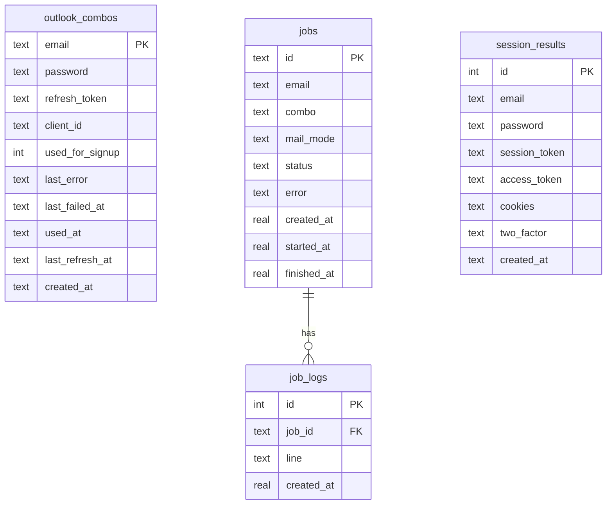
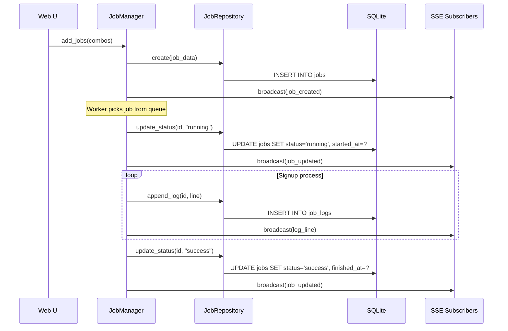
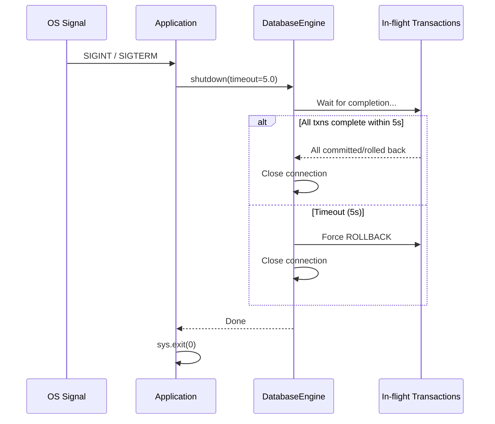

# Design Document — sqlite-persistence

## Overview

Chuyển toàn bộ persistence layer của `gpt_signup_hybrid` từ JSON files + in-memory sang SQLite, sử dụng Python stdlib `sqlite3` module (async context manager chạy đồng bộ trên calling thread — không dùng `asyncio.to_thread` do constraint của threading.RLock). Thiết kế gồm 3 layer chính:

1. **Database Engine** (`db/engine.py`) — Quản lý connection, WAL mode, migrations, transaction safety
2. **Repository Layer** (`db/repositories.py`) — Data access abstraction (ComboRepository, JobRepository, SessionResultRepository)
3. **Migration Tool** (`db/migrate.py`) — CLI tool chuyển JSON → SQLite + import pool files

Kiến trúc tuân thủ dependency injection: business logic modules (JobManager, CLI) nhận repository instance qua constructor/parameter, không import trực tiếp engine.

```
┌─────────────────────────────────────────────────────────────┐
│                    Application Layer                          │
│  ┌──────────┐  ┌──────────────┐  ┌───────────────────────┐  │
│  │  CLI     │  │  Web Server  │  │  OutlookMailProvider  │  │
│  └────┬─────┘  └──────┬───────┘  └───────────┬───────────┘  │
│       │                │                      │              │
├───────┼────────────────┼──────────────────────┼──────────────┤
│       ▼                ▼                      ▼              │
│  ┌─────────────────────────────────────────────────────────┐ │
│  │              Repository Layer                            │ │
│  │  ComboRepo  │  JobRepo  │  SessionResultRepo            │ │
│  └──────────────────────────┬──────────────────────────────┘ │
│                             │                                │
│                             ▼                                │
│  ┌─────────────────────────────────────────────────────────┐ │
│  │              Database Engine                             │ │
│  │  Connection Pool │ WAL │ Migrations │ Transaction Mgmt  │ │
│  └──────────────────────────┬──────────────────────────────┘ │
│                             │                                │
│                             ▼                                │
│                    runtime/data.db                            │
└─────────────────────────────────────────────────────────────┘
```

## Architecture

### Quyết định kỹ thuật

| Quyết định | Lý do |
|---|---|
| Dùng `sqlite3` stdlib (không dùng SQLAlchemy/aiosqlite) | Project nhỏ, không cần ORM. Giảm dependency. Async context manager chạy sync trên calling thread (RLock constraint). |
| WAL mode + `busy_timeout=5000` | Cho phép concurrent read trong khi web server + CLI cùng access DB. |
| Single file `runtime/data.db` | Đơn giản, backup = copy 1 file. Phù hợp scale hiện tại (~100 combos, ~50 jobs). |
| Repository pattern (không Active Record) | Tách biệt SQL khỏi business logic. Dễ test với mock/stub. |
| Schema versioning qua `_schema_version` table | Lightweight, không cần Alembic cho project scope nhỏ. |
| `BEGIN IMMEDIATE` cho write transactions | Tránh deadlock khi multiple writers (web + CLI). |

### Module Layout

```
gpt_signup_hybrid/
├── db/
│   ├── __init__.py          # Export: get_engine(), get_repos()
│   ├── engine.py            # DatabaseEngine class
│   ├── repositories.py      # ComboRepository, JobRepository, SessionResultRepository
│   ├── migrate.py           # Migration tool (JSON → SQLite, import-pool)
│   └── schema.py            # DDL strings + version management
├── cli.py                   # Thêm commands: migrate, import-pool
├── web/manager.py           # JobManager inject JobRepository
└── mail_providers.py        # OutlookMailProvider inject ComboRepository
```

## Components and Interfaces

### DatabaseEngine (`db/engine.py`)

```python
class DatabaseEngine:
    """SQLite engine với WAL mode, migration, transaction management."""

    def __init__(self, db_path: Path | str = "runtime/data.db"):
        """Khởi tạo engine. Tạo directories + file nếu chưa có.

        Raises:
            PermissionError: Nếu path không writable.
            SchemaError: Nếu schema migration fail.
        """

    def get_connection(self) -> contextlib.AbstractContextManager[sqlite3.Connection]:
        """Context manager: auto-commit on success, rollback on exception.

        Sử dụng BEGIN IMMEDIATE cho write safety.
        Nếu đã trong transaction (nested call), không mở transaction mới.
        """

    async def get_connection_async(self) -> contextlib.AbstractAsyncContextManager[sqlite3.Connection]:
        """Async wrapper — chạy lock/tx đồng bộ trên calling thread (không dùng asyncio.to_thread).

        Lý do: threading.RLock phải release trên cùng thread đã acquire.
        asyncio.to_thread có thể dispatch acquire/release sang thread khác nhau,
        gây RuntimeError. SQLite connection dùng check_same_thread=False nên
        truy cập từ async context vẫn an toàn.
        """

    def close(self, timeout: float = 5.0) -> None:
        """Graceful shutdown: đợi in-flight transactions, rồi close.

        Args:
            timeout: Max seconds đợi transactions hoàn tất.
                     Sau timeout → force rollback + close.
        """

    @property
    def is_closed(self) -> bool: ...
```

### Repository Layer (`db/repositories.py`)

```python
class RepositoryError(Exception):
    """Lỗi từ repository layer. Wrap storage errors."""
    def __init__(self, operation: str, cause: Exception): ...


class ComboRepository:
    def __init__(self, engine: DatabaseEngine): ...

    def get_by_email(self, email: str) -> dict | None: ...
    def upsert(self, combo_data: dict) -> None: ...
    def ensure_exists(self, combo_data: dict) -> None: ...
    def mark_success(self, email: str) -> None: ...
    def mark_failure(self, email: str, error: str) -> None: ...
    def pick_available(self) -> dict: ...
    def update_refresh_token(self, email: str, token: str) -> None: ...
    def list_all(self) -> list[dict]: ...


class JobRepository:
    def __init__(self, engine: DatabaseEngine): ...

    def create(self, job_data: dict) -> str: ...
    def update_status(self, job_id: str, status: str, **kwargs) -> None: ...
    def update_email(self, job_id: str, email: str) -> None: ...
    def append_log(self, job_id: str, line: str) -> None: ...
    def get_by_id(self, job_id: str) -> dict | None: ...
    def list_all(self) -> list[dict]: ...
    def list_by_status(self, status: str) -> list[dict]: ...
    def list_completed(self) -> list[dict]: ...
    def delete(self, job_id: str) -> None: ...
    def delete_finished(self, job_type: str | None = None) -> int: ...
    def get_logs(self, job_id: str) -> list[dict]: ...
    def recover_interrupted(self) -> list[dict]: ...


class SessionResultRepository:
    def __init__(self, engine: DatabaseEngine): ...

    def create(self, result_data: dict) -> int: ...
    def get_by_email(self, email: str) -> dict | None: ...
    def update_2fa(self, email: str, mfa_data: dict) -> None: ...
    def export_json(self, email: str) -> dict | None: ...
    def list_all(self) -> list[dict]: ...
```

### Migration Tool (`db/migrate.py`)

```python
class MigrationTool:
    """Chuyển dữ liệu JSON → SQLite + import pool files."""

    def __init__(self, engine: DatabaseEngine, combo_repo: ComboRepository,
                 session_repo: SessionResultRepository): ...

    def migrate_outlook_state(self, state_dir: Path) -> MigrationSummary: ...
    def migrate_sessions(self, sessions_dir: Path) -> MigrationSummary: ...
    def import_pool_file(self, pool_path: Path) -> ImportSummary: ...


@dataclass
class MigrationSummary:
    entity_type: str
    total_files: int
    inserted: int
    skipped_duplicate: int
    skipped_error: int
    errors: list[str]


@dataclass
class ImportSummary:
    total_lines: int
    inserted: int
    updated: int
    skipped: int
    errors: list[str]
```

## Data Models

### Schema DDL

```sql
-- Schema version tracking
CREATE TABLE IF NOT EXISTS _schema_version (
    version INTEGER PRIMARY KEY,
    applied_at TEXT NOT NULL DEFAULT (datetime('now')),
    description TEXT
);

-- Outlook combo state
CREATE TABLE IF NOT EXISTS outlook_combos (
    email TEXT PRIMARY KEY,
    password TEXT NOT NULL,
    refresh_token TEXT NOT NULL,
    client_id TEXT NOT NULL,
    used_for_signup INTEGER NOT NULL DEFAULT 0,
    last_error TEXT,
    last_failed_at TEXT,
    used_at TEXT,
    last_refresh_at TEXT,
    created_at TEXT NOT NULL DEFAULT (datetime('now'))
);

-- Jobs (web UI)
CREATE TABLE IF NOT EXISTS jobs (
    id TEXT PRIMARY KEY,
    email TEXT NOT NULL,
    combo TEXT NOT NULL,
    mail_mode TEXT NOT NULL DEFAULT 'outlook'
        CHECK(mail_mode IN ('outlook', 'worker', 'gmail_advanced')),
    status TEXT NOT NULL DEFAULT 'queued'
        CHECK(status IN ('queued', 'running', 'success', 'error', 'cancelled')),
    error TEXT,
    password TEXT,
    secret TEXT,
    first_code TEXT,
    user_id TEXT,
    session_path TEXT,
    payment_link TEXT,
    session_data TEXT,
    created_at REAL NOT NULL,
    started_at REAL,
    finished_at REAL,
    job_type TEXT NOT NULL DEFAULT 'signup'
);

CREATE INDEX IF NOT EXISTS idx_jobs_status ON jobs(status);
CREATE INDEX IF NOT EXISTS idx_jobs_email ON jobs(email);

-- Job logs
CREATE TABLE IF NOT EXISTS job_logs (
    id INTEGER PRIMARY KEY AUTOINCREMENT,
    job_id TEXT NOT NULL REFERENCES jobs(id) ON DELETE CASCADE,
    line TEXT NOT NULL,
    created_at REAL NOT NULL DEFAULT (unixepoch('subsec'))
);

CREATE INDEX IF NOT EXISTS idx_job_logs_job_id ON job_logs(job_id);

-- Session results
CREATE TABLE IF NOT EXISTS session_results (
    id INTEGER PRIMARY KEY AUTOINCREMENT,
    email TEXT NOT NULL,
    password TEXT,
    name TEXT,
    age INTEGER,
    user_id TEXT,
    account_id TEXT,
    session_token TEXT,
    access_token TEXT,
    cookies TEXT,       -- JSON array
    two_factor TEXT,    -- JSON object
    phase1_seconds REAL,
    phase2_seconds REAL,
    otp_seconds REAL,
    created_at TEXT NOT NULL DEFAULT (datetime('now'))
);

CREATE INDEX IF NOT EXISTS idx_session_results_email ON session_results(email);
```

### Entity Relationships



### Sequence Diagram — Job Lifecycle với SQLite



## Correctness Properties

*A property is a characteristic or behavior that should hold true across all valid executions of a system — essentially, a formal statement about what the system should do. Properties serve as the bridge between human-readable specifications and machine-verifiable correctness guarantees.*

### Property 1: Transaction atomicity — all-or-nothing schema migration

*For any* schema migration containing multiple DDL statements, if any statement fails, then NO tables or indexes from that migration should exist in the database after the error.

**Validates: Requirements 1.5, 1.8**

### Property 2: Connection context manager commit/rollback

*For any* sequence of write operations within a `get_connection()` context manager, if the block completes without exception then all writes are committed and readable; if any exception is raised, then no writes from that block persist and the original exception type is preserved.

**Validates: Requirements 1.6, 5.1, 5.2**

### Property 3: Refresh token rotation round-trip

*For any* combo email and any valid refresh token string (starting with "M.C"), after calling `update_refresh_token(email, token)`, reading back via `get_by_email(email)` should return the new token and a valid ISO 8601 `last_refresh_at` timestamp.

**Validates: Requirements 2.2**

### Property 4: Combo state mutation preserves invariants

*For any* combo, `mark_success(email)` sets `used_for_signup=1`, `used_at` to a valid timestamp, and `last_error=None`; `mark_failure(email, error)` sets `last_error` and `last_failed_at` without modifying `used_for_signup` regardless of its prior value.

**Validates: Requirements 2.3, 2.4**

### Property 5: Pick available returns correct combo under filtering rules

*For any* set of combos in the database with mixed states (some used, some with terminal errors, some available), `pick_available()` returns the earliest-created combo where `used_for_signup=0` AND `last_error` does not contain any terminal error substring ("registration_disallowed", "invalid_grant", "AADSTS50173", "AADSTS70008"). If no such combo exists, it SHALL raise `RepositoryError` indicating pool exhaustion with total combo count.

**Validates: Requirements 2.5, 2.6**

### Property 6: Job status transition updates correct fields

*For any* job and any valid status transition, `update_status(job_id, "running")` sets `started_at` to a valid unix timestamp; `update_status(job_id, status)` where status is "success"/"error"/"cancelled" sets `finished_at` to a valid unix timestamp and preserves `error` field when provided.

**Validates: Requirements 3.3, 3.4**

### Property 7: Job log append round-trip

*For any* job_id and any non-empty log line string, after `append_log(job_id, line)`, the log line is retrievable in the job's log list (via `get_by_id`) in insertion order.

**Validates: Requirements 3.5**

### Property 8: Reset running to queued preserves other statuses

*For any* set of jobs with mixed statuses, after `reset_running_to_queued()`, all previously-running jobs have status "queued" with `started_at=None`, while jobs with status "queued", "success", "error", "cancelled" remain unchanged.

**Validates: Requirements 3.6, 10.2**

### Property 9: Delete finished removes only success/error jobs

*For any* set of jobs with mixed statuses, after `delete_finished()`, no jobs with status "success" or "error" exist, and all jobs with status "queued", "running", or "cancelled" remain intact with their log entries.

**Validates: Requirements 3.7, 10.6**

### Property 10: Session result create round-trip

*For any* valid session result data dict (containing email, password, name, age, user_id, account_id, session_token, access_token, cookies as list, phase timings), after `create(data)`, reading via `get_by_email(email)` returns a record with all fields matching the input.

**Validates: Requirements 4.2**

### Property 11: Session result export_json deserialization

*For any* session result with `cookies` stored as JSON string (list of dicts) and `two_factor` stored as JSON string (dict), `export_json(email)` returns a dictionary where `cookies` is a Python list and `two_factor` is a Python dict, with values matching the original input data.

**Validates: Requirements 4.5**

### Property 12: 2FA update targets only the most recent record

*For any* email with multiple session result rows (different `created_at` timestamps), `update_2fa(email, mfa_data)` modifies only the row with the latest `created_at`, leaving all older rows' `two_factor` column unchanged.

**Validates: Requirements 4.3**

### Property 13: Migration preserves data from JSON files to SQLite

*For any* valid outlook state JSON file (containing email, refresh_token, client_id, etc.) or valid session result JSON file, after migration the corresponding database row contains field values equivalent to the source JSON file content.

**Validates: Requirements 6.1, 6.2**

### Property 14: Migration skips duplicates without error

*For any* combo email or session result that already exists in the database, re-running migration on the same source files produces no duplicate rows and does not raise an error.

**Validates: Requirements 6.3**

### Property 15: Pool import upsert preserves state, updates credentials

*For any* existing combo in the database (with any values of `used_for_signup`, `used_at`, `last_error`, `last_failed_at`), importing a pool line with the same email overwrites `password`, `refresh_token`, `client_id` from the pool line while preserving `used_for_signup`, `used_at`, `last_error`, `last_failed_at` unchanged.

**Validates: Requirements 8.1, 8.2, 8.3**

### Property 16: Parse resilience — valid items processed despite invalid siblings

*For any* mix of valid and invalid input items (pool lines with bad format, JSON files with invalid content), processing the batch successfully imports/migrates all valid items and skips invalid ones without aborting.

**Validates: Requirements 6.6, 8.4**

### Property 17: Read non-existent identifiers return None

*For any* random string identifier that does not exist as a primary key in the database, `get_by_email()`, `get_by_id()` return None without raising an exception.

**Validates: Requirements 7.7**

### Property 18: Job recovery loads all persisted jobs with logs

*For any* set of jobs previously persisted in SQLite (with associated log lines), after loading via the repository, all jobs are returned with correct field values and their full log history in insertion order.

**Validates: Requirements 10.1**

## Error Handling

### Exception Hierarchy

```python
class DatabaseError(Exception):
    """Base error cho database layer."""

class SchemaError(DatabaseError):
    """Schema migration failure."""

class RepositoryError(DatabaseError):
    """Repository write/read failure.

    Attributes:
        operation: str — tên method đã fail (e.g., "mark_success")
        cause: Exception — original exception
    """
    def __init__(self, operation: str, cause: Exception):
        self.operation = operation
        self.cause = cause
        super().__init__(f"{operation} failed: {cause}")
```

### Error Handling Strategy

| Scenario | Behavior |
|---|---|
| DB path not writable | `DatabaseError` at startup — fail fast |
| Schema migration fails | `SchemaError` + rollback DDL transaction |
| Write within transaction fails | Rollback + re-raise original exception type |
| `busy_timeout` exceeded | `sqlite3.OperationalError` propagated |
| Read returns no results | Return `None` (not exception) |
| Write to non-existent FK | `RepositoryError` wrapping IntegrityError |
| JSON serialize/deserialize fails | `RepositoryError` wrapping ValueError |
| Shutdown timeout exceeded | Force-rollback in-flight txns + close |

### Transaction Patterns

```python
# Pattern 1: Single write (auto-transaction)
def mark_success(self, email: str) -> None:
    with self._engine.get_connection() as conn:
        conn.execute(
            "UPDATE outlook_combos SET used_for_signup=1, used_at=?, last_error=NULL WHERE email=?",
            (datetime.now(timezone.utc).isoformat(), email),
        )

# Pattern 2: Multi-write in one transaction
def update_status(self, job_id: str, status: str, **kwargs) -> None:
    with self._engine.get_connection() as conn:
        conn.execute("UPDATE jobs SET status=?, ... WHERE id=?", (...))
        if log_line:
            conn.execute("INSERT INTO job_logs (job_id, line) VALUES (?, ?)", (job_id, log_line))

# Pattern 3: Read (no transaction needed for reads in WAL mode)
def get_by_email(self, email: str) -> dict | None:
    conn = self._engine.raw_connection()  # read-only, no BEGIN IMMEDIATE
    row = conn.execute("SELECT * FROM outlook_combos WHERE email=?", (email,)).fetchone()
    return dict(row) if row else None
```

### Graceful Shutdown



**Web server shutdown flow:**
1. Receive SIGINT/SIGTERM
2. JobManager marks all `running` jobs as `queued` in DB (ready for next start)
3. Cancel all worker tasks
4. DatabaseEngine.shutdown(timeout=5.0)
5. Uvicorn graceful stop

## Testing Strategy

### Property-Based Testing

**Library**: [Hypothesis](https://hypothesis.readthedocs.io/) (Python standard PBT)

**Configuration**:
- Minimum 100 examples per property test
- Deadline: 5000ms per example (SQLite I/O)
- Database: in-memory (`:memory:`) cho property tests — fast + isolated
- Suppress health checks cho slow DB tests

**Property tests** (từ Correctness Properties section):
- Mỗi property → 1 test function với decorator `@given(...)`
- Tag format: `# Feature: sqlite-persistence, Property N: <title>`
- Generators cho: email strings, refresh tokens (M.C prefix), combo dicts, job dicts, SignupResult-like dicts, pool file lines

### Unit Tests (Example-Based)

- Schema smoke tests: verify tables/columns exist after init
- PRAGMA settings: WAL, busy_timeout, foreign_keys
- Edge cases: non-writable path, empty pool, duplicate migration
- CLI integration: --no-file-output flag behavior
- Error propagation: RepositoryError wrapping

### Integration Tests

- Full lifecycle: startup → import pool → pick combo → signup → persist result → recovery
- Web server: shutdown → restart → job recovery
- Concurrent access: multiple threads writing (WAL mode validation)
- Migration tool: real JSON files → SQLite → verify content

### Test Organization

```
test/
├── test_db_engine.py           # DatabaseEngine unit + property tests
├── test_combo_repository.py    # ComboRepository property + unit tests
├── test_job_repository.py      # JobRepository property + unit tests
├── test_session_repository.py  # SessionResultRepository property + unit tests
├── test_migration.py           # Migration tool tests
├── test_pool_import.py         # Pool import tests
└── test_integration_web.py     # Web server recovery integration
```
