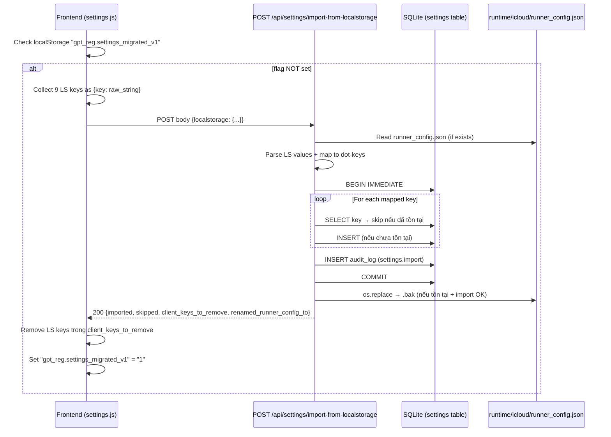
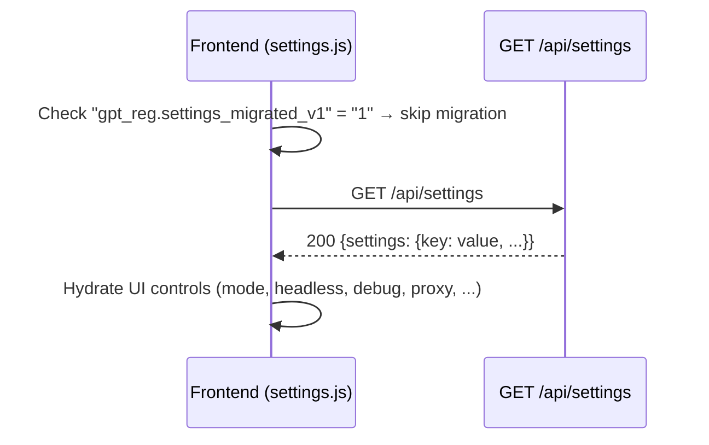
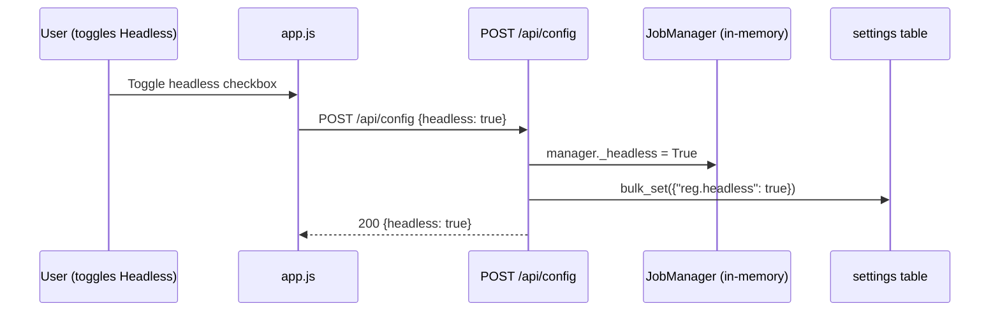

# Technical Design — unified-settings-store

## 1. Overview

Thống nhất toàn bộ runtime configuration vào bảng SQLite `settings` (flat KV, dot-namespaced key, JSON-encoded value). Thay thế phân mảnh giữa `localStorage` (frontend) và `runtime/icloud/runner_config.json` (backend).

Layers:
```
┌────────────────────────────────────────────────┐
│  Frontend (web/static/*.js)                    │
│  settings.js → GET/PUT /api/settings/*         │
│  + existing endpoints (POST /api/config, ...)  │
└────────────────────┬───────────────────────────┘
                     │ HTTP (auth gated)
┌────────────────────▼───────────────────────────┐
│  HTTP API (web/server.py)                      │
│  6 endpoint /api/settings/*                    │
│  + write-through hooks trong existing routes   │
└────────────────────┬───────────────────────────┘
                     │ call
┌────────────────────▼───────────────────────────┐
│  SettingsRepository (db/repositories.py)       │
│  get / set / delete / list / bulk_get / bulk_set│
│  + audit log + retry busy-lock                 │
└────────────────────┬───────────────────────────┘
                     │ SQL
┌────────────────────▼───────────────────────────┐
│  SQLite (settings table, schema v10)           │
└────────────────────────────────────────────────┘
```

## 2. DB Layer — Schema Migration v10

### DDL

```sql
CREATE TABLE IF NOT EXISTS settings (
    id INTEGER PRIMARY KEY AUTOINCREMENT,
    key TEXT NOT NULL UNIQUE,
    value TEXT,
    updated_at TEXT NOT NULL DEFAULT (strftime('%Y-%m-%dT%H:%M:%fZ','now'))
);
CREATE INDEX IF NOT EXISTS idx_settings_key ON settings(key);
```

### Migration

```python
# db/schema.py
CURRENT_VERSION = 10

DDL_SETTINGS = """\
CREATE TABLE IF NOT EXISTS settings (
    id INTEGER PRIMARY KEY AUTOINCREMENT,
    key TEXT NOT NULL UNIQUE,
    value TEXT,
    updated_at TEXT NOT NULL DEFAULT (strftime('%Y-%m-%dT%H:%M:%fZ','now'))
);
"""
DDL_SETTINGS_INDEXES = """\
CREATE INDEX IF NOT EXISTS idx_settings_key ON settings(key);
"""

# Thêm vào ALL_DDL cuối:
ALL_DDL += [DDL_SETTINGS, DDL_SETTINGS_INDEXES]

# Incremental migration cho DB hiện có (v9 → v10):
MIGRATIONS[10] = [
    "CREATE TABLE IF NOT EXISTS settings (\n"
    "    id INTEGER PRIMARY KEY AUTOINCREMENT,\n"
    "    key TEXT NOT NULL UNIQUE,\n"
    "    value TEXT,\n"
    "    updated_at TEXT NOT NULL DEFAULT (strftime('%Y-%m-%dT%H:%M:%fZ','now'))\n"
    ");",
    "CREATE INDEX IF NOT EXISTS idx_settings_key ON settings(key);",
]
```

## 3. Repository Layer — SettingsRepository

### Constants & Whitelist (R4, R8)

```python
import re
from typing import Any, Mapping, Sequence

_KEY_REGEX = re.compile(r"^[a-z][a-z0-9_]*(\.[a-z0-9_]+)*$")
_KEY_MAX_LEN = 128

# Exact keys whitelist
_EXACT_KEYS: frozenset[str] = frozenset([
    "reg.mode", "reg.headless", "reg.debug", "reg.default_password",
    "reg.job_timeout", "reg.post_reg_get_session", "reg.post_reg_get_link",
    "reg.post_reg_link_region", "reg.auto_retry", "reg.auto_retry_max",
    "reg.auto_retry_delay", "reg.max_concurrent",
    "proxy.url", "proxy.visible",
    "mail_mode.current", "mail_mode.worker_config",
    "hme.runner.action", "hme.runner.count_per_cycle",
    "hme.runner.retry_interval", "hme.runner.label", "hme.runner.note",
    "hme.privacy_mask",
    "autoreg.concurrency", "autoreg.poll_interval", "autoreg.password",
    "autoreg.logs_url", "autoreg.api_key",
    "hotmail.target_count", "hotmail.concurrency", "hotmail.max_attempts",
    "hotmail.domain", "hotmail.delay_between", "hotmail.headless",
    "hotmail.captcha_methods", "hotmail.captcha_key",
    "ui.active_tab", "ui.proxy_visible", "ui.link_mode",
])

# Sensitive keys — audit log redact value thành "***"
_SENSITIVE_KEYS: frozenset[str] = frozenset([
    "proxy.url", "autoreg.api_key", "hotmail.captcha_key",
    "mail_mode.worker_config",
])
```

### Type Constraints (R3.6)

| Key | Type | Constraint |
|-----|------|-----------|
| `reg.mode` | str | `∈ {"single", "multi"}` |
| `reg.headless` | bool | — |
| `reg.debug` | bool | — |
| `reg.default_password` | str \| null | — |
| `reg.job_timeout` | int | `[30, 600]` |
| `reg.post_reg_get_session` | bool | — |
| `reg.post_reg_get_link` | bool | — |
| `reg.post_reg_link_region` | str | `∈ {"VN","ID","IN","US"}` |
| `reg.auto_retry` | bool | — |
| `reg.auto_retry_max` | int | `[0, 10]` |
| `reg.auto_retry_delay` | int | `≥ 0` |
| `reg.max_concurrent` | int | `[1, 10]` |
| `proxy.url` | str \| null | — |
| `proxy.visible` | bool | — |
| `mail_mode.current` | str | non-empty |
| `mail_mode.worker_config` | object \| null | `{logs_url: str, api_key: str}` |
| `hme.runner.action` | str | `∈ {"generate","check_all","deactivate_bulk","reactivate_bulk","delete_bulk","update_meta_bulk","list_sync"}` |
| `hme.runner.count_per_cycle` | int \| null | `> 0` when set |
| `hme.runner.retry_interval` | int \| null | `≥ 10` when set |
| `hme.runner.label` | str \| null | `len ≤ 200` |
| `hme.runner.note` | str \| null | `len ≤ 1000` |
| `hme.privacy_mask` | bool | — |
| `autoreg.concurrency` | int | `[1, 5]` |
| `autoreg.poll_interval` | int | `≥ 10` |
| `autoreg.password` | str | non-empty |
| `autoreg.logs_url` | str \| null | — |
| `autoreg.api_key` | str \| null | — |
| `hotmail.target_count` | int | `[1, 100]` |
| `hotmail.concurrency` | int | `[1, 5]` |
| `hotmail.max_attempts` | int | `[1, 500]` |
| `hotmail.domain` | str | `∈ {"hotmail.com","outlook.com"}` |
| `hotmail.delay_between` | int | `[5, 120]` |
| `hotmail.headless` | bool | — |
| `hotmail.captcha_methods` | list[str] | subset `{"twocaptcha","manual"}` |
| `hotmail.captcha_key` | str \| null | — |
| `ui.active_tab` | str | `∈ {"reg","session","link","hme","hotmail"}` |
| `ui.proxy_visible` | bool | — |
| `ui.link_mode` | str | `∈ {"combo","session_json","access_token"}` |

### Pseudocode

```python
class SettingsRepository:
    def __init__(self, engine: DatabaseEngine) -> None:
        self._engine = engine

    # ── Key validation ──
    def _validate_key(self, key: str) -> None:
        if not isinstance(key, str):
            raise RepositoryError("set", TypeError(f"key must be str, got {type(key).__name__}"))
        if len(key) > _KEY_MAX_LEN:
            raise RepositoryError("set", ValueError(f"key too long: {len(key)} > {_KEY_MAX_LEN}"))
        if not _KEY_REGEX.match(key):
            raise RepositoryError("set", ValueError(f"invalid key format: {key!r}"))

    def _validate_whitelist(self, key: str, op: str = "set") -> None:
        if key not in _EXACT_KEYS:
            raise RepositoryError(op, ValueError(f"key not in whitelist: {key}"))

    def _validate_type(self, key: str, value: Any) -> None:
        """Type-check theo bảng R3.6. Raise RepositoryError nếu sai type."""
        # ... dispatch theo key → check type + range ...

    # ── CRUD ──
    def get(self, key: str) -> Any | None:
        """R2.1: Read key, JSON-decode, return None nếu không tồn tại."""
        conn = self._engine.raw_connection()
        row = conn.execute(
            "SELECT value FROM settings WHERE key = ?", (key,)
        ).fetchone()
        if row is None:
            return None
        if row["value"] is None:
            return None
        return json.loads(row["value"])  # fail-fast nếu corrupt (R3.3)

    def set(self, key: str, value: Any) -> None:
        """R2.2: Upsert + audit log."""
        self._validate_key(key)
        self._validate_whitelist(key)
        self._validate_type(key, value)
        encoded = json.dumps(value, ensure_ascii=False, sort_keys=True, separators=(',', ':'))
        self._with_retry(lambda: self._do_set(key, encoded))

    def _do_set(self, key: str, encoded: str) -> None:
        with self._engine.get_connection() as conn:
            # Check if key existed (for audit old_present)
            existing = conn.execute(
                "SELECT 1 FROM settings WHERE key = ?", (key,)
            ).fetchone()
            conn.execute(
                """INSERT INTO settings (key, value) VALUES (?, ?)
                   ON CONFLICT(key) DO UPDATE SET
                     value = excluded.value,
                     updated_at = strftime('%Y-%m-%dT%H:%M:%fZ','now')""",
                (key, encoded),
            )
            # Audit log (R10) — redact sensitive
            audit_value = "***" if key in _SENSITIVE_KEYS else encoded
            conn.execute(
                """INSERT INTO icloud_audit_log (event_type, payload_json)
                   VALUES ('settings.set', ?)""",
                (json.dumps({"key": key, "old_present": existing is not None,
                             "new_value": audit_value}),),
            )

    def delete(self, key: str) -> bool:
        """R2.3: Delete key, return True nếu xoá được."""
        self._validate_key(key)
        self._validate_whitelist(key, "delete")
        return self._with_retry(lambda: self._do_delete(key))

    def _do_delete(self, key: str) -> bool:
        with self._engine.get_connection() as conn:
            cursor = conn.execute("DELETE FROM settings WHERE key = ?", (key,))
            if cursor.rowcount > 0:
                conn.execute(
                    """INSERT INTO icloud_audit_log (event_type, payload_json)
                       VALUES ('settings.delete', ?)""",
                    (json.dumps({"key": key}),),
                )
                return True
            return False

    def list(self, prefix: str | None = None) -> dict[str, Any]:
        """R2.4: List all hoặc filter theo prefix."""
        conn = self._engine.raw_connection()
        if prefix:
            rows = conn.execute(
                "SELECT key, value FROM settings WHERE key = ? OR key LIKE ?",
                (prefix, f"{prefix}.%"),
            ).fetchall()
        else:
            rows = conn.execute("SELECT key, value FROM settings").fetchall()
        result = {}
        for row in rows:
            if row["key"] in _EXACT_KEYS:  # chỉ trả key trong whitelist
                result[row["key"]] = json.loads(row["value"]) if row["value"] else None
        return result

    def bulk_get(self, keys: Sequence[str]) -> dict[str, Any]:
        """R2.5: Get nhiều key cùng lúc."""
        conn = self._engine.raw_connection()
        placeholders = ",".join("?" for _ in keys)
        rows = conn.execute(
            f"SELECT key, value FROM settings WHERE key IN ({placeholders})", tuple(keys)
        ).fetchall()
        return {row["key"]: json.loads(row["value"]) for row in rows if row["value"]}

    def bulk_set(self, items: Mapping[str, Any]) -> None:
        """R2.6: Ghi nhiều key trong 1 transaction (R11.1)."""
        for key in items:
            self._validate_key(key)
            self._validate_whitelist(key)
            self._validate_type(key, items[key])
        self._with_retry(lambda: self._do_bulk_set(items))

    def _do_bulk_set(self, items: Mapping[str, Any]) -> None:
        with self._engine.get_connection() as conn:
            keys_written = []
            for key, value in items.items():
                encoded = json.dumps(value, ensure_ascii=False, sort_keys=True, separators=(',', ':'))
                conn.execute(
                    """INSERT INTO settings (key, value) VALUES (?, ?)
                       ON CONFLICT(key) DO UPDATE SET
                         value = excluded.value,
                         updated_at = strftime('%Y-%m-%dT%H:%M:%fZ','now')""",
                    (key, encoded),
                )
                keys_written.append(key)
            # Audit 1 entry cho bulk (R10.3)
            conn.execute(
                """INSERT INTO icloud_audit_log (event_type, payload_json)
                   VALUES ('settings.bulk_set', ?)""",
                (json.dumps({"keys": keys_written}),),
            )

    # ── Retry busy-lock (R11.3) ──
    def _with_retry(self, fn, max_retries: int = 3):
        import time
        import sqlite3
        backoffs = [0.05, 0.15, 0.4]
        for attempt in range(max_retries + 1):
            try:
                return fn()
            except RepositoryError as e:
                if isinstance(e.cause, sqlite3.OperationalError) and "locked" in str(e.cause):
                    if attempt < max_retries:
                        time.sleep(backoffs[attempt])
                        continue
                raise
            except sqlite3.OperationalError as e:
                if "locked" in str(e) and attempt < max_retries:
                    time.sleep(backoffs[attempt])
                    continue
                raise RepositoryError("set", e) from e
```

## 4. Manager Hydration (R9)

```python
# web/server.py — on_startup hook mở rộng:
@app.on_event("startup")
async def on_startup():
    ...
    from ..db.repositories import SettingsRepository
    settings_repo = SettingsRepository(_engine)
    try:
        all_settings = settings_repo.list()
    except RepositoryError:
        _log.warning("Settings load failed at startup, using defaults")
        all_settings = {}

    # Hydrate managers
    manager = get_manager(...)
    manager.apply_settings(all_settings)  # reg.headless, reg.job_timeout, proxy.url, ...
    get_session_manager(...).apply_settings(all_settings)
    get_link_manager(...).apply_settings(all_settings)
    # HmeRunner, AutoRegRunner, HotmailJobManager — hydrate via apply_settings
```

## 5. HTTP API (R5)

| Method | Path | Body | Response |
|--------|------|------|----------|
| GET | `/api/settings` | — (query: `?prefix=`) | `{"settings": {...}}` |
| GET | `/api/settings/{key}` | — | `{"key": "...", "value": ...}` / 404 |
| PUT | `/api/settings/{key}` | `{"value": ...}` | `{"key": "...", "value": ...}` / 422 |
| DELETE | `/api/settings/{key}` | — | `{"deleted": true}` / 404 |
| POST | `/api/settings/bulk` | `{"items": {...}}` | `{"updated": N}` |
| POST | `/api/settings/import-from-localstorage` | `{"localstorage": {...}}` | R7.5 response |

Tất cả endpoint được gate bởi `require_token` middleware hiện hữu.

## 6. Write-through (R6)

Mỗi endpoint config hiện có thêm 1 call `settings_repo.bulk_set(...)` cuối handler:

```python
@app.post("/api/config")
async def set_config(payload: SetConfigRequest):
    manager = get_manager()
    # ... apply in-memory như cũ ...
    # Write-through (R6.1, R6.7):
    try:
        settings_repo.bulk_set({
            "reg.mode": payload.mode,
            "reg.headless": payload.headless,
            "reg.debug": payload.debug,
            # ... map từng field ...
        })
    except RepositoryError as e:
        _log.warning("write-through settings failed: %s", e)
        return JSONResponse({..., "settings_persist_error": str(e)})
    return JSONResponse({...})
```

Pattern tương tự cho:
- `POST /api/proxy` → `proxy.url`
- `PUT /api/icloud/run/config` → `hme.runner.*`
- AutoReg start endpoint → `autoreg.*`
- Hotmail start endpoint → `hotmail.*`

## 7. Migration Endpoint (R7)

### Sequence Diagram — First Load Migration



### Sequence Diagram — Subsequent Load



### Sequence Diagram — User Edit Write-through



### Key Mapping (localStorage → settings DB)

| localStorage key | Parsed as | DB key(s) |
|------------------|-----------|-----------|
| `gpt_reg.settings` | JSON object | `reg.mode`, `reg.headless`, `reg.debug`, `reg.default_password`, `reg.job_timeout`, `reg.post_reg_get_session`, `reg.post_reg_get_link`, `reg.post_reg_link_region`, `reg.auto_retry_max` |
| `gpt_reg.proxy` (via LS_PROXY) | string | `proxy.url` |
| `gpt_reg.proxy_visible` | string "0"/"1" | `ui.proxy_visible` (bool) |
| `gpt_reg.mail_mode` | string | `mail_mode.current` |
| `gpt_reg.worker_config` | JSON object | `mail_mode.worker_config` |
| `gpt_reg.active_tab` | string | `ui.active_tab` |
| `autoreg.config.v1` | JSON object | `autoreg.password`, `autoreg.concurrency`, `autoreg.poll_interval` |
| `hme.privacy.mask.v1` | string "0"/"1" | `hme.privacy_mask` (bool) |
| `gpt_reg.link.mode` | string | `ui.link_mode` |
| *(server-side)* runner_config.json | JSON object | `hme.runner.action`, `hme.runner.count_per_cycle`, `hme.runner.retry_interval`, `hme.runner.label`, `hme.runner.note` |

## 8. Frontend Module — web/static/settings.js

```javascript
// settings.js — loaded TRƯỚC app.js trong index.html
(function() {
  'use strict';
  const MIGRATED_KEY = 'gpt_reg.settings_migrated_v1';
  const LS_KEYS_TO_MIGRATE = [
    'gpt_reg.settings', 'gpt_reg.proxy', 'gpt_reg.proxy_visible',
    'gpt_reg.mail_mode', 'gpt_reg.worker_config', 'gpt_reg.active_tab',
    'autoreg.config.v1', 'hme.privacy.mask.v1', 'gpt_reg.link.mode'
  ];

  window.Settings = {
    _cache: null,

    async bootstrap(token) {
      // One-shot migration (R7)
      if (!localStorage.getItem(MIGRATED_KEY)) {
        const snapshot = {};
        LS_KEYS_TO_MIGRATE.forEach(k => {
          const v = localStorage.getItem(k);
          if (v !== null) snapshot[k] = v;
        });
        try {
          const resp = await fetch('/api/settings/import-from-localstorage', {
            method: 'POST',
            headers: {'Content-Type': 'application/json', 'X-API-Token': token},
            body: JSON.stringify({localstorage: snapshot}),
          });
          if (resp.ok) {
            const data = await resp.json();
            (data.client_keys_to_remove || []).forEach(k => localStorage.removeItem(k));
            localStorage.setItem(MIGRATED_KEY, '1');
          }
        } catch(e) { console.warn('[settings] migration failed:', e); }
      }
      // Load all settings (R12.2)
      return this.load(token);
    },

    async load(token) {
      try {
        const resp = await fetch('/api/settings', {
          headers: {'X-API-Token': token}
        });
        if (resp.ok) {
          const data = await resp.json();
          this._cache = data.settings || {};
        }
      } catch(e) { console.warn('[settings] load failed:', e); }
      return this._cache || {};
    },

    get(key) { return this._cache ? this._cache[key] : undefined; },

    async save(key, value, token) {
      // Cho UI-only keys (ui.active_tab, hme.privacy_mask, ui.proxy_visible, ui.link_mode)
      try {
        await fetch('/api/settings/' + encodeURIComponent(key), {
          method: 'PUT',
          headers: {'Content-Type': 'application/json', 'X-API-Token': token},
          body: JSON.stringify({value}),
        });
        if (this._cache) this._cache[key] = value;
      } catch(e) { console.warn('[settings] save failed:', e); }
    }
  };
})();
```

## 9. Correctness Properties (PBT)

| # | Property | Covers |
|---|----------|--------|
| P1 | `∀ (k,v) ∈ whitelist × JSON-serializable: set(k,v); get(k) == v` | R2.9 round-trip |
| P2 | `∀ k ∉ whitelist: set(k, v) raises RepositoryError` | R4.2 |
| P3 | `∀ k not matching regex: set(k, v) raises RepositoryError` | R3.4 |
| P4 | Import endpoint idempotent: 2 calls same input → 2nd returns imported=[] | R7.10 |
| P5 | `bulk_set({k1:v1, ..., kN:vN}) fail at ki ⇒ DB unchanged for k1..kN` | R11.1 |
| P6 | `delete(k) twice → 1st True, 2nd False` | R2.3 |
| P7 | `list(prefix="reg") ⊆ _EXACT_KEYS ∩ {k: k.startswith("reg.")}` | R2.4 |
| P8 | Audit log row count ≥ write count (set → 1 audit, bulk_set → 1 audit) | R10 |

## 10. File Changes

| File | Action | Mô tả |
|------|--------|-------|
| `db/schema.py` | modify | `CURRENT_VERSION=10`, `DDL_SETTINGS`, `MIGRATIONS[10]`, append `ALL_DDL` |
| `db/repositories.py` | modify | Thêm class `SettingsRepository` + whitelist constants |
| `db/__init__.py` | modify | Thêm `get_settings_repo(engine)` factory |
| `web/server.py` | modify | 6 endpoint `/api/settings/*`, write-through hooks, startup hydration |
| `web/manager.py` | modify | Thêm `apply_settings(dict)` cho JobManager/SessionManager/LinkManager |
| `web/runner_config_store.py` | deprecate | Chỉ dùng trong migration endpoint (đọc legacy file), không gọi save() nữa |
| `web/static/settings.js` | create | Module bootstrap + load + save |
| `web/static/index.html` | modify | `<script src="/static/settings.js">` trước app.js |
| `web/static/app.js` | modify | Gọi `Settings.bootstrap(token)` thay `loadSettings()`, bỏ LS_SETTINGS |
| `web/static/hme.js` | modify | Bỏ localStorage privacy mask, dùng `Settings.get('hme.privacy_mask')` |
| `web/static/autoreg.js` | modify | Bỏ LS_KEY `autoreg.config.v1`, dùng `Settings.get('autoreg.*')` |
| `web/static/hotmail.js` | modify | Dùng `Settings.get('hotmail.*')` cho initial form values |
| `web/static/session.js` | minor | Giữ nguyên LS textarea (ngoài scope) |
| `web/static/link.js` | modify | Bỏ LS_LINK_MODE, dùng `Settings.get('ui.link_mode')` |

## 11. Test Plan

| Test file | Scope |
|-----------|-------|
| `test/check_settings_schema_migration.py` | Fresh DB + v9→v10 upgrade idempotent |
| `test/test_settings_repository.py` | PBT: P1–P8, unit cho get/set/delete/list/bulk_get/bulk_set |
| `test/test_settings_api.py` | HTTP contract 6 endpoint (status codes, whitelist reject, auth) |
| `test/test_settings_migration_endpoint.py` | Import from LS + runner_config.json + idempotent + rename .bak |
| `test/check_manager_hydration_settings.py` | Startup load từ DB, fallback default khi DB fail |
| `test/check_settings_writethrough.py` | POST /api/config → settings table ghi đúng key |

## 12. Backward Compatibility

1. **Phase 1** (this spec): settings.js gọi migration endpoint 1 lần → DB có data. Frontend + backend đọc DB. Endpoints cũ (`POST /api/config`) vẫn hoạt động + write-through.
2. **Phase 2** (future, ngoài scope): Xoá code localStorage cũ hoàn toàn khỏi app.js/hme.js/autoreg.js khi confirm 100% user đã migrate.
3. Legacy `runner_config.json`: đọc 1 lần trong migration endpoint rồi rename `.bak`. `RunnerConfigStore` class giữ lại nhưng đánh deprecated.
